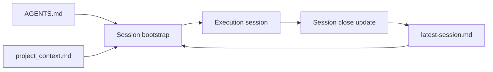

# Agent Memory Governance

## Architecture mémoire session

Fallback statique:
```md

```

## Purpose
Keep agent context stable across sessions while minimizing token waste.

## Mémoire persistante - système de travail autonome

Cette couche formalise la boucle de travail attendue pour les tâches non triviales. Elle sert de repère opératoire pour garder des réponses fiables, évolutives et testées.

### Cycle obligatoire

1. Planifier
- analyser la demande en profondeur ;
- identifier l'objectif final, les contraintes, les risques et les informations manquantes ;
- définir une stratégie avant toute exécution.

2. Décomposer
- séparer la tâche en sous-tâches claires lorsque cela réduit le risque ;
- raisonner en rôles logiques distincts comme analyse, code, test et debug ;
- maintenir un contexte explicite pour chaque sous-tâche.

3. Exécuter
- appliquer un changement ciblé ;
- éviter les placeholders, les faux raccourcis et les contournements ;
- garder la modification cohérente avec l'architecture et le design system.

4. Tester
- vérifier le cas nominal ;
- couvrir les cas limites et les cas d'erreur ;
- lancer les vérifications pertinentes disponibles dans le dépôt.

5. Corriger
- partir de la cause racine ;
- corriger de manière ciblée ;
- re-tester après correction avant de conclure.

6. S'améliorer
- consigner les erreurs significatives, leur cause et leur correction ;
- réutiliser ce retour d'expérience dans les sessions suivantes ;
- éviter la répétition des mêmes défauts.

7. Répondre
- fournir une synthèse claire des changements ;
- indiquer ce qui a été testé et ce qui reste à vérifier ;
- signaler explicitement les risques résiduels.

## Source-of-truth layers
1. `AGENTS.md` (stable rules)
- Global operating rules and response style.
- Update rarely (only when process changes).

2. `project_context.md` (semi-stable project context)
- Architecture, stack, critical files, and validation commands.
- Update when architecture or workflows change.

3. `documentation/sessions/history/latest-session.md` (volatile session memory)
- Recent done, in-progress, next, and risks.
- Update at the end of each meaningful session.

## Update cadence
- `AGENTS.md`: monthly or by explicit process decision.
- `project_context.md`: when runtime topology or conventions change.
- `documentation/sessions/history/latest-session.md`: every session close.

## Session protocol
Start:
1. Run `npm run session:bootstrap`.
2. Run `npm run session:budget`.
3. Confirm scope and risks.

Close:
1. Run `npm run session:close -- --done "..." --next "..." --risk "..."`.
2. Keep entries short and factual.

## Anti-drift rules
- Do not duplicate stable rules in `latest-session.md`.
- Do not store volatile TODO lists in `AGENTS.md`.
- Keep each section concise and deduplicated.
- Keep `documentation/sessions/history/latest-session.md` below line budget (default cap: 140 lines, 8 items/section).
