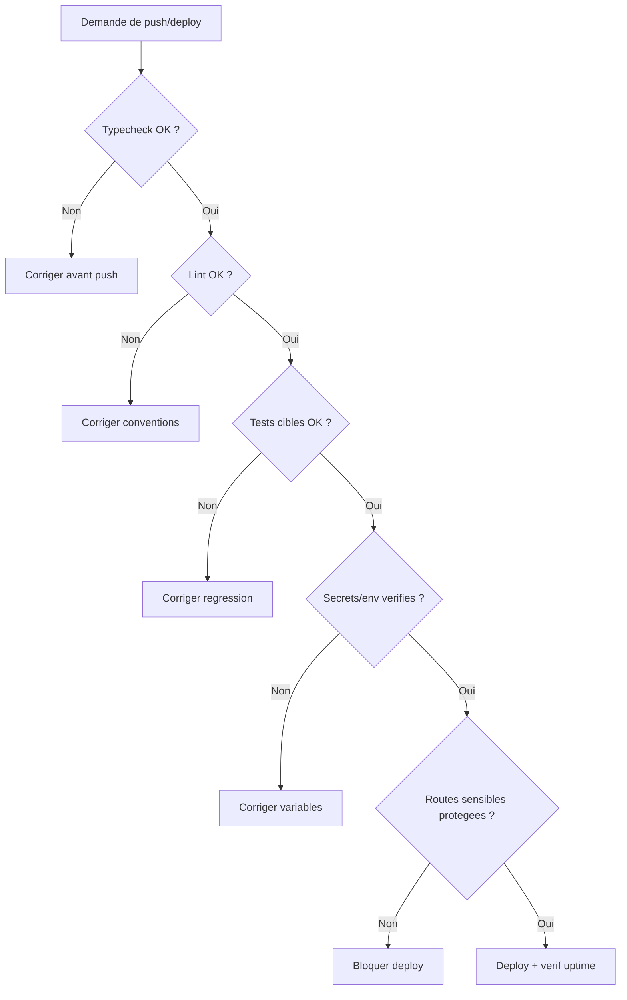

# Checklist push deploy

## Decision tree securite avant push

Fallback statique:
```md

```

1. `npm -C apps/web run typecheck`
2. `npm -C apps/web run lint`
3. Lancer les tests cibles des zones modifiees
4. Verifier variables d'environnement critiques
5. Controler routes sensibles (`/admin`, auth, API metier)
6. Verifier `api/uptime` apres mise en production
