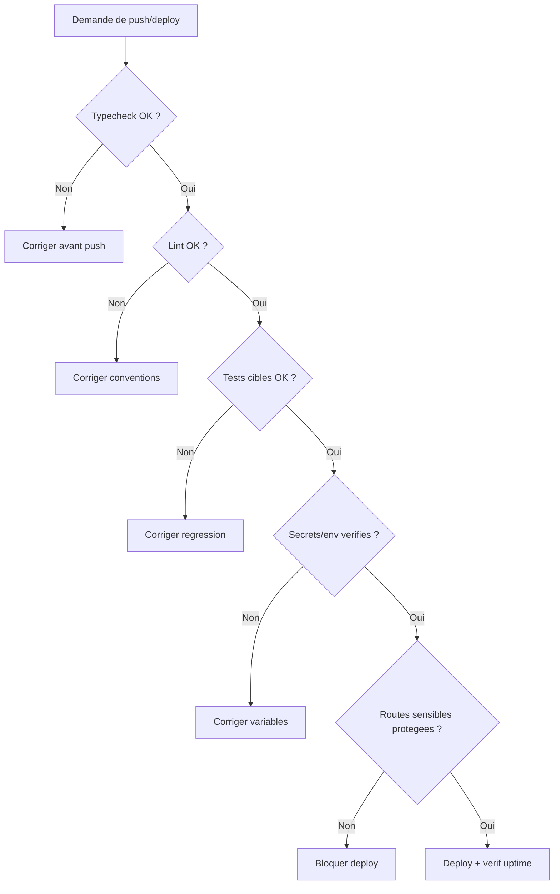

# Checklist push deploy

## Decision tree securite avant push

Fallback statique:
```md

```

## Regle de deploy recommandee

- Preferer `vercel env pull .env.local --yes` puis `git commit` + `git push origin main`.
- Laisser Vercel redeployer automatiquement depuis GitHub.
- Eviter `vercel deploy --prod` direct depuis la CLI sur ce repo: le `rootDirectory=apps/web` peut dupliquer le chemin et casser le deploy local CLI.
- Si un deploy doit etre force manuellement, verifier d'abord que les env Vercel pointent vers le bon projet Supabase avant tout push.

## Regle de commit

- Toujours prendre l'etat complet du repo avant un commit: `git add -A` depuis la racine du dépôt.
- Ne pas faire de commit partiel par fichier ou sous-dossier sauf exception explicitement demandee par l'utilisateur.
- Verifier `git status` sur l'ensemble du repo avant commit pour s'assurer qu'aucun changement utile ne reste hors staging.
- Si le commit doit inclure une documentation, des assets ou des changements code, ils partent dans le meme commit global.

## Tri des fichiers

- **A garder dans Git**: documentation metier, runbooks, schemas, migrations, scripts, pages_site canonique, assets de reference.
- **A ignorer dans `.gitignore`**: artefacts locaux, exports temporaires, caches, logs, builds, backups jetables, `.next`, `node_modules`, fichiers `apps/web/data/local-db/*.json` et sorties de debug locales.
- **A ignorer dans `.vercelignore`**: uniquement les dossiers d'outillage local et de contexte editeur qui ne doivent jamais partir au deploy Vercel.
- **A ne pas ignorer**: la documentation qui sert de source de verite projet, meme si elle est volumineuse.

1. `npm -C apps/web run typecheck`
2. `npm -C apps/web run lint`
3. Lancer les tests cibles des zones modifiees
4. Verifier variables d'environnement critiques
5. Controler routes sensibles (`/admin`, auth, API metier)
6. Verifier `api/uptime` apres mise en production
