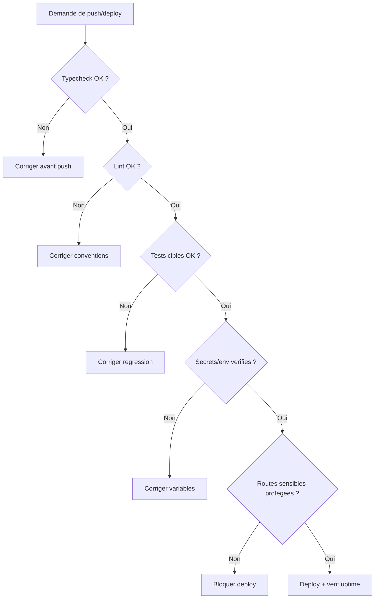

# Checklist push deploy

## Decision tree securite avant push

```mermaid
flowchart TD
  A[Demande de push/deploy] --> B{Typecheck OK ?}
  B -- Non --> B1[Corriger avant push]
  B -- Oui --> C{Lint OK ?}
  C -- Non --> C1[Corriger conventions]
  C -- Oui --> D{Tests cibles OK ?}
  D -- Non --> D1[Corriger regression]
  D -- Oui --> E{Secrets/env verifies ?}
  E -- Non --> E1[Corriger variables]
  E -- Oui --> F{Routes sensibles protegees ?}
  F -- Non --> F1[Bloquer deploy]
  F -- Oui --> G[Deploy + verif uptime]
```
Fallback statique:
```md

```

## Regle de deploy recommandee

- Laisser Vercel redeployer automatiquement depuis GitHub après un commit publié
  avec l'identité de publication attendue.
- Ne jamais lancer `vercel env pull` dans le checkout principal pour résoudre un
  incident de deployment : cette commande peut créer ou modifier des fichiers
  `.env*`. Si elle est nécessaire, l'exécuter dans une sandbox éphémère et
  supprimer les fichiers générés avant sa clôture.
- Avec le projet monorepo actuel, le `rootDirectory` Vercel est
  `apps/web`. Une commande CLI lancée depuis la racine du dépôt doit rester
  depuis cette racine ; la lancer depuis `apps/web` avec le lien du projet peut
  résoudre `apps/web/apps/web` et échouer avant le build.
- Un `vercel deploy --prod` manuel est réservé à une récupération explicite.
  Vérifier alors le projet, le SHA source, l'état `READY`, les alias et les
  logs ciblés avant de conclure.

## Préflight identité et provenance

Avant tout commit destiné à GitHub/Vercel, vérifier l'origine effective de
l'identité, pas seulement la configuration globale :

```powershell
git config --show-origin --show-scope --get user.name
git config --show-origin --show-scope --get user.email
git var GIT_AUTHOR_IDENT
git var GIT_COMMITTER_IDENT
Get-ChildItem Env:GIT_* | Where-Object Name -match 'GIT_(AUTHOR|COMMITTER)'
```

L'identité `Static Candidate Test` et son adresse de fixture sur un domaine
`.invalid` sont réservées aux fixtures qui créent leur propre dépôt temporaire, notamment
`scripts/ci/run-static-candidate-check.test.mjs`. Elle ne doit jamais être
présente dans `.git/config` du checkout de publication ni dans les variables
`GIT_AUTHOR_*`/`GIT_COMMITTER_*` du processus qui crée un commit réel.

Si Vercel renvoie `TEAM_ACCESS_REQUIRED` ou
`Git author ... must have access to the team`, arrêter les retries : un simple
`--meta` ne corrige pas forcément l'attribution interne Vercel. Corriger
l'identité de publication, conserver la signature et ne jamais réécrire ni
force-push le commit historique concerné.

## Regle de commit

- Définir l'allowlist exacte du lot et ne jamais utiliser `git add -A`.
- Stager uniquement cette allowlist, puis vérifier immédiatement
  `git diff --cached --name-status` et `git diff --cached --check`.
- Pour un index ou une sandbox isolée, utiliser `git commit -S` (ou
  `git commit-tree -S`) : `commit.gpgsign=true` ne signe pas automatiquement
  un `git commit-tree`. Vérifier ensuite `git show --show-signature --no-patch`
  avant le push.
- Les changements parallèles dirty ou déjà stagés hors lot restent préservés et
  ne sont pas absorbés dans le commit.
- Après `git fetch origin main`, vérifier l'ascendance et les commits locaux
  non publiés avant un push normal. Une avance distante indépendante autorise
  au plus une resynchronisation sûre ; une nouvelle race impose STOP.

## Tri des fichiers

- **A garder dans Git**: documentation metier, runbooks, schemas, migrations, scripts, pages_site canonique, assets de reference.
- **A ignorer dans `.gitignore`**: artefacts locaux, exports temporaires, caches, logs, builds, backups jetables, `.next`, `node_modules`, fichiers `apps/web/data/local-db/*.json` et sorties de debug locales.
- **A ignorer dans `.vercelignore`**: uniquement les dossiers d'outillage local et de contexte editeur qui ne doivent jamais partir au deploy Vercel.
- **A ne pas ignorer**: la documentation qui sert de source de verite projet, meme si elle est volumineuse.

1. `npm -C apps/web run typecheck` si le lot touche le code TypeScript
2. `npm -C apps/web run lint` si le lot touche le code web
3. Lancer les tests cibles des zones modifiées
4. Vérifier les variables d'environnement critiques sans afficher leur valeur
5. Contrôler les routes sensibles (`/admin`, auth, API métier)
6. Après production, vérifier `/api/health` ou `/api/uptime`
7. Pour une récupération Vercel, inspecter le deployment et ses logs avant de
   déclarer la production rétablie
