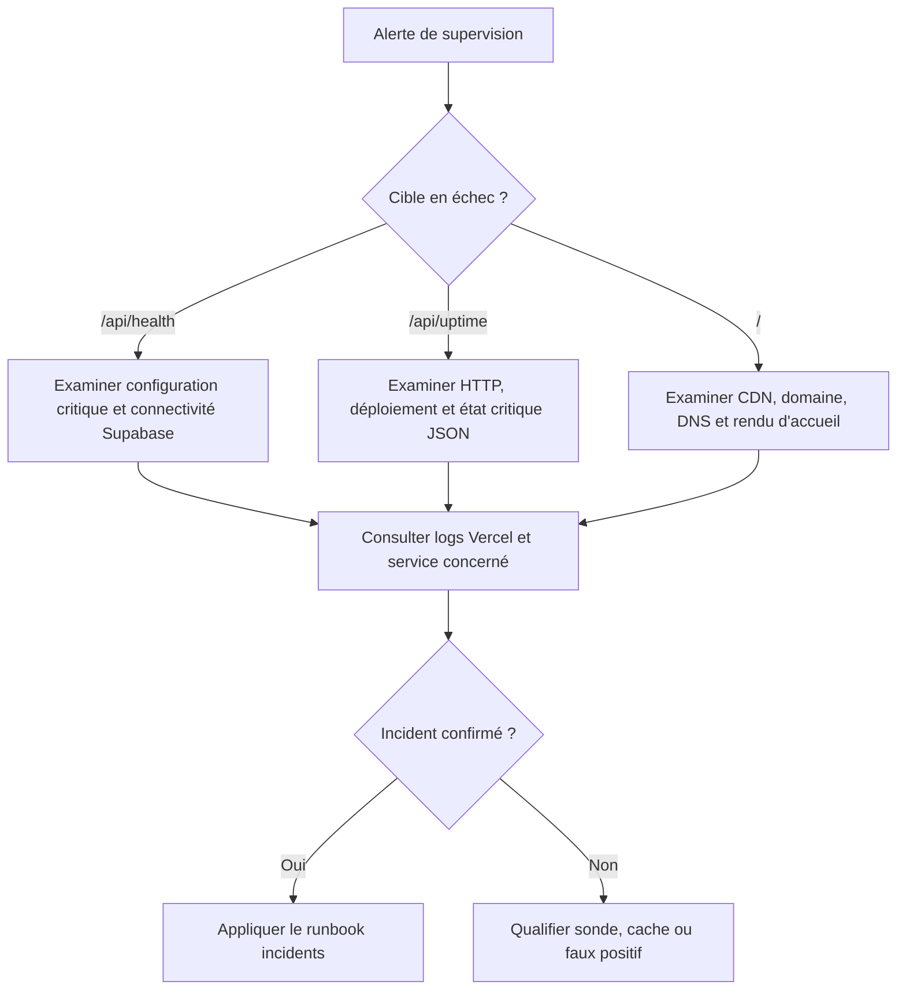

# Cloudflare, Sentry Uptime et UptimeRobot — supervision de CleanMyMap

> **Statut : CURRENT — procédure d'exploitation et configuration cible.**
> Les réglages des fournisseurs sont effectués dans leurs tableaux de bord ;
> leur présence dans ce document ne prouve pas qu'ils ont été appliqués.
> Référence fonctionnelle des endpoints : `apps/web/src/app/api/uptime/route.ts`
> et `apps/web/src/app/api/health/route.ts` sur `main`.

## Objectif

Superviser l'accessibilité publique de CleanMyMap et la connectivité de ses
services sans télécharger inutilement la page d'accueil à haute fréquence.
Cette politique applique le principe de soutenabilité préventive défini dans
[`platform-cost-governance.md`](./platform-cost-governance.md) : réduire le
coût fixe de supervision avant l'augmentation du trafic bénévole, sans perdre
la capacité de détecter les pannes importantes.

Les moniteurs externes ne sont pas des cron Vercel. Leurs requêtes peuvent
néanmoins consommer des `CDN Requests`, du `Fast Data Transfer` et, selon le
cache et la route, des ressources serveur ou Supabase.

## Rôles des trois points de contrôle

| Endpoint | Ce qui est réellement contrôlé | Limite |
|---|---|---|
| `GET /api/uptime` | Disponibilité HTTP de la route et présence/cohérence de configurations critiques (Supabase, Clerk) | Ne teste **pas** la connectivité de Supabase. Répond HTTP `200` même si le JSON indique `criticalStatus: "degraded"` : une simple alerte HTTP 2xx/5xx ne détecte donc pas toutes les dégradations. Cache CDN `s-maxage=120`, avec `stale-while-revalidate=300`. |
| `GET /api/health` | Disponibilité de la route, variables indispensables et connectivité Supabase via une lecture légère (`HEAD`/`select id`, `limit(1)`) | Répond `503` en cas de dégradation détectée ; requête potentiellement plus coûteuse. Cache CDN `s-maxage=60`, avec `stale-while-revalidate=120`. |
| `GET /` | Accessibilité HTTP du véritable accueil public | Télécharge une réponse HTML nettement plus volumineuse ; HTTP `200` ne prouve pas l'hydratation ou le fonctionnement intégral de l'interface. |

Ne pas remplacer le contrôle de `/` par le seul `/api/uptime` : ils couvrent des
pannes différentes. Ne pas multiplier les sondes fréquentes d'une même route
sans besoin de redondance documenté.

## Réglages recommandés pour l'exploitation courante (Hobby)

| Fournisseur | Moniteur | Méthode et URL | Intervalle cible | But |
|---|---|---|---|---|
| **Sentry Uptime** | Accessibilité légère | `GET https://cleanmymap.fr/api/uptime` | **1 minute** | Détection rapide d'une panne HTTP sans recharger continuellement l'accueil |
| **UptimeRobot** | Accueil public | `GET https://cleanmymap.fr/` | **30 minutes** | Vérification périodique de la vraie page |
| **UptimeRobot** | Backend et Supabase | `GET https://cleanmymap.fr/api/health` | **15 minutes** | Détection de la dégradation de configuration ou de connectivité serveur |

**Sentry Uptime** : conserver initialement le timeout de **10 secondes**, le
seuil de **3 échecs consécutifs**, la méthode `GET` et `Allow Sampling` désactivé
observés sur le moniteur existant. Le seuil correspond à environ trois minutes
pour une sonde exécutée chaque minute, hors retards et erreurs de plateforme.
Aucun en-tête HTTP personnalisé n'est requis par ces routes publiques ; ne pas
ajouter d'en-tête factice ni de secret dans les captures ou la documentation.

**UptimeRobot** : conserver le type HTTP(s) et les notifications utiles.
Les intervalles de 30 et 15 minutes doivent être vérifiés dans l'offre et
l'interface effectivement disponibles. Le seuil d'alerte et les destinataires
ne sont pas déduits des captures : les relire dans la configuration du service.

### État observé avant changement — captures du 8 octobre 2026

Ce tableau est une **observation datée**, pas une preuve de l'état actuel après
sauvegarde des paramètres :

| Fournisseur | URL observée | Intervalle observé |
|---|---|---|
| Sentry Uptime | `https://cleanmymap.fr` | 1 minute |
| UptimeRobot | `cleanmymap.fr` | 5 minutes |
| UptimeRobot | `cleanmymap.fr/api/health` | 5 minutes |

Les captures n'établissent pas que les modifications recommandées ont déjà
été enregistrées. Après changement, vérifier à nouveau chaque fiche moniteur.

## Procédure de configuration

### Sentry Uptime

1. Dans l'organisation Sentry concernée, ouvrir **Monitors → Uptime**, puis le
   moniteur qui vise actuellement `https://cleanmymap.fr`.
2. Modifier seulement l'URL vers
   `https://cleanmymap.fr/api/uptime` ; conserver `GET`, intervalle 1 minute,
   timeout 10 secondes et seuil de 3 échecs, sauf décision d'exploitation
   spécifique.
3. Enregistrer et confirmer que la fiche active affiche l'URL et la fréquence
   attendues ; observer au moins un contrôle réussi.
4. Pour une surveillance de dégradation applicative, ne pas considérer le seul
   statut HTTP `200` de `/api/uptime` comme suffisant : contrôler le champ
   `criticalStatus` séparément si un moniteur de contenu est explicitement
   configuré, ou s'appuyer sur `/api/health`.

### UptimeRobot

1. Ouvrir **Monitoring**, puis le menu d'édition du moniteur
   `cleanmymap.fr` ; conserver la cible `/` et régler l'intervalle à **30 min**.
2. Ouvrir le moniteur `cleanmymap.fr/api/health` ; conserver son URL et régler
   l'intervalle à **15 min**.
3. Enregistrer chacun des moniteurs. Confirmer les nouvelles cadences, le type
   HTTP(s), leur état actif et les destinataires d'alerte.
4. Si la cadence souhaitée n'est pas disponible dans le plan utilisé, choisir
   une cadence effectivement offerte et documenter l'écart ; ne pas inventer
   une limitation ou changer d'abonnement sans décision explicite.

## Justification coût et méthode de validation

Le relevé Vercel transmis le 8 octobre 2026 montrait pour `/` environ **883
requêtes en 12 heures**, **133 Mo sortants** et **150 Ko par réponse**.
Avant modification, les fréquences nominales Sentry (720/12 h) et UptimeRobot
accueil (144/12 h) représentent ensemble **864 sondes théoriques par 12 heures**.
La proximité des volumes est un indice fort, **pas une attribution exhaustive** :
les fenêtres, les éventuelles redirections et les autres clients peuvent varier.

À fréquence nominale constante, le passage des deux sondes d'accueil à la
seule vérification UptimeRobot toutes les 30 minutes réduit leur nombre
théorique de **1 728 à 48 téléchargements de `/` par jour**, soit environ
**97 %** des *téléchargements d'accueil dus à ces deux moniteurs*.
Il ne prédit pas une économie identique sur le trafic total ni sur le prix de
Vercel. Le moniteur Sentry continue de solliciter `/api/uptime` chaque minute.

Après sauvegarde des trois moniteurs :

1. Confirmer les URL, cadences et statuts dans **Sentry** et **UptimeRobot**.
2. Contrôler la disponibilité des trois endpoints et le maintien des alertes.
3. Dans Vercel Hobby, comparer deux fenêtres de **12 h** de la même route `/`
   (nombre de requêtes, transfert sortant, taille moyenne de réponse), en
   tenant compte des autres changements de trafic et des redirections.
4. Examiner également les requêtes de `/api/uptime` et `/api/health`, les
   invocations de fonctions et, si disponible, les cache hits, afin de vérifier
   qu'aucune économie n'a seulement déplacé une charge plus coûteuse.
5. Si les volumes restent élevés, examiner les robots de recherche, previews
   de liens et autres moniteurs avant de modifier le rendu de l'accueil ou les
   règles Firewall.

La présence d'un cache CDN ne rend pas gratuits les octets envoyés à chaque
sonde. Ne pas attribuer un gain réel avant la mesure post-configuration.

## Diagnostic et escalade

- `/api/health` en HTTP `503` : examiner les variables de configuration et la
  connectivité Supabase avant de conclure à une indisponibilité générale.
- `/api/uptime` en HTTP `200` avec `criticalStatus: "degraded"` : signal de
  configuration dégradée **non visible par une alerte fondée sur le seul code HTTP**.
- `/` inaccessible : vérifier en priorité domaine/DNS, TLS, déploiement Vercel,
  CDN et erreur de rendu ; ne pas neutraliser cette sonde sous prétexte de coût.

Voir [`runbook-monitoring-logs.md`](./runbook-monitoring-logs.md) et
[`incidents-frequents-et-reprise.md`](./incidents-frequents-et-reprise.md)
pour la qualification et la résolution des incidents. Les seuils d'escalade
opérationnels doivent être ajustés à la cadence choisie : un moniteur toutes
les 30 minutes ne peut pas garantir une détection sous cinq minutes.

## Checklist historique — cutover Cloudflare / Next.js

Cette partie conserve les opérations utiles en cas de **nouvelle bascule DNS**.
Elle ne définit pas les fréquences de surveillance courante, qui figurent dans
la section précédente.

### Prérequis

- Déploiement Vercel de production disponible et validé.
- Configuration de production critique présente (Clerk, Supabase, Sentry).
- Domaine principal identifié et validé.

### Étapes Cloudflare (DNS)

1. Confirmer la cible Vercel (CNAME/apex selon la configuration réelle).
2. Réduire temporairement le TTL DNS avant cutover si nécessaire.
3. Basculer l'entrée DNS principale vers la cible autorisée.
4. Vérifier la propagation depuis plusieurs résolveurs publics.
5. Vérifier HTTPS/TLS, les redirections et les réglages réellement gérés par
   Cloudflare ou Vercel selon le routage retenu.
6. Ne pas imposer de cache agressif sur les API ; conserver la stratégie de
   cache explicite des assets statiques Next.js.

### Vérification post-cutover

1. Tester manuellement l'accueil, les cartes et le parcours Clerk.
2. Vérifier les trois sondes ci-dessus et leurs alertes.
3. Lire les erreurs Sentry et les logs Vercel.
4. En cas d'incident confirmé, suivre le runbook de déploiement et la procédure
   de rollback autorisée ; ne pas basculer DNS ou déploiement uniquement parce
   qu'une sonde retourne un faux positif.
