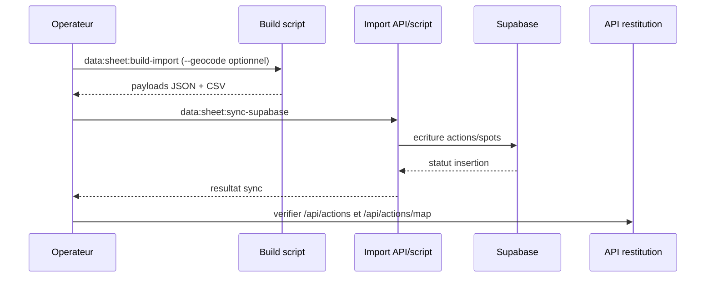
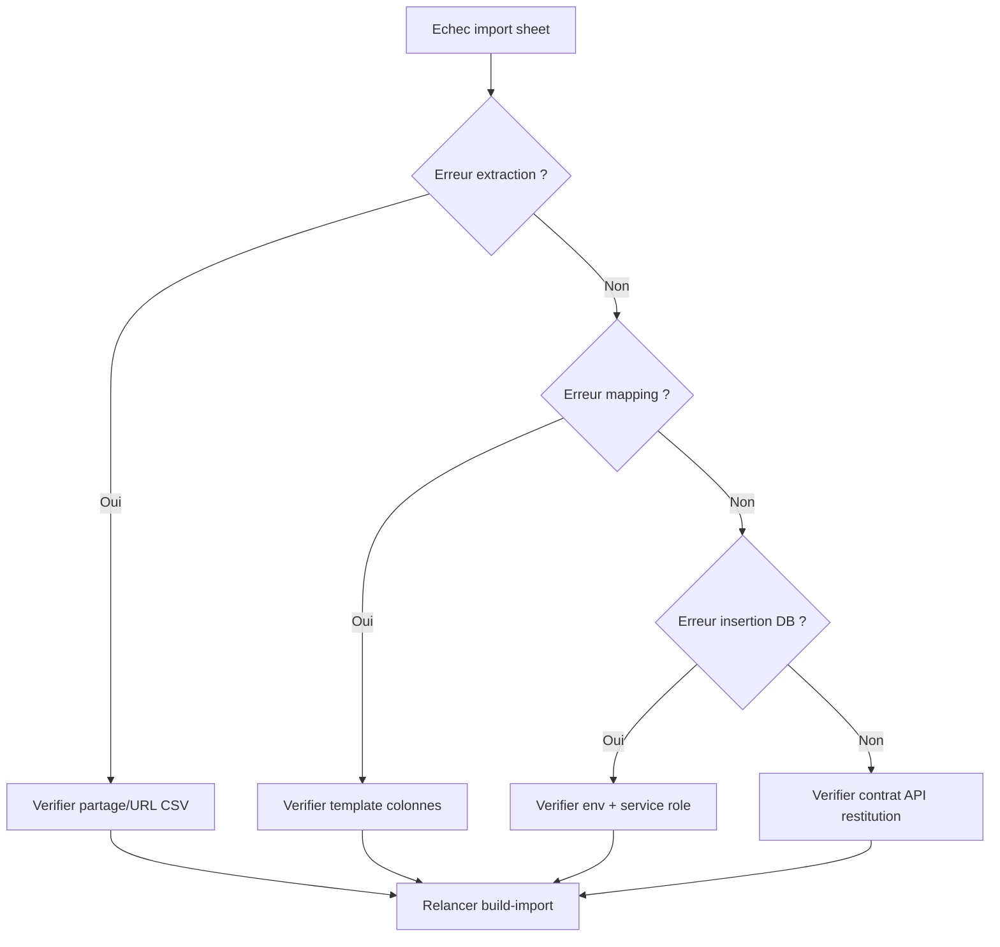
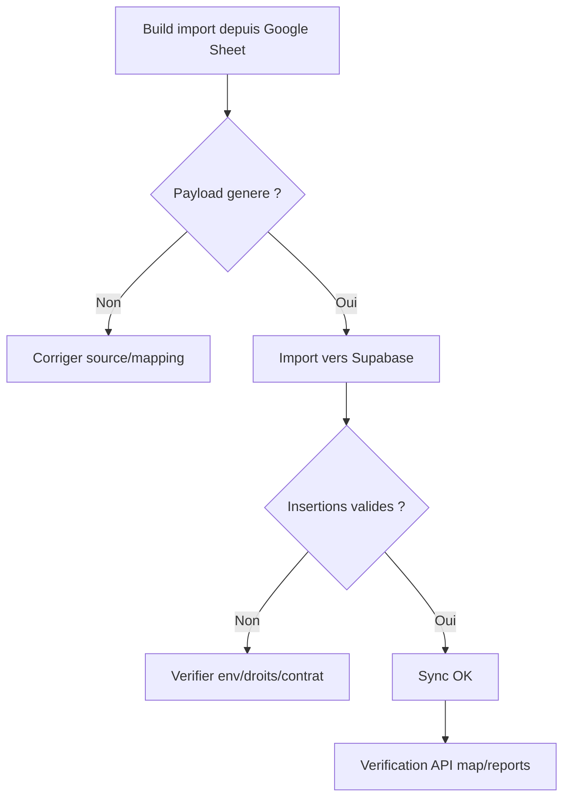

# Google Sheet Admin Import (Historique Actions)

## Sequence import alignee avec pipeline cible

Fallback statique:
```md

```

## Decision tree de depannage

Fallback statique:
```md

```

## Flowchart build -> import -> sync

Fallback statique:
```md

```

## Objectif
Importer des historiques d'actions depuis Google Sheet sans passer par les formulaires utilisateurs.

## Lien Sheet détecté dans le repo
- Source par défaut: `https://docs.google.com/spreadsheets/d/1kKkhylwqo10OA-p6CDuNwYihzW0ElwTeFwCwZ6O-rJw/export?format=csv&gid=0`
- Script existant: `apps/web/scripts/sync-real-data-from-sheet.mjs`

## Colonnes recommandées (template admin)
Utiliser le template: `apps/web/data/raw/google-sheet-admin-template.csv`

Colonnes:
- `Depart` (requis avec `Arrivee`, sert à reconstituer le trajet)
- `Arrivee` (requis avec `Depart` pour les parcours)
- `Lieu Propre ?` (optionnel, oui/non)
- `Association`
- `Nombre de benevoles`
- `Duree (min)`
- `Date` (YYYY-MM-DD ou `DD/MM/YYYY`, requis)
- `Type de Lieu`
- `Dechets (kg)`
- `Megots (kg)`
- `Qualite Megots`

Le builder conserve aussi une compatibilite retroactive avec les anciennes colonnes
`action_date`, `location_label`, `latitude`, `longitude`, `cigarette_butts`,
`volunteers_count`, `duration_minutes`, `association_name`, `enterprise_name`,
`actor_name`, `status`, `notes` et `type`.

## Générer un payload JSON d'import admin
Depuis la racine du repo:

```bash
npm --prefix apps/web run data:sheet:build-import
```

Avec URL personnalisée:

```bash
npm --prefix apps/web run data:sheet:build-import -- "https://docs.google.com/spreadsheets/d/<ID>/export?format=csv&gid=0"
```

Avec géocodage automatique des lignes sans coordonnées:

```bash
npm --prefix apps/web run data:sheet:build-import -- --geocode
```

Sorties:
- CSV brut récupéré: `apps/web/data/raw/google-sheet-admin-actions.csv`
- Payload admin prêt à l'emploi: `apps/web/data/raw/google-sheet-admin-import.json`
- CSV "mode formulaire web" aligne sur la nouvelle structure du sheet: `apps/web/data/raw/google-sheet-form-like.csv`
- Payload lieux propres: `apps/web/data/raw/google-sheet-clean-places-import.json`
- CSV lieux propres (logique `clean_place`): `apps/web/data/raw/google-sheet-clean-places-form-like.csv`

## Import vers le backend admin
Le payload généré est compatible avec `/api/actions/import` (dry-run puis confirmation)
et conserve les métadonnees de trajet dans `notes` pour que la carte puisse
reconstruire une polyline lorsqu'un trajet Depart/Arrivee est present.

Remarque:
- `association_name` est persisté avec la même normalisation que le formulaire.
- Pour les lignes entreprise: renseigner `enterprise_name` pour éviter de fusionner tous les cas RSE.
- Les associations hors référentiel sont automatiquement rabattues sur `Action spontanee` avec traçabilité dans `notes` (`Original association: ...`).
- La colonne `liste lieux propres` est traitée séparément et exportée en objets `clean_place` (logique site dédiée, distincte des actions).
- Les trajets `Depart / Arrivee` sont géocodés puis stockés avec une géométrie
  de ligne dans les notes techniques, ce qui permet d'afficher les actions sur la
  carte du site meme sans colonnes lat/lon dans le sheet.

## Sync direct vers Supabase (carte web)
Commande unique (rebuild depuis Google Sheet + import en base):

```bash
npm --prefix apps/web run data:sheet:sync-supabase
```

Effet:
- écrit les lignes `actions` dans `public.actions`
- écrit les lieux propres dans `public.spots` (`waste_type=clean_place`)
- supprime d'abord les anciennes lignes importées par ce même flux (idempotent)

Variables requises:
- `NEXT_PUBLIC_SUPABASE_URL`
- `SUPABASE_SERVICE_ROLE_KEY`

Options:
- `--skip-build` pour réutiliser les payloads déjà générés
- `--system-user-id=<id>` pour changer le `created_by_clerk_id` technique

## Depannage (erreur "Sheet appears empty")
- Cause frequente: dans certains environnements, Google renvoie une page HTML (auth/interstitiel) au lieu d'un vrai CSV.
- Comportement actuel des scripts:
  - tentative automatique d'URL CSV alternative (`gviz/tq?tqx=out:csv`);
  - fallback automatique sur le snapshot local si disponible:
    - `apps/web/data/raw/google-sheet-admin-actions.csv`
    - `apps/web/data/raw/google-sheet-map-clean-up.csv`
- Action recommandee si l'erreur persiste:
  1. verifier que la feuille est partagee/public ou accessible au compte utilise;
  2. fournir explicitement `CLEANMYMAP_SHEET_URL` vers un export CSV valide;
  3. relancer `npm --prefix apps/web run data:sheet:build-import`.

## Push automatique vers Google Sheets (API)
Script pret a l'emploi:
- `apps/web/scripts/push-google-sheet-from-form-like.mjs`

Commande:

```bash
npm --prefix apps/web run data:sheet:push
```

Variables d'environnement requises:
- `GOOGLE_SHEETS_SPREADSHEET_ID`
- `GOOGLE_SERVICE_ACCOUNT_EMAIL`
- `GOOGLE_SERVICE_ACCOUNT_PRIVATE_KEY` (avec `\n` dans la valeur)

Variables optionnelles:
- `GOOGLE_SHEETS_TAB_ACTIONS` (defaut: `actions_form_like`)
- `GOOGLE_SHEETS_TAB_CLEAN_PLACES` (defaut: `clean_places_form_like`)
- `GOOGLE_SHEETS_CLEAR_BEFORE_WRITE` (`true`/`false`, defaut: `true`)

Pre-requis Google:
- Creer un service account GCP avec acces `Google Sheets API`.
- Partager le Google Sheet cible avec l'email du service account (editeur).
- Generer les donnees locales avant push:

```bash
npm --prefix apps/web run data:sheet:build-import -- --geocode
```
