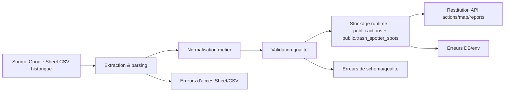
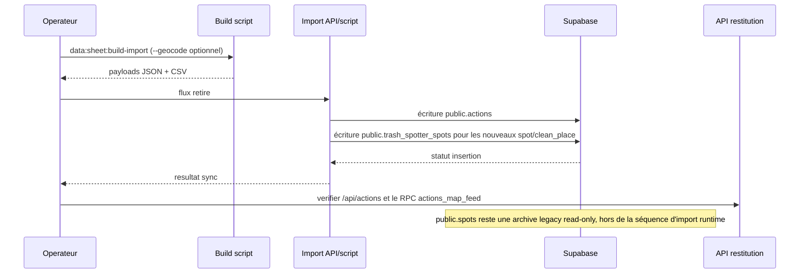
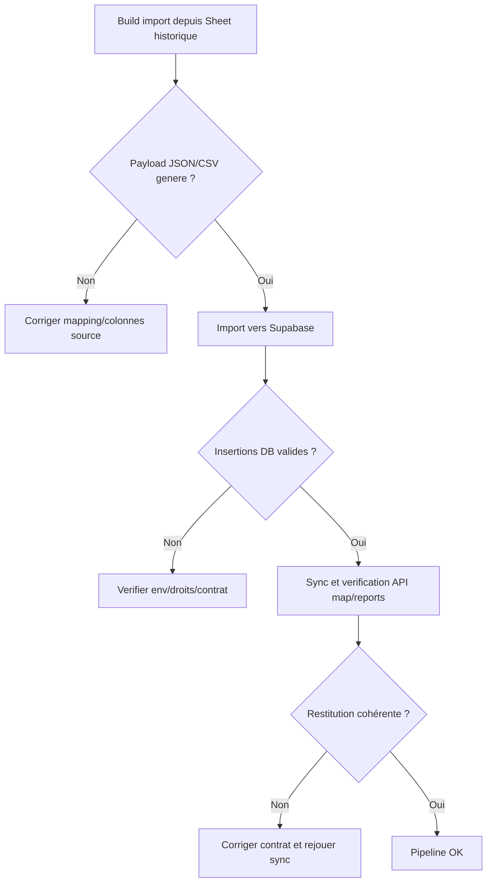
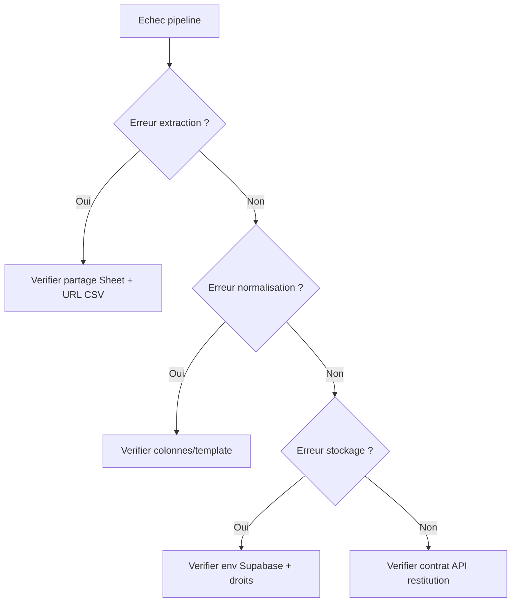

# Data pipeline import (visual-first)

## Diagramme global source -> normalisation -> stockage -> restitution

Fallback statique:
```md

```

## Etapes avec entree/sortie/erreurs connues
| Etape | Entree | Sortie | Erreurs connues |
|---|---|---|---|
| Extraction & parsing | URL CSV Google Sheet, snapshots locaux | CSV brut local | Sheet non accessible, HTML au lieu de CSV, encodage invalide |
| Normalisation metier | CSV brut + mapping colonnes | Payload JSON admin + payload lieux propres | Colonnes manquantes, types invalides, association non reconnue |
| Validation qualite | Payload normalise | Payload validable importable | Geoloc manquante/incoherente, dates invalides, champs requis absents |
| Stockage Supabase | Payload valide + env Supabase | Lignes `public.actions` et `public.trash_spotter_spots` | `SUPABASE_SERVICE_ROLE_KEY` absente, échec insertion, conflit idempotence |
| Restitution API | Donnees stockees | `/api/actions`, RPC `actions_map_feed`, exports reports | Contrat data casse, mismatch champs, reponse partielle |

### Frontière des tables

- `public.actions` est la table canonique des actions.
- `public.trash_spotter_spots` est la cible unique de tout nouveau
  signalement `spot` ou `clean_place`.
- `public.spots` est une archive legacy read-only. Elle est hors du chemin
  d'import runtime : aucune nouvelle écriture, modération ou restitution
  runtime ne doit la cibler. Une lecture explicite reste réservée aux
  opérations de maintenance ou d'export historiques.

## Sequence d'execution recommandee

Fallback statique:
```md

```

## Flowchart build -> import -> sync

Fallback statique:
```md

```

## Commandes
```bash
npm --prefix apps/web run data:sheet:build-import
npm --prefix apps/web run data:sheet:build-import -- --geocode
```

La synchronisation directe Google Sheet -> Supabase est retiree.

## Variables critiques
- `NEXT_PUBLIC_SUPABASE_URL`
- `SUPABASE_SERVICE_ROLE_KEY`
- `CLEANMYMAP_SHEET_URL` (si override source)

## Decision tree de depannage

Fallback statique:
```md

```
