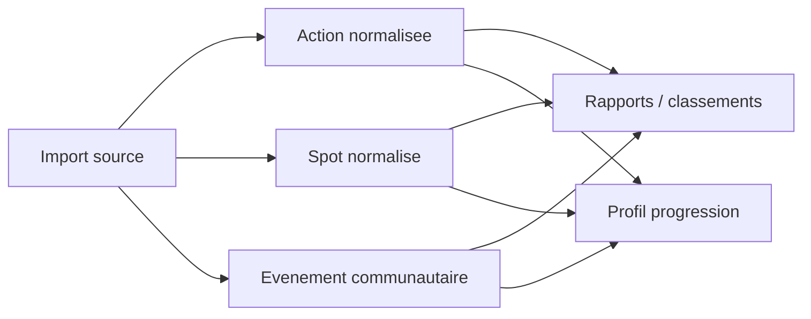

# Schema de normalisation

## Architecture entites + relations

Fallback statique:
```md

```

## Entites principales
- Action
- Spot
- Evenement communautaire
- Profil progression

## Principes
- Unifier les champs minimaux (date, localisation, statut, auteur/source)
- Normaliser les champs de volume/qualite avant aggrégation via `apps/web/src/lib/actions/*`
- Marquer explicitement les donnees estimees/proxy

## Controle qualite avant ecriture

Les imports externes administrateur passent par `normalizeExternalActionImport` dans
`apps/web/src/lib/actions/unified-source.ts`, puis par `createAction`. Une insertion
directe dans `actions` n'est pas un chemin d'import valide : elle contourne les
organisateurs, la geometrie persistee et les metadonnees du contrat.

Le resume de qualite est versionne par
`apps/web/src/lib/actions/data-quality.ts` et distingue :

- `measured` : valeur declaree ou relevee sur le terrain ;
- `derived` : valeur calculee a partir d'autres donnees, notamment l'impact ;
- `estimated` : valeur issue d'une estimation provisoire ou d'une geometrie estimee ;
- `missing` : valeur non disponible.

Les anomalies `invalid_date`, `invalid_measure`, `implausible_measure`,
`partial_coordinates`, `invalid_coordinates` et `missing_location_label` sont
bloquantes pour une confirmation d'import. `missing_coordinates` est une alerte :
l'action peut rester exploitable dans les listes et rapports, mais elle est exclue
de la couverture cartographique. La paire latitude/longitude est toujours evaluee
ensemble ; une seule coordonnee renseignee est donc explicitement `partial`.

La revue mensuelle est disponible via l'endpoint admin existant avec
`/api/reports/governance-monthly?quality=1&month=YYYY-MM`. Elle restitue les taux,
les anomalies par code, la couverture geographique, la provenance des mesures et
les alertes de seuil.
