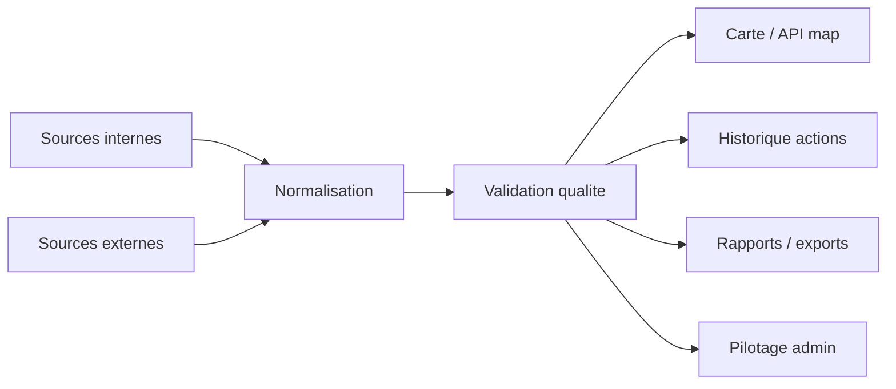

# Sources de donnees

## Flow complet sources -> normalisation -> usages

Fallback statique:
```md

```

## Sources internes
- Actions declarees (citoyens/collectifs)
- Spots et statuts de nettoyage
- Evenements communautaires et RSVPs

## Sources externes
- Imports Google Sheet admin
- Donnees contextuelles eventuelles (meteo/evenements locaux)

## Points de controle
- Traçabilite des imports
- Validation qualite avant exploitation analytique

## Sources éditoriales et institutionnelles

Les contenus environnementaux et institutionnels suivent un contrat distinct du
flux d'actions :

```txt
apps/web/src/lib/content/content-validation.ts
```

Avant affichage public, la source, sa date et sa précision, le niveau de preuve,
le responsable et la dernière revue doivent être renseignés. Les claims sont
séparés entre fait, estimation et recommandation. Voir
`documentation/architecture/content-validation.md`.
