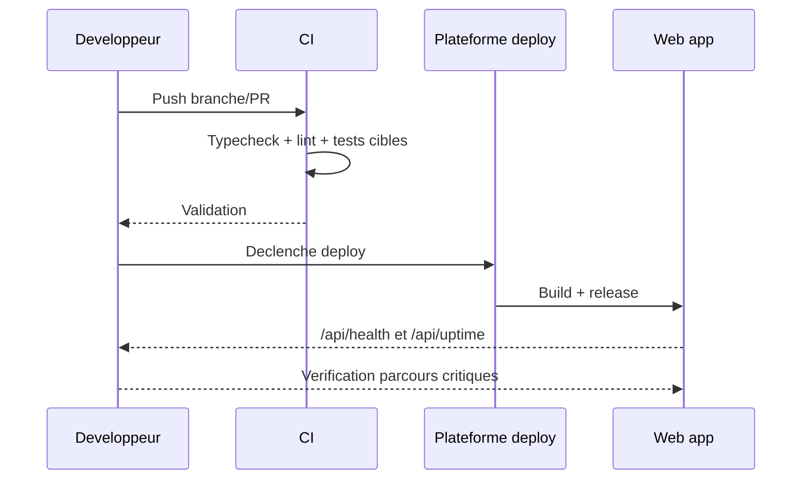

# Runbook deploiement

## Sequence deploiement (runtime web)

Fallback statique:
```md

```

## Avant deploy
- Validation locale/CI (typecheck, lint, tests cibles)
- Verification env critiques (Clerk/Supabase)
- Si une correction touche le build ou les routes Vercel, faire d'abord passer `npm run build -w apps/web` et `npm run audit:vercel-quota` avant de lancer un `vercel build` complet.
- Si `vercel build` echoue sur Windows avec `EPERM: operation not permitted, symlink`, arreter la boucle de retry et basculer vers un shell elevé ou Windows Developer Mode avant de relancer.

## Pendant deploy
- Suivre statut deployment (branche, root `apps/web`)
- Eviter changements paralleles non traces

## Apres deploy
- Verifier `/api/health` et `/api/uptime`
- Tester parcours critiques (auth, action, admin)
