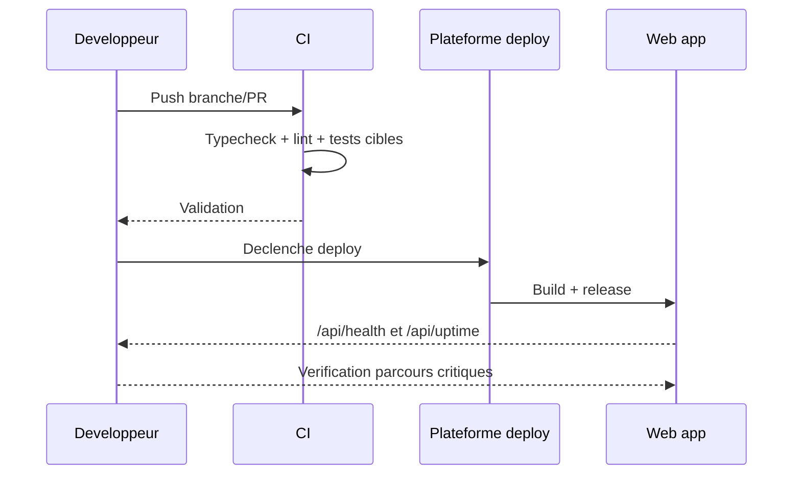

# Runbook deploiement

## Sequence deploiement (runtime web)

```mermaid
sequenceDiagram
  participant Dev as Developpeur
  participant CI as CI
  participant Vercel as Plateforme deploy
  participant App as Web app
  Dev->>CI: Push branche/PR
  CI->>CI: Typecheck + lint + tests cibles
  CI-->>Dev: Validation
  Dev->>Vercel: Declenche deploy
  Vercel->>App: Build + release
  App-->>Dev: /api/health et /api/uptime
  Dev-->>App: Verification parcours critiques
```
Fallback statique:
```md

```

## Avant deploy
- Validation locale/CI (typecheck, lint, tests cibles)
- Verification env critiques (Clerk/Supabase)
- Si une correction touche le build ou les routes Vercel, faire d'abord passer `npm run build -w apps/web` et `npm run audit:vercel-quota` avant de lancer un `vercel build` complet.
- Si `vercel build` echoue sur Windows avec `EPERM: operation not permitted, symlink`, arreter la boucle de retry et basculer vers un shell elevé ou Windows Developer Mode avant de relancer.

## Identité Git avant publication

Le checkout de publication doit utiliser l'identité Git réelle du projet. Une
configuration locale dans `.git/config` prend precedence sur
`~/.gitconfig`; les variables `GIT_AUTHOR_*` et `GIT_COMMITTER_*` peuvent encore
la surcharger.

```powershell
git config --show-origin --show-scope --get user.name
git config --show-origin --show-scope --get user.email
git var GIT_AUTHOR_IDENT
git var GIT_COMMITTER_IDENT
Get-ChildItem Env:GIT_* | Where-Object Name -match 'GIT_(AUTHOR|COMMITTER)'
```

Ne jamais publier avec l'identité `Static Candidate Test` ni avec l'adresse de
fixture sur un domaine `.invalid`. Cette identité reste limitée aux dépôts temporaires créés par les tests de
`run-static-candidate-check`. Conserver `commit.gpgsign`, `gpg.format`, la clé
de signature et l'allowlist configurés ; ne pas désactiver Verified Commits.

Un commit construit avec `git commit-tree` n'est pas signé par le seul réglage
`commit.gpgsign=true`. Pour une publication depuis un index isolé, préférer
`git commit -S` ou fournir explicitement `git commit-tree -S`, puis vérifier la
signature du SHA avant le push. Ne jamais remplacer cette vérification par une
fixture ou par une désactivation de la signature.

Si Vercel répond `TEAM_ACCESS_REQUIRED` avec
`Git author ... must have access to the team`, le problème est l'attribution
du commit avant le build. Arrêter les retries, corriger uniquement l'identité
de publication et ne pas réécrire le commit déjà publié.

## Déploiement manuel d'un SHA historique

Cette procédure est une récupération exceptionnelle lorsqu'un commit déjà
publié ne peut plus être redéployé par le lien Git Vercel à cause de son auteur
historique, et qu'une réécriture est interdite :

1. Résoudre le SHA demandé et matérialiser une sandbox éphémère sous
   `.artifacts/` avec `git worktree add --detach`, jamais un clone.
2. Vérifier `git -C <sandbox> rev-parse HEAD` et
   `git -C <sandbox> status --short` avant l'upload.
3. Lier la sandbox au bon projet Vercel. Avec `rootDirectory=apps/web`, lancer
   la CLI depuis la racine de la sandbox ; ne pas ajouter `apps/web` au chemin
   de commande. Le `vercel link` peut générer `.env.local` ou modifier un
   `.gitignore` local : ces fichiers ne font jamais partie du lot et doivent
   être retirés de la sandbox avant son nettoyage.
4. Si l'auteur historique invalide bloque encore la création, envoyer
   exceptionnellement l'arbre vérifié sans son contexte Git, avec le projet
   explicite et une métadonnée `gitCommitSha` égale au SHA vérifié. Cette
   métadonnée ne remplace pas la preuve : conserver le `rev-parse HEAD` avant
   l'envoi, puis vérifier le SHA dans le deployment Vercel.
5. Attendre `READY` et contrôler `readyStateReason`, `buildSkipped` et
   `meta.gitCommitSha`. Un deployment `BLOCKED` avec `buildSkipped=true` n'est
   pas un build réussi.

Cette récupération ne crée aucun commit et ne permet ni force-push ni
réécriture de l'historique.

## Pendant deploy
- Suivre le statut du deployment, le projet et le root `apps/web`.
- Ne pas lancer plusieurs uploads concurrents pour le même SHA.
- Conserver les changements parallèles du checkout principal hors de la
  sandbox de récupération.

## Apres deploy
- Verifier `/api/health` et `/api/uptime`
- Tester parcours critiques (auth, action, admin)

## Preuves post-déploiement et logs ciblés

Vérifier d'abord le deployment et ses alias, puis le domaine public :

```powershell
npx vercel inspect <deployment-url> --json --non-interactive
Invoke-WebRequest -Uri https://cleanmymap.fr/ -Method Head -UseBasicParsing
```

Pour un incident de persistance ou d'écriture fichier, lire une fenêtre
bornée des logs runtime sans envoyer de requête d'écriture :

```powershell
npx vercel logs --project <project-id> --environment production --since 15m --query '/api/contact' --limit 100 --json --non-interactive
npx vercel logs --project <project-id> --environment production --since 15m --query '/api/legal-content-reports' --limit 100 --json --non-interactive
npx vercel logs --project <project-id> --environment production --since 15m --query 'EROFS' --limit 100 --json --non-interactive
```

Une sortie vide signifie qu'aucune ligne correspondante n'a été observée dans
la fenêtre demandée ; elle ne prouve pas qu'une route a reçu du trafic. Le
rapport doit distinguer ces deux faits.

## Nettoyage de la sandbox

Après la vérification :

```powershell
git worktree list
git worktree remove .artifacts/<sandbox>
git worktree list
```

Vérifier l'absence de processus Vercel/Node lancé par l'opération et l'absence
du chemin de sandbox. Si Windows conserve un verrou, arrêter uniquement les
processus de cette opération, puis supprimer le dossier temporaire connu ; ne
pas utiliser de nettoyage récursif large ni toucher au checkout principal.
