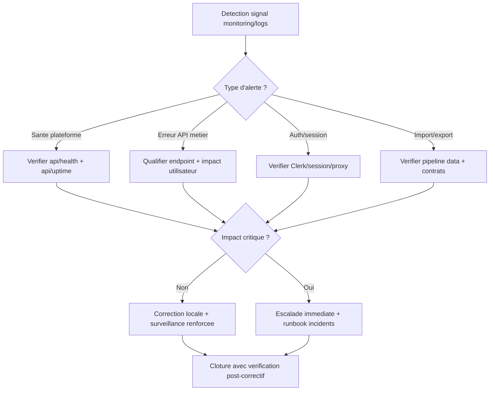

# Runbook monitoring logs

## Flowchart detection -> qualification -> escalade

Fallback statique:
```md

```

## Signaux de supervision
- `GET /api/health`
- `GET /api/uptime`

## Logs a suivre
- erreurs API metier
- erreurs auth/session
- erreurs import/export

## Controle hebdomadaire recommande
- Verifier les 3 derniers incidents Sentry et qualifier les nouveaux digestes.
- Verifier les derniers runs GitHub Actions en echec ou annules.
- Verifier les derniers deploiements Vercel et les erreurs de build.
- Verifier les alertes Dependabot et les PR de mise a jour de dependances.
- N'agir que sur les signaux nouveaux ou persistants, puis consigner le resultat dans la session.

## Escalade
- Si incident critique: appliquer le runbook `incidents-frequents-et-reprise.md`.

## Services web non utilises pour l'instant
- Stripe (paiements en ligne / dons): la route webhook existe déjà, mais elle reste inerte tant que `STRIPE_SECRET_KEY` et `STRIPE_WEBHOOK_SECRET` ne sont pas configurés.
- Pinecone (vecteurs image): a activer quand on lance la recherche IA pour retrouver facilement des cleanwalks dans la base.
- Upstash (Redis serverless, rate limiting, QStash, Workflow): ne pas ajouter tant qu'il n'y a pas un besoin explicite.
- Ajouter Upstash uniquement le jour ou l'on dit:
  - "je dois limiter les abus sur mes API"
  - "j'ai besoin de cache/queues maintenant"

## Services a passer en revue
- Clerk: verifier `GET /api/uptime` quand les sessions sont instables; `clerk_keys: warning` signifie souvent une prod encore branchee sur des clés test.
- Resend: verifier les routes `/api/send` et `/api/email/test` pour distinguer une vraie panne (`502/503`) d'une simple absence de configuration.
- Stripe: verifier `POST /api/stripe/webhook` et les logs `[Stripe Webhook]` pour distinguer un webhook absent d'une signature invalide.
