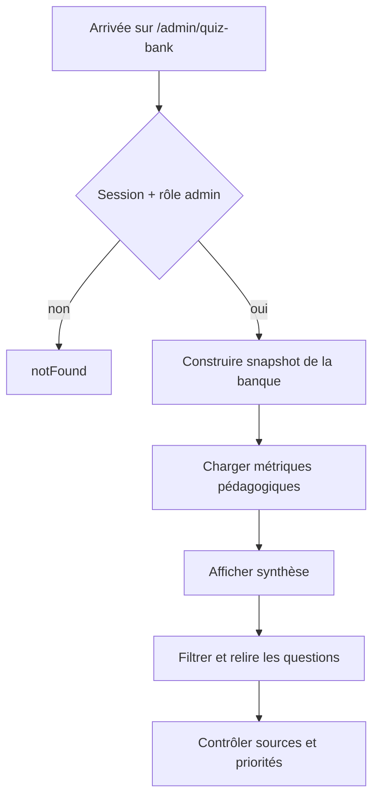

# Banque de quiz — Présentation détaillée

## Parcours



## Construction des données

La page utilise :

```txt
QUIZ_QUESTIONS
buildQuizBankAdminSnapshot(...)
loadQuizPedagogicalMetricsSnapshot(...)
summarizeQuizPedagogicalMetrics(...)
```

## Blocs visibles

### Header

```txt
Administration du quiz
Banque de questions
Admin only
Vue d'audit
```

### Métriques pédagogiques

Synthèse actuelle :

```txt
trop faciles
trop échouées
compétences fragiles
erreurs fréquentes
```

### RGPD & collecte

Le panneau rappelle que les métriques sont agrégées et anonymes dans cette couche.

### Vue banque

`QuizBankAdminView` reçoit le snapshot préparé côté serveur.

## Sécurité

Invariants :

- rôle `admin` obligatoire ;
- pas de banque admin exposée publiquement ;
- pas d'autorisation implicite basée uniquement sur la présence d'un compte ;
- pas de données personnelles supplémentaires sans besoin explicite.

## Performance

La page construit les snapshots côté serveur.

À surveiller si la banque grossit :

- coût de construction ;
- taille du payload ;
- pagination ou virtualisation ;
- recalcul des métriques.

Ne pas ajouter une base ou un cache supplémentaire sans mesure préalable.

## Accessibilité

Vérifier :

- filtres clavier ;
- labels ;
- ordre de lecture ;
- tableaux ou listes structurés ;
- état vide ;
- annonce des filtres actifs.
