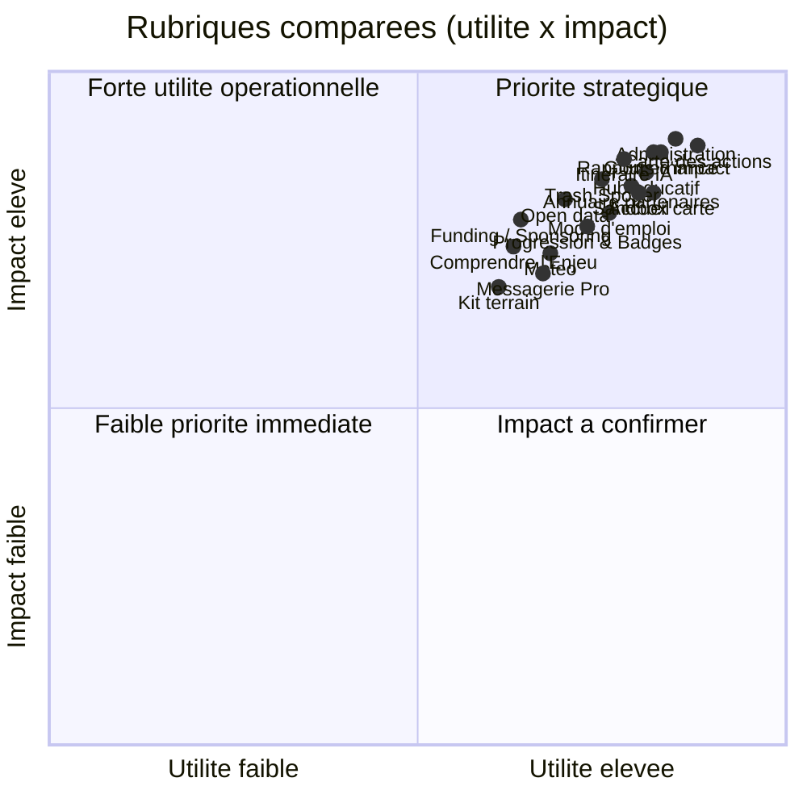

Les rubriques de CleanMyMap.fr
Utilite & impact - mise a jour 2026 (structure 5 blocs)

---

## Note de restructuration

Ancienne structure 7 blocs → nouvelle structure 5 blocs (homepage) :
- Piloter → fusionné dans Bloc 1 (Accueil & Pilotage)
- Impact → fusionné dans Bloc 3 (Cartographie & Impact)
- Discussion → fusionné dans Bloc 4 (Réseau & Discussions)

---

## Liste complète par ordre d'importance

1. Accueil perso
2. Déclarer une action
3. Carte des actions
4. Tableau de bord
5. Profil & impact
6. Rapports d'impact
7. Méthodologie
8. Itinéraire IA
9. Signalement Déchets
10. Carte d'entraînement
11. Hub Éducatif
12. Guide terrain
13. Annuaire partenaires
14. Opérations collectives
15. Messagerie Pro
16. Gouvernance / Pilotage
17. Administration
18. Observatoire Public
19. Découvrir le réseau
20. Progression & Badges
21. Météo
22. Que faire des déchets ?
23. Comprendre l'Enjeu
24. Kit terrain
25. Soutenir le Projet
26. Explorer (Sommaire)
27. Profil public
28. Parcours
29. Parcours par profil
30. Impact profil
31. Portail Décideur
32. Partenaires - onboarding
33. Partenaires - dashboard
34. Impression rapport
35. Historique des actions
36. Services admin
37. God Mode
38. Connexion
39. Inscription
40. Onboarding localisation

---

## Heatmap utilité x impact par rubrique

---

## Organisation par blocs et rubriques

### Bloc 1 — Accueil & Pilotage · `amber` / `brun`

**Page vitrine** `/`

- Contenu : hero, chiffres d'impact, CTA "Se connecter", "Visiter en tant qu'invité", "Déclarer une action".
- Utilite : premier point d'entrée public pour comprendre le projet et conduire le visiteur vers l'engagement citoyen.
- Impact : augmente la conversion des visiteurs en déclarants, améliore l'adoption des pages clefs.

**Reprise de session** `/accueil`

- Espace personnel contextualisé : où j'en suis, quoi faire ensuite.
- Utilite : reprise rapide de session sans friction.
- Impact : réduit le temps avant la première action utile.

**Cockpit quotidien** `/dashboard`

- Vue synthèse des indicateurs, déclaration d'action directe, accès rapides par rôle.
- Utilite : piloter l'activité quotidienne.
- Impact : décisions plus rapides, déclarations sans navigation supplémentaire.

**Profil & impact** `/profil`

- Paramètres de compte, progression, badges, impact personnel.
- Utilite : point central de gestion utilisateur.
- Impact : personnalisation du parcours et confiance.

**Vue Pilotage / Gouvernance** `/pilotage`

- Résultats pour les décideurs publics.
- Disponibilité : `coordinateur`, `scientifique`, `elu`, `admin`.
- Utilite : transformer la donnée en arbitrage.
- Impact : allocations plus pertinentes.

**Portail Décideur** `/sponsor-portal`

- Espace ROI et impact territorial.
- Disponibilité : `elu` et `admin`.
- Utilite : donner un outil dédié aux décideurs.
- Impact : facilite le pilotage institutionnel.

**Famille autonome — Administration** `/admin`

- Modération et supervision.
- Disponibilité : `admin` uniquement.
- Utilite : garantir la fiabilité des données.
- Impact : protection contre les abus.

**Famille autonome — God Mode** `/admin/godmode`

- Supervision master admin.
- Disponibilité : `admin` uniquement.
- Utilite : outils avancés de maintenance.
- Impact : support technique et gouvernance renforcés.

---

### Bloc 2 — Agir · `emerald`

**Déclarer une action** `/actions/new`

- Formulaire terrain prioritaire, Clerk intervient uniquement à la validation.
- Utilite : capter rapidement une action de dépollution.
- Impact : accélère l'augmentation du volume de données terrain et alimente la carte, les rapports et le pilotage.

**Itinéraire IA** `/sections/route`

- Recommandations dynamiques : où agir aujourd'hui.
- Utilite : transformer la data en parcours d'action.
- Impact : rend les sorties plus efficaces et ciblées.

**Signalement Déchets** `/signalement`

- Rapport de hotspots de pollution.
- Utilite : détecter rapidement les zones critiques.
- Impact : raccourcit le délai entre observation et traitement.

**Météo** `/sections/weather`

- Conditions terrain et fenêtres d'action.
- Utilite : choisir le bon moment, le bon niveau de sécurité et le bon kit avant de partir.
- Impact : limite les sorties improductives et améliore la qualité opérationnelle.

**Mode d'emploi / Guide terrain** `/sections/guide`

- Guide terrain et bonnes pratiques.
- Utilite : réduire les erreurs de terrain.
- Impact : opérations plus sûres et plus fluides.

**Kit terrain** `/sections/kit`

- Checklist et matériel.
- Utilite : standardiser la préparation.
- Impact : moins d'oublis et plus de fluidité.

**Que faire des déchets ?** `/sections/recycling`

- Guide de tri, valorisation et filières.
- Utilite : prolonger la valeur des ressources collectées.
- Impact : réduit le volume de déchets finaux.

**Historique des actions** `/actions/history`

- Route existante mais `availability: hidden` dans le registre.
- Note : pas exposée dans le ruban standard, accessible via chemin direct ou certaines pages internes.

---

### Bloc 3 — Cartographie & Impact · `sky` / `red`

**Carte des actions** `/actions/map`

- Carte géolocalisée des actions et hotspots.
- Utilite : visualiser les lieux d'intervention fiables.
- Impact : améliore la priorisation locale et réduit les doublons.

**Carte d'entraînement (sandbox)** `/sections/sandbox`

- Sandbox séparée pour tester filtres, couches et navigation cartographique.
- Utilite : explorer sans engagement et valider les comportements de la carte.
- Impact : réduit les erreurs d'utilisation de l'outil cartographique.

**Observatoire public** `/observatoire`

- Données ouvertes, accessibles sans connexion.
- Utilite : ouvrir les données aux chercheurs et collectivités.
- Impact : favorise la réutilisation et la transparence.

**Rapports d'impact** `/reports`

- Synthèses et exports pour élus, chercheurs et partenaires.
- Utilite : rendre les résultats partageables et défendables.
- Impact : crédibilité renforcée pour financement et arbitrage.

**Profil impact** `/profil/impact`

- Métriques personnelles détaillées.
- Utilite : lire son propre impact en détail.
- Impact : motivation et engagement accrus.

**Progression & Badges** `/sections/gamification`

- Indicateurs personnels, niveaux et badges.
- Utilite : motiver par la progression individuelle et collective.
- Impact : fidélisation et retour utilisateur accrus.

---

### Bloc 4 — Réseau & Discussions · `indigo`

**Découvrir le réseau** `/partners/network`

- Vue du réseau engagé.
- Utilite : cartographier les partenaires mobilisés.
- Impact : facilite la collaboration institutionnelle.

**Annuaire partenaires** `/partners/dashboard`

- Fiches et contacts de partenaires.
- Utilite : trouver les bons acteurs locaux.
- Impact : accélère les mises en relation.

**Onboarding partenaire** `/partners/onboarding`

- Séquence guidée pour rejoindre le réseau.
- Utilite : structurer l'entrée des nouveaux partenaires.
- Impact : qualité et fiabilité du réseau.

**Opérations collectives** `/sections/community`

- Organisation des actions de groupe.
- Utilite : réduire l'isolement des bénévoles.
- Impact : plus d'actions locales coordonnées.

**Messagerie Pro** `/sections/messagerie`

- Canal de coordination.
- Utilite : fluidifier l'entraide.
- Impact : moins de frictions organisationnelles.

**Soutenir le Projet** `/sections/funding`

- Sponsoring de zones et mécénat.
- Utilite : structurer le modèle économique.
- Impact : finance durable des actions citoyennes.

---

### Bloc 5 — Apprendre · `yellow`

**Hub Éducatif** `/learn/hub`

- Index + reprise : quatre rubriques internes (Comprendre, S'entraîner, Bonnes pratiques, Ressources).
- Utilite : centraliser l'entrée du bloc et rediriger vers les pages dédiées sans mélanger les usages.
- Impact : améliore la qualité des interventions, la reprise mobile et la continuité de lecture.

**Comprendre l'enjeu** `/learn/comprendre`

- Contexte climat, ordres de grandeur, renvoi vers méthodologie.
- Utilite : relier l'action locale aux ODD et aux repères scientifiques.
- Impact : meilleures décisions et compréhension partagée.

**S'entraîner** `/learn/sentrainer`

- Quiz courts, répétition espacée (SRS).
- Utilite : ancrer les repères par la répétition active.
- Impact : meilleure mémorisation des facteurs clés.

**Bonnes pratiques** `/learn/bonnes-pratiques`

- Guides courts, gestes utiles, séquence avant/pendant/après.
- Utilite : garder le bon réflexe sans alourdir l'action.
- Impact : opérations plus propres et plus efficaces.

**Ressources** `/learn/ressources`

- Bibliothèque, liens externes, références.
- Utilite : aller plus loin sur un sujet précis.
- Impact : autonomie et approfondissement.

---

## Notes sur les rôles

- Les rubriques de gouvernance et d'administration ne sont pas visibles dans le ruban standard pour les bénévoles.
- `Météo` vit dans le bloc Agir et sert de filtre opérationnel avant sortie terrain.
- `Portail Décideur` et `Gouvernance` sont exposés différemment selon le rôle : `elu` et `admin` ont un accès plus large, tandis que `coordinateur` et `scientifique` voient principalement `Gouvernance`.
- `Administration` et `God Mode` sont des rubriques strictement `admin`.
- `Historique` existe mais reste `hidden` dans le registre ; il n'est pas proposé dans le ruban principal.

---

## Règle de maintenance

Quand un bloc change, mettre à jour ce fichier en même temps que :
- `documentation/liberte-UX-UI/AUDIT_BLOCS_RUBRIQUES.md`
- `documentation/product/matrice-rubriques.md`
- `apps/web/src/lib/navigation.ts`
