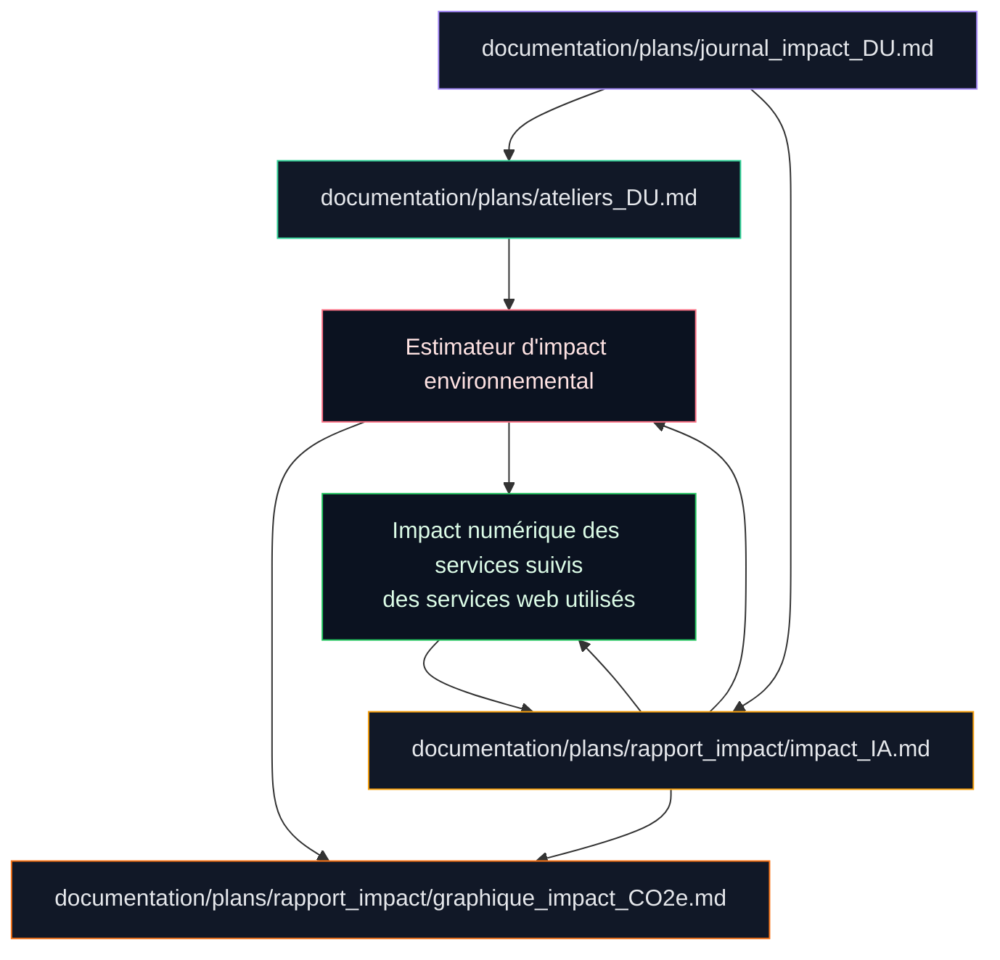

# Journal d'Impact : Ateliers DU x Audit IA x Ajouts de code

Résumé d'ouverture:

- ce journal sert de porte d'entrée courte vers l'historique détaillé lié aux ateliers DU et à l'impact ;
- il conserve les décisions, les arbitrages et les ajouts de code utiles comme trace partagée ;
- il remplace l'ancien index court, désormais absorbé dans ce document ;
- il reste le point d'accès partagé pour les contributeurs qui ont besoin du contexte complet.

Ce journal ne conserve que les **ajouts de code** réalisés en lien direct avec :

- les apprentissages issus des ateliers du DU ;
- les besoins de gouvernance, de sobriété et de fiabilité formalisés dans `documentation/plans/rapport_impact/impact_IA.md`.

Toute modification ou ajout de code ayant un impact social ou environnemental non négligeable doit être enregistré ici avec, au minimum, la date, une explication courte du changement et son impact bénéfique ou négatif. Si l'impact est négatif, une solution concrète pour le réduire doit aussi être proposée.

2026-05-25 - Migration du socle Supabase vers une nouvelle base hébergée à Paris et réalignement des migrations SQL locales sur cette cible. Impact bénéfique: baisse potentielle de la latence pour les utilisateurs parisiens, cohérence géographique plus forte avec le runtime Vercel en `cdg1`, et simplification du pilotage si l'ancienne base en Irlande est retirée ensuite. Impact négatif: migration plus risquée et plus coûteuse à maintenir tant que les données historiques de l'ancienne base ne sont pas encore recopiées; solution de réduction: conserver l'ancienne base le temps d'extraire/importer les données réellement utiles, puis la supprimer seulement après vérification complète.

2026-05-24 - Ajout de réglages workspace VS Code pour exclure `.next`, `node_modules`, `.vercel`, `dist`, `build`, `coverage` et `.git` des watchers et de la recherche, avec plafond mémoire TypeScript abaissé. Impact bénéfique: moins d'I/O disque, moins de RAM consommée par les indexeurs et moins de contention avec les builds Next.js. Impact négatif: un peu moins de visibilité sur les artefacts générés, compensée par l'exclusion explicite uniquement des répertoires dérivés.

2026-05-24 - Optimisation et déduplication des visuels de documentation: conversion des quatre schémas techniques de session en `webp` plus légers, mise à jour des légendes et du guide de sessions, bascule du logo du README vers l'asset `logo-cleanmymap.webp`, et ajout de rewrites Vercel pour conserver les anciens chemins `.png` des visuels publics tout en servant les versions allégées. Impact bénéfique: baisse du poids des assets, réduction du volume transféré au build et au rendu des pages de documentation, et moindre pression disque/stockage. Impact négatif: légère complexité de routage supplémentaire, compensée par la conservation des anciennes URLs via rewrite.

2026-05-24 - Suppression de l'export Vercel brut `web_eqnhvnoym-maxencedrm-7606s-projects_vercel_app_logs.csv`, devenu obsolète et trompeur avec son en-tête `path_name,size` et ses tailles d'analyse figées. Impact bénéfique: moins de bruit documentaire et moins de risque de confondre un artefact de diagnostic avec une source de vérité. Impact négatif: perte d'un historique brut local, compensée par les journaux Vercel et la documentation d'incident plus ciblée.

2026-05-24 - Ajout d'un mode de démarrage local propre (`dev:clean`) et d'un mode port strict (`dev:strict`) pour éviter les caches Next/Turbopack corrompus et les faux localhost causés par un second serveur sur un port de secours. La route notifications a aussi été durcie en dev pour renvoyer un état vide au lieu d'erreurs 500 quand Supabase/Clerk n'est pas prêt. Impact bénéfique: moins de bruit, moins de confusion entre anciennes et nouvelles versions, et moins de relances inutiles du serveur local. Impact négatif: un peu plus de surface de commandes de dev, compensée par des consignes de démarrage plus claires.

Il ne sert ni de backlog, ni de plan d'action général, ni de dossier institutionnel.
Les priorités actives restent dans [documentation/plans/ateliers_DU.md](/C:/Users/sophi/Desktop/MAXENCE/business/CleanmyMap-main/documentation/plans/ateliers_DU.md).
La seule zone de directives encore exploitables ici est l'**annexe A**.

Ce cadre poursuit deux objectifs. D'abord, montrer un impact reel des ateliers sur le projet web avec une lecture critique, structuree et credible. Ensuite, disposer d'un support de pilotage capable de justifier les choix techniques, environnementaux et institutionnels devant un jury ou un partenaire externe.

## Schéma des liens

Le journal détaillé renvoie aux autres pièces de travail ci-dessous pour garder une lecture cohérente entre les ateliers DU, le rapport d'impact IA, la méthode du graphique et les estimateurs techniques du projet.

Lecture rapide:

- `ateliers_DU.md` fixe le cadre des ateliers;
- `journal_impact_DU.md` conserve l'historique détaillé et les ajouts de code;
- `rapport_impact/impact_IA.md` concentre l'analyse principale;
- `graphique_impact_CO2e.md` documente la méthode du graphe;
- l'estimateur d'impact agrège les signaux du projet;
- le visuel synthétique des services suivis aide à cadrer les limites et hypothèses des services web.

### Concepts cles appliques

- **Diagnostic territorial et ecologique** : objectiver a la fois la pollution locale et le cout numerique du service, puis relier declaration, carte, historique, reporting et IUR.
- **Cartographie des acteurs** : clarifier les roles entre benevoles, associations, decideurs publics et equipe admin pour reduire les confusions de perimetre.
- **Participation citoyenne** : simplifier l'entree dans l'action avec declaration terrain, suivi et CTA adaptes aux roles.
- **Pilotage par indicateurs** : faire reposer les arbitrages sur des indicateurs lisibles, tracables et autant que possible automatises.
- **Evaluation critique et gouvernance de la sobriete** : instituer l'autocritique via l'audit IA, le role de Responsable Sobriete et la prise en compte des effets rebond.

### Historique condense des implementations

- **Fondation** : routes coeur, rubriques, sections metier, collecte terrain.
- **Pilotage** : APIs metier, reporting, exports, moderation admin, securisation de base.
- **Consolidation** : navigation parcours/espace, standardisation des pages, dedoublonnage, fiabilisation funnel.
- **Maturite cible** : observabilite unifiee, qualite de donnees, historisation des livrables, runbooks et verification finale transverse.

### Difficultes structurantes et enseignements

- arbitrages continus entre richesse fonctionnelle et lisibilite ;
- prevention des doublons inter-pages et des redondances documentaires ;
- stabilisation des metriques et de leur interpretation ;
- vigilance permanente sur le vendor lock-in, l'effet rebond et la validation humaine.

### Synthese des apports conserves

- distinction utile entre deja implemente, hors perimetre et chantiers encore ouverts ;
- priorisation par phases pour limiter les regressions ;
- importance de la securite, de l'observabilite, de la qualite de donnees et de la tracabilite ;
- conversion des ateliers DU en cadre d'execution concret, mesurable et critique.

## 1. Axe : Évaluation critique et Sobriété Numérique

*Enseignement : Savoir porter un regard critique sur son propre impact et institutionnaliser la sobriété.*

| Date | Amélioration apportée | Impact concret |
| :--- | :--- | :--- |
| 13/05/26 | **Normalisation de l'Audit d'Impact IA** | Création d'un référentiel de 3100+ lignes analysant les coûts carbone, eau et éthique de l'IA. |
| 13/05/26 | **Indice IUR (Indice d'Utilité Réelle)** | Mise en place de la formule `Impact Terrain / Coût Numérique` comme juge de paix pour tout nouveau développement. |
| 13/05/26 | **Charte de Sobriété (SOBRIETY_RULES.md)** | Création d'un protocole de développement imposant le choix de modèles légers et la mise en cache systématique. |

---

## 2. Axe : Pilotage par la donnée et Indicateurs

*Enseignement : Passer de la perception subjective à la mesure objective.*

| Date | Amélioration apportée | Impact concret |
| :--- | :--- | :--- |
| 13/05/26 | **Automatisation des statistiques d'audit** | Création de `update-audit-stats.mjs` pour synchroniser dynamiquement les métriques de code avec le dossier d'impact. |
| 13/05/26 | **Audit des Écarts (Roadmap vs Réalité)** | Identification technique des manquements (Campagnes, Qualité de donnée) pour prioriser les futurs sprints. |
| 13/05/26 | **Reporting qualité CI/CD orienté pilotage** | Création de `scripts/cicd-metrics-report.mjs` et de `documentation/maintenance/ci-cd-metrics-report.md` pour suivre les runs GitHub Actions, le cache et les déploiements Vercel dans une logique de mesure continue. |
| 13/05/26 | **Audit exécutable des messages Ateliers DU** | Formalisation de `documentation/plans/ateliers_DU_execution_rapide.md` pour distinguer les lots déjà absorbés, les écarts encore ouverts et l'ordre d'attaque réaliste. |
| 20/05/26 | **Socle d'estimateur d'impact environnemental** | Mise en place de l'architecture du calcul transparent pour le site et l'utilisateur, avec postes visibles, hypothèses versionnées et panneau UI prêt à brancher dans le rapport d'impact IA. |
| 21/05/26 | **Séparation Codex / GPT-5.4 mini** | Distinction explicite entre les sessions Codex et le modèle GPT-5.4 mini utilisé pendant le développement du site, avec badge ACV dédié, pour éviter de mélanger développement et production. |
| 26/05/26 | **Journal hebdomadaire Codex** | Ajout d'un historique spécifique à l'usage Codex — développement du site pour enregistrer les semaines manuellement, reconstruire les périodes passées et convertir ces signaux projet-spécifiques en équivalent CO2e sans moyenne externe. |
| 21/05/26 | **Deuxième ordre d'impact** | Ajout d'une décomposition lisible du CO2e en CO2 brut, électricité, autres GES, produits chimiques et eau, afin de détailler la structure du graphe et ses priorités de réduction. |
| 24/05/26 | **Chaîne Sentry post-build sans blocage** | Remplacement du build plugin Sentry par un upload post-build des source maps via `sentry-cli` avec injection des debug IDs. Impact positif: le build n'est plus fragile sur les dépendances natives et les symboles restent récupérables en production. Limite: il faut un `SENTRY_AUTH_TOKEN` et des variables Sentry correctement renseignées, sinon l'upload est sauté. |

---

## 3. Axe : Gouvernance et Participation Citoyenne

*Enseignement : Clarifier les rôles et interfaces pour augmenter l'engagement.*

| Date | Amélioration apportée | Impact concret |
| :--- | :--- | :--- |
| 13/05/26 | **Rôle de Responsable Sobriété** | Institutionnalisation d'un droit de veto technique pour garantir que l'usage de l'IA reste éthique et sobre. |
| 13/05/26 | **Protocole Human-in-the-loop** | Garantie que toute décision d'IA est supervisée par un humain, renforçant la légitimité du projet. |

---

## 4. Axe : Souveraineté et Pérennité

*Enseignement : Anticiper les dépendances et garantir la continuité de l'action.*

| Date | Amélioration apportée | Impact concret |
| :--- | :--- | :--- |
| 13/05/26 | **Stratégie de sortie technique** | Planification de la mitigation du *vendor lock-in* (Vercel/Supabase) pour assurer l'indépendance à long terme. |
| 24/05/26 | **Localisation Vercel orientée Paris** | Alignement du runtime Vercel sur `cdg1` pour rapprocher les fonctions des utilisateurs parisiens et des données européennes. Le gain environnemental est réel mais partiel, car le build cloud Vercel reste exécuté en `iad1` Washington. |
| 13/05/26 | **Standardisation Sémantique (SLB)** | Reformatage de 230 KB de documentation pour une lecture optimale par les humains et les futurs agents IA. |
| 13/05/26 | **Matrice de traçabilité cœur produit** | Création de `documentation/architecture/traceability-matrix.md` pour relier rubrique, route, composant, API et source de donnée. |
| 13/05/26 | **Dossier de validation institutionnelle** | Création d'un point d'entrée unique liant audit d'impact, gouvernance IA, sobriété, maintenance, traçabilité et stratégie de sortie technique. |

### Vue d'ensemble des effets des dernières modifications

- **Avantages généraux** :
  - moins d'allers-retours transatlantiques pour le runtime dynamique ;
  - meilleure cohérence entre utilisateurs parisiens, fonctions Vercel et données européennes ;
  - build Sentry plus robuste grâce à l'upload post-build des source maps, sans dépendre du plugin pendant la compilation ;
  - baisse du risque d'exposition des configs sensibles en rendant les MCP locaux ;
  - meilleure lisibilité opérationnelle grâce à la documentation des services, des logs et des règles de déploiement ;
  - posture plus robuste pour un dépôt public, avec des garde-fous GitHub/Vercel plus explicites.

- **Inconvénients ou limites** :
  - le build cloud Vercel reste en `iad1`, donc le gain environnemental n'est pas total ;
  - la chaîne Sentry ajoute une étape post-build et dépend de `SENTRY_AUTH_TOKEN`, `SENTRY_ORG` et `SENTRY_PROJECT` pour fonctionner complètement ;
  - plus de configuration locale à maintenir sur chaque machine ;
  - plus de documentation à tenir à jour pour éviter les écarts entre l'état réel et les notes de pilotage ;
  - une partie du bénéfice dépend encore de services tiers dont la localisation doit rester surveillée ;
  - le durcissement peut ajouter un peu de friction au quotidien, surtout sur les déploiements et les diagnostics.

---

---

## 5. Synthèse des Solutions Issues de l'Audit d'Impact (Section 22)

*Enseignement : Transformer un diagnostic en plan de remédiation technique.*

| Action | État | Impact sur le Projet |
| :--- | :--- | :--- |
| **Sécurité (Directive 2)** | ✅ Réalisé | Création de `scripts/pre-release-check.mjs` pour scanner les secrets et fichiers critiques avant déploiement. Baisse du risque de fuite de souveraineté. |
| **Sécurité publication (durcie)** | ✅ Réalisé | Correction du script `pre-release-check.mjs`, ajout de `npm run pre-release:check` et formalisation de `documentation/operations/pre-release-security-check.md` pour l'inventaire des variables sensibles et des contrôles. |
| **IUR (Directive 7)** | ✅ Réalisé | Intégration de l'Indice d'Utilité Réelle dans le moteur de pilotage et le dashboard admin. Pilotage par la sobriété (Impact > Coût). |
| **Observabilité (Directive 3)** | ✅ Réalisé | Ajout d'une alerte de sobriété automatique dans le moteur de priorisation, enrichissement de `/api/services` avec résumé global, niveaux de sévérité et timeline courte, plus affichage admin de supervision. |
| **Data Quality (Directive 4)** | ✅ Réalisé | Détection automatique des anomalies métier (impact irréaliste, données manquantes) via `dataIntegrityPriority`. |
| **Standardisation UI (Directive 6)** | ✅ Réalisé | Mutualisation du code avec `AdminPanelShell` pour 3 panels majeurs. Réduction stricte du poids du bundle JS (Sobriété logicielle). |
| **Audit des Écarts Ateliers** | ✅ Réalisé | Clôture des écarts de sécurité, observabilité, data quality et standardisation UI. Le lot campagnes multi-actions a été cadré comme chantier partiellement couvert, à finaliser sur un modèle/API d'agrégation. |
| **Reporting qualité automatisé (Directive 7)** | ✅ Réalisé | Ajout de `scripts/cicd-metrics-report.mjs` et d'une documentation dédiée pour produire un suivi comparable des runs CI/CD, du cache et des déploiements. |
| **Check-list Sortie IA** | ✅ Réalisé | Création du `PULL_REQUEST_TEMPLATE.md` pour forcer la vérification humaine du code généré. |
| **Gouvernance IA Explicite** | ✅ Réalisé | Rédaction de `GOVERNANCE.md` définissant la responsabilité humaine sur chaque bloc de code. |
| **Optimisation Poids Plume** | 🚀 En cours | Réduction du logo de **88%** et bundle splitting pour les cartes (Leaflet), réduisant la conso batterie mobile. |
| **Tests de non-régression ciblés (Directive 5)** | 🟡 Partiellement réalisé | Renforcement de tests sur la modération admin, la validation d'actions, les filtres de carte, le stockage brouillon, l'analytics consent, `/api/services`, les endpoints critiques d'export (`actions.csv`, `actions.json`, `elus-dossier`) et les boutons UI d'export CSV/PDF. La couverture UI de `/dashboard` et `/reports` reste à consolider. |
| **Convergence exports web (Directive 11)** | ✅ Réalisé | Uniformisation des headers de livrables et des noms de fichiers pour CSV/JSON/PDF côté serveur via un helper commun, puis harmonisation des libellés/messages front d'export CSV/PDF avec `buildExportUiCopy`, couverte par des tests serveur et UI statiques. |
| **Standardisation des Prompts (Action C)** | ✅ Réalisé | Réduction du bruit numérique via `PROMPT_GUIDE.md`. |
| **Fiabilité des Indicateurs (Action J)** | ✅ Réalisé | Protocole de revue via `METRICS_RELIABILITY_PROTOCOL.md`. |
| **Protection des Données (Action D)** | ✅ Réalisé | Politique de sécurité via `DATA_PROTECTION_POLICY.md`. |

---

---

**Clôture documentaire du plan supprimé :**
Le plan d'écarts supprimé a été absorbé dans ce journal. Les améliorations effectivement implémentées sont désormais tracées ici comme références de preuve, avec distinction explicite entre `réalisé`, `partiellement réalisé` et `à faire`.

**Nettoyage du backlog de session :**
Les prompts deja executes ont ete retires des fichiers de pilotage actifs. Les prompts restants ont ete regroupes par priorite operationnelle dans `documentation/plans/ateliers_DU.md`. `documentation/plans/ateliers_DU_execution_rapide.md` devient une trace d'execution et non un second backlog.

## 6. Annexe A - Bibliothèque de pilotage IA

*Cette annexe centralise les directives opérationnelles retirées de la section 22 de l'audit principal. Elle porte le niveau d'exécution, tandis que l'audit conserve le niveau de décision, de contrôle et de preuve.*

| Action | Directive | État | Preuve attendue | Contrôle associé |
| :--- | :--- | :--- | :--- | :--- |
| **B - Validation humaine des contenus environnementaux** | Ajouter un workflow de validation humaine des contenus environnementaux et institutionnels. | ✅ Réalisé | `CONTENT_VALIDATION_WORKFLOW.md` | Vérification des chiffres et interprétations. |
| **C - Standardisation des usages IA utiles** | Créer un guide de prompts internes par cas d'usage (code, documentation, UX, debug). | ✅ Réalisé | `PROMPT_GUIDE.md` | Réduction des itérations redondantes. |
| **D - Protection des données sensibles** | Ajouter une politique d'usage IA du projet : données interdites, anonymisation minimale. | ✅ Réalisé | `DATA_PROTECTION_POLICY.md` | Contrôle des données personnelles et secrets. |
| **G - Clarté des messages environnementaux** | Réaliser un audit de clarté des contenus environnementaux et proposer une version harmonisée. | ✅ Réalisé | `CONTENT_VALIDATION_WORKFLOW.md` | Contrôle du vocabulaire et de la cohérence. |
| **J - Fiabilité des indicateurs** | Ajouter des contrôles de cohérence des indicateurs et un protocole de revue mensuelle. | ✅ Réalisé | `METRICS_RELIABILITY_PROTOCOL.md` | Vérification de la cohérence analytics. |

---

## 7. Analyses Systémiques et Réflexions de Fond

*Enseignement : Comprendre les enjeux de pouvoir, de dépendance et d'effet rebond dans le numérique.*

| Thématique | Enseignement DU appliqué | Application dans CleanMyMap |
| :--- | :--- | :--- |
| **Effet Rebond (Jevons)** | Se méfier de la vitesse de l'IA qui pousse au *feature creep*. | Décision de geler les fonctions "gadgets" (badges, chat) pour se concentrer sur le noyau utile. |
| **Souveraineté (Section 15)** | Analyser la géopolitique du cloud (90% stack US). | Cartographie des risques de rupture (Vercel, Clerk, Supabase) et plan de mode dégradé (export statique). |
| **Éthique du "Ghost Work"** | Reconnaître le coût social caché de l'IA (annotation). | Engagement à limiter l'IA aux tâches de structure et non à la modération massive non supervisée. |
| **Dualité de Logique** | Choisir entre "Infra légère" et "Plateforme extensive". | Arbitrage en faveur de l'infrastructure légère de coordination pour rester sobre. |
| **IA comme Accélérateur** | S'inspirer d'AlphaFold pour l'action écologique. | Utilisation de l'IA pour compresser 2 ans de R&D environnementale en 3 mois de développement citoyen. |

---

## 8. Alignement avec les Objectifs de Développement Durable (ODD)

*Enseignement : Inscrire son action dans le cadre universel de l'ONU.*

Le projet CleanMyMap, audité via le prisme des ODD, valide les points suivants :

- **ODD 11 (Villes Durables)** : Amélioration prouvée de l'espace public via le signalement.
- **ODD 12 (Consommation Responsable)** : Sensibilisation à la fin de vie des produits (mégots, plastiques).
- **ODD 13 (Climat)** : Discipline de sobriété numérique (IUR) pour ne pas être un fardeau carbone.
- **ODD 17 (Partenariats)** : Création d'un outil de liaison entre citoyens, associations et élus.

---

**Note de synthèse finale :**
Grâce aux ateliers DU, CleanMyMap est passé d'une "application web de nettoyage" à une **"infrastructure civique responsable, auditée et souveraine"**.
Chaque décision technique est désormais le fruit d'un arbitrage entre **utilité sociale maximale** et **empreinte environnementale minimale**.
Le projet n'est plus seulement un outil numérique, c'est une **démonstration de sobriété en acte**.
