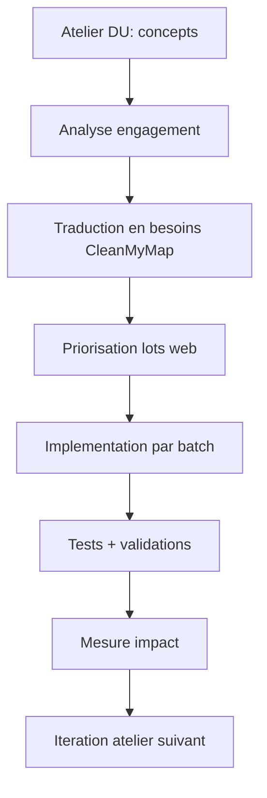

ATELIERS_DU - VERSION CONSOLIDEE ET EXPLOITABLE POUR CLEANMYMAP

FLOWCHART DU PARCOURS ATELIER

CONTEXTE ET OBJECTIF DU DOCUMENT
Ce document transforme les enseignements des ateliers DU en cadre d'analyse puis en plan d'action concret pour CleanMyMap.
Objectif principal: montrer un impact reel des ateliers sur le projet web, avec une lecture critique, structuree et credible.
Objectif secondaire: disposer d'un support operationnel (Journal d'Impact) pour piloter et justifier les choix devant le jury.

PARTIE 1 - ANALYSE DE L'ENGAGEMENT ET APPORTS DES ATELIERS

1. Analyse de l'engagement

Définition de mon engagement
Mon engagement est de créer une application web pour les citoyens de la ville de Paris. Cet outil a pour but de réduire les déchets urbains et de soutenir les actions de dépollution urbaine dans le cadre du développement durable. Concrètement, le site web combine action de terrain, coordination collective et pilotage par la donnée, afin d'améliorer concrètement les actions et les connaissances des bénévoles sur le développement durable par diverses rubriques.

Probleme identifie
Le probleme central est la dissociation entre:

- la realite visible des dechets dans l'espace public,
- et la capacite des acteurs locaux a agir rapidement, de maniere coordonnee et mesurable.
Trois freins dominants ressortent: dispersion de l'information, faible continuite de mobilisation, difficulte de priorisation.

Publics concernes

- Benevoles et citoyens contributeurs.
- Coordinateurs associatifs.
- Decideurs locaux et collectivites.
- Acteurs de supervision et moderation.
- Publics secondaires: partenaires, scolaires, structures de sensibilisation.

Acteurs impliques

- Citoyens: signalement, participation, execution terrain.
- Associations: animation, coordination, suivi local.
- Collectivites: arbitrage, priorisation, soutien institutionnel.
- Equipe projet/admin: qualite des donnees, moderation, consolidation des livrables.

1. Mise en application des enseignements des ateliers

Concept cle 1 - Diagnostic territorial et écologique
Rappel synthetique
Un engagement efficace commence par un diagnostic local (déchets) et systémique (impact numérique) objectivable.
Application CleanMyMap
Structuration des flux declaration -> carte -> historique -> reporting, complétée par l'indice IUR (Impact/Coût).
Apport reel
Passage d'une perception diffuse a une lecture actionnable des zones a traiter et de la rentabilité écologique du code.

Concept cle 2 - Cartographie des acteurs
Rappel synthetique
L'impact depend d'une clarte des roles et interfaces entre acteurs.
Application CleanMyMap
Organisation role-aware (benevole, coordinateur, decideur, admin) avec differenciation de navigation et priorites d'action.
Apport reel
Meilleure coordination et reduction des confusions de perimetre.

Concept cle 3 - Participation citoyenne
Rappel synthetique
La participation augmente quand l'entree dans l'action est simple et valorisee.
Application CleanMyMap
Parcours de declaration terrain, historique de suivi, CTA role-aware.
Apport reel
Meilleure conversion intention -> action.

Concept cle 4 - Pilotage par indicateurs et automatisation
Rappel synthetique
La decision doit s'appuyer sur des indicateurs lisibles, tracables et, idéalement, automatisés pour éviter le biais humain.
Application CleanMyMap
Rapports, exports, instrumentation analytics, et script d'automatisation des métriques (`update-audit-stats.mjs`).
Apport reel
Arbitrage plus rationnel, gain de temps sur le reporting et dialogue facilite avec partenaires institutionnels.

Concept cle 5 - Evaluation critique et Gouvernance de la sobriété
Rappel synthetique
Un projet d'engagement credible explicite ses limites et institutionnalise son autocritique (Human-in-the-loop).
Application CleanMyMap
Audit d'Impact IA, rôle de Responsable Sobriété avec droit de veto, et analyse systémique (Paradoxe de Jevons).
Apport reel
Robustesse accrue, maturité de pilotage et légitimité institutionnelle face aux enjeux de transition.

1. Demarche personnelle

Motivation
Concevoir un outil utile socialement et ecologiquement, capable de soutenir une action locale continue et observable.

Positionnement
Posture hybride: porteur de projet, concepteur produit, facilitateur de coordination.

Competences mobilisees et developpees

- Mobilisees: architecture web, priorisation produit, structuration de donnees, analyse d'usage.
- Developpees: articulation enjeux sociaux/environnementaux avec implementation technique, formalisation academique des choix.

Evolution de ma vision de l'engagement
Evolution d'une logique d'initiative individuelle vers une logique de systeme socio-technique: agir, coordonner, mesurer, justifier.

1. Impact et portee

Impact actuel
Impact encore partiel mais concret:

- base applicative fonctionnelle pour collecte et suivi,
- parcours role-aware en progression,
- production de livrables exploitables pour pilotage.

Impact potentiel

- meilleure continuite des actions locales,
- meilleure priorisation territoriale,
- meilleure exploitabilite institutionnelle des donnees.

Indicateurs mesurables proposes

- taux de conversion view_new -> start_form -> submit_success,
- delai declaration -> prise en charge,
- taux d'actions completees par zone/periode,
- usage des livrables et exports,
- taux d'anomalies detectees/corrigees,
- retention des contributeurs 30/90 jours.

Historique condense des implementations (mesure d'impact ateliers)

- Fondation: routes coeur, rubriques, sections metier, collecte terrain.
- Pilotage: APIs metier, reporting, exports, moderation admin, securisation de base.
- Consolidation en cours: navigation parcours/espace, standardisation des pages, dedoublonnage, multi-horizon, fiabilisation funnel.
- Maturite cible: observabilite unifiee, qualite de donnees, historisation serveur des livrables, runbook rollout/rollback.

1. Analyse critique

Limites du projet

- heterogeneite de qualite des donnees,
- risque de complexite UX,
- modules encore partiellement converges (funnel, livrables, historique serveur),
- dependance technologique (vendor lock-in: Vercel/Supabase),
- risque d'inflation de code et d'effet rebond (paradoxe de Jevons) induit par l'usage massif de l'IA.

Difficultes rencontrees

- arbitrages entre richesse fonctionnelle et lisibilite,
- prevention des doublons inter-pages,
- stabilisation des metriques et de leur interpretation.

Points a ameliorer

- clarifier la responsabilite exclusive de certaines pages,
- finaliser la convergence multi-horizon,
- renforcer la tracabilite des exports,
- augmenter la couverture tests e2e role-based,
- formaliser des seuils qualite/performance,
- pérenniser le rôle de Responsable Sobriété au-delà de la phase de conception,
- renforcer l'autonomie technique (exportabilité totale des données).

PARTIE 2 - MISE A JOUR DU CONTEXTE OPERATIONNEL ET PLAN D'ACTION WEB

Cette seconde partie n'est pas une liste brute de taches. Elle traduit explicitement les enseignements des ateliers en actions web priorisees, avec distinction entre:

- acquis deja en place,
- elements hors perimetre produit web,
- chantiers implementables non finalises.
Elle sert de feuille de route d'execution, de suivi et de mesure d'impact.

1. Acquis deja en place (a ne pas re-implementer)

- Parcours applicatifs coeur actifs: /dashboard, /reports, /actions/new, /actions/map, /actions/history, /admin.
- Registre de rubriques/sections operationnel.
- APIs metier principales en production (actions, spots, community, reports, moderation, health/services).
- Base de securisation initiale (middleware, env centralisee, RLS de base).
- Audit d'Impact IA normalisé (documentation/ai-guides/impact_IA.md) et validé.
- Automatisation des métriques de documentation (`update-audit-stats.mjs`).
- Premiers livrables PDF/exports disponibles.

1. Hors perimetre direct du produit web (a traiter ailleurs)

- Gouvernance RH interne non numerique.
- Negociation politique/institutionnelle hors outil.
- Comptabilite et obligations administratives non applicatives.
- Logistique terrain physique (materiel, transport, stockage).
- Process juridiques complets hors code.

1. Chantiers implementables non finalises (priorises)

Priorite immediate

- Tests de non-regression cibles sur les parcours coeur et les exports.
- Observabilite admin unifiee avec timeline courte des incidents.
- Convergence des exports PDF/CSV/JSON cote web.
- Validation humaine et clarte des contenus environnementaux.

Priorite moyen terme

- Clarification structurelle des pages coeur pour supprimer les doublons analytiques.
- Campagnes multi-actions et suivi associe.
- Fiabilite des indicateurs et protocole de revue mensuelle.
- Standardisation des usages IA utiles et politique de partage de donnees.

Priorite consolidation et pérennisation

- Refactor section-renderer sans regression fonctionnelle.
- Tracabilite documentaire unique (source of truth) a maintenir a jour.
- Mitigation du vendor lock-in (stratégie de sortie Vercel/Supabase) a prolonger par inventaire technique.
- Routine d'audit trimestrielle (Responsable Sobriété).
- Verification finale complete et synthese des risques restants.

1. Succession de messages a m'envoyer (execution directe)

Messages obsoletes ou deja absorbes (a ne plus rejouer)

- Ancien message 1 : absorbe par `documentation/plans/ateliers_DU_execution_rapide.md`.
- Ancien message 2 : absorbe par `scripts/pre-release-check.mjs` + `documentation/operations/pre-release-security-check.md`.
- Ancien message 4 : partiellement absorbe par `dataIntegrityPriority` ; ne pas rejouer tel quel.
- Ancien message 7 : absorbe par `scripts/cicd-metrics-report.mjs` + documentation associee.
- Ancien message 10 : absorbe par `documentation/architecture/traceability-matrix.md`.
- Ancien message 12 : absorbe par `documentation/operations/vendor-exit-strategy.md`.
- Ancien message 13 : absorbe par `documentation/plans/dossier_validation_institutionnelle.md`.

Backlog d'execution direct actualise

Priorite 1 - Stabiliser ce qui expose le plus de risque produit

Message A
"Ajoute les tests minimaux de non-regression sur /dashboard, /reports, /actions/map, /api/reports/actions.csv, /api/reports/actions.json et /api/reports/elus-dossier, puis fournis les trous de couverture restants."

Message B
"Complete l'observabilite admin centralisee a partir de /api/services: statut global, details par service, criticite, message d'etat et timeline courte des incidents ou degradations recentes."

Message C
"Planifie puis implemente la convergence des exports PDF/CSV/JSON cote web: comportement uniforme, noms de fichiers coherents, messages d'erreur homogènes, et tests des endpoints critiques."

Message D
"Implemente le workflow de validation humaine des contenus environnementaux et institutionnels, puis harmonise les messages cles, le niveau de preuve et la distinction fait/hypothese."

Priorite 2 - Clarifier le produit et fiabiliser le pilotage

Message E
"Clarifie la responsabilite de chaque page coeur et supprime les doublons analytiques entre /dashboard, /reports, /pilotage et /observatoire, sans retirer d'information utile."

Message F
"Implemente le lot campagnes multi-actions: modele, API, UI de suivi et integration minimale avec les flux existants, sans casser declaration, carte, historique ni reporting."

Message G
"Renforce la fiabilite des indicateurs: controles de coherence funnel/engagement/exports, protocole de revue mensuelle et documentation des seuils d'alerte."

Message H
"Cree un guide interne des usages IA utiles et une politique de partage des donnees vers les outils IA: cas d'usage autorises, cas interdits, anonymisation minimale et controle avant partage."

Priorite 3 - Consolider l'architecture et fermer proprement le cycle

Message I
"Refactor section-renderer en sous-modules sans changer le comportement visible, puis valide par tests smoke sur les sections coeur."

Message J
"Prolonge la strategie de sortie technique par un inventaire concret des points de couplage Vercel/Supabase/Clerk dans le code et par les scripts de restauration/export manquants."

Message K
"Fais une verification finale complete des lots ateliers_DU encore ouverts, corrige les anomalies detectees, puis fournis les risques restants, les dettes assumees et le plan de suite."

Messages a n'utiliser qu'en cas de besoin

Message L
"Remets a jour la matrice de tracabilite documentaire uniquement si les routes, composants coeur ou APIs ont change depuis la derniere version."

Message M
"Regenere le dossier de validation institutionnelle uniquement si un lot modifie l'audit d'impact IA, la gouvernance, la maintenance ou la strategie de sortie."

1. Regles de validation avant execution de lot

- Chaque lot doit livrer: changements, tests, risques restants.
- Aucun lot n'est considere termine sans verification non-regression.
- Toute decision structurante doit etre tracee (choix, alternatives, impact).

Definition of done minimale

- lint/tests verts,
- pas de regression routes/endpoints critiques,
- documentation mise a jour,
- risque residuel explicite.

RECAPITULATIF FINAL

Idees conservees depuis la version initiale

- Distinction utile entre deja implemente, hors perimetre, implementable non finalise.
- Priorisation par phases pour limiter les regressions.
- Importance de la securite, de l'observabilite et de la qualite de donnees.
- Besoin de convergence des livrables (notamment PDF) et de tracabilite.

Enrichissements ajoutes

- Cadre analytique complet pour le DU (engagement, application des ateliers, impact, critique).
- Contexte de la seconde partie reformule en feuille de route operationnelle.
- Suppression des repetitions et clarification des priorites.
- Ajout d'une succession de messages directement exploitables pour execution.

Actions concretes proposees

- 12 messages d'execution ordonnes.
- Regles de validation et definition of done explicites.
- Historique condense des implementations pour mesure d'impact.

Points a valider manuellement

- Ordre final des priorites selon contraintes de calendrier DU.
- Niveau de profondeur attendu pour le module data quality.
- Perimetre exact du PDF web "complet" attendu pour validation academique.
- Seuils minimaux de qualite/performance pour cloturer chaque lot.
