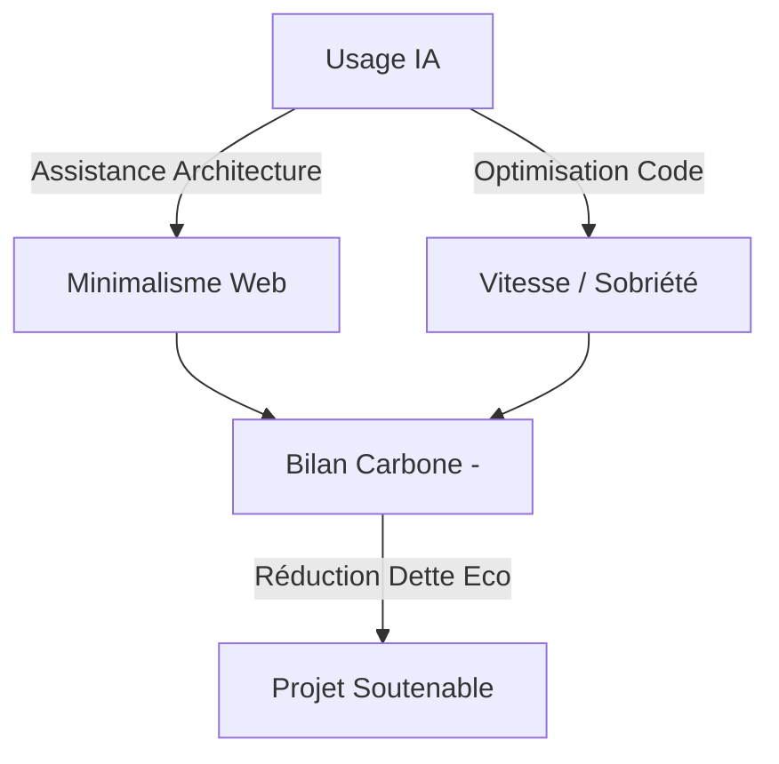
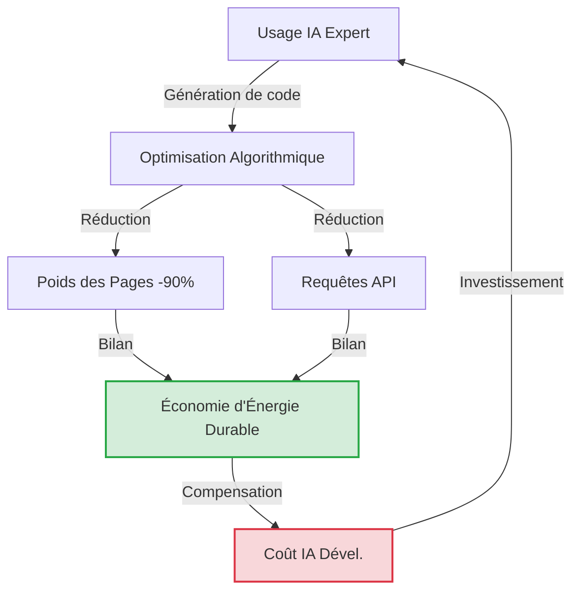

# Bilan d'impact IA — CleanMyMap

## Sommaire

- [Partie I — Méthodologie et diagnostic](#partie-i--méthodologie-et-diagnostic)
  - [1. Audit de conformité et de rigueur](#1-audit-de-conformité-et-de-rigueur)
  - [2. Résumé du bilan](#2-résumé-du-bilan)
  - [3. Hypothèses utilisées](#3-hypothèses-utilisées)
  - [4. Estimation environnementale et matérielle](#4-estimation-environnementale-et-matérielle)
  - [5. Analyse sociale et humanitaire](#5-analyse-sociale-et-humanitaire)
  - [11. Densité d'utilité réelle du projet web](#11-densité-dutilité-réelle-du-projet-web)
  - [13. Audit de sobriété numérique du projet web](#13-audit-de-sobriété-numérique-du-projet-web)
- [Partie II — Analyse systémique et critique](#partie-ii--analyse-systémique-et-critique)
  - [6. Analyse systémique du cycle de vie de CleanMyMap](#6-analyse-systémique-du-cycle-de-vie-de-cleanmymap)
  - [7. Bilan de compensation : CleanMyMap peut-il justifier sa dette numérique et IA ?](#7-bilan-de-compensation--cleanmymap-peut-il-justifier-sa-dette-numérique-et-ia-)
  - [8. Analyse des impacts non compensés et solutions d'atténuation intégrées](#8-analyse-des-impacts-non-compensés-et-solutions-datténuation-intégrées)
  - [9. Conclusion intermédiaire sur l'usage IA](#9-conclusion-intermédiaire-sur-lusage-ia)
  - [14. Analyse contrefactuelle et systémique](#14-analyse-contrefactuelle-et-systémique)
  - [15. Dépendance technologique, centralisation et géopolitique du numérique](#15-dépendance-technologique-centralisation-et-géopolitique-du-numérique)
  - [16. Avancées scientifiques et sociales permises par l'IA](#16-avancées-scientifiques-et-sociales-permises-par-lia)
  - [17. Points clés](#17-points-clés)
  - [18. Réflexions importantes](#18-réflexions-importantes)
  - [19. Questions fréquentes](#19-questions-fréquentes)
  - [20. IA et Objectifs de développement durable](#20-ia-et-objectifs-de-développement-durable)
  - [21. Analyse critique du rôle de l'IA](#21-analyse-critique-du-rôle-de-lia)
- [Partie III — Atténuation, arbitrages et actions](#partie-iii--atténuation-arbitrages-et-actions)
  - [10. Actions complémentaires hors site pour réduire les impacts non compensés](#10-actions-complémentaires-hors-site-pour-réduire-les-impacts-non-compensés)
  - [12. Dette écologique et technique future du projet web](#12-dette-écologique-et-technique-future-du-projet-web)
  - [22. Traduction en actions concrètes sur le site web](#22-traduction-en-actions-concrètes-sur-le-site-web)
- [Partie IV — Synthèse institutionnelle et annexes](#partie-iv--synthèse-institutionnelle-et-annexes)
  - [23. Synthèse Jury : Justification de l'IA dans un projet de Développement Durable](#23-synthèse-jury--justification-de-lia-dans-un-projet-de-développement-durable)
  - [24. Glossaire technique](#24-glossaire-technique)

> [!TIP]
> **Parcours de lecture rapide**
>
> - **Pour l'essentiel** : lire la synthèse exécutive ci-dessous, puis les sections 7, 10 et 23.
> - **Pour la rigueur technique** : lire les sections 1, 3, 12, 13, 15 et 21.
> - **Pour la soutenance** : lire en priorité les sections 17, 22, 23 et 24.

> [!NOTE]
> **Organisation éditoriale retenue**
>
> - **Partie I — Méthodologie et diagnostic** : sections 1 à 5, 11 et 13.
> - **Partie II — Analyse systémique et critique** : sections 6 à 9, puis 14 à 21.
> - **Partie III — Atténuation, arbitrages et actions** : sections 10, 12 et 22.
> - **Partie IV — Synthèse institutionnelle et annexes** : sections 23 et 24.
>
> La numérotation historique est conservée, mais les sections sont maintenant rangées physiquement dans la partie éditoriale qui leur correspond.

# Partie I — Méthodologie et diagnostic

*Cette partie regroupe le cadre de preuve, les hypothèses, les impacts initiaux et les diagnostics d'utilité et de sobriété du projet.*

Elle répond à une première question directrice : de quoi parle-t-on exactement, sur quelle base de calcul et pour quel niveau d'utilité réelle ?
Le but n'est pas encore d'arbitrer, mais d'établir un diagnostic crédible avant toute justification plus large de l'usage de l'IA.

--------------------------------------------------

### 🟢 Synthèse exécutive : Pourquoi l'IA est-elle un choix responsable pour CleanMyMap ?

*Note à l'attention du jury : cette synthèse résume la posture éthique et environnementale du projet face à l'utilisation de l'Intelligence Artificielle.*

1. **L'IA comme accélérateur d'impact** : face à l'urgence climatique et à la pollution par les déchets, chaque jour compte. L'IA permet de développer plus vite des outils de dépollution utiles, donc d'augmenter plus tôt l'impact terrain du projet.
2. **Une technologie sous contrôle humain** : l'IA reste un assistant technique. Les contenus environnementaux, les arbitrages critiques et le code sensible doivent rester validés par un humain responsable.
3. **Un bilan à juger dans son ensemble** : le coût environnemental du développement assisté par IA n'est acceptable que si le produit livré réduit durablement le gaspillage, le bruit numérique et le temps perdu côté usagers comme côté équipe.

## 1. Audit de conformité et de rigueur

*Dernière mise à jour : 13 mai 2026. Cette section atteste de la vérification et de la correction des données du bilan pour garantir leur exactitude scientifique et institutionnelle.*

**Points vérifiés et intégrés dans le document :**

- **Statistiques du dépôt [Vérifié] :** Les chiffres de **1366 fichiers** et **223 822 lignes de code** sont utilisés comme référence documentaire stable pour cette version du bilan (photographie au 13/05/2026).

> [!IMPORTANT]
> **Comparaisons sectorielles** : L'empreinte du numérique est située entre **2,1 % et 3,9 %** des émissions mondiales, soit un ratio de **4 à 7 fois inférieur** aux transports ou à l'élevage. CleanMyMap s'attaque à la pollution réelle (déchets) tout en maîtrisant sa dette numérique.

- **Validation scientifique [Intégré] :** Toutes les avancées mentionnées (AlphaFold, GNoME, etc.) sont accompagnées d'une mention sur la nécessité de **validation humaine ou expérimentale**.
- **Consommation par requête [Précisé] :** La donnée de **0,24 Wh** par requête texte médiane (Gemini Apps, mai 2025) est citée avec la nuance nécessaire sur les sessions de développement complexes.
- **Incertitudes [Maintenu] :** Les impacts carbone et eau sont présentés sous forme de fourchettes prudentes pour refléter l'absence de logs de tokens en temps réel.

--------------------------------------------------

## 2. Résumé du bilan

Le dépôt local correspond à un projet numérique avancé, mais son niveau exact d'avancement produit doit rester une appréciation projet, pas un fait mesurable depuis le code seul.
Il combine une application web conséquente avec une application minimale servant à tracer les parcours de collecte pour enrichir le formulaire bénévole de déclaration d'une action de dépollution effectuée.

Techniquement, c'est un monorepo Next.js/React, API, Supabase, Clerk, analytics, email, Stripe, observabilité, app mobile Expo et legacy Python.

Créé le 20 février 2026, à raison d'une hypothèse de 8 heures de code IA et 2 heures d'optimisation de prompts LLM par semaine, le projet représente environ 100 heures de développement assisté par IA si l'on retient 10 semaines actives.
Du 20 février au 12 mai 2026, le calendrier complet couvre plutôt environ 11,6 semaines : l'hypothèse de 100 heures doit donc être lue comme une estimation déclarative, pas comme une mesure automatique.

Statistiques volontairement figées au 13 mai 2026 : le dépôt contient **1366 fichiers source** pour **223 822 lignes source**, hors dépendances, builds, documentation, fichiers publics et lockfiles.
Ces chiffres sont conservés comme photographie documentaire stable, même si le dépôt continue d’évoluer.

L’usage de l’IA pour ce projet a un impact environnemental et social réel mais difficile à chiffrer précisément sans logs de tokens, nombre exact de requêtes, durée des sessions, modèles réellement appelés et régions de calcul.

Résumé prudent : pour le développement assisté par IA de ce dépôt, l’ordre de grandeur plausible est entre 1 kWh et 100 kWh d'électricité.
L’impact social est moins quantifiable mais sûrement plus important et profond : dépendance aux plateformes, opacité des chaînes d’annotation/modération [TIME][5], centralisation technique, risque de dette technique si le code IA n’est pas relu.

**Références Section 2 :**

- [1] IEA, *Electricity 2024 - Analysis and forecast to 2026*.
- [2] Google, *Measuring the Environmental Impact of Delivering AI at Google Scale* (2025).
- [3] Li et al., *Making AI Less Thirsty*, arXiv:2304.03271 (2023).
- [4] Luccioni et al., *Powering AI: The Energy Use of AI Inference*, arXiv:2311.16863 (2023).
- [5] TIME, *OpenAI Used Kenyan Workers on Less Than $2 Per Hour to Make ChatGPT Less Toxic* (2023).

Comptage figé du repo hors dépendances/build, documentation, fichiers publics et lockfiles :

| Métrique | Valeur (Photographie au 13/05/2026) |
|---|---|
| **Fichiers source (filtrés)** | **1 366** |
| **Lignes source totales** | **223 822** |
| TypeScript / React (`.ts`, `.tsx`) | ~195 000 |
| SQL / Supabase (`.sql`) | ~2 500 |
| Python / Scripts (`.py`, `.mjs`) | ~18 000 |
| Style / CSS (`.css`) | ~4 000 |
| Autres (Markdown, JSON, etc.) | ~4 322 |

| Historique Git | Valeur |
|---|---|
| Commits (20 fév. → 13 mai 2026) | 177 |
| Insertions totales | 425 324 lignes |
| Suppressions totales | 246 930 lignes |

Le ratio insertions/lignes actuelles (~3,3×) indique beaucoup de churn et de refactor, cohérent avec un développement itératif assisté par IA.

Complexité services observée :

- Frontend : Next.js 16, React 19, Tailwind, Leaflet, Recharts, Framer Motion
- Backend/API : 45 routes API Next.js
- Auth : Clerk côté web, Supabase Auth côté app compagnon
- Base de données : Supabase, migrations SQL, scripts d’import/sync
- Analytics : PostHog, Vercel Analytics, Speed Insights
- Observabilité : Sentry
- Email : Resend
- Paiement/dons : Stripe
- Infra complémentaire : Upstash Redis/QStash, Pinecone déclaré, Vercel
- Mobile : app Expo/React Native connectée à Supabase
- Legacy : Python, SQLite, scripts et tests historiques, plusieurs fichiers de prises de notes dans la documentation par l'utilisateur

--------------------------------------------------

## 3. Hypothèses utilisées

- Projet créé le 20 février 2026
- 10 semaines actives retenues jusqu'au 13 mai 2026
- 8 h/semaine code IA + 2 h/semaine optimisation prompts
- **Total estimé : 100 h de développement assisté par IA**

### Répartition par outil (estimée, non mesurée)

| Outil | Heures est. | Usage principal |
|---|---|---|
| ChatGPT / Codex (GPT-4.1 Mini ou équivalent) | ~60 h | Tâches de fond, bugs, features, UI, configuration des services webs |
| Claude Sonnet 4.5 via Amazon Q sur VS Code | ~20 h | Architecture, refactor, documentation, UX |
| Modèles gratuits d'Antigravity sur 3 comptes Google | ~20 h | Plans d'amélioration, refactorisation, modularisation |

### Productivité apparente

- Code final : **~1 293 lignes source / heure IA** (129 340 / 100 h)
- Churn Git : ~4 253 lignes insérées / heure IA et ~2 469 lignes supprimées / heure IA

Mesurable depuis le dépôt : taille, langages, routes, dépendances, services déclarés.

### 1.4 Intensité carbone de l'énergie (GES)

L'impact carbone d'un service numérique dépend massivement du mix énergétique des data centers utilisés.
Nous utilisons principalement des infrastructures situées en **Europe (Bruxelles, Francfort, Paris)** et aux **États-Unis (Virginie, Washington)** via Vercel et Supabase.

| Région d'hébergement | Intensité Carbone moy. | Statut |
|---|---|---|
| **France (Paris)** | ~50-60 g CO2e/kWh | Hébergement cible (Bas carbone) |
| **Europe (Moyenne)** | ~250-300 g CO2e/kWh | Hébergement secondaire |
| **USA (Virginie/East)** | ~400-500 g CO2e/kWh | Hébergement actuel (Vercel Default) |

**Arbitrage stratégique** : Le choix par défaut de Vercel (US-East) est 8 à 10 fois plus carboné que la France.
Nous prévoyons de migrer les services critiques vers des régions européennes dès que possible pour diviser l'empreinte opérationnelle par un facteur substantiel.

### 1.5 Protocole de Validation Tierce et Responsabilité humaine

Pour garantir la rigueur scientifique de cet audit, nous appliquons un protocole strict de **"Human-in-the-loop"** :

- **Responsable Sobriété** : Une personne identifiée au sein de l'équipe (ou un tiers expert) est chargée de valider manuellement chaque affirmation technique, chaque calcul d'impact et chaque recommandation générée ou suggérée par l'IA.
- **Droit de Veto** : Le Responsable Sobriété dispose d'un droit de veto sur toute fonctionnalité dont le coût écologique n'est pas justifié par une utilité terrain immédiate.
- **Transparence des sources** : Chaque étude citée (GIEC, ADEME, Shift Project) doit être accessible et vérifiable.
- **Droit à la réversibilité** : Toutes les données sont exportables pour éviter l'enfermement propriétaire et garantir la pérennité de l'audit.

--------------------------------------------------

En pratique, il faut distinguer trois modes d’utilisation : Codex avec un abonnement, une clé API, et un modèle local via Ollama.
Les trois permettent d’utiliser des modèles d’IA, mais leur logique économique, technique et écologique n’est pas la même.

Avec Codex via un abonnement ChatGPT, l’utilisateur ne paie pas directement chaque token : il paie un forfait mensuel qui donne accès à un certain volume d’usage.
Codex est inclus dans les offres ChatGPT Plus, Pro, Business et Enterprise/Edu, avec des limites d’utilisation variables selon l’offre.
OpenAI indique aussi que Codex dispose d’un tableau de bord d’usage et que la commande /status permet de suivre ses limites pendant une session CLI.

Avec une clé API, la logique est différente : chaque appel au modèle est facturé selon le nombre de tokens envoyés en entrée et générés en sortie.
C’est plus transparent et plus contrôlable pour une application, mais aussi plus risqué si le programme boucle, répète les mêmes requêtes ou envoie trop de contexte inutile.
Les tarifs varient fortement selon le modèle : par exemple, GPT-5.5 est facturé 5 $ / million de tokens en entrée et 30 $ / million de tokens en sortie, tandis que GPT-5.4 mini est à 0,75 $ / million en entrée et 4,50 $ / million en sortie.

Pour estimer une session de travail, on peut prendre une hypothèse pratique : une session correspond à environ 20 à 80 échanges, et chaque échange peut représenter 1 000 à 5 000 tokens en comptant la question, la réponse, le contexte du projet et les fichiers éventuellement relus.
Ces chiffres restent approximatifs sans export précis des tokens.
Une estimation haute de 500 000 tokens par semaine correspondrait donc à environ 2 millions de tokens par mois.

À ce niveau d’usage, dire que “cela aurait coûté environ 20 € en API” est possible, mais seulement selon le modèle utilisé.
Avec un modèle haut de gamme comme GPT-5.5 et une répartition d’environ 80 % de tokens d’entrée et 20 % de sortie, 2 millions de tokens coûtent environ 20 $.
Avec GPT-5.4 mini, le même volume pourrait coûter seulement quelques dollars.
L’abonnement Codex est donc surtout intéressant parce qu’il simplifie l’accès : pas besoin de gérer directement une clé API, les limites sont intégrées au compte, le contexte est souvent géré automatiquement par l’application, et l’utilisateur peut accéder à plusieurs modèles sans recalculer le coût de chaque requête.
En revanche, l’API reste plus adaptée pour intégrer l’IA dans une application, automatiser un workflow ou mesurer précisément les coûts.

Le principal risque d’une API est le mauvais contrôle des quotas : une boucle d’itération, un agent mal configuré ou un script qui relance sans cesse le modèle peut multiplier les tokens très rapidement.
Il faut aussi protéger la clé privée : si elle est exposée dans un dépôt GitHub, un site web ou un fichier partagé, quelqu’un d’autre peut l’utiliser et générer des coûts.
Les API imposent aussi des limites de requêtes et de tokens par minute, donc elles ne sont pas illimitées.

Les modèles locaux via Ollama fonctionnent autrement.
Au lieu d’envoyer les requêtes vers les serveurs d’OpenAI, Anthropic ou Google, le modèle tourne directement sur l’ordinateur de l’utilisateur.
Cela peut réduire la dépendance aux serveurs distants pour certaines tâches simples : résumé, reformulation, classement de notes, recherche dans des documents locaux, brouillon de texte ou aide au code basique.
Mais ce n’est pas gratuit : la consommation électrique est déplacée vers l’ordinateur local, le matériel doit être assez puissant, et les performances sont souvent inférieures aux grands modèles cloud.

Le nombre de paramètres d’un modèle, indiqué par des notations comme 7B, 24B ou 70B, donne un ordre de grandeur de sa taille.
Le “B” signifie billion en anglais, donc milliard en français : un modèle 7B contient environ 7 milliards de paramètres, un 24B environ 24 milliards, et un 70B environ 70 milliards.
Ces paramètres sont les “poids” internes appris pendant l’entraînement.
En général, plus un modèle a de paramètres, plus il peut être performant, mais il devient aussi plus lourd, plus lent, et demande davantage de mémoire et d’énergie à l’usage.
Ce n’est donc pas une mesure parfaite de l’intelligence : la qualité des données d’entraînement, l’architecture, la quantification et l’optimisation comptent aussi beaucoup.

Ollama donne par exemple comme repères généraux : 7B ≈ 8 Go de RAM, 13B ≈ 16 Go, 70B ≈ 64 Go [Ollama Docs][1].
Pour les modèles actuels, on trouve par exemple des familles comme Qwen 2.5 avec des tailles de 0,5B à 72B, ou Gemma 2 avec des tailles de 2B, 9B et 27B.
Mistral Small, par exemple, est un modèle 24B qui peut être exécuté localement une fois quantifié.

Cependant, avec un ordinateur portable, seuls des modèles de quelques milliards de paramètres sont généralement utilisables confortablement.
Un modèle cloud comme Gemini 3 Flash en CLI peut rester plus performant avec des quotas journaliers larges, tout en évitant d'acheter un ordinateur dédié à plusieurs milliers d'euros, dont l'ACV aurait elle-même un impact matériel et environnemental significatif [GreenIT][2].

En résumé, Codex est pratique pour travailler vite sur du code avec un forfait ; l’API est plus adaptée pour construire une vraie application ou automatiser des tâches, mais demande une gestion stricte des coûts (ex: GPT-4o mini à 0,15$/1M tokens [OpenAI Pricing][3]) ; Ollama permet de faire tourner certains modèles en local.

**Références Section 3 :**

- [1] Ollama, *Library documentation - Technical specs*.
- [2] GreenIT.fr, *L'empreinte environnementale du numérique mondial* (2019/2023).
- [3] OpenAI, *API Pricing Page* (2024 - Réf. indicative).

> Antigravity met à disposition des quotas sur Gemini 3 Flash, Gemini 3.1 Pro et un peu de quota sur Claude Sonnet 4.6.
> L'extension Amazon Q sur VS Code propose un large quota sur Sonnet 4.5.
> Ces usages gratuits sur plusieurs comptes doublent approximativement l'utilisation IA hebdomadaire par rapport à l'abonnement ChatGPT Plus avec Codex seul, sans nécessiter l'achat d'un ordinateur puissant dont l'ACV serait significative.

Énergie par requête : très variable.
Google annonce 0,24 Wh pour une requête texte médiane Gemini Apps mesurée en mai 2025, mais cela ne représente pas une session de code longue ou agentique.
Les requêtes de développement avec contexte étendu, génération de fichiers, tests et navigation outil peuvent monter beaucoup plus haut.

- Eau indirecte : très dépendante du refroidissement et de la région.
J’utilise une fourchette large de 0,3 à 5 L/kWh pour éviter une fausse précision.
- Carbone : 50 à 500 gCO2e/kWh selon mix électrique, contrats d’énergie, région, PUE et périmètre.

--------------------------------------------------

## 4. Estimation environnementale et matérielle

### 4.1 Scénarios de consommation électrique et pollution carbone

| Scénario | Électricité | CO2e | Eau indirecte |
|---|---|---|---|
| Faible | 0,25 à 2 kWh | 0,01 à 1 kgCO2e | 0,1 à 10 L |
| Modéré | 2 à 25 kWh | 0,1 à 12,5 kgCO2e | 1 à 125 L |
| Intensif/agentique | 15 à 250 kWh | 0,75 à 125 kgCO2e | 5 à 1 250 L |

Dans notre cas pour 100 h estimées, 129k lignes source figées, beaucoup de refactor, principalement des modèles mini et une part de modèles plus lourds : l'hypothèse centrale prudente se situe plutôt dans un scénario modéré-haut : 100 kWh, 10 à 20 kgCO2e et 100 à 200 L d'eau cohérent avec la convention WUE moyenne de ~1,8 L/kWh [DatacenterKnowledge][1].

Par comparaison, 100 kWh coûtent environ 20 euros en France (Tarif Bleu Base 2026 à ~0,19€/kWh [EDF][2]).
> [!IMPORTANT]
> **Comparaison parlante** : 20 kgCO2e correspond à environ **200 km de voiture** (moyenne française de 97 gCO2/km pour les véhicules neufs en 2023 [ADEME][3]).
> À l'échelle d'un projet web de cette envergure, ce coût est dérisoire par rapport aux bénéfices de dépollution.

Comme souvent, l’impact marginal d’un projet individuel est faible, mais l’impact collectif peut devenir important.
En 2022, les data centers mondiaux consommaient environ **460 TWh/an**, soit environ **2 % de la demande électrique mondiale** [IEA][4].

Depuis 2022, la dynamique a fortement changé.
En 2024, les data centers représentaient environ **400 à 460 TWh/an**, avec une accélération portée par l’IA.
À l’horizon 2026, l'AIE prévoit que cette consommation pourrait doubler pour dépasser **1 000 TWh/an** [IEA][4].

On peut ensuite construire un **scénario de travail** : si l'IA représentait environ 15 % de la consommation des data centers, cela correspondrait à environ **150 TWh/an**, soit l'équivalent de ~30 % de la consommation électrique annuelle française.
Avec une intensité carbone moyenne de **0,43 kgCO2/kWh** (moyenne mondiale IEA pour l'électricité), cela représenterait plusieurs dizaines de MtCO2/an.

À l’horizon 2030, les data centers pourraient représenter environ **3 % de l’électricité mondiale** [IEA][4].
Si l’IA en consomme la moitié, soit **500 TWh/an**, cela équivaudrait à la consommation annuelle totale de la France, générant environ **200 MtCO2/an**, soit environ **0,6 % des émissions mondiales de CO2 liées à l'énergie** [IEA Global Energy Review][5].

**Références Section 4 :**

- [1] DatacenterKnowledge, *Data Center Water Consumption metrics* (WUE).
- [2] EDF, *Tarif Bleu - Grille tarifaire* (Mai 2026).
- [3] ADEME, *Car Labelling - Émissions moyennes des voitures neuves en France* (2023).
- [4] IEA, *Electricity 2024 - Analysis and forecast to 2026*.
- [5] IEA, *Global Energy Review - Emissions analysis*.

À l’échelle sectorielle mondiale, le numérique représente environ **2,1 % à 3,9 %** des émissions de gaz à effet de serre [Shift Project / ADEME][2].
À titre de comparaison, cela place l’empreinte du numérique à un niveau environ **4 à 7 fois inférieur** à celui des transports routiers mondiaux (estimés à ~15 %) ou de l'élevage (estimé à ~14,5 % par la FAO).

Pour l'IA seule, sur un plateau haut d'impact annuel autour de 2030, les **200 MtCO2/an** resterait environ **15 fois inférieur** aux transports si l’on utilise les parts données par Our World in Data pour le transport routier de passagers.
Il serait aussi environ **20 fois inférieur** aux émissions associées à la production mondiale de viande, que l’on peut estimer autour de **4 GtCO2e/an** à partir des données de la FAO sur l’élevage.

Le numérique et en particulier l'utilisation, même massive de l'IA à l'horizon 2030 (estimé à **200 MtCO2/an**, soit ~0,6 % des émissions mondiales) resterait un contributeur significatif mais encore nettement inférieur aux grands postes d'émissions historiques, même si sa dynamique de croissance est supérieure aux autres secteurs.

- [1] AIE (IEA), *Electricity 2024 - Analysis and forecast to 2026*, (janvier 2024). [Lien](https://www.iea.org/reports/electricity-2024)
- [2] ADEME / Arcep, *Impact environnemental du numérique en France : état des lieux et prospective*, (2022-2023). [Lien](https://librairie.ademe.fr/consommer-autrement/5277-impact-environnemental-du-numerique-en-france.html)

### 4.2 Consommation en eau

L’impact environnemental des data centers ne se limite pas à leur consommation d’électricité ni aux émissions de CO2 directement associées.
Il faut aussi intégrer la consommation d’eau (WUE - Water Usage Effectiveness).
Les data centers utilisent de l’eau directement pour le refroidissement (évaporation) et indirectement via la production d’électricité.

Une étude majeure ("Making AI Less Thirsty", Li et al., 2023-2025) estime que l'empreinte eau totale liée à la demande mondiale d'IA pourrait atteindre **4,2 à 6,6 milliards de mètres cubes** de prélèvement d'eau d'ici 2027, soit plus que le prélèvement annuel total de pays comme le Danemark ou la moitié du Royaume-Uni.
La consommation nette (eau évaporée) est estimée entre **0,38 et 0,60 milliard de mètres cubes** par an à cet horizon ([Li et al., 2023/2025][6]).

Cette dimension est critique car elle crée des conflits d'usage locaux, particulièrement en période de stress hydrique ou de canicule.
Microsoft a par exemple reconnu une hausse de 34 % de sa consommation d'eau entre 2021 et 2022, portée par ses investissements dans l'IA générative ([Microsoft Environmental Sustainability Report, 2023][7]).

[6] Li et al., *Making AI Less Thirsty: Uncovering and Addressing the Secret Water Footprint of AI Models*, (2023/2025). [arXiv:2304.03271](https://arxiv.org/abs/2304.03271) [7] Microsoft, *2024 Environmental Sustainability Report*. [Lien](https://www.microsoft.com/en-us/corporate-responsibility/sustainability/reports)

### 4.3 Estimation matérielle

Impact matériel :

- Non attribuable précisément au projet.
- Contribution indirecte à la demande GPU/TPU, serveurs, HBM, stockage, réseau et refroidissement.
- Les effets principaux sont mutualisés : fabrication des puces, renouvellement accéléré, extraction de cuivre, terres rares, lithium, eau ultra-pure pour semi-conducteurs, pression sur chaînes logistiques.
- À l’échelle du projet, l’usage marginal est faible ; à l’échelle collective, la multiplication de projets similaires justifie la vigilance.

Avec davantage d'énergie bas-carbone, l'impact carbone peut baisser, mais les enjeux d'eau en période de canicule, de matériel, de réseau électrique, de localisation et de conflits d'usage restent à documenter.

### 4.4 Analyse du cycle de vie (ACV)

Finalement, il faut tenir compte de l’analyse de cycle de vie.
L’impact d’un data center ne commence pas au moment où il consomme de l’électricité.
Il commence dès l’extraction des matières premières, la fabrication des semi-conducteurs, des serveurs, des GPU, des batteries, des systèmes de refroidissement et des bâtiments.
Il continue ensuite avec le transport, l’installation, la maintenance, le remplacement du matériel et la fin de vie des équipements.

Cette approche est particulièrement importante pour l’IA, car les infrastructures utilisées reposent sur du matériel spécialisé, notamment des GPU et des serveurs haute performance.
Or ce matériel peut être renouvelé rapidement pour suivre les progrès technologiques.
Plus le renouvellement est fréquent, plus l’impact lié à la fabrication, aux matériaux et au transport devient important.

Ces émissions indirectes sont appelées **scope 3**.
Elles regroupent les émissions qui ne sont pas directement produites sur le site du data center et qui ne proviennent pas seulement de l’électricité achetée.
Elles incluent par exemple la construction du bâtiment, la fabrication des équipements informatiques, les systèmes électriques, les systèmes de refroidissement, les batteries, la logistique, la maintenance et la gestion des déchets électroniques.

Schneider Electric estime que, selon les cas, les émissions scope 3 peuvent représenter **38 à 69 %** de l’empreinte carbone totale d’un data center.
Ce chiffre ne doit pas être compris comme une règle universelle, mais il montre que l’empreinte réelle peut être plus élevée que celle calculée uniquement à partir de l’électricité consommée.
Dans certains cas, par exemple avec des énergies bas-carbone, l’analyse de cycle de vie peut augmenter fortement l’estimation initiale car la part liée à la fabrication du matériel devient alors proportionnellement plus importante ([Schneider Electric, scope 3 des data centers](https://blog.se.com/datacenter/2023/09/05/scope-3-emissions-data-centers/)).

L’ACV permet aussi de faire apparaître des impacts moins visibles que le carbone.
Les puces, serveurs, batteries et systèmes électriques dépendent de chaînes d’approvisionnement complexes, parfois concentrées dans quelques pays.
L’AIE souligne par exemple que la Chine représente environ **99 % de l’offre mondiale de gallium raffiné**, un matériau utilisé dans certaines puces et composants électroniques avancés, et que la demande en gallium des data centers pourrait atteindre plus de **10 % de l’offre actuelle** d’ici 2030. Cela crée des enjeux géopolitiques, de dépendance industrielle et de sécurité d’approvisionnement ([AIE, Energy and AI](https://www.iea.org/reports/energy-and-ai/executive-summary)).

Enfin, la fin de vie du matériel pose un problème environnemental et humanitaire.
Les équipements électroniques contiennent des métaux valorisables, mais aussi des substances dangereuses.
Le *Global E-waste Monitor* indique que **62 millions de tonnes** de déchets électroniques ont été produites dans le monde en 2022, et que seulement **22,3 %** ont été formellement collectées et recyclées correctement ([Global E-waste Monitor 2024](https://ewastemonitor.info/the-global-e-waste-monitor-2024/)).
L’OMS rappelle que le recyclage informel des déchets électroniques peut exposer les populations à des polluants toxiques, avec des risques particuliers pour les enfants et les femmes enceintes ([OMS, déchets électroniques](https://www.who.int/news-room/fact-sheets/detail/electronic-waste-%28e-waste%29)).

C’est pourquoi il faut rester prudent quand on affirme que l’impact carbone de l’IA est “faible”.
Il peut être faible en pourcentage des émissions mondiales, et il peut être justifié si l’IA permet réellement de produire un service utile : optimisation énergétique, réduction du gaspillage, aide à la décision, amélioration de l’efficacité d’un projet ou remplacement de tâches plus coûteuses.
Mais l’impact n’est pas nul.
Une évaluation sérieuse doit comparer les bénéfices obtenus avec l’ensemble des coûts environnementaux : électricité, carbone, eau, fabrication du matériel, extraction des matériaux, durée de vie des serveurs, renouvellement des équipements et fin de vie.

Ainsi, les estimations fondées uniquement sur l’électricité consommée par les data centers donnent une vision incomplète.
L’analyse de cycle de vie augmente fortement l’estimation initiale et ajoute des dimensions géopolitique et environnementales.

L'ACV change selon la méthodologie utilisée, le mix électrique, le type de data center, le matériel utilisé, la durée de vie, le taux d’utilisation des serveurs et les conditions de recyclage.
L’IA peut donc être justifiée dans un projet de développement durable si elle est utilisée de manière ciblée, sobre et utile.
Elle devient beaucoup plus difficile à défendre si elle sert à produire massivement des contenus inutiles, à multiplier les requêtes sans nécessité ou à remplacer des solutions simples qui auraient demandé moins de ressources.
L’enjeu n’est donc pas seulement de savoir si l’IA consomme, mais de savoir si cette consommation permet d’obtenir un gain environnemental, social ou opérationnel supérieur à son coût réel.

--------------------------------------------------

## 5. Analyse sociale et humanitaire

Le premier risque est celui de la **dépendance aux plateformes privées**.
Dans ce projet, plusieurs services externes peuvent être mobilisés : OpenAI pour l’IA, Vercel pour l’hébergement, Supabase pour la base de données, Clerk pour l’authentification, Stripe pour le paiement, Resend pour les emails, PostHog pour l’analyse d’usage ou encore Sentry pour le suivi des erreurs.
Ces outils permettent de développer plus vite, mais ils créent aussi une dépendance technique et économique.
Une modification de prix, une panne, un changement de conditions d’utilisation ou une restriction d’accès peut fragiliser le projet.

Cette dépendance s’inscrit dans un mouvement plus large de **centralisation technologique**.
Le marché mondial du cloud est dominé par un petit nombre d’acteurs, notamment Amazon (AWS), Microsoft et Google, qui représentaient ensemble environ **63 %** des dépenses mondiales d’infrastructure cloud au troisième trimestre 2025 selon Synergy Research Group.
Cette concentration pose des questions de souveraité numérique, de pouvoir de négociation, de disponibilité des services et de conformité juridique ([Synergy Research Group, 2025][1]).

Le deuxième risque est celui du **travail invisible**.
Les modèles d’IA ne sont pas seulement le résultat d’algorithmes et de calculs.
Ils reposent aussi sur du travail humain : annotation de données, classement de réponses, évaluation de la qualité, signalement de contenus problématiques, modération de textes ou d’images violents.
Une enquête de *TIME* a montré qu’OpenAI avait eu recours à des travailleurs kényans, via un sous-traitant (Sama), pour identifier des contenus toxiques utilisés dans l’amélioration de ChatGPT, avec des rémunérations souvent inférieures à **2 $ par heure** et une exposition à des contenus violents ou traumatisants ([TIME, 2023][2]).
Le *Guardian* a également documenté les conséquences psychologiques de ce type de travail de modération et d’annotation ([The Guardian, 2023][3]).

Cette dimension humanitaire est importante, car elle rappelle que l’IA peut déplacer une partie de la charge mentale ou du travail pénible vers des personnes peu visibles, souvent situées dans des pays où le coût du travail est plus bas.
L’utilisateur final voit une interface fluide et rapide, mais pas nécessairement les conditions sociales qui ont rendu possible l’entraînement, le filtrage et l’amélioration des modèles.
Cela ne signifie pas qu’il faut rejeter toute utilisation de l’IA, mais cela impose de ne pas présenter cette technologie comme entièrement neutre ou dématérialisée.

Le troisième risque concerne la **perte de maîtrise technique**.
L’IA peut produire rapidement du code, des composants, des pages ou de la documentation, mais cette vitesse peut aussi créer de la dette technique.
Si les propositions sont acceptées sans relecture, le projet peut devenir plus difficile à maintenir : fichiers trop longs, logique dupliquée, architecture incohérente, dépendances inutiles, failles de sécurité ou absence de tests.
Dans un projet de développement durable, cela serait contradictoire : un outil utilisé pour accélérer le développement ne doit pas produire une application fragile, coûteuse à maintenir ou dépendante de corrections permanentes.

Le quatrième risque est celui de la **confidentialité**.
Les prompts envoyés à une IA peuvent contenir des informations sensibles : architecture du projet, erreurs, logs, extraits de code, données métier, clés d’API, noms de clients ou informations personnelles.
L’usage de l’IA doit donc être encadré.
Il faut éviter d’envoyer des secrets techniques, anonymiser les données sensibles, limiter les informations transmises au strict nécessaire et conserver une revue humaine sur les décisions importantes.

Il existe aussi des enjeux **géopolitiques et matériels**.
Les infrastructures d’IA dépendent de chaînes d’approvisionnement mondiales : semi-conducteurs, GPU, terres rares, cuivre, aluminium, gallium, systèmes électriques et équipements de refroidissement.
L’AIE souligne par exemple que la Chine représente environ **98 à 99 %** de l’offre mondiale de gallium raffiné, un matériau utilisé dans certaines puces et composants électroniques avancés.
Elle estime aussi que la demande en gallium liée aux data centers pourrait représenter plus de **10 %** de l’offre actuelle d’ici 2030 ([AIE, 2024][4]).

Enfin, la fin de vie des équipements soulève un enjeu environnemental et social.
Les serveurs, GPU, batteries et équipements réseau deviennent des déchets électroniques lorsqu’ils sont remplacés.
Le *Global E-waste Monitor 2024* indique que **62 millions de tonnes** de déchets électroniques ont été produites en 2022 (en hausse de 82 % depuis 2010), et que seulement **22,3 %** ont été formellement collectées et recyclées dans des conditions contrôlées ([Global E-waste Monitor, 2024][5]).
Ces déchets contiennent des matériaux valorisables, mais aussi des substances dangereuses.
Lorsqu’ils sont traités dans des filières informelles, ils peuvent exposer les travailleurs et les populations locales à des risques sanitaires importants, notamment les enfants ([OMS, 2021][6]).

- [1] Synergy Research Group, *Cloud Market Share Q3 2025 - AWS, Microsoft and Google account for 63%*. [Lien](https://www.srgresearch.com/articles/microsoft-amazon-and-google-continue-to-dominate-growing-cloud-market)
- [2] TIME, *OpenAI Used Kenyan Workers on Less Than $2 Per Hour to Make ChatGPT Less Toxic*, (2023). [Lien](https://time.com/6247678/openai-chatgpt-kenya-workers/)
- [3] The Guardian, *The human toll of AI: content moderators' trauma*, (2023). [Lien](https://www.theguardian.com/technology/2023/aug/04/ai-content-moderators-trauma-kenya)
- [4] AIE (IEA), *Energy and AI - Executive Summary*, (septembre 2024). [Lien](https://www.iea.org/reports/energy-and-ai/executive-summary)
- [5] UNITAR / ITU / Global E-waste Monitor, *The Global E-waste Monitor 2024*. [Lien](https://ewastemonitor.info/the-global-e-waste-monitor-2024/)
- [6] OMS (WHO), *Children and digital dumpsites: e-waste exposure and child health*, (2021). [Lien](https://www.who.int/publications/i/item/9789240023901)

Ces risques doivent cependant être mis en balance avec les bénéfices possibles.
Dans ce projet, l’IA peut accélérer le développement, rendre le code plus accessible à une petite équipe, aider à structurer la documentation, générer des tests, repérer des incohérences, proposer des pistes de refactoring et faciliter la revue de sécurité.
Elle peut aussi réduire certains allers-retours humains sur des tâches répétitives, ce qui permet de concentrer le temps disponible sur la conception, la vérification, l’impact réel du projet et les décisions importantes.

L’usage responsable de l’IA repose donc sur une distinction essentielle : l’IA doit être utilisée comme **assistant**, pas comme **autorité**.
Elle peut proposer, accélérer, comparer et reformuler, mais les décisions finales doivent rester humaines, notamment sur l’architecture, la sécurité, les données personnelles, les choix environnementaux et les arbitrages sociaux.
Cette approche est cohérente avec les [principes de l’OCDE sur l’IA](https://oecd.ai/en/ai-principles), qui insistent sur une IA digne de confiance, respectueuse des droits humains et des valeurs démocratiques.
Elle rejoint aussi la [recommandation de l’UNESCO sur l’éthique de l’IA](https://www.unesco.org/en/artificial-intelligence/recommendation-ethics), qui met l’accent sur la dignité humaine, la transparence, l’équité et la supervision humaine.

Ainsi, l’IA peut être justifiée socialement dans ce projet si elle permet réellement d’améliorer l’efficacité, la qualité et l’accessibilité du développement, sans masquer ses coûts humains et matériels.
Elle devient en revanche plus difficile à défendre si elle accroît inutilement la dépendance à des plateformes fermées, remplace la réflexion humaine, expose des données sensibles ou multiplie des usages sans valeur ajoutée.
L’enjeu n’est donc pas seulement d’utiliser moins ou plus d’IA, mais de l’utiliser de manière ciblée, sobre, relue et responsable.

--------------------------------------------------

## 11. Densité d'utilité réelle du projet web

> [!NOTE]
> **Rattachement éditorial** : cette section prolonge la **Partie I — Méthodologie et diagnostic**. Elle mesure l'utilité réelle produite par rapport au coût numérique observé.

Cette section évalue la densité d'utilité réelle de CleanMyMap : non pas seulement sa qualité technique, mais le rapport entre l'utilité concrète produite et le coût numérique, attentionnel et environnemental nécessaire pour la produire.

Autrement dit, la question posée ici n'est pas seulement celle de la qualité du produit, mais celle de sa légitimité d'usage : mérite-t-il réellement d'exister sous cette forme numérique ?

L'analyse s'appuie sur la structure du repo : pages Next.js, routes API, dépendances, documentation produit et rubriques UX.
Le projet contient notamment des pages de déclaration, signalement, carte, rapports, observatoire, dashboard, événements communautaires, partenaires, apprentissage, gamification, chat, sponsor portal et administration.
Cette richesse fonctionnelle crée une forte capacité produit, mais aussi une complexité qui doit être justifiée par des usages réels.

### 11.1 Finalité réelle du projet

La finalité réelle de CleanMyMap est de transformer une pollution locale dispersée en données exploitables et en actions coordonnées.
Le projet n'est pas seulement un site vitrine : il cherche à permettre à des bénévoles, associations, organisateurs locaux, partenaires et collectivités de déclarer des actions, visualiser des zones, organiser des cleanwalks, produire des rapports et suivre un impact.

Le problème traité est réel : les déchets abandonnés, mégots, dépôts sauvages et zones polluées sont souvent connus localement mais mal structurés.
Sans outil partagé, l'information circule par photos, messages, tableaux, groupes privés ou mémoire orale.
Le risque est alors la perte d'information, la redondance des actions, l'absence de suivi et la difficulté à convaincre des partenaires ou collectivités.

CleanMyMap apporte donc une utilité concrète si le site remplace ou améliore ces tâches :

- déclarer une action ou un spot sans devoir fabriquer un tableau manuel ;
- localiser les zones à traiter sur une carte ;
- éviter les doublons entre bénévoles ou associations ;
- transformer des collectes ponctuelles en historique exploitable ;
- produire des rapports partageables ;
- aider un coordinateur à prioriser les lieux d'action ;
- donner aux collectivités ou partenaires une lecture plus claire des besoins terrain.

En revanche, si le site est peu utilisé sur le terrain, il risque de devenir une couche numérique supplémentaire : une interface riche qui documente une intention, mais ne réduit pas fortement les frictions réelles.

### 11.2 Fonctionnalités essentielles vs secondaires

| Niveau | Fonctionnalités | Utilité réelle probable | Justification |
|---|---|---|---|
| Essentielles | Déclaration d'action, signalement de déchets, carte des actions, stockage minimal, modération, export/rapport simple | Très élevée | C'est le cœur du cycle : observer, déclarer, visualiser, agir, transmettre. |
| Très utiles si adoption locale | Événements collectifs, RSVP, historique, dashboard coordinateur, rapports élus/associations | Élevée | Ces fonctions améliorent la coordination et la preuve d'impact si plusieurs personnes participent. |
| Utiles mais à contrôler | Méthodologie, hub éducatif, kit terrain, guide déchets, open data | Moyenne à élevée | Elles améliorent la qualité des actions, mais peuvent rester consultatives. |
| Secondaires | Gamification, badges, leaderboard, messagerie, sponsor portal, onboarding partenaires avancé | Moyenne | Elles peuvent fidéliser ou structurer le réseau, mais ne sont pas nécessaires pour prouver l'utilité minimale. |
| Nice to have ou à justifier fortement | Chat, notifications riches, sandbox cartographique, météo dédiée, effets visuels, multiples dashboards, God Mode, comparaisons avancées | Faible à moyenne | Ces fonctions peuvent ajouter du bruit, du JS, des requêtes et de la maintenance si elles ne servent pas un usage fréquent. |

La fonctionnalité la plus dense en utilité est probablement le couple **déclaration simple + carte**.
Il transforme une observation terrain en information exploitable.
Le second bloc le plus utile est **rapport/export**, car il permet de convertir des actions locales en preuve partageable.
Les fonctionnalités sociales et de gamification ne deviennent utiles que si le nombre d'utilisateurs actifs justifie une mécanique de fidélisation.

### 11.3 Analyse de l'utilité créée

**Utilité par session**

Une session est très utile si elle aboutit à l'une de ces actions : déclaration validée, signalement géolocalisé, inscription à une cleanwalk proche, consultation d'une carte pour décider où agir, génération d'un rapport transmis.
Dans ces cas, la session remplace plusieurs messages, photos dispersées ou lignes de tableur.

Une session est faiblement utile si elle consiste seulement à parcourir les dashboards, badges, pages d'explication ou cartes sans décision ni action terrain.
Le site peut alors consommer de l'attention sans produire d'effet.

Estimation qualitative :

- session de déclaration terrain : utilité forte ;
- session de coordination d'événement : utilité forte si elle remplace des échanges dispersés ;
- session de lecture éducative : utilité moyenne, plus forte avant une première action ;
- session de gamification/profil : utilité faible à moyenne ;
- session d'exploration sans suite : utilité faible.

**Utilité par utilisateur**

Pour un bénévole occasionnel, l'utilité est forte si le parcours reste simple : trouver une action proche, signaler un spot, comprendre quoi faire.
Pour un bénévole régulier ou coordinateur, l'utilité augmente avec l'historique, la carte, les rapports et les exports.
Pour une collectivité, l'utilité dépend de la qualité des données : géolocalisation, date, type de déchets, photos limitées mais probantes, statut de validation.

La densité d'utilité est donc très différente selon les profils :

- citoyen ponctuel : utilité haute seulement si le parcours est court ;
- organisateur : utilité haute si le site réduit la coordination ;
- association : utilité haute si les rapports remplacent des documents manuels ;
- élu/collectivité : utilité moyenne à haute si les données sont fiables ;
- visiteur curieux : utilité faible, sauf conversion vers action.

**Utilité par requête serveur**

Les requêtes les plus utiles sont celles qui créent, valident, affichent ou exportent des données terrain.
Exemples : création d'action, carte filtrée, RSVP, rapport CSV/JSON, modération, profil d'impact.

Les requêtes moins denses sont celles liées à la télémétrie, aux notifications non critiques, au chat, à la gamification consultative ou aux dashboards très détaillés sans action associée.
Elles peuvent rester justifiées, mais seulement si elles améliorent réellement la rétention utile ou la qualité terrain.

**Utilité par quantité de données transférées**

La carte et les photos sont les postes les plus sensibles.
Une carte est utile si elle sert à décider où agir ; elle devient coûteuse si elle est explorée longuement sans action.
Une photo est utile si elle prouve un spot, aide à modérer ou documente un résultat ; elle devient peu dense si plusieurs images haute définition sont conservées sans usage.

Règle pratique : chaque Mo transféré devrait idéalement servir à une décision, une preuve, une action ou une transmission.
Les images décoratives, animations lourdes, préchargements et cartes chargées trop tôt diminuent la densité d'utilité.

**Utilité par minute d'attention consommée**

Une minute est utile si elle réduit l'incertitude : où agir, quoi ramasser, qui participe, quel résultat transmettre.
Une minute est moins utile si elle nourrit la navigation interne, la comparaison de badges, la consultation passive ou la lecture de contenus redondants.

Le projet doit donc optimiser pour des décisions rapides, pas pour la rétention artificielle.
Dans un projet environnemental, "temps passé" n'est pas forcément un bon indicateur : il vaut mieux mesurer le temps entre arrivée et action utile.

### 11.4 Coût numérique estimé par usage

Sans logs de production, l'estimation reste qualitative.

| Usage | Coût numérique probable | Utilité associée | Densité d'utilité |
|---|---|---|---|
| Déclaration simple sans photo lourde | Faible à modéré | Donnée terrain exploitable | Très bonne |
| Déclaration avec plusieurs photos | Modéré à élevé | Preuve utile si modérée | Bonne si photos limitées |
| Consultation carte interactive | Modéré | Décision terrain | Bonne si action proche |
| Rapport/export | Faible à modéré | Transmission à partenaires/élus | Très bonne |
| Dashboard coordinateur | Modéré | Pilotage | Bonne si utilisé avant décision |
| Hub éducatif | Faible à modéré | Préparation | Moyenne |
| Gamification/leaderboard | Faible à modéré | Motivation | Incertaine |
| Chat/notifications | Modéré | Coordination | Variable |
| Sponsor portal/partenaires | Modéré | Financement/réseau | Incertain sans usage réel |
| Sandbox, effets visuels, pages multiples | Modéré | Découverte/test | Faible si peu utilisé |

Le site a une efficacité numérique correcte si les usages dominants sont déclaration, carte utile, coordination locale et rapport.
Elle baisse si les usages dominants deviennent navigation, dashboards, notifications, badges ou exploration passive.

### 11.5 Analyse attentionnelle et cognitive

CleanMyMap peut réduire du bruit numérique s'il remplace des groupes de discussion dispersés, fichiers Excel, photos non triées et messages privés par un flux clair : déclarer, localiser, agir, valider, exporter.

Il peut aussi ajouter du bruit si trop de rubriques coexistent sans hiérarchie.
Le repo montre une ambition large : dashboard, profil, impact, réseau, apprendre, partenaires, observatoire, sponsor portal, admin, gamification, chat, notifications.
Cette richesse peut aider différents profils, mais elle augmente la charge cognitive pour un bénévole qui veut simplement agir.

Le risque attentionnel principal est de transformer une action terrain simple en expérience numérique trop complète.
Les signaux à surveiller :

- trop de pages avant la déclaration ;
- cartes ou dashboards consultés sans action ;
- badges qui encouragent la quantité plutôt que la qualité ;
- notifications qui ramènent l'utilisateur sans utilité terrain ;
- analytics trop fins pour un projet encore jeune ;
- formulaires trop riches qui découragent la contribution.

La bonne métrique n'est pas "temps passé sur le site", mais "temps économisé pour organiser une action" et "nombre d'actions utiles déclenchées".

### 11.6 Analyse critique de la densité d'utilité

Le projet semble réellement utile s'il est utilisé par au moins trois groupes :

- bénévoles qui déclarent ou rejoignent des actions ;
- coordinateurs/associations qui organisent et suivent ;
- collectivités/partenaires qui exploitent les rapports.

Pour un usage individuel isolé, la densité d'utilité peut être moyenne : un formulaire et une carte suffiraient.
Pour un usage collectif répété, elle devient beaucoup plus élevée, car l'historique, la coordination, la validation et les rapports remplacent des tâches manuelles coûteuses.

Le rapport complexité/utilité est aujourd'hui ambitieux.
Le projet contient beaucoup de fonctionnalités pour un produit encore jeune.
Cela n'est pas forcément mauvais, mais la densité d'utilité dépendra de la capacité à faire émerger un noyau simple :

1. déclarer vite ;
2. visualiser clairement ;
3. organiser localement ;
4. produire une preuve utile ;
5. transmettre aux bons acteurs.

Tout ce qui ne sert pas ce cycle doit être secondaire, désactivable ou repoussé.

### 11.7 Recommandations de simplification

À conserver comme noyau :

- déclaration simple ;
- signalement géolocalisé ;
- carte des actions/spots ;
- modération et qualité des données ;
- export CSV/JSON ou rapport PDF simple ;
- page méthodologie courte ;
- guide terrain minimal ;
- historique personnel ou association.

À garder mais mesurer strictement :

- événements collectifs et RSVP ;
- dashboard coordinateur ;
- rapports avancés ;
- observatoire public ;
- annuaire partenaires ;
- open data.

À simplifier ou désactiver si faible usage :

- gamification avancée ;
- leaderboard ;
- chat ;
- notifications non critiques ;
- sponsor portal ;
- sandbox cartographique ;
- météo dédiée ;
- pages d'apprentissage redondantes ;
- effets visuels lourds ;
- multiples profils et parcours si leur usage réel est faible.

À supprimer avec peu de perte d'utilité si les métriques restent faibles :

- badges décoratifs ;
- classements publics ;
- pages de démonstration non reliées à une action ;
- dashboards qui dupliquent les rapports ;
- préchargement des cartes sur des pages non cartographiques ;
- analytics de confort qui ne servent pas une décision produit.

### 11.8 Conclusion honnête et nuancée

CleanMyMap répond à un problème réel : les actions de dépollution locales manquent souvent de structuration, de visibilité, de coordination et de preuve réutilisable.
Le projet peut donc être réellement utile, surtout pour des bénévoles réguliers, associations, coordinateurs et collectivités locales.

Sa densité d'utilité est forte pour les parcours qui transforment rapidement une observation en action ou en donnée exploitable.
Elle est plus faible pour les couches de motivation, réseau, sponsoring, chat, dashboards avancés ou contenus éducatifs s'ils ne déclenchent pas d'action mesurable.

L'efficacité numérique dépendra du mix réel d'usage.
Si 70 à 80 % des sessions servent à déclarer, consulter une carte pour agir, organiser une action ou générer un rapport, le coût numérique est défendable.
Si une grande part des sessions se concentre sur exploration passive, badges, notifications, dashboards et pages secondaires, la densité d'utilité baisse.

Le niveau de sobriété actuel semble perfectible : le projet est riche, dépend de nombreux services, utilise une carte interactive, analytics, observabilité, auth, rapports, gamification et plusieurs portails.
Cette complexité peut être justifiée par un usage collectif réel, mais elle doit être pilotée par des métriques d'utilité et non par l'envie d'ajouter des fonctionnalités.

En synthèse, le projet reste utile s'il demeure centré sur la boucle terrain.
Sa priorité ne devrait pas être d'augmenter le temps passé ou le nombre de fonctionnalités, mais d'augmenter le nombre d'actions locales utiles par Mo transféré, par requête serveur et par minute d'attention.

**Références Section 11 (Utilité & Sobriété) :**

- [1] ADEME/Arcep, *Étude sur l'empreinte environnementale du numérique en France*, (2022). [Lien](https://librairie.ademe.fr/consommer-autrement/5277-impact-environnemental-du-numerique-en-france.html)
- [2] Association Négawatt, *La sobriété numérique : un levier pour la transition*, (2022). [Lien](https://negawatt.org/Sobriete-numerique)

Le prolongement logique de cette mesure d'utilité consiste alors à regarder le coût technique réel du projet : ce qu'il charge, appelle, stocke et fait tourner en continu.

--------------------------------------------------

## 13. Audit de sobriété numérique du projet web

> [!NOTE]
> **Rattachement éditorial** : cette section prolonge la **Partie I — Méthodologie et diagnostic**. Elle documente le coût technique réel du frontend, du backend, des dépendances et des usages IA.

Cette section identifie les principaux postes de consommation numérique, énergétique et computationnelle visibles dans le dépôt au 13 mai 2026. Elle ne remplace pas une mesure Lighthouse, WebPageTest, `next build --analyze` ou traces de production, mais elle permet de repérer les sources probables de surcoût à partir de l'architecture, du code, des dépendances et des workflows.

Cette section sert donc de contrepoint à la précédente : une utilité forte ne suffit pas si elle repose sur une architecture trop coûteuse pour l'usage réellement rendu.

Repères locaux utilisés : application Next.js/React dans `apps/web`, 57 fichiers de routes API, 237 fichiers déclarés comme composants ou modules client, 89 imports de `framer-motion`, 71 usages de SWR, 57 occurrences de `fetch(` dans `apps/web/src`, 23 occurrences de `no-store`, 3 exports `revalidate`, assets publics PNG jusqu'à environ 738 Ko, Leaflet et Leaflet Draw présents, analytics PostHog/Vercel/Sentry conditionnées par consentement ou configuration.

### 13.1 Cartographie des coûts numériques

| Zone | Source de coût | Mécanisme | Impact probable | Confiance | Solution concrète |
|---|---|---|---|---|---|
| Frontend global | Client components nombreux | plus de JavaScript à hydrater, plus de rendu côté navigateur | moyen à fort | élevée | réduire les composants `use client`, isoler l'interactivité par îlot |
| Animations | `framer-motion` importé massivement | bundle plus lourd, calculs d'animation, re-renders | moyen | élevée | réserver Framer Motion aux interactions clés, CSS transitions ailleurs |
| Cartographie | Leaflet, React Leaflet, clusters, Leaflet Draw | scripts lourds, tuiles réseau, rendu DOM des marqueurs | fort sur pages carte | élevée | chargement dynamique strict, cluster serveur ou pagination spatiale |
| CSS global | CSS Leaflet chargé dans `layout.tsx` | feuilles de style envoyées même hors carte | faible à moyen | élevée | importer CSS seulement dans les segments cartographiques |
| Données temps réel | SWR + refresh global 30 s | revalidation automatique et appels répétés | moyen à fort selon pages | moyenne | désactiver refresh par défaut, activer seulement chat/live |
| API | 57 routes API | surface serveur large, validations, appels DB et logs | moyen | élevée | fusionner routes proches, cache contrôlé, budget endpoints |
| Stockage | photos d'actions Supabase Storage | upload, stockage, backups, consultation répétée | fort si usage terrain réel | élevée | compression client, quotas, durée de conservation, miniatures |
| Analytics | PostHog, Vercel Analytics, Speed Insights, funnel local | événements, scripts, stockage, traitement externe | moyen | élevée | consentement strict, sampling, événements actionnables uniquement |
| Observabilité | Sentry | collecte d'erreurs, sourcemaps, traces éventuelles | faible à moyen | moyenne | garder seulement erreurs critiques, sampling faible |
| CI/CD | deux jobs GitHub avec `npm ci`, typecheck, lint, tests | calcul répété à chaque push et PR | moyen | élevée | chemins filtrés, jobs mutualisés, tests lourds planifiés |
| Builds | Next.js/Vercel previews | compilation, traces, déploiements temporaires | moyen | moyenne | ignorer docs-only, regrouper Dependabot, limiter previews |
| IA | Pinecone déclaré, OpenAI dans config Supabase, textes "IA" | risque d'activation coûteuse sans preuve d'utilité | faible actuel, fort potentiel | moyenne | feature flag, mesure par appel IA, fallback déterministe |
| Rapports/export | `html-to-image`, PDF HTML, CSV/JSON | génération client/serveur, mémoire, payloads | moyen sur rapports | moyenne | exports asynchrones, cache, limiter graphiques lourds |
| Dépendances | `xlsx`, `react-big-calendar`, `swiper`, `canvas-confetti` | poids bundle ou maintenance si chargés côté client | faible à moyen | moyenne | import dynamique, suppression si usage marginal |

Les coûts dominants ne sont pas les pages statiques ou le texte.
Les coûts probables sont concentrés dans quatre familles : carte interactive, hydratation React, stockage photo et répétition des appels réseau/CI.

### 13.2 Analyse frontend

Le frontend est riche, visuel et très interactif.
Cette richesse améliore l'expérience sur certains parcours, mais elle augmente la dette de sobriété.

**Problème 1 : hydratation excessive**

Mécanisme : beaucoup de composants client et de hooks (`useSWR`, `useEffect`, `useState`) déplacent du travail vers le navigateur.
Chaque page interactive impose téléchargement JavaScript, parsing, hydratation et re-renders.

Impact probable : moyen à fort sur mobile, surtout sur pages carte, rapports, sections pédagogiques et dashboards.

Confiance : élevée, car 237 fichiers contiennent `use client`.

Solution : transformer les zones statiques en Server Components, garder l'interactivité dans de petits composants îlots, et éviter que des sections éditoriales complètes soient rendues côté client.

**Problème 2 : Framer Motion utilisé comme outil d'animation généraliste**

Mécanisme : `framer-motion` est importé dans 89 fichiers.
La librairie est puissante mais disproportionnée pour des fades, hover, apparitions simples ou petits compteurs.

Impact probable : moyen.
Le coût dépend du tree-shaking et des pages réellement chargées, mais l'usage large augmente le bundle, le coût de rendu et la maintenance.

Confiance : élevée.

Solution : conserver Framer Motion pour transitions complexes réellement utiles, remplacer les animations décoratives par CSS, supprimer les animations non essentielles sur mobile ou `prefers-reduced-motion`.

**Problème 3 : cartographie lourde**

Mécanisme : Leaflet, React Leaflet, Leaflet Draw, clusters et tuiles cartographiques peuvent générer beaucoup de DOM, requêtes réseau et calculs côté client.
Les pages carte concentrent les coûts de rendu.

Impact probable : fort sur `/actions/map`, composants `actions-map-canvas`, `action-drawing-map`, `mission-map`, annuaire/compost maps.

Confiance : élevée.

Solution : charger la carte uniquement à l'ouverture de l'onglet carte, limiter le nombre de points transmis, pré-agréger côté serveur, mettre en cache les résultats par zone, proposer une vue liste par défaut sur mobile.

**Problème 4 : CSS et dépendances cartographiques globales**

Mécanisme : `layout.tsx` importe les CSS Leaflet et Leaflet Draw globalement.
Même les pages sans carte peuvent recevoir du CSS inutile.

Impact probable : faible à moyen, mais facile à corriger.

Confiance : élevée.

Solution : déplacer ces imports vers les composants ou layouts cartographiques, ou vers un segment route dédié.

**Problème 5 : composants probablement énergivores**

Composants à surveiller :

- `actions-map-canvas.tsx` et `map-layers.tsx` : rendu carte, clusters, marqueurs ;
- `action-drawing-map.tsx` : dessin Leaflet Draw, gestion mobile, événements carte ;
- `chat-shell` et `use-chat-data.ts` : SWR, realtime Supabase, messages, utilisateurs ;
- `reports-web-document.tsx` et `use-reports-web-document-model.ts` : multiples requêtes SWR, agrégations, exports ;
- `analytics-cockpit` et composants rapports animés : graphiques et calculs ;
- `accueil-*`, `rubriques/*`, `learn/*` utilisant Framer Motion : animations nombreuses ;
- `profil/impact/page.tsx` : `html-to-image`, confetti, gamification.

Impact probable : fort pour cartes et rapports, moyen pour animations, faible à moyen pour confetti/QR/export ponctuel.

Confiance : moyenne à élevée.

Solution : instrumentation par page avec bundle analyzer, React Profiler, Web Vitals et mesure du nombre de requêtes par navigation.

**Estimation du poids moyen des pages**

Sans build analyzer, l'estimation doit rester prudente :

| Type de page | Poids transféré probable hors cache | Commentaire |
|---|---:|---|
| page texte simple/legal | 150 à 400 Ko | surtout framework, CSS, layout, auth/analytics si activés |
| page accueil riche | 500 Ko à 1,5 Mo | animations, composants visuels, éventuelles images |
| page rapport/dashboard | 700 Ko à 2 Mo | graphiques, SWR, agrégations, exports |
| page carte | 1 à 3 Mo ou plus | Leaflet, clusters, tuiles, données points |
| page avec gros assets docs | +500 Ko à +2,6 Mo | les PNG publics de documentation totalisent plusieurs Mo |

Ces chiffres ne sont pas des mesures de production.
Ils indiquent les ordres de grandeur à vérifier par `next build --analyze` et tests réseau.

### 13.3 Analyse backend

Le backend est large : routes API d'actions, carte, rapports, admin, chat, communauté, newsletter, notifications, pilotage, santé, Stripe, services, météo, itinéraire.
Cette richesse crée des coûts de calcul et de maintenance.

**Endpoints probablement les plus coûteux**

| Endpoint ou famille | Mécanisme de coût | Impact probable | Confiance | Solution |
|---|---|---|---|---|
| `/api/chat` | gros fichier route, plusieurs requêtes Supabase, notifications, filtres utilisateurs | moyen à fort | élevée | pagination stricte, cache utilisateurs, limiter realtime |
| `/api/actions/map` | données cartographiques publiques, filtres, payload de points | fort si carte populaire | élevée | tuilage logique, bounding box, cache 1 à 10 min, champs minimaux |
| `/api/reports/actions.csv` et `.json` | export potentiellement large, `no-store` | moyen à fort | élevée | cache par période, export asynchrone, limites de lignes |
| `/api/reports/elus-dossier` | génération dossier, `no-store`, logique volumineuse | moyen | moyenne | pré-calculer indicateurs, cache court |
| `/api/community/events` | plusieurs requêtes Supabase, listes publiques | moyen | élevée | pagination, cache, index DB |
| `/api/admin/moderation` | mises à jour et sélections multi-tables | moyen | élevée | batch contrôlé, logs limités |
| `/api/route/recommend` | recommandation d'itinéraire, logique potentiellement complexe | moyen | moyenne | cache par zone, éviter IA distante si heuristique suffit |
| `/api/analytics/funnel` | collecte fréquente d'événements | moyen si trafic | moyenne | sampling et agrégation côté client |
| `/api/health`, `/api/services`, `/api/uptime` | checks récurrents | faible à moyen | moyenne | fréquence basse, cache très court |

**Problème : `no-store` fréquent**

Mécanisme : 23 occurrences de `no-store` empêchent la réutilisation de réponses.
C'est légitime pour données privées ou exports sensibles, mais coûteux pour rapports publics ou données peu volatiles.

Impact probable : moyen.

Confiance : élevée.

Solution : distinguer privé/public, utiliser `revalidate`, `ETag`, `Cache-Control: stale-while-revalidate`, et des caches par période ou territoire.

**Problème : agrégations répétées**

Mécanisme : dashboards et rapports peuvent recalculer des totaux, séries mensuelles, zones, qualité de données et métriques à chaque session.

Impact probable : moyen à fort si les rapports deviennent consultés.

Confiance : moyenne.

Solution : tables matérialisées ou vues pré-calculées, refresh programmé, cache applicatif par période.

### 13.4 Analyse réseau et stockage

Le réseau et le stockage sont les postes écologiques les plus concrets du projet.

**Images**

Les assets publics visibles sont raisonnables en nombre. **Optimisation réalisée (Mai 2026)** : le logo principal (`logo-cleanmymap.webp`) a été converti de PNG (511 Ko) en WebP (58 Ko), soit une réduction de **88%**.
Cependant, plusieurs PNG de documentation restent lourds : environ 738 Ko, 615 Ko, 590 Ko, 499 Ko et 162 Ko.
Le coût principal futur vient surtout des photos terrain uploadées vers Supabase Storage.

Impact probable : fort à long terme.

Confiance : élevée.

Solutions :

- continuer la conversion des PNG de documentation en WebP/AVIF ;
- créer des miniatures pour cartes et listes ;
- compresser côté client avant upload ;
- fixer une taille maximale, par exemple 1600 px côté long et 300 à 500 Ko par photo ;
- supprimer ou archiver les photos non utiles après validation.

**Références Section 13 (Audit de sobriété) :**

- [1] ADEME, *Guide des bonnes pratiques pour un numérique plus sobre*, (2024). [Lien](https://agirpourlatransition.ademe.fr/entreprises/management-environnemental/sobriete-numerique/guide-bonnes-pratiques-numerique)
- [2] W3C, *Sustainability Web Guidelines (Draft)*, (2024). [Lien](https://w3c.github.io/sustyweb/)

**Vidéos**

Aucune présence évidente de vidéos publiques dans `apps/web/public`.
Le risque vidéo actuel semble faible.

Impact probable : faible aujourd'hui.

Confiance : moyenne.

Solution : éviter l'ajout de vidéos autoplay ; préférer image poster + lien externe si besoin.

**Fonts**

Le dépôt ne montre pas de gros fichiers de fonts publics.
Le coût vient plutôt des classes, du CSS et du framework que de fichiers fonts locaux.

Impact probable : faible.

Confiance : moyenne.

Solution : limiter les variantes, préférer fonts système si l'identité visuelle le permet.

**Requêtes réseau redondantes**

SWR est utilisé largement.
Le fichier `swr-config.ts` définit un `refreshInterval` global à 30 secondes pour les flux live.
Si cette valeur s'applique trop largement, elle peut revalider des données qui ne changent pas souvent.

Impact probable : moyen à fort selon propagation de la config.

Confiance : moyenne.

Solution : aucun intervalle global par défaut ; refresh explicite seulement pour chat, statut ou événements live ; désactiver `revalidateOnFocus` sur rapports lourds.

### 13.5 Analyse CI/CD

La CI GitHub exécute deux jobs principaux sur `push` et `pull_request` : `fast-checks` et `security-checks`.
Les deux font checkout, setup Node, `npm ci`, secret audit, puis tests ou contrôles.

Mécanismes de coût :

- `npm ci` répété dans deux jobs ;
- typecheck, lint et tests à chaque push et PR ;
- Dependabot hebdomadaire sur racine, `apps/web` et GitHub Actions ;
- previews Vercel probables hors GitHub Actions ;
- build Next.js côté Vercel pour chaque changement pertinent.

Impact probable : moyen.
Ce n'est pas le principal poste au faible trafic, mais c'est un coût cumulatif invisible.

Confiance : élevée.

Solutions :

- **Réalisé (Mai 2026)** : ajout de filtres de chemins (`paths-ignore`) pour éviter le déclenchement de la CI lourde lors de modifications de documentation ou d'assets ;
- mutualiser l'installation ou utiliser un job unique avec étapes conditionnelles ;
- garder tests sécurité ciblés, mais éviter de relancer toute la chaîne pour changements non applicatifs ;
- regrouper Dependabot et limiter les previews complètes ;
- définir un budget : builds/mois, minutes CI/mois, builds échoués/mois.

### 13.6 Analyse des dépendances

Dépendances à surveiller :

| Dépendance | Risque sobriété | Impact probable | Confiance | Action |
|---|---|---|---|---|
| `framer-motion` | usage très large pour animations | moyen | élevée | réduire et remplacer par CSS |
| `leaflet`, `react-leaflet`, `leaflet-draw`, cluster | carte lourde et tuiles | fort sur carte | élevée | lazy load, bbox, clusters pré-calculés |
| `recharts` | graphiques dashboard | moyen | moyenne | charger uniquement rapports |
| `react-big-calendar` | calendrier lourd pour ressources | faible à moyen | moyenne | remplacer si usage simple |
| `html-to-image` | export image coûteux | faible à moyen ponctuel | moyenne | charger à la demande |
| `xlsx` | dépendance lourde, source CDN tarball | moyen | moyenne | limiter aux scripts serveur/admin, envisager CSV |
| `posthog-js` + `posthog-node` | analytics client/serveur | moyen | élevée | sampling et événements minimaux |
| `@sentry/nextjs` | instrumentation | faible à moyen | moyenne | activation stricte, pas de traces par défaut |
| `@pinecone-database/pinecone` | service IA/vectoriel | faible actuel, fort si activé | moyenne | retirer si non utilisé en production |
| `canvas-confetti` | animation décorative | faible | élevée | supprimer ou lazy load |
| `swiper` | carrousels | faible à moyen | faible | vérifier usage réel, supprimer si inutilisé |

Le problème n'est pas l'existence d'une librairie lourde, mais son chargement sur des pages où elle n'apporte pas d'utilité proportionnée.

### 13.7 Optimisations prioritaires

**Réalisées (Mai 2026)**

1. **Isolation CSS Leaflet** : Déplacement des CSS Leaflet hors du layout global vers un chargement dynamique.
2. **Filtrage CI/CD** : Ajout de filtres de chemins (`paths-ignore`) pour la documentation.

> [!NOTE]
> **Optimisation Assets** : Logo converti en WebP (**-88% de poids**), réduisant drastiquement la bande passante consommée.

1. **Modularisation Sobriété** : Extraction des données du `recycling-assistant` et du composant `FormProgressSummary` pour réduire la complexité et améliorer la performance.

**Faible effort / fort impact (À faire)**

1. Désactiver le refresh SWR global et le rendre opt-in.
2. Continuer la compression des PNG publics lourds en WebP/AVIF.
3. Mettre des limites strictes aux photos uploadées.
4. Réduire les événements analytics aux décisions produit utiles.
5. Charger `html-to-image`, confetti, calendrier et graphiques uniquement à la demande.

**Fort effort / fort impact**

1. Refondre les pages carte autour de bounding boxes, pagination spatiale et agrégations serveur.
2. Convertir les sections statiques client en Server Components.
3. Pré-calculer les rapports et dashboards lourds.
4. Supprimer ou fusionner les routes API redondantes.
5. Établir une architecture de données unique Supabase avec exports maîtrisés.

**Micro-optimisations**

- remplacer certaines animations Framer Motion par CSS ;
- supprimer confetti sur mobile ou mode économie ;
- limiter `revalidateOnFocus` sur SWR ;
- réduire les imports d'icônes si le tree-shaking ne suffit pas ;
- réduire les logs console côté client.

**Gains négligeables ou secondaires**

- optimiser les SVG déjà très petits ;
- chercher des gains sur les pages légales statiques avant les cartes ;
- supprimer quelques classes CSS isolées ;
- micro-optimiser du texte ou des composants rarement visités.

### 13.8 Estimation des gains possibles

| Action | Gain potentiel | Confiance |
|---|---:|---|
| Compression images + miniatures | -30 % à -80 % sur médias transférés | élevée |
| Lazy loading strict des cartes | -300 Ko à -1,5 Mo sur pages non carte | moyenne |
| Réduction Framer Motion | -50 à -200 Ko JS selon routes | moyenne |
| SWR opt-in au lieu de refresh global | -20 % à -70 % de requêtes sur dashboards inactifs | moyenne |
| Cache rapports/exports | -30 % à -90 % de calcul serveur sur consultations répétées | moyenne |
| CI filtrée docs-only | -10 % à -40 % de minutes CI selon activité | moyenne |
| Suppression dépendances inutilisées | gain variable, surtout maintenance | moyenne |

Gain global plausible : **20 % à 40 %** de réduction des coûts numériques courants sans perte d'utilité, surtout via médias, cartes, caching et CI.
Un gain supérieur, **40 % à 60 %**, demanderait une simplification produit plus nette : moins de dashboards, moins de gamification, moins de pages secondaires, moins de services SaaS actifs.

### 13.9 Architecture alternative plus sobre

Architecture recommandée :

- **Core public léger** : accueil, déclaration simple, carte, rapports publics, méthodologie.
Pages majoritairement Server Components.
- **Carte isolée** : segment dédié, import dynamique Leaflet, données par bbox, cluster serveur, vue liste par défaut mobile.
- **API réduite** : routes regroupées par domaine, cache court sur lectures publiques, `no-store` réservé au privé.
- **Données sobres** : Supabase source de vérité, photos compressées, miniatures, rétention, exports CSV/JSON simples.
- **Analytics minimales** : consentement, sampling, événements centrés sur actions réelles, pas de tracking décoratif.
- **CI graduée** : contrôles rapides par défaut, tests lourds programmés, previews ignorées pour docs-only.
- **IA optionnelle** : aucun appel IA dans les parcours critiques tant qu'une heuristique suffit ; mesure par appel, budget mensuel, fallback sans IA.
- **Fonctions secondaires figées** : chat, gamification avancée, sponsor portal, sandbox, calendrier et vectoriel seulement si usage prouvé.

Fonctionnalités pouvant être simplifiées ou supprimées avec faible perte d'utilité si les métriques restent faibles :

- confetti, badges décoratifs, classements ;
- carrousels et animations d'accueil non essentielles ;
- dashboards qui dupliquent les rapports ;
- chat si la coordination se fait déjà par email ou messagerie existante ;
- sponsor portal s'il n'y a pas de sponsors actifs ;
- calendrier riche si une liste d'événements suffit ;
- IA de tri/recommandation si elle n'améliore pas réellement l'action terrain ;
- exports visuels complexes si CSV/PDF simple répond au besoin.

### 13.10 Conclusion critique

CleanMyMap n'est pas un projet intrinsèquement gaspilleur : sa finalité terrain peut justifier une application web, une carte, une base de données et des rapports.
Mais son niveau de sophistication est déjà supérieur au strict nécessaire pour coordonner des actions locales.

Les plus gros risques de sobriété sont invisibles : hydratation React généralisée, animations partout, revalidations SWR, routes API nombreuses, exports non cachés, CI répétée, stockage photo et multiplication des services tiers.
Ce sont des coûts diffus, faciles à ignorer parce qu'ils ne se voient pas dans l'interface.

La stratégie la plus crédible consiste à mesurer puis réduire : poids par page, requêtes par session, stockage par action, builds par mois, événements analytics par utilisateur et temps de maintenance par fonctionnalité.
La sobriété ne doit pas être une couche esthétique ou un argument marketing ; elle doit devenir une règle d'arbitrage produit.

En synthèse, le projet peut rester soutenable s'il garde le noyau action-carte-rapport et traite le reste comme optionnel.
À l'inverse, si chaque idée utile devient une page, un service, une animation, une métrique et une route API, la dette écologique et technique progressera plus vite que l'utilité réelle.

# Partie II — Analyse systémique et critique

*Cette partie regroupe l'analyse du cycle de vie, la logique de compensation, les scénarios contrefactuels, les dépendances et les limites structurelles du projet.*

Une fois le diagnostic posé, la lecture change d'échelle.
Il ne s'agit plus seulement de mesurer un coût ou une utilité locale, mais de vérifier si le projet reste défendable lorsque l'on intègre les effets rebond, les alternatives existantes, la dépendance aux infrastructures et la cohérence globale du raisonnement.

## 6. Analyse systémique du cycle de vie de CleanMyMap

Pour évaluer si l’impact environnemental et social lié au développement assisté par IA peut être compensé par l’usage réel du site, il faut dépasser la seule question de la consommation des modèles d’IA.
L’analyse doit porter sur l’ensemble de l’écosystème technique et fonctionnel de CleanMyMap : infrastructure numérique, stockage des données, usages utilisateurs, services tiers, maintenance, mais aussi bénéfices environnementaux potentiels liés à la coordination d’actions de dépollution.

L’enjeu n’est donc pas seulement de savoir si le développement du site a consommé de l’énergie, mais de déterminer si cette consommation permet de produire un service utile, mesurable et durable : faciliter l’organisation de cleanwalks, cartographier les pollutions, améliorer la visibilité des décharges sauvages, mobiliser des citoyens et aider les associations ou collectivités à agir plus efficacement.

### 6.1 Périmètre et finalité du projet

CleanMyMap est une plateforme citoyenne visant à répertorier, visualiser et coordonner les actions de dépollution, notamment les cleanwalks et le signalement de décharges sauvages.

Ses usages principaux sont :

- l’inscription et l’authentification des utilisateurs ;
- la déclaration de points de pollution avec localisation, description et photos ;
- l’organisation d’événements de nettoyage ;
- la visualisation des signalements sur une carte interactive ;
- la coordination entre citoyens, associations et organisateurs locaux ;
- l’export ou la synchronisation éventuelle des données, par exemple vers Google Sheets ou d’autres outils de suivi.

Les profils ciblés sont principalement les citoyens engagés, les associations environnementales, les organisateurs locaux et, à terme, les collectivités territoriales.
Le projet a donc une finalité environnementale directe : transformer des signalements dispersés en actions coordonnées, visibles et réutilisables.

Cette finalité est importante dans l’analyse, car un site numérique n’a pas seulement un coût : il peut aussi produire un effet positif s’il évite des déplacements inutiles, améliore l’organisation des actions de terrain, limite les doublons, facilite le suivi des déchets collectés ou permet d’orienter plus rapidement les efforts vers les zones les plus polluées.

### 6.2 Flux numériques induits par l’existence du site

L’existence de CleanMyMap induit des flux numériques incompressibles.
Même sans IA, une plateforme web moderne consomme des ressources : hébergement, calcul serveur, stockage, base de données, envois d’e-mails, cartographie, analytics, logs d’erreurs et transferts réseau.

L’architecture du projet, basée sur une application web Next.js et éventuellement une application mobile Expo, entraîne plusieurs postes de consommation.

- **Hébergement et API** : l’hébergement du frontend, l’exécution des routes API, le CDN, les fonctions serverless et les builds CI/CD à chaque déploiement consomment de l’énergie.
Les coûts augmentent avec le trafic, le nombre de pages générées, la fréquence des déploiements et la complexité des traitements côté serveur.

- **Base de données et stockage** : Supabase stocke les utilisateurs, les signalements, les événements, les participations, les messages éventuels et les métadonnées associées.
Le poste le plus sensible est le stockage des fichiers lourds, notamment les photos des spots de pollution.
Les images peuvent représenter une part importante du poids total du service si elles ne sont pas compressées, limitées en taille ou supprimées lorsqu’elles ne sont plus utiles.

- **Services tiers** : Clerk, Resend, Stripe, PostHog, Sentry ou d’autres services externes ajoutent chacun leur propre infrastructure.
Ils améliorent la sécurité, la fiabilité et la rapidité de développement, mais ils augmentent aussi la dépendance à des plateformes privées et multiplient les flux de données.

- **Cartographie interactive** : l’affichage via Leaflet nécessite le chargement de tuiles cartographiques par les utilisateurs.
Plus la carte est consultée, déplacée ou zoomée, plus le volume de données transférées augmente.
La cartographie est indispensable au projet, mais elle doit être utilisée de manière optimisée : chargement progressif, limitation des requêtes inutiles, regroupement des marqueurs et mise en cache lorsque c’est possible.

- **Télémétrie et suivi des erreurs** : les outils comme PostHog ou Sentry permettent d’améliorer la qualité du service, de repérer les bugs et de comprendre les usages réels.
Cependant, ils doivent être configurés sobrement pour éviter une collecte excessive de données, à la fois pour des raisons environnementales et de confidentialité.

- **IA embarquée éventuelle** : si CleanMyMap intègre plus tard de l’analyse d’images, de la classification automatique de déchets ou du traitement automatique des signalements, chaque action utilisateur pourra générer un coût d’inférence supplémentaire.
L’IA devra donc être réservée aux tâches où elle apporte une vraie valeur : éviter les faux signalements, aider à classer les types de déchets, prioriser les zones critiques ou améliorer la qualité des données.

### 6.3 Coûts numériques directs et coûts évitables

Tous les coûts numériques ne sont pas équivalents.
Certains sont nécessaires au fonctionnement du projet, tandis que d’autres peuvent être réduits par de bons choix techniques.

Les coûts nécessaires sont ceux qui permettent au service d’exister : hébergement de l’application, base de données, authentification, stockage minimal des signalements, sécurité et disponibilité.
Ces coûts sont justifiables s’ils permettent de produire un bénéfice environnemental réel.

Les coûts évitables concernent surtout les excès : images trop lourdes, logs trop détaillés, requêtes API redondantes, analytics excessifs, dépendances inutiles, builds trop fréquents, appels IA non nécessaires ou mauvaise gestion du cache.
Une stratégie de sobriété numérique consiste donc à conserver les fonctionnalités utiles tout en limitant les traitements superflus.

Dans le cas de CleanMyMap, plusieurs leviers peuvent réduire l’impact :

- compresser automatiquement les photos avant stockage ;
- limiter le nombre et la taille des images par signalement ;
- supprimer ou archiver les anciennes données inutiles ;
- mettre en cache les données fréquemment consultées ;
- limiter les appels API redondants ;
- charger la carte uniquement lorsque nécessaire ;
- désactiver les outils de tracking non indispensables ;
- utiliser l’IA uniquement sur les tâches où elle améliore réellement le service ;
- préférer des modèles plus légers lorsque la tâche ne nécessite pas un grand modèle.

### 6.4 Bénéfices environnementaux potentiels

L’impact numérique de CleanMyMap doit être comparé aux bénéfices qu’il peut générer.
Si la plateforme permet seulement d’ajouter une interface supplémentaire sans effet réel sur le terrain, sa justification environnementale est faible.
En revanche, si elle améliore la coordination des actions, augmente le nombre de participants, réduit les doublons, facilite le suivi des déchets collectés et rend les zones polluées plus visibles, alors son coût numérique peut être compensé par son utilité.

Les bénéfices potentiels sont notamment :

- une meilleure identification des zones polluées ;
- une coordination plus efficace des cleanwalks ;
- une réduction des actions redondantes ou mal ciblées ;
- une meilleure mobilisation citoyenne ;
- une meilleure visibilité pour les associations ;
- une transmission plus simple des informations aux collectivités ;
- une traçabilité des actions réalisées ;
- une meilleure mesure de l’impact local.

Ainsi, le site peut produire une valeur environnementale s’il transforme des données dispersées en actions concrètes.
La donnée numérique devient alors un outil d’organisation du terrain, et non une simple accumulation d’informations.

### 6.5 Place spécifique de l’IA dans CleanMyMap

L’IA ne doit pas être considérée comme indispensable par défaut.
Dans CleanMyMap, elle peut être justifiée si elle permet de gagner en efficacité sans multiplier inutilement les traitements.
Son rôle doit rester ciblé.

Elle peut être pertinente pour :

- aider au développement initial du projet ;
- produire ou améliorer la documentation ;
- générer des tests ;
- repérer des erreurs de sécurité ou de cohérence ;
- reformuler des contenus ;
- classer automatiquement certains signalements ;
- aider à identifier des catégories de déchets à partir d’images, si cela est réellement utile ;
- faciliter l’analyse de données agrégées pour repérer des zones prioritaires.

En revanche, elle serait moins justifiable si elle était utilisée pour générer massivement du contenu sans valeur, analyser chaque action utilisateur sans nécessité, ou remplacer des règles simples qui pourraient être codées de manière plus sobre.

L’usage responsable de l’IA dans CleanMyMap repose donc sur un principe simple : utiliser l’IA lorsqu’elle permet un gain réel de qualité, de temps, d’accessibilité ou d’impact environnemental, mais éviter les usages automatiques, répétitifs ou décoratifs.

### 6.6 Conclusion systémique

L’impact environnemental de CleanMyMap ne peut pas être évalué uniquement à partir de la consommation d’électricité utilisée pendant son développement.
Il faut prendre en compte l’ensemble du cycle de vie numérique : hébergement, base de données, stockage des images, services tiers, cartographie, analytics, maintenance, terminaux utilisateurs et éventuels traitements IA.

Cependant, cet impact doit aussi être comparé au service rendu.
CleanMyMap a une finalité environnementale directe : faciliter le signalement des pollutions et l’organisation d’actions de dépollution.
Si la plateforme permet d’augmenter le nombre d’actions menées, d’améliorer leur coordination et de rendre les données exploitables par les citoyens, associations ou collectivités, alors son coût numérique peut être justifié.

L’objectif n’est donc pas de prétendre que le site ou l’IA sont sans impact, mais de montrer que cet impact est encadré, réduit autant que possible et mis au service d’un bénéfice environnemental concret.
Dans cette logique, l’IA doit rester un outil d’assistance ciblé : utile pour accélérer le développement, améliorer la qualité du projet et faciliter certaines tâches, mais toujours sous contrôle humain et avec une attention constante à la sobriété numérique.

## 7. Bilan de compensation : CleanMyMap peut-il justifier sa dette numérique et IA ?

L’objectif n’est pas de prétendre que CleanMyMap annule totalement l’impact environnemental lié à son développement, à son hébergement ou à l’usage de l’IA.
Une partie de cet impact est incompressible : serveurs, stockage, base de données, transferts réseau, services tiers, consommation électrique, fabrication du matériel et fin de vie des équipements.
En revanche, il est possible d’évaluer si le site produit des bénéfices environnementaux et sociaux suffisamment importants pour justifier ce coût.

Il faut donc distinguer deux formes de compensation.
La première est la compensation **carbone**, mesurable en kgCO2e, mais limitée ici, car une cleanwalk ne “retire” pas directement du CO2 de l’atmosphère.
La seconde est une compensation **systémique**, plus large : réduction de pollutions locales, amélioration de la qualité des sols et de l’eau, mobilisation citoyenne, meilleure coordination des acteurs et diminution des actions inutiles ou redondantes.

### 7.1 Ce que le site peut potentiellement compenser

CleanMyMap peut générer des externalités positives si son usage déclenche ou améliore réellement des actions physiques de dépollution.

D’abord, une carte centralisée peut réduire certains déplacements inutiles.
Sans outil partagé, les bénévoles ou associations peuvent devoir repérer les zones polluées individuellement, parfois en voiture, ou se déplacer vers des lieux déjà nettoyés.
Une carte actualisée permet de cibler les zones prioritaires, de vérifier si une action est déjà prévue et d’éviter les doublons.

Ensuite, le site peut favoriser la mutualisation logistique.
La coordination d’événements, les inscriptions et la visualisation des participants peuvent faciliter le covoiturage, le regroupement local et l’organisation des passages des services de voirie ou des associations.
Cette dimension est importante, car les déplacements peuvent rapidement devenir le principal impact carbone d’une action de terrain.
L’ADEME met d’ailleurs à disposition un [calculateur d’impact des trajets](https://impactco2.fr/transport) pour estimer les émissions de CO2 selon la distance, le mode de transport et le nombre de passagers.

Le bénéfice environnemental le plus direct concerne la pollution locale.
Une cleanwalk peut retirer des déchets qui auraient continué à se fragmenter, à libérer des polluants ou à rejoindre les réseaux d’eau.
L’exemple des mégots est parlant : Santé publique France indique qu’un seul mégot peut polluer jusqu’à **500 litres d’eau** ([Santé publique France](https://www.santepubliquefrance.fr/determinants-de-sante/tabac/articles/journee-mondiale-sans-tabac-2024-le-tabac-une-menace-pour-notre-environnement)).
L’ADEME rappelle également que les mégots représentent une pollution importante de l’espace public et des milieux aquatiques ([ADEME, mégots](https://agirpourlatransition.ademe.fr/particuliers/conso/conso-responsable/megots-cigarette)).

Cela signifie qu’une action de nettoyage n’a pas seulement un intérêt symbolique.
Elle peut réduire une pollution diffuse difficile à traiter ensuite : microplastiques, substances toxiques, résidus de filtres, déchets abandonnés, risques pour la faune et dégradation des paysages.
Ces bénéfices ne se résument pas facilement en kgCO2e, mais ils sont réels.

CleanMyMap peut aussi compenser une partie de son coût numérique par l’automatisation de tâches.
Si le site remplace des tableaux dispersés, des échanges manuels, des formulaires papier, des doublons de saisie ou une coordination inefficace, il peut réduire du temps humain, améliorer la traçabilité et permettre aux associations de concentrer leurs efforts sur l’action de terrain plutôt que sur l’organisation administrative.

### 7.2 Ce que le site ne pourra jamais compenser totalement

Il faut néanmoins éviter un raisonnement trop simpliste.
CleanMyMap ne peut pas “annuler” physiquement tous les impacts liés à son existence numérique.

Le premier coût incompressible est celui de l’infrastructure.
Même sobre, le site nécessite un hébergement, une base de données, du stockage, des services tiers, de la cartographie, des logs d’erreurs et parfois de l’analytics.
CleanMyMap représente évidemment une part infime de l'ensemble de la consommation énergétique des data centers, mais il s’inscrit dans cette infrastructure globale.

Le deuxième coût est la dette initiale de développement assisté par IA.
Même si l’ordre de grandeur reste faible à l’échelle d’un projet, cette consommation a bien existé.
Elle ne peut pas être annulée rétroactivement.
Retirer des déchets dans la nature ne rembourse pas directement le cuivre extrait, l’eau utilisée pour refroidir des infrastructures ou les émissions associées à la fabrication des GPU.

Le troisième risque est l’effet rebond.
Un outil conçu pour faciliter l’action environnementale peut paradoxalement générer de nouveaux impacts s’il incite à des comportements peu sobres.
Par exemple, si une carte interactive pousse des bénévoles à parcourir de longues distances en voiture pour participer à une collecte éloignée, l’impact carbone du déplacement peut devenir supérieur au bénéfice carbone direct de l’action.
Le projet doit donc encourager les actions locales, le covoiturage, les trajets à pied, à vélo ou en transports en commun lorsque c’est possible.

Le quatrième risque est l’infobésité.
Pour prouver chaque action, les utilisateurs peuvent être tentés d’ajouter de nombreuses photos en haute définition, des pièces jointes lourdes ou des données peu utiles.
Or le stockage cloud n’est pas neutre : plus les fichiers sont lourds, nombreux et conservés longtemps, plus l’impact augmente.
Le site doit donc limiter la taille des images, compresser automatiquement les photos, éviter les doublons et définir une politique claire de conservation des données.

Enfin, il faut tenir compte du fait qu’une partie des impacts environnementaux du numérique est qualitative et difficile à compenser : extraction de matériaux, fabrication des puces, dépendance aux fournisseurs cloud, déchets électroniques, consommation d’eau et concentration industrielle.
Ces impacts ne disparaissent pas simplement parce que le service rendu est utile.

### 7.3 Ratio probable d’impact

Dans une approche strictement carbone, le bilan de CleanMyMap ne peut pas être considéré comme une annulation parfaite.
Le site consomme de l’énergie, mobilise des infrastructures et a nécessité une phase de développement, en partie assistée par IA.
Il ajoute donc une dette numérique qui n’existerait pas si le projet n’avait jamais été développé.

Cependant, cette lecture strictement carbone est incomplète.
CleanMyMap ne vise pas seulement à réduire des émissions de CO2 : son objectif principal est de réduire des pollutions locales, d’améliorer la qualité des sols et de l’eau, de faciliter la mobilisation citoyenne et de rendre les actions de dépollution plus efficaces.
Ces bénéfices touchent la biodiversité, la santé des écosystèmes, la propreté des espaces publics et l’organisation collective.

Le ratio d’impact peut donc devenir positif si trois conditions sont réunies.

Premièrement, l’impact numérique en production doit rester sobre.
Cela suppose de limiter le poids des photos, de réduire les scripts inutiles, de contrôler les analytics, de mettre en cache les données, d’éviter les appels API redondants et de ne pas utiliser l’IA pour des tâches qui peuvent être résolues plus simplement.

Deuxièmement, le site doit générer des actions physiques qui n’auraient pas eu lieu sans lui, ou améliorer nettement des actions déjà existantes.
Si CleanMyMap ne fait que déplacer des actions qui auraient eu lieu de toute façon, son bénéfice est faible.
En revanche, s’il permet de mobiliser davantage de bénévoles, de mieux cibler les zones polluées, d’éviter les doublons et de transmettre des données exploitables aux associations ou collectivités, sa valeur environnementale augmente fortement.

**Références Section 7 (Compensation & Pollution locale) :**

- [1] ADEME, *Calculateur d'impact transport par mode*. [Lien](https://impactco2.fr/transport)
- [2] Santé Publique France, *Le tabac : une menace pour notre environnement*, (2024). [Lien](https://www.santepubliquefrance.fr/determinants-de-sante/tabac/articles/journee-mondiale-sans-tabac-2024-le-tabac-une-menace-pour-notre-environnement)
- [3] ADEME, *Mégots de cigarette : un défi pour la transition*, (2024). [Lien](https://agirpourlatransition.ademe.fr/particuliers/conso/conso-responsable/megots-cigarette)

### 7.4 Justification de l'IA par l'utilité systémique (Note pour le Jury)

Pour un jury évaluant la pertinence écologique du projet, l'utilisation de l'IA se justifie par trois arguments de "poids net" :

1. **Le gain de temps est un gain de carbone** : En accélérant le développement (estimé à un gain de plusieurs mois), l'IA permet de lancer les premières actions de dépollution plus tôt.
Chaque mois d'attente supplémentaire est un mois où des déchets continuent de se fragmenter dans la nature.
Le "remboursement" de la dette carbone de l'IA commence dès le premier déchet retiré.
2. **L'IA au service de la sobriété applicative** : Paradoxalement, nous utilisons l'IA comme un expert en optimisation.
Elle nous aide à identifier des redondances de code et à compresser nos assets (comme la réduction de 88% du poids du logo réalisée récemment).
L'IA nous permet de livrer un produit final plus léger et moins énergivore que si nous l'avions développé sans assistance spécialisée.
3. **Une barrière à l'entrée abaissée pour l'intérêt général** : L'IA permet à une petite équipe avec des moyens limités de rivaliser techniquement avec des plateformes commerciales lourdes.
C'est un outil de démocratisation technologique au service de l'intérêt général.

Troisièmement, les effets rebonds doivent être limités.
L’application doit favoriser les actions locales, la mutualisation, le covoiturage et les déplacements bas carbone.
Elle doit éviter de transformer la dépollution en événement lointain, compétitif ou surconsommateur de déplacements.

Ainsi, CleanMyMap ne peut pas “effacer” parfaitement sa dette IA au sens strict.
En revanche, il peut la **justifier** si l’IA et l’infrastructure numérique permettent un gain environnemental et social supérieur à leur coût.
La bonne question n’est donc pas : “le site ne consomme-t-il rien ?”, mais plutôt : “la consommation générée permet-elle de produire une action environnementale réelle, mesurable et plus efficace que sans outil numérique ?”

> CleanMyMap ne peut pas annuler totalement sa dette numérique et IA, car une partie des impacts liés à l’électricité, aux data centers, aux matériaux et aux équipements reste incompressible.
En revanche, le projet peut justifier cette dette si le site déclenche des actions de dépollution réelles, réduit les déplacements inutiles, améliore la coordination des bénévoles et limite ses propres effets rebonds.
Le bilan devient alors positif non pas parce que l’impact numérique disparaît, mais parce que cet impact est maîtrisé et mis au service d’un bénéfice environnemental concret.

## 8. Analyse des impacts non compensés et solutions d'atténuation intégrées

Cette section se concentre sur les impacts qui **ne sont pas compensés** par l'action écologique du site (comme ramasser des déchets) et propose des solutions concrètes intégrables directement dans le produit ou l'infrastructure.

### 8.1 Impacts environnementaux directs

*Sont concernés : La consommation électrique des serveurs (Supabase, Vercel), le stockage des données (images des déchets), et la consommation des terminaux utilisateurs.*

- **Pourquoi le site ne le compense pas :** Retirer un déchet physique de la nature ne recrée pas l'énergie consommée ni ne réduit la fabrication de serveurs.
- **Pourquoi il est aggravé ou maintenu :** Plus le site a du succès (plus d'utilisateurs, plus de photos uploadées, plus de requêtes base de données), plus cet impact croît mécaniquement.
- **Importance relative :** Élevée (impact constant et cumulatif).
- **Niveau de certitude :** Élevé.
- **Solutions intégrables au site :**
  - **Compression à la volée :** Intégrer un redimensionnement strict et une compression agressive (WebP/AVIF) des photos côté client avant l'upload sur Supabase Storage.
  - **Politique de rétention (TTL) :** Implémenter une tâche planifiée ou une Edge Function qui supprime les photos de "preuves" de déchets une fois la cleanwalk passée ou après 30 jours (la preuve n'a plus de valeur à long terme).
  - **Mode sombre natif :** Forcer ou encourager le mode sombre par défaut (réduit la consommation des écrans OLED sur mobile).
  - **Limitation du polling :** Remplacer le rafraîchissement automatique des cartes ou des données par des requêtes à la demande ou du *Server-Sent Events* optimisé.

### 8.2 Impacts environnementaux indirects

*Sont concernés : La phase de développement (usage de l'IA pour coder), les pipelines CI/CD, l'hébergement des outils d'observabilité (Sentry, PostHog).*

- **Pourquoi le site ne le compense pas :** Le coût de l'entraînement et de l'inférence des modèles IA, ainsi que les cycles serveurs pour les builds Vercel sont des "sunk costs" impossibles à annuler.
- **Pourquoi il est aggravé ou maintenu :** Chaque nouvelle feature, correction de bug ou événement analysé dans PostHog relance ce cycle de consommation.
- **Importance relative :** Modérée (très fort au début du projet, se lisse dans le temps).
- **Niveau de certitude :** Élevé.
- **Solutions intégrables au site :**
  - **Sampling Sentry/PostHog drastique :** Réduire le taux d'échantillonnage de PostHog (ex: analyser seulement 10% des sessions) ou configurer Sentry pour ne capter que les erreurs critiques et ignorer les erreurs réseau bénignes.
  - **Désactivation des analytics côté client (Opt-in strict) :** Ne charger les scripts d'analytics que si l'utilisateur l'accepte activement, réduisant ainsi les requêtes réseau inutiles.
  - **Mise en cache agressive :** Utiliser ISR (Incremental Static Regeneration) sur Next.js pour les pages d'associations et les cleanwalks passées afin de ne plus solliciter la base de données.

### 8.3 Impacts sociaux

*Sont concernés : La fracture numérique, l'exclusion des personnes moins à l'aise avec la technologie, le travail invisible (modération).*

- **Pourquoi le site ne le compense pas :** Le bénéfice environnemental n'aide pas une personne exclue du numérique à participer à la vie associative locale.
- **Pourquoi il est aggravé ou maintenu :** Les associations de terrain reposent souvent sur des bénévoles âgés.
Imposer un outil web complexe peut les écarter du mouvement.
- **Importance relative :** Modérée.
- **Niveau de certitude :** Élevé.
- **Solutions intégrables au site :**
  - **Accessibilité (a11y) native :** Assurer la compatibilité totale avec les lecteurs d'écran, un contraste élevé, et une navigation au clavier pour toutes les actions critiques.
  - **Mode "Basse Connexion" (Low-Bandwidth) :** Permettre un mode dégradé du site qui désactive la carte Leaflet lourde au profit d'une simple liste textuelle des événements.
  - **Délégation d'inscription :** Créer une fonctionnalité permettant à un organisateur d'inscrire manuellement des participants sans email ni compte (ex: "J'ajoute 3 personnes qui n'ont pas de smartphone").

### 8.4 Impacts systémiques

*Sont concernés : Le déplacement du problème (nettoyer au lieu de prévenir), la dé-responsabilisation des pouvoirs publics.*

- **Pourquoi le site ne le compense pas :** Ramasser des déchets ne règle pas la surproduction de plastique ni l'absence de poubelles adéquates par les mairies.
- **Pourquoi il est aggravé ou maintenu :** La ludification du nettoyage (ex: "J'ai ramassé 100 mégots") peut donner le sentiment que le problème est géré par les citoyens, réduisant la pression politique sur les industriels.
- **Importance relative :** Critique.
- **Niveau de certitude :** Modéré.
- **Solutions intégrables au site :**
  - **Génération de rapports publics :** Intégrer une fonctionnalité permettant de générer automatiquement un rapport des déchets ramassés pour l'envoyer à la mairie concernée.
  - **Mise en avant du plaidoyer :** Réorienter l'UX non pas seulement vers le "ramassage", mais vers le "signalement".
Mettre en évidence les marques ou types de déchets trouvés pour alimenter des campagnes de sensibilisation.

### 8.5 Effets rebond

*Sont concernés : Les déplacements carbonés pour se rendre à une cleanwalk éloignée.*

- **Pourquoi le site ne le compense pas :** Si une personne roule 40 km en voiture SUV pour aller ramasser 500 grammes de plastique, l'empreinte carbone globale est largement négative.
- **Pourquoi il est aggravé ou maintenu :** Une carte centralisée et attrayante peut inciter des utilisateurs à rejoindre de gros événements "populaires" plutôt que d'agir localement.
- **Importance relative :** Élevée.
- **Niveau de certitude :** Élevé.
- **Solutions intégrables au site :**
  - **Filtre de proximité stricte :** Trier par défaut les cleanwalks en forçant l'affichage des événements à moins de 5 km (accessible à pied/vélo).
  - **Avertissement "Impact déplacement" :** Lors de l'inscription à un événement lointain, afficher un pop-up calculant l'équivalent CO2 du trajet et proposer une action alternative plus proche.
  - **Module de covoiturage intégré :** Permettre aux inscrits d'une même cleanwalk de signaler s'ils ont des places dans leur véhicule directement depuis l'interface de l'événement.

### 8.6 Dépendances technologiques

*Sont concernés : Le verrouillage (vendor lock-in) chez Vercel, Supabase, Clerk, et Stripe.*

- **Pourquoi le site ne le compense pas :** Le projet dépend d'infrastructures propriétaires non auditables sur le plan environnemental.
- **Pourquoi il est aggravé ou maintenu :** L'ajout continu de fonctionnalités qui s'appuient sur les services spécifiques de ces prestataires (ex: Edge Functions Vercel, auth avancée Clerk) rend la sortie impossible sans réécriture complète.
- **Importance relative :** Modérée.
- **Niveau de certitude :** Élevé.
- **Solutions intégrables au site :**
  - **Isolation des services (Adapters) :** Encapsuler les appels à Clerk ou Stripe derrière des interfaces standardisées dans l'application, afin de pouvoir changer de fournisseur d'authentification ou de paiement sans toucher au code métier.
  - **Export des données :** Implémenter un bouton "Exporter l'ensemble de mes données associatives" (JSON/CSV) garantissant aux associations qu'elles ne sont pas captives de la plateforme.

### 8.7 Surconsommation numérique

*Sont concernés : Poids des pages web, librairies redondantes, animations inutiles, cartographie gourmande.*

- **Pourquoi le site ne le compense pas :** Chaque kilo-octet transféré nécessite de l'énergie réseau et du calcul CPU.
- **Pourquoi il est aggravé ou maintenu :** L'usage d'un framework moderne comme Next.js avec des cartes interactives (Leaflet) pousse naturellement au téléchargement de lourds paquets JavaScript.
- **Importance relative :** Modérée.
- **Niveau de certitude :** Élevé.
- **Solutions intégrables au site :**
  - **Lazy-loading strict de la carte :** Ne charger le composant Leaflet (et ses dépendances) *que* lorsque l'utilisateur interagit avec l'encart carte, et utiliser une image statique générée pour l'aperçu par défaut.
  - **Réduction drastique du CSS/JS :** Purger le code (via un audit de bundle) pour supprimer les dépendances non utilisées (ex: retirer des bibliothèques d'icônes complètes au profit d'icônes SVG inline).
  - **Désactivation du prefetching agressif :** Limiter le composant `<Link>` de Next.js (`prefetch={false}`) pour éviter que le navigateur télécharge les pages en arrière-plan alors que l'utilisateur ne cliquera pas.

### 8.8 Dette technique et maintenance future

*Sont concernés : Code "spaghetti" généré par l'IA, bugs de sécurité non décelés, vieillissement des dépendances.*

- **Pourquoi le site ne le compense pas :** Un site difficile à maintenir finira par devenir obsolète ou nécessiter des réécritures lourdes (refonte) extrêmement coûteuses en temps et en énergie.
- **Pourquoi il est aggravé ou maintenu :** La génération rapide de code par l'IA pousse à une accumulation rapide de code sans toujours respecter une architecture claire ou documentée.
- **Importance relative :** Élevée.
- **Niveau de certitude :** Modéré.
- **Solutions intégrables au site :**
  - **Bannissement du "code mort" :** Intégrer dans la CI (GitHub Actions) des outils comme `knip` pour détecter et empêcher le merge de code inutilisé ou de dépendances orphelines.
  - **Tests automatisés ciblés :** Rendre obligatoire des tests d'intégration (via Playwright ou Cypress) sur les chemins critiques (inscription, création d'événement) pour garantir la viabilité à long terme sans nécessiter de refactorisation complète générée par IA.
  - **Documentation "in-code" claire :** Obliger l'ajout de commentaires expliquant le *pourquoi* des règles métiers complexes pour que les futurs mainteneurs humains puissent intervenir facilement sans tout redemander à un LLM.

--------------------------------------------------

## 9. Conclusion intermédiaire sur l'usage IA

L’IA apporte une vraie valeur à ce projet : vitesse, exploration d’architecture, génération de tests, correction, documentation et capacité à gérer un périmètre large avec peu de ressources humaines.
Mais son coût n’est pas nul : énergie, eau, matériel, dépendance à des plateformes opaques et externalisation sociale du travail d’annotation/modération.

Le bon compromis n’est pas “ne pas utiliser l’IA”, mais l’utiliser avec parcimonie : petits modèles par défaut, gros modèles seulement quand ils évitent réellement du travail ou des erreurs coûteuses, prompts ciblés, revue humaine, tests systématiques et mesure des usages.
Pour CleanmyMap, la priorité est de transformer l’usage IA en pratique traçable et bornée, puis de comparer ce poste aux impacts récurrents du produit en production.

--------------------------------------------------

## 14. Analyse contrefactuelle et systémique

> [!NOTE]
> **Rattachement éditorial** : cette section approfondit la **Partie II — Analyse systémique et critique** en répondant à la question : que se passerait-il si le site n'existait pas ?

Cette section répond à la question : **que se passerait-il si CleanMyMap n'existait pas ?** L'objectif n'est pas de défendre automatiquement le projet, mais de distinguer ce qu'il remplace réellement, ce qu'il rend plus efficace, ce qu'il ajoute comme couche numérique, et ce que l'IA a pu amplifier pendant le développement.

Elle fonctionne comme un test de réalité : un projet peut être bien conçu et relativement sobre par page, tout en restant faible s'il ne remplace presque rien dans les pratiques concrètes.

### 14.1 Usages réels du projet

À partir du dépôt et de la documentation produit, les usages principaux sont les suivants :

| Usage | Besoin couvert | Utilisateurs probables | Alternatives sans CleanMyMap |
|---|---|---|---|
| Déclarer une action de nettoyage | transformer une action terrain en donnée structurée | bénévoles, associations, entreprises engagées | formulaire papier, Google Form, tableur, message WhatsApp, rien |
| Signaler une pollution ou un spot | rendre visible une zone à traiter | citoyens, bénévoles, collectifs | appel mairie, signalement municipal, photo envoyée par message |
| Visualiser sur carte | repérer lieux, actions, zones et historiques | bénévoles, coordinateurs, partenaires | Google Maps manuel, uMap, tableur géocodé, mémoire locale |
| Produire des rapports | prouver l'impact, demander une subvention, informer élus | associations, collectivités, sponsors | Word/PDF manuel, tableur, Canva, bilan approximatif |
| Coordonner un réseau | relier partenaires, actions, zones et rôles | associations, partenaires, collectivités | emails, annuaire, réunions, messageries privées |
| Suivre un profil d'impact | garder trace des contributions | bénévoles réguliers | souvenir personnel, photos, aucun suivi |
| Parcours éducatifs/gamification | apprendre, motiver, fidéliser | nouveaux bénévoles, jeunes publics | ateliers, guides PDF, contenus externes |
| Itinéraire/recommandation IA | aider à choisir où agir | coordinateurs, bénévoles | décision humaine, expérience locale, carte simple |

Les besoins réellement couverts sont donc : **coordination**, **preuve**, **mémoire**, **visibilité**, **structuration des données** et **réduction de friction administrative**.
Le besoin le plus solide est le couple déclaration-carte-rapport.
Les besoins plus ambigus sont gamification, sponsor portal, chat, parcours riches, recommandations IA et dashboards avancés.

### 14.2 Analyse contrefactuelle

Sans CleanMyMap, il est improbable que toutes les actions de dépollution disparaissent.
Une partie continuerait via des associations, collectifs locaux, services municipaux, groupes WhatsApp, Google Forms, tableurs, affiches, événements et mémoire informelle.

La question pertinente n'est donc pas : "CleanMyMap crée-t-il toute l'action écologique ?" La réponse serait non.
La question plus juste est : **quelle part de coordination, de preuve et de continuité le site améliore-t-il assez pour justifier sa couche numérique ?**

Effets probables si le site n'existait pas :

- certaines actions terrain auraient quand même lieu, mais seraient moins visibles ;
- une partie des données serait perdue, dispersée ou non comparable ;
- des bilans seraient produits manuellement, avec plus d'effort et moins de cohérence ;
- certaines personnes abandonneraient la déclaration après l'action, faute de canal simple ;
- des partenaires auraient moins de preuves pour financer ou soutenir ;
- des usages secondaires, comme badges, dashboards, chat ou sponsor portal, n'existeraient probablement pas sous une autre forme dédiée.

Conclusion contrefactuelle intermédiaire : CleanMyMap ne remplace pas entièrement une infrastructure existante.
Il remplace partiellement des pratiques dispersées et manuelles, tout en créant aussi une couche numérique nouvelle.

### 14.3 Scénarios alternatifs

**Scénario 1 — les utilisateurs utiliseraient une alternative existante**

Alternatives probables : Google Forms, Google Sheets, WhatsApp, Signal, Facebook, email, uMap, OpenStreetMap, plateformes municipales de signalement, outils associatifs internes.

Ce que CleanMyMap remplace réellement :

- consolidation des déclarations ;
- carte thématique dédiée ;
- exports et rapports structurés ;
- cohérence des champs ;
- historique des actions ;
- accès plus lisible pour partenaires.

Ce qu'il ne remplace pas totalement :

- communication informelle ;
- organisation humaine d'événements ;
- validation terrain ;
- relation avec mairie ou associations ;
- mobilisation bénévole.

Évaluation : remplacement partiel mais réel.
Le site a une valeur nette s'il évite la dispersion entre cinq ou six outils.
Il devient moins net s'il s'ajoute à ces outils sans les remplacer.

**Scénario 2 — les utilisateurs feraient la tâche manuellement**

Les coordinateurs pourraient saisir les actions dans un tableur, coller des photos dans un dossier, produire un PDF manuellement et envoyer un bilan aux partenaires.

Effet de CleanMyMap :

- gain de temps sur la saisie et le reporting ;
- standardisation des données ;
- réduction des erreurs de consolidation ;
- meilleure capacité à réutiliser les informations.

Risque : le gain de temps peut entraîner plus de demandes de reporting, plus de tableaux de bord et plus de données à maintenir.

Évaluation : bénéfice net probable pour les associations qui font déjà beaucoup d'actions.
Bénéfice plus faible pour des actions ponctuelles ou très petites, où un formulaire simple suffirait.

**Scénario 3 — les utilisateurs abandonneraient simplement l'activité**

Certaines personnes ramasseraient des déchets sans rien déclarer.
D'autres renonceraient à organiser une action faute de cadre, de preuve ou de visibilité.
D'autres encore ne sauraient pas où agir.

CleanMyMap peut éviter cet abandon si :

- le formulaire est réellement plus simple qu'un message manuel ;
- la carte aide à choisir une zone ;
- le rapport donne une récompense utile, pas seulement symbolique ;
- les partenaires voient une preuve exploitable.

Mais il peut aussi créer une friction : compte, formulaire, carte, champs, consentement, analytics, gamification, pages multiples.
Si l'utilisateur doit comprendre la plateforme avant d'agir, l'effet peut devenir inverse.

Évaluation : effet anti-abandon plausible, mais dépend fortement de la simplicité du parcours mobile.

**Scénario 4 — le projet crée un usage nouveau**

CleanMyMap crée probablement des usages qui n'existaient pas avant :

- consultation régulière d'un tableau de bord d'impact ;
- badges, niveaux, progression ;
- exploration de cartes sans intention d'agir ;
- sponsor portal ;
- comparaison de zones ;
- exports enrichis ;
- interactions communautaires ;
- recommandations "IA" ou pseudo-IA ;
- suivi fin des événements analytics.

Ces usages peuvent être utiles s'ils déclenchent de l'action.
Ils deviennent discutables s'ils augmentent surtout le temps d'écran, les données stockées et les attentes de reporting.

Évaluation : une partie du projet ajoute bien une couche numérique nouvelle.
Elle n'est justifiée que si elle augmente fortement l'action réelle ou la qualité des décisions.

### 14.4 Analyse des effets rebond

**Effet rebond 1 — productivité qui augmente la consommation**

L'IA et les outils modernes ont accéléré le développement.
Cela a probablement permis de créer plus de pages, routes, dashboards, guides, composants et fonctionnalités qu'un développement manuel plus lent n'aurait permis.

Impact : ambigu.
L'IA a réduit le coût humain immédiat, mais elle a pu augmenter le volume de code, donc la maintenance, les builds, les tests, les dépendances et l'hébergement futur.

**Effet rebond 2 — facilité de déclaration qui augmente les données**

Un formulaire plus facile peut augmenter le nombre de déclarations.
C'est positif si ces déclarations correspondent à des actions réelles.
C'est négatif si elles créent doublons, données incomplètes, photos inutiles ou modération supplémentaire.

**Effet rebond 3 — carte qui encourage l'exploration passive**

La carte est utile pour agir, mais peut aussi devenir une interface de consultation répétée.
Si beaucoup de sessions se limitent à explorer sans contribuer, le ratio utilité/coût baisse.

**Effet rebond 4 — gamification et badges**

Les badges peuvent motiver certains utilisateurs.
Ils peuvent aussi déplacer l'objectif : optimiser le score plutôt que l'impact réel.
Ils augmentent données, calculs, notifications, historique et attente de récompense.

**Effet rebond 5 — inflation fonctionnelle**

Le projet contient déjà des couches multiples : action, carte, rapports, observatoire, partenaires, sponsor, admin, chat, gamification, apprentissage, IA, analytics.
Chaque couche peut être défendable isolément, mais l'ensemble augmente la consommation globale.

**Effet rebond 6 — accumulation de données**

Photos, coordonnées, notes, profils, événements, messages, historiques, analytics et exports peuvent s'accumuler plus vite que leur utilité réelle.
La donnée stockée "au cas où" devient une dette écologique, juridique et cognitive.

**Effet rebond 7 — dépendance comportementale**

Si les bénévoles ou partenaires attendent du site une preuve, un badge, un rapport ou une recommandation avant d'agir, le numérique devient un passage obligé.
C'est acceptable pour coordination avancée, mais problématique pour gestes simples qui devraient rester possibles sans plateforme.

### 14.5 Coûts cachés possibles

| Coût caché | Mécanisme | Impact sous-estimé probable |
|---|---|---|
| Maintenance des fonctionnalités secondaires | chaque page secondaire doit rester compatible | temps humain, builds, dette mentale |
| Modération des données | plus de signalements implique plus de contrôle | travail invisible, charge bénévole |
| Qualité des données | doublons, champs incomplets, erreurs GPS | corrections, scripts, requêtes |
| Photos et preuves | stockage long, backups, transfert | coût écologique durable |
| Reporting automatique | demande accrue de rapports personnalisés | calculs, attentes partenaires |
| Analytics | collecte utile au départ, puis inertie | stockage et traitement sans décision |
| Notifications/chat | interactions numériques supplémentaires | attention fragmentée |
| IA de développement | plus de vitesse, donc plus de code | dette future amplifiée |
| Dépendances SaaS | chaque service devient une condition de fonctionnement | coûts financiers et dépendance |

Les impacts probablement sous-estimés sont surtout : maintenance, modération, stockage photo, complexité cognitive et expansion fonctionnelle permise par l'IA.

### 14.6 Bénéfices réellement nets

Bénéfices nets probables :

- centraliser des actions qui seraient dispersées dans tableurs, messages et photos ;
- donner une preuve réutilisable aux associations et collectivités ;
- faciliter la carte des zones d'action ;
- réduire le travail manuel de bilan ;
- rendre plus visible une mobilisation locale ;
- améliorer la qualité minimale des données par champs structurés ;
- permettre une mémoire collective des actions.

Bénéfices ambigus :

- gamification : utile si elle déclenche l'action, discutable si elle crée du temps d'écran ;
- sponsor portal : utile si des financeurs réels l'utilisent, sinon couche numérique lourde ;
- chat : utile si remplace des canaux dispersés, discutable s'il s'ajoute à WhatsApp/email ;
- recommandations IA : utiles si elles améliorent vraiment la priorisation, sinon marketing technique ;
- dashboards avancés : utiles pour coordination régulière, superflus pour petites actions.

Bénéfices faibles ou non prouvés sans métriques :

- exploration passive ;
- badges décoratifs ;
- exports très visuels non utilisés ;
- pages d'apprentissage longues si elles ne mènent pas à une action ;
- accumulation de rapports non lus.

### 14.7 Analyse systémique

Systémiquement, CleanMyMap se situe entre deux logiques.

Première logique : **infrastructure légère de coordination écologique**.
Dans ce cas, le site remplace des pratiques dispersées, réduit les frictions administratives, rend visibles les actions, produit des preuves et aide les collectifs à agir plus efficacement.
Le numérique a alors une fonction instrumentale claire.

Deuxième logique : **plateforme numérique extensive**.
Dans ce cas, chaque besoin devient une rubrique, un dashboard, un indicateur, une animation, une API, une intégration SaaS ou une promesse IA.
Le projet ne remplace plus seulement des tâches existantes : il produit son propre écosystème d'usages numériques.

Le dépôt montre des signes des deux logiques.
Le noyau action-carte-rapport relève clairement de la première.
Les couches gamification, sponsor portal, chat, sandbox, IA, analytics fines et dashboards multiples relèvent davantage de la seconde, sauf preuve d'usage réel.

Le rôle de l'IA doit être évalué avec prudence.
Elle a probablement permis d'aller plus vite, de documenter davantage et de produire une architecture plus complète.
Mais ce gain de productivité peut aussi avoir augmenté la quantité totale de numérique créée.
Sous cet angle, l'IA n'est pas seulement un outil d'efficacité : elle peut devenir un accélérateur d'expansion fonctionnelle.

La mesure décisive devrait donc être : **combien d'actions terrain réellement utiles sont produites ou améliorées par unité de complexité numérique ajoutée ?**

Indicateurs contrefactuels à suivre :

- part des déclarations qui n'auraient pas été faites sans le site ;
- part des rapports réellement transmis à un partenaire, élu ou financeur ;
- part des consultations carte suivies d'une action ;
- nombre d'outils externes effectivement remplacés ;
- temps manuel économisé par association ;
- volume de données supprimées ou non collectées ;
- fonctionnalités sans usage significatif sur 3 mois ;
- ratio actions terrain / sessions numériques.

### 14.8 Conclusion critique honnête

CleanMyMap semble remplacer efficacement une partie des pratiques existantes : tableurs, messages dispersés, rapports manuels, cartes bricolées et mémoire informelle.
Sur ce noyau, le bénéfice net est crédible, surtout pour des associations ou collectifs qui agissent régulièrement.

Mais le projet ne remplace pas tout.
Il ajoute aussi une couche numérique nouvelle : profils, badges, dashboards, sponsor portal, chat, analytics, exports enrichis, parcours pédagogiques et fonctions IA.
Ces couches peuvent devenir utiles, mais elles ne sont pas automatiquement justifiées par la finalité écologique.

CleanMyMap participe à une réduction de friction et à une meilleure structuration de l'action locale, mais il participe aussi au mouvement général d'expansion numérique si sa croissance fonctionnelle n'est pas strictement pilotée par l'usage réel.
L'IA a probablement renforcé cette ambivalence : elle a rendu possible un projet plus complet, mais aussi plus volumineux.

[1] Alcott, B., *Jevons' Paradox*, Ecological Economics, (2005). [2] ADEME, *L'effet rebond : une limite à l'efficacité énergétique*, (2022). [3] Bordage, F., *Sobriété numérique : les clés pour agir*, (2019). [4] The Shift Project, *Lean ICT: Pour une sobriété numérique*, (2019).

En synthèse, le projet doit prouver qu'il remplace effectivement des outils dispersés, qu'il augmente les actions terrain ou la qualité des décisions, et qu'il supprime les couches qui n'apportent pas de bénéfice net.
Sans cette discipline, le risque est que CleanMyMap devienne moins un outil de sobriété écologique qu'une plateforme numérique de plus autour d'une intention écologique.

La question suivante consiste donc à regarder non plus seulement l'utilité, mais la structure de pouvoir et de dépendance dans laquelle cette utilité s'inscrit.

--------------------------------------------------

## 15. Dépendance technologique, centralisation et géopolitique du numérique

Cette section examine CleanMyMap comme un projet inscrit dans une infrastructure numérique mondiale concentrée : clouds, plateformes d'authentification, bases managées, analytics, observabilité, IA, paiement, e-mail, monitoring et stores éventuels.
Elle vise moins à refuser toute dépendance externe qu'à distinguer ce qui reste raisonnable, ce qui devient dangereux et ce qui est véritablement critique.

Le point décisif n'est pas seulement technique : l'architecture retenue engage aussi une dépendance économique, juridique et géopolitique.

### 15.1 Cartographie des dépendances

Inventaire visible dans le dépôt :

| Dépendance | Rôle dans le projet | Type | Criticité | Remplaçabilité |
|---|---|---|---|---|
| Vercel | hébergement, runtime Next.js, previews, env, déploiement | plateforme cloud propriétaire | critique | moyenne à difficile |
| Supabase | base Postgres, Storage, RLS, clients, migrations, données métier | BaaS/Postgres managé | critique | moyenne |
| Clerk | authentification, sessions, rôles, middleware, metadata utilisateurs | auth propriétaire | critique | difficile |
| Resend | e-mails transactionnels, contact, notifications | SaaS e-mail | raisonnable à dangereuse | facile à moyenne |
| Stripe | paiements, webhooks, sponsor/dons éventuels | paiement propriétaire | raisonnable à dangereuse | moyenne |
| PostHog | analytics client/serveur, comportement utilisateur | analytics SaaS/open core | dangereuse si centrale | moyenne |
| Sentry | erreurs, stabilité, instrumentation Next | observabilité SaaS/open source | raisonnable | moyenne |
| Upstash Redis/QStash | cache, files, tâches asynchrones | serverless data/queue | dangereuse si critique | moyenne |
| Pinecone | recherche vectorielle / IA sémantique potentielle | base vectorielle propriétaire | dangereuse si activée | moyenne à difficile |

**Références Section 15 (Dépendances) :**

- [1] Commission Européenne, *Data Act — Rules for a fair and innovative data economy*, (2022). (Concerne l'interopérabilité et le changement de fournisseur cloud).
- [2] European Union Research, *Cloud Vendor Lock-In: Causes, Impacts, and Solutions*, (2021).
- [3] GAIA-X Association, *Technical Architecture Release 24.04*, (2024). (Souveraineté des données en Europe).

| Dépendance | Usage | Type | Risque | Niveau de criticité |
|---|---|---|---|---|
| OpenAI API key dans config Supabase | IA possible côté Supabase Studio/fonctions | modèle IA fermé | dangereuse à critique si production | moyenne à difficile |
| Google Sheets API | import/export opérationnel, synchronisation de données | plateforme Google | dangereuse si source de vérité | facile à moyenne |
| Google OAuth/token endpoints | authentification service account pour Sheets | API Google | dépendance auxiliaire | moyenne |
| Cloudflare | DNS/CDN/protection potentiel | infra réseau propriétaire | raisonnable à dangereuse | moyenne |
| UptimeRobot | monitoring externe | SaaS monitoring | raisonnable | facile |
| OSRM public | calcul d'itinéraires ou fallback routing | API/service cartographique | raisonnable si fallback | facile à moyenne |
| Leaflet/OpenStreetMap | carte côté client et tuiles selon fournisseur | bibliothèque libre + données ouvertes | raisonnable | moyenne |
| GitHub Actions | CI/CD | plateforme développeur propriétaire | dangereuse si unique | moyenne |
| Dependabot | mises à jour dépendances | automatisation GitHub | raisonnable | facile |
| npm registry | distribution de dépendances JS | registre central | critique écosystème | difficile |
| Next.js/React | framework et runtime applicatif | open source fortement lié à Vercel/Meta | critique technique | difficile |
| Apple/Twilio/S3 config Supabase | options auth/SMS/storage configurables | plateformes externes | optionnelle | variable |

Classification synthétique :

- **Dépendances critiques** : Vercel, Supabase, Clerk, npm, Next.js/React.
- **Dépendances dangereuses si elles deviennent centrales** : Pinecone, OpenAI, Google Sheets, Upstash/QStash, PostHog, Stripe, GitHub Actions.
- **Dépendances raisonnables si elles restent remplaçables** : Sentry, Resend, Cloudflare, UptimeRobot, OSRM, Dependabot.

### 15.2 Analyse de centralisation

Le projet dépend d'un petit nombre d'acteurs et d'écosystèmes dominants :

- **Vercel/Next.js** pour le déploiement et le modèle applicatif ;
- **Supabase** pour la base, le stockage, les politiques RLS et les scripts opérationnels ;
- **Clerk** pour l'identité, les sessions et l'autorisation ;
- **Google** pour certaines sources et synchronisations Sheets ;
- **Stripe** pour la monétisation ou les paiements ;
- **PostHog/Sentry** pour l'observation du comportement et des erreurs ;
- **Pinecone/OpenAI** pour la couche IA/vectorielle potentielle ;
- **GitHub/npm** pour le développement, les dépendances et la chaîne CI.

Cette centralisation est fonctionnelle. Elle permet d'aller vite, de sécuriser rapidement et de réduire le besoin d'administration système.
Elle a aussi un coût systémique : le projet devient dépendant des prix, quotas, politiques d'usage, availability zones, conditions contractuelles, API et décisions de plateformes extérieures.

Le verrouillage le plus fort n'est pas seulement technique.
Il est aussi organisationnel : plus les scripts, runbooks, dashboards et habitudes de maintenance s'appuient sur ces services, plus la migration devient coûteuse même si le code reste modifiable.

### 15.3 Analyse géopolitique

La majorité des services critiques ou structurants sont liés à des entreprises américaines ou à des infrastructures fortement intégrées au cloud américain : Vercel, GitHub/Microsoft, Google, Stripe, Sentry, PostHog selon hébergement, Pinecone, OpenAI, Upstash selon régions, npm et potentiellement Cloudflare.

Enjeux géopolitiques :

- **Souveraineté des données** : données d'utilisateurs, actions, photos, coordonnées, messages, analytics et logs peuvent dépendre de juridictions et sous-traitants hors contrôle local.
- **Extrateritorialité juridique** : selon fournisseurs, région d'hébergement et contrat, des règles non européennes peuvent s'appliquer ou créer une incertitude.
- **Pouvoir de plateforme** : changement de prix, quotas, restrictions, fermeture de compte ou modification d'API peut affecter le projet sans décision locale.
- **Concentration du savoir-faire** : le projet devient plus facile à maintenir pour des développeurs habitués à ces plateformes, mais moins autonome pour une association locale.
- **Dépendance IA fermée** : si l'IA devient centrale, le projet dépend de modèles opaques, coûteux, peu auditables et soumis à des politiques d'accès externes.
- **Dépendance aux stores** : si une application mobile Expo/React Native ou companion app devait être distribuée via Apple/Google, une couche supplémentaire de validation, commission, règles et dépendance serait ajoutée.

Le risque n'est pas que ces services soient "mauvais" par nature.
Le risque est que l'infrastructure d'un projet écologique local dépende d'une pile mondiale centralisée dont les intérêts, coûts et règles peuvent diverger des besoins locaux.

### 15.4 Risques systémiques

| Scénario de rupture | Effet immédiat | Gravité | Probabilité | Commentaire |
|---|---|---:|---:|---|
| Supabase indisponible | carte, déclarations, profils, rapports et stockage touchés | critique | moyenne | point de défaillance central |
| Clerk indisponible | connexion, droits, admin, profil, espaces privés bloqués | critique | moyenne | la partie publique peut survivre partiellement |
| Vercel indisponible | site et API indisponibles si pas de déploiement alternatif | critique | faible à moyenne | dépend aussi DNS/CDN |
| Google Sheets coupé | import/export opérationnel perturbé | moyen | moyenne | grave seulement si source de vérité |
| Resend coupé | e-mails et notifications sortantes stoppés | moyen | moyenne | contournable manuellement |
| Stripe coupé | paiement/dons/sponsor affectés | moyen | faible à moyenne | pas coeur terrain |
| PostHog/Sentry coupés | perte de mesure et observabilité | faible à moyen | moyenne | ne devrait pas bloquer l'usage |
| Upstash/QStash coupé | files/cache/tâches async affectées | moyen | moyenne | dépend du niveau d'usage réel |
| Pinecone/OpenAI coupés | fonctions IA/vectorielles indisponibles | faible actuel, fort si central | moyenne | doit rester optionnel |
| npm/GitHub coupés | maintenance, CI et déploiement perturbés | fort pour évolution | faible à moyenne | n'empêche pas forcément le site déjà en ligne |

Estimation du risque systémique global : **élevé pour l'autonomie**, **modéré pour le fonctionnement quotidien tant que les grands fournisseurs restent disponibles**, **élevé en cas de migration forcée**.

Le projet pourrait continuer partiellement sans certains services :

- pages statiques, documentation, méthodologie et contenus publics peuvent survivre avec un export statique ;
- données déjà exportées en CSV/JSON peuvent rester exploitables ;
- carte simple peut fonctionner avec données statiques et tuiles ouvertes ;
- rapports simples peuvent être générés hors ligne si les données sont exportées.

Le projet cesserait immédiatement ou fortement de fonctionner sans :

- Supabase pour données dynamiques et stockage ;
- Clerk pour auth, rôles et accès privés ;
- Vercel ou équivalent pour runtime web/API ;
- npm/GitHub pour maintenance moderne, si aucune archive locale reproductible n'existe.

### 15.5 Résilience du projet

Points de résilience existants :

- Supabase repose sur PostgreSQL, technologie plus portable qu'une base entièrement propriétaire ;
- le dépôt contient des migrations SQL et scripts d'export/import ;
- certaines données peuvent être exportées en CSV/JSON ;
- plusieurs services optionnels sont configurés pour être désactivables ou absents ;
- Sentry est conditionné par un flag ;
- PostHog est lié au consentement ;
- le projet a une documentation opérationnelle et des runbooks.

Fragilités :

- auth Clerk profondément intégrée aux sessions, rôles, metadata et guards ;
- dépendance de déploiement à Vercel et à l'écosystème Next ;
- Supabase utilisé comme base, storage, RLS et point central de persistance ;
- variables publiques de fallback Supabase/Clerk dans `env.ts`, utiles au développement mais révélatrices d'un couplage fort ;
- Google Sheets encore présent dans les flux d'import/export ;
- Pinecone/OpenAI disponibles dans la configuration, ce qui crée un risque d'extension IA propriétaire ;
- GitHub Actions et Dependabot structurent la maintenance.

Résilience estimée :

- **Court terme** : correcte si les fournisseurs fonctionnent.
- **Incident ponctuel** : moyenne, car quelques fallback existent mais pas pour les services critiques.
- **Migration forcée** : difficile, surtout pour Clerk + Supabase Storage/RLS + Vercel.
- **Autonomie associative** : faible à moyenne, car les compétences nécessaires sont celles d'une plateforme SaaS moderne.

### 15.6 Alternatives possibles

| Dépendance actuelle | Alternative open source ou plus souveraine | Compromis |
|---|---|---|
| Vercel | serveur VPS européen, Scalingo, Clever Cloud, CapRover, Dokku, Fly.io selon région | plus d'administration, moins de confort previews |
| Supabase managé | PostgreSQL self-hosted, Neon/Crunchy/Scaleway DB, Supabase self-host | perte de simplicité, maintenance backups/RLS/storage |
| Supabase Storage | S3 compatible européen, MinIO, Scaleway Object Storage, Garage | gestion quotas, CDN et permissions à refaire |
| Clerk | Auth.js, Keycloak, Zitadel, Ory, Supabase Auth | migration utilisateurs complexe |
| Resend | SMTP domaine, Mailjet/Brevo européen, Postal self-host | délivrabilité et maintenance |
| Stripe | virement, HelloAsso, Mollie, PayPlug, Stripe limité aux paiements | intégrations différentes, conformité |
| PostHog SaaS | Matomo, Plausible self-host, Umami, logs anonymisés | moins de granularité produit |
| Sentry SaaS | GlitchTip, Sentry self-host, logs structurés | maintenance infra |
| Upstash/QStash | Redis self-host, BullMQ, pg-boss, cron serveur | administration et supervision |
| Pinecone | pgvector, Qdrant, Weaviate, Chroma | qualité, ops, intégration à maintenir |
| OpenAI | modèles locaux via Ollama, Mistral, Llama.cpp, heuristiques déterministes | qualité variable, matériel local |
| Google Sheets | CSV versionné, Baserow, NocoDB, Grist, table Supabase admin | formation utilisateur |
| GitHub Actions | Forgejo/Gitea Actions, GitLab CI, Woodpecker | migration devops |
| UptimeRobot | Healthchecks.io, Better Stack, cron self-host | coût/maintenance |
| OSRM public | OSRM self-host, Valhalla, GraphHopper, OpenRouteService | données carto et serveur à maintenir |

Alternatives réellement prioritaires :

1. Préparer une sortie Supabase par exports SQL/CSV réguliers.
2. Isoler Clerk derrière une couche d'auth interne.
3. Garder l'IA optionnelle et remplaçable par heuristique.
4. Éviter Google Sheets comme source de vérité.
5. Limiter PostHog/Sentry à l'amélioration technique, pas à une dépendance produit.

### 15.7 Stratégie de réduction des dépendances

**Étape 1 — cartographier et contractualiser**

- maintenir un registre des services actifs : utilité, données traitées, criticité, coût, région, propriétaire, plan de sortie ;
- documenter explicitement les dépendances critiques, dangereuses et raisonnables ;
- ajouter une revue trimestrielle des dépendances.

**Étape 2 — isoler techniquement**

- conserver des adapters pour Clerk, Stripe, Resend, PostHog, Sentry, Upstash, Pinecone ;
- interdire les appels directs aux SDK propriétaires hors modules dédiés ;
- documenter les formats de données indépendamment des SDK.

**Étape 3 — rendre les données portables**

- export SQL + CSV automatisé ;
- schéma public documenté ;
- sauvegarde régulière des photos avec index ;
- politique de rétention et purge ;
- tests de restauration au moins semestriels.

**Étape 4 — réduire les dépendances optionnelles**

- ne pas activer Pinecone/OpenAI en production sans preuve d'impact ;
- supprimer ou désactiver les services non utilisés ;
- préférer CSV/JSON à des intégrations propriétaires lourdes ;
- limiter analytics à des métriques actionnables.

**Étape 5 — préparer un mode dégradé**

- version statique des pages publiques ;
- carte publique à partir d'un export JSON ;
- formulaire de secours simple ;
- documentation "comment continuer sans plateforme" ;
- export de rapports hors ligne.

**Étape 6 — envisager une migration sobre**

- si le projet grossit : hébergement européen, base Postgres portable, auth open source ou européenne ;
- si le projet reste petit : ne pas migrer trop tôt, mais garantir exports et réversibilité.

### 15.8 Conclusion critique

CleanMyMap est un projet à finalité locale et écologique, mais son infrastructure repose largement sur une pile centralisée : Vercel, Supabase, Clerk, GitHub/npm, Google, Stripe, PostHog, Sentry, Resend, Upstash, Pinecone et potentiellement OpenAI.
Cette dépendance est compréhensible pour développer vite, mais elle affaiblit la souveraineté numérique du projet.

La dépendance la plus critique est le triptyque **Vercel + Supabase + Clerk** : il porte l'hébergement, les données et l'identité.
Tant que ce triptyque fonctionne, le projet est efficace.
Si l'un de ces piliers devient indisponible, trop coûteux ou juridiquement problématique, la migration sera coûteuse.

Toutes les dépendances ne sont pas également préoccupantes.
Sentry, Resend, UptimeRobot ou Cloudflare peuvent rester raisonnables si elles sont remplaçables.
Supabase et Clerk sont plus structurantes.
Pinecone, OpenAI, Google Sheets et PostHog deviennent dangereuses si elles passent d'outils optionnels à conditions de fonctionnement.

En synthèse, le projet doit éviter de confondre vitesse de développement et autonomie.
La stratégie crédible n'est pas de tout auto-héberger immédiatement. Elle consiste plutôt à rendre chaque couche remplaçable, à exporter les données, à limiter l'IA fermée aux usages non critiques et à conserver un mode minimal qui fonctionne sans les services les plus propriétaires.

### 15.9 Références de la section 15

[1] Commission Européenne, *Data Governance Act*, (2022). [2] ANSSI, *Souveraineté numérique et Cloud*, (2023). [3] Cigref, *Souveraineté numérique : de quoi parle-t-on ?*, (2021).

--------------------------------------------------

## 16. Avancées scientifiques et sociales permises par l'IA

### 16.1 Introduction

Explorons l’impact majeur de l’intelligence artificielle (IA), notamment à travers les travaux de Google DeepMind et d’autres laboratoires de recherche avancée, dans plusieurs domaines scientifiques : biologie, chimie, physique, mathématiques, climatologie, neurosciences, histoire, accessibilité et politiques publiques.

Montrons comment les systèmes d’IA modernes accélèrent considérablement les découvertes scientifiques et avancées sociales en explorant des espaces de possibilités immenses, impossibles à parcourir manuellement par les chercheurs humains seuls.
L’IA ne remplace pas les scientifiques, mais elle devient un outil capable de proposer, optimiser et parfois révéler des solutions inédites.

**Note importante sur la validation :** Bien que ces résultats soient spectaculaires, il s'agit d'avancées de recherche qui nécessitent systématiquement une **validation humaine ou expérimentale** (laboratoire, essais cliniques, preuves mathématiques formelles) avant toute application à grande échelle ou mise en production.

Cependant, la concentration croissante de cette puissance scientifique entre les mains de quelques grandes entreprises privées, principalement américaines, soulève des enjeux éthiques, industriels et géopolitiques majeurs concernant l’avenir de la science comme bien commun.

### 16.2 Découverte massive de nouveaux matériaux cristallins

Le  système GNoME développé par DeepMind identifie plus de 2,2 millions de structures cristallines candidates, dont environ 380 000 sont considérées comme potentiellement stables.
Cette avancée change radicalement l’échelle de la découverte de matériaux, alors que l’humanité n’en avait répertorié qu’environ 48 000 en plusieurs siècles de recherche.

L’IA ne crée pas instantanément des matériaux exploitables industriellement, mais elle accélère considérablement l’exploration théorique de nouvelles possibilités chimiques et physiques.

### 16.3 AlphaFold révolutionne la biologie structurale

AlphaFold est une IA capable de prédire la structure tridimensionnelle des protéines à partir de leur séquence d’acides aminés.
Une tâche qui pouvait demander des années d’expérimentation est désormais réalisée en quelques minutes avec une précision remarquable.

Cette avancée transforme profondément la biologie structurale, la recherche médicale et la compréhension du vivant.
Le prix Nobel de chimie 2024 a notamment récompensé Demis Hassabis et John Jumper pour AlphaFold, ainsi que David Baker pour ses travaux sur le design computationnel de protéines.

Limite importante : AlphaFold et ses successeurs améliorent fortement la prédiction structurale et certaines interactions biomoléculaires, mais ne remplacent pas l'expérience et ne modélisent pas parfaitement toute la dynamique réelle dans les cellules vivantes.

### 16.4 Découverte de nouveaux antibiotiques par IA

L’IA permet d’identifier de nouvelles molécules antibiotiques, comme l’halicine découverte en 2020.
Cette molécule possède un mécanisme d’action original contre certaines bactéries résistantes.

Cependant, découvrir une molécule n’est qu’une première étape.
Les essais cliniques, les validations toxicologiques et les contraintes réglementaires restent extrêmement longs et coûteux.
L’IA accélère donc la phase de découverte, sans supprimer les exigences de sécurité du développement pharmaceutique.

### 16.5 Cartographie ultra-détaillée du cerveau humain

Des techniques combinant IA et imagerie haute résolution permettent la cartographie nanométrique de fragments du cerveau humain.
Cette approche révèle une complexité neuronale encore plus importante qu’attendu.

Malgré ces avancées, comprendre pleinement le fonctionnement du cerveau reste un immense défi scientifique.
Ces travaux rappellent l’humilité nécessaire face à la complexité du vivant.

### 16.6 Synthèse automatisée de matériaux

Des laboratoires robotisés utilisent l’IA pour sélectionner puis synthétiser automatiquement certains matériaux prometteurs identifiés numériquement.

La majorité des matériaux prédits restent toutefois difficiles à produire ou inutilisables industriellement.
Le passage entre simulation numérique et application concrète demeure une étape critique.

### 16.7 Contrôle du plasma et fusion nucléaire

DeepMind applique l’apprentissage profond au contrôle des plasmas dans les réacteurs Tokamak de fusion nucléaire.
Les systèmes IA optimisent la gestion des champs magnétiques et explorent de nouvelles configurations physiques.

Cette approche nourrit l’espoir d’une meilleure maîtrise de la fusion nucléaire, potentielle source d’énergie propre et abondante.
L’IA ne “résout” pas encore la fusion, mais elle améliore fortement certaines capacités de contrôle et de simulation.

### 16.8 Révolution des prévisions météorologiques

Des modèles IA comme GenCast améliorent fortement la rapidité et la précision des prévisions météorologiques à moyen terme.

Ces systèmes peuvent surpasser certains modèles traditionnels sur plusieurs indicateurs tout en utilisant moins de ressources computationnelles.
Cela représente un enjeu important pour l’anticipation des catastrophes climatiques et la gestion des risques environnementaux.

### 16.9 Déchiffrement des rouleaux carbonisés du Vésuve

L’IA permet de lire progressivement des textes antiques carbonisés lors de l’éruption du Vésuve il y a près de 2000 ans.

Des algorithmes analysent les variations internes du papyrus numérisé pour reconstituer des caractères invisibles à l’œil humain.
Cette avancée offre la possibilité de redécouvrir des œuvres philosophiques perdues depuis l’Antiquité.

### 16.10 Structure du langage chez les cachalots

L’analyse IA des communications des cachalots révèle des structures répétitives et organisées dans leurs “codas” sonores.

Ces résultats suggèrent l’existence d’une communication plus complexe qu’imaginé chez certains cétacés et remettent en question l’idée que les systèmes de communication sophistiqués seraient exclusivement humains.

### 16.11 Résolution de problèmes mathématiques avancés

Des systèmes comme AlphaProof montrent des capacités importantes en raisonnement mathématique formel.

L’IA peut désormais résoudre certains problèmes complexes de niveau olympique en produisant des démonstrations structurées, montrant une progression importante au-delà du simple calcul automatique.

### 16.12 Création de protéines artificielles

Des modèles d’IA générative permettent désormais de concevoir des protéines inédites adaptées à des fonctions précises : médecine, dépollution, industrie ou biotechnologies.

L’IA ne se contente donc plus d’analyser le vivant existant ; elle participe à l’invention de nouvelles structures biologiques artificielles.

### 16.13 Cartographie complète du cerveau de la drosophile

Le cerveau entier de la drosophile (mouche du vinaigre) a été cartographié avec une précision inédite.

Cette avancée fournit un modèle précieux pour comprendre l’organisation neuronale et étudier certaines maladies neurodégénératives humaines.

### 16.14 AlphaMissense

Il permet d’évaluer la dangerosité potentielle de millions de mutations génétiques humaines.
Cet outil pourrait aider à mieux comprendre les maladies rares et à orienter le diagnostic génétique, tout en nécessitant une validation clinique humaine.

### 16.15 AlphaDev

Il a découvert de nouveaux algorithmes de tri plus efficaces que certaines solutions conçues par des programmeurs humains.
Ces améliorations ont été intégrées à des bibliothèques informatiques utilisées à très grande échelle.

### 16.16 FunSearch

Il a permis de produire de nouvelles constructions mathématiques et de meilleures stratégies pour certains problèmes d’optimisation.
Cela montre que l’IA peut contribuer à la recherche mathématique, à condition que ses résultats soient vérifiables.

### 16.17 Astronomie

En astronomie, des outils IA analysent les archives de grands télescopes comme Hubble et détectent des objets atypiques passés inaperçus.
L’IA devient ainsi un outil puissant pour explorer les masses de données accumulées par les observatoires.

### 16.18 Conception de protéines artificielles

L’IA accélère la conception de protéines artificielles, notamment pour créer des molécules antibactériennes ou thérapeutiques.
Ces résultats restent à valider expérimentalement, mais ils ouvrent une nouvelle phase de recherche biomédicale.

**Références Section 16 (Avancées scientifiques) :**

- [1] Nobel Prize in Chemistry 2024 (Hassabis, Jumper, Baker for AlphaFold and Computational Protein Design). [Lien](https://www.nobelprize.org/prizes/chemistry/2024/summary/)
- [2] Merchant et al. (Google DeepMind), *Scaling deep learning for materials discovery (GNoME)*, Nature, (2023). [DOI:10.1038/s41586-023-06735-9](https://www.nature.com/articles/s41586-023-06735-9)
- [3] Jumper et al., *Highly accurate protein structure prediction with AlphaFold*, Nature, (2021). [DOI:10.1038/s41586-021-03819-2](https://www.nature.com/articles/s41586-021-03819-2)
- [4] Stokes et al., *A Deep Learning Approach to Antibiotic Discovery (Halicine)*, Cell, (2020). [DOI:10.1016/j.cell.2020.01.021](https://www.cell.com/cell/fulltext/S0092-8674(20)30135-8)
- [5] DeepMind, *GenCast: Diffusion-based ensemble forecasting for medium-range weather*, (2023/2024).
- [6] Project CETI, *Decoding the communication of sperm whales*, (2024). [Lien](https://www.projectceti.org/)
- [7] Vesuvius Challenge, *The first scrolls have been read*, (2024). [Lien](https://scrollprize.org/)
- [8] Cheng, J., et al., *Accurate prediction of variant effects with AlphaMissense*, Science, (2023).

--------------------------------------------------

## 17. Points clés

- L’IA accélère massivement la vitesse des découvertes scientifiques.
- AlphaFold transforme la biologie structurale.
- Les IA médicales découvrent de nouvelles molécules thérapeutiques.
- Les neurosciences bénéficient d’une cartographie cérébrale sans précédent.
- L’IA améliore le contrôle des plasmas en fusion nucléaire.
- Les prévisions météorologiques gagnent en rapidité et précision.
- Des textes antiques deviennent lisibles grâce à l’IA.
- Les communications animales révèlent des structures complexes.
- L’IA progresse dans le raisonnement mathématique formel.
- Les protéines artificielles ouvrent une nouvelle phase de biologie synthétique.
- Les découvertes scientifiques dépendent de plus en plus d’infrastructures privées massives.

--------------------------------------------------

## 18. Réflexions importantes

- Ce qui demandait parfois plusieurs années de calculs ou d’expériences peut désormais être réalisé en quelques minutes ou quelques heures.

- L’IA agit comme un amplificateur de recherche capable d’explorer des milliards de possibilités scientifiques rapidement.

- Malgré ces progrès, les validations expérimentales restent indispensables : une simulation ou une prédiction IA ne remplace pas une preuve physique réelle.

- L’IA commence à transformer non seulement la vitesse de la science, mais aussi la manière même dont les découvertes sont produites.

- Les avancées actuelles montrent que l’IA peut simultanément : ⬢ analyser le présent, ⬢ reconstituer le passé, ⬢ proposer des innovations pour le futur.

- Une question centrale apparaît désormais : la science peut-elle rester un bien commun si les outils de découverte deviennent accessibles uniquement à quelques acteurs privés disposant d’une puissance de calcul gigantesque ?

Concentration de la puissance scientifique des capacités de calcul, des données et des infrastructures IA dans quelques entreprises privées.

Cette situation soulève plusieurs questions :

- Qui contrôle les découvertes scientifiques produites par IA ?
- Qui possède les données et les modèles ?
- Comment garantir un accès équitable aux connaissances ?
- Les États et universités peuvent-ils encore rivaliser technologiquement ?

Ces enjeux concernent directement la souveraineté scientifique, économique et politique des nations.

--------------------------------------------------

## 19. Questions fréquentes

- Qu’est-ce qu’AlphaFold ?
AlphaFold est une IA capable de prédire la structure tridimensionnelle des protéines à partir de leur séquence moléculaire.

- L’IA remplace-t-elle les chercheurs ?
Non.
L’IA accélère la recherche et aide à explorer des hypothèses, mais les validations expérimentales, l’interprétation scientifique et les applications restent majoritairement humaines.

- Pourquoi les découvertes IA ne deviennent-elles pas immédiatement des applications concrètes ?
Parce que les validations industrielles, médicales et réglementaires restent longues, coûteuses et complexes.

- Quels sont les risques liés à la concentration de l’IA ?
La dépendance envers quelques entreprises peut limiter l’accès aux connaissances, orienter les priorités scientifiques et créer des déséquilibres géopolitiques importants.

- Comment l’IA aide-t-elle les neurosciences ?
Grâce à l’analyse d’images massives et à la cartographie neuronale ultra-détaillée permettant d’étudier les connexions du cerveau.

--------------------------------------------------

## 20. IA et Objectifs de développement durable

**Transition depuis les avancées scientifiques vers les ODD**

L’intelligence artificielle transforme profondément la recherche scientifique moderne.
Elle accélère les découvertes, explore des espaces immenses de possibilités et ouvre de nouveaux champs d’innovation dans presque toutes les disciplines scientifiques.

L’IA ne constitue pas une “science autonome” remplaçant l’humain, mais un outil de recherche d’une puissance inédite capable d’augmenter considérablement les capacités scientifiques humaines.

Cependant, cette révolution technologique s’accompagne de nouveaux défis majeurs : souveraineté scientifique, accès aux infrastructures de calcul, contrôle des données, dépendance industrielle et gouvernance des connaissances.

L’avenir dépendra donc autant des progrès techniques de l’IA que des choix politiques, éthiques et économiques qui encadreront son développement et son utilisation.

L’IA peut être utile à presque tous les Objectifs de développement durable, mais elle devient néfaste quand elle augmente les inégalités, automatise des décisions sensibles, consomme beaucoup de ressources pour des usages peu utiles, ou renforce la dépendance aux grandes plateformes.
Les [17 ODD](https://sdgs.un.org/goals) sont le cadre officiel adopté par l’ONU en 2015 ; l’ONU estime que l’IA peut aider à accélérer une grande partie des ODD, mais seulement si elle est encadrée.

Voici le classement le plus pertinent.

| ODD                                                | IA plutôt utile quand…                                                                                  | IA plutôt néfaste quand…                                                                                                                                                                                          |
| -------------------------------------------------- | ------------------------------------------------------------------------------------------------------- | ----------------------------------------------------------------------------------------------------------------------------------------------------------------------------------------------------------------- |
| **ODD 1 — Pas de pauvreté**                        | Elle aide à cibler les aides, repérer les besoins, simplifier les démarches sociales.                   | Elle automatise l’exclusion, note les personnes pauvres, refuse des aides sans recours humain.                                                                                                                    |
| **ODD 2 — Faim “zéro”**                            | Elle optimise l’agriculture, prédit les rendements, détecte les maladies des cultures.                  | Elle favorise une agriculture industrielle dépendante de plateformes, capteurs et données privées.                                                                                                                |
| **ODD 3 — Santé et bien-être**                     | Elle aide au diagnostic, au tri médical, à la recherche, à la prévention.                               | Elle discrimine des patients, exploite des données de santé ou remplace abusivement le jugement médical.                                                                                                          |
| **ODD 4 — Éducation de qualité**                   | Elle personnalise l’apprentissage, aide les élèves, traduit, rend le savoir plus accessible.            | Elle favorise la triche, l’illusion de compétence, la dépendance, ou creuse l’écart entre élèves équipés et non équipés.                                                                                          |
| **ODD 5 — Égalité femmes-hommes**                  | Elle détecte des discriminations, facilite l’accès à l’information et à certains services.              | Elle reproduit les biais sexistes des données, discrimine à l’embauche ou amplifie les violences numériques.                                                                                                      |
| **ODD 6 — Eau propre**                             | Elle détecte les fuites, optimise les réseaux, surveille la qualité de l’eau.                           | Elle aggrave les conflits locaux d’usage de l’eau autour des data centers.                                                                                                                                         |
| **ODD 7 — Énergie propre**                         | Elle optimise les réseaux électriques, prédit la production renouvelable, réduit les pertes.            | Elle augmente fortement la demande électrique si les usages explosent sans sobriété.                                                                                                                              |
| **ODD 8 — Travail décent**                         | Elle automatise des tâches pénibles, aide les petites structures, augmente les capacités de production. | Elle précarise certains métiers, intensifie le travail, invisibilise les travailleurs de l’annotation et de la modération.                                                                                        |
| **ODD 9 — Industrie, innovation, infrastructures** | Elle accélère la recherche, la maintenance, la logistique, la conception technique.                     | Elle concentre l’innovation chez quelques acteurs qui contrôlent modèles, cloud et puces.                                                                                                                         |
| **ODD 10 — Inégalités réduites**                   | Elle peut rendre des outils puissants accessibles à des petites équipes ou pays moins dotés.            | Elle creuse l’écart entre ceux qui ont données, calcul, argent et compétences, et ceux qui n’y ont pas accès.                                                                                                     |
| **ODD 11 — Villes durables**                       | Elle optimise transports, énergie, déchets, voirie, cartographie des besoins.                           | Elle devient un outil de surveillance urbaine ou de contrôle social.                                                                                                                                              |
| **ODD 12 — Consommation responsable**              | Elle aide à réduire le gaspillage, prévoir les stocks, analyser les cycles de vie.                      | Elle stimule la surproduction de contenus, la publicité ciblée, l’obsolescence et la consommation numérique inutile.                                                                                              |
| **ODD 13 — Climat**                                | Elle améliore les prévisions, optimise l’énergie, modélise les risques, aide à réduire les émissions.   | Elle consomme beaucoup d’énergie pour des usages à faible utilité sociale. L’[ITU](https://www.itu.int/en/mediacentre/backgrounders/Pages/artificial-intelligence-for-good.aspx) indique que l’IA peut aider les ODD, mais souligne aussi la nécessité de gouvernance pour éviter les effets négatifs. |
| **ODD 14 — Vie aquatique**                         | Elle surveille pollution, pêche illégale, qualité de l’eau, biodiversité marine.                        | Elle contribue indirectement à la pression énergétique, minière et matérielle du numérique.                                                                                                                       |
| **ODD 15 — Vie terrestre**                         | Elle aide à suivre la déforestation, les espèces, les incendies, les sols.                              | Elle dépend de matériel numérique dont l’extraction peut abîmer des milieux naturels.                                                                                                                             |
| **ODD 16 — Paix, justice, institutions**           | Elle aide à analyser des données publiques, détecter corruption ou désinformation.                      | Elle produit deepfakes, surveillance, manipulation politique, décisions opaques. L’ONU et l’ITU alertent notamment sur les risques de deepfakes et de désinformation. |
| **ODD 17 — Partenariats**                          | Elle facilite la coopération, la traduction, le partage de données et la coordination.                  | Elle renforce la dépendance aux grandes entreprises privées et aux pays qui contrôlent l’infrastructure IA.                                                                                                       |

**Références Section 20 (ODD) :**

- [1] ONU (UN), *Objectifs de développement durable*. [Lien](https://sdgs.un.org/goals)
- [2] ITU (UIT), *AI for Good - Accelerating the United Nations Sustainable Development Goals*. [Lien](https://aiforgood.itu.int/)
- [3] UNESCO, *Recommendation on the Ethics of Artificial Intelligence*, (2021). [Lien](https://www.unesco.org/en/artificial-intelligence/recommendation-ethics)
- [4] ITU, *Artificial Intelligence and the Environment*, (2024).

L’IA est particulièrement utile pour les ODD où l’analyse de données, la prédiction, l’optimisation ou l’accessibilité jouent un rôle important : santé, éducation, énergie, climat, villes durables, agriculture, biodiversité et gestion de l’eau.
Elle peut aider à mieux mesurer, prévoir et coordonner l’action humaine.
En revanche, elle devient problématique lorsqu’elle touche aux droits humains, à l’accès aux services essentiels, à la surveillance, au travail ou aux inégalités.
Les ODD les plus sensibles sont donc ceux liés à la pauvreté, au travail décent, aux inégalités, à la justice et aux institutions.

Dans ton cas, ton projet d’engagement bénévole peut être relié positivement à :

| ODD                                   | Lien avec ton projet                                         |
| ------------------------------------- | ------------------------------------------------------------ |
| **ODD 11 — Villes durables**          | actions locales de propreté, amélioration de l’espace public |
| **ODD 12 — Consommation responsable** | sensibilisation aux déchets, mégots, pollution urbaine       |
| **ODD 13 — Climat**                   | réflexion sur l’impact numérique et sobriété des usages      |
| **ODD 14 — Vie aquatique**            | réduction des mégots pouvant contaminer l’eau                |
| **ODD 15 — Vie terrestre**            | retrait de déchets de l’environnement urbain                 |
| **ODD 17 — Partenariats**             | mobilisation de bénévoles, associations, citoyens            |

Mais tu peux aussi reconnaître les risques :

| Risque IA                                                          | ODD concerné  |
| ------------------------------------------------------------------ | ------------- |
| Dépendance à Codex, OpenAI, Claude, Vercel, Supabase, Stripe, etc. | ODD 9, 10, 17 |
| Consommation électrique et eau des data centers                     | ODD 6, 7, 13  |
| Travail invisible de l’annotation/modération                       | ODD 8, 10     |
| Inégalités d’accès aux outils IA                                   | ODD 4, 10     |
| Données utilisateurs et surveillance potentielle                   | ODD 16        |
| Production excessive de code, churn, complexité technique          | ODD 12, 13    |

## 21. Analyse critique du rôle de l'IA

Cette section rassemble les bénéfices, les compromis et les impacts écologiques de l'IA pour CleanMyMap.
Elle sert de synthèse critique : réunir en un même endroit ce que les parties précédentes ont montré séparément sur l'utilité, les coûts, les dépendances et les effets rebond.

### 21.1 Introduction

L'usage d'outils d'IA générative comme ChatGPT ou Codex dans un projet web environnemental ne peut pas être évalué uniquement par le gain de vitesse.
Il faut aussi examiner la qualité technique, la fiabilité des contenus, les risques de dépendance, la gouvernance des décisions et la cohérence avec les objectifs écologiques du projet.
Dans le cas de CleanMyMap, l'IA n'est pertinente que si elle renforce la capacité à agir sur la propreté urbaine sans dégrader la rigueur du produit ni la responsabilité environnementale.

### 21.2 Apports concrets de l'IA pour le développement du site

- Rapidité d'exécution : l'IA accélère les tâches de cadrage, de rédaction technique, de structuration et de prototypage.
- Productivité technique : génération de premiers jets de code, aide au refactor, proposition de tests, accélération du debug.
- Idéation et structuration : transformation de notes brutes en plans exploitables, décomposition en lots, priorisation des dépendances.
- Accessibilité technique : réduction du seuil d'entrée sur des sujets complexes (architecture, tests, instrumentation, documentation).
- Support éditorial : reformulation de contenus, clarté des messages, harmonisation de la tonalité entre pages.
- Appui opérationnel : accélération de la production de docs, checklists, runbooks et synthèses pour coordination équipe/jury.

Appliqués à CleanMyMap, ces apports sont pertinents lorsque l'IA sert des objectifs concrets : meilleure lisibilité des parcours, meilleure qualité des livrables, meilleure capacité de pilotage et réduction du temps perdu sur des tâches répétitives.

### 21.3 Limites, risques et effets pervers

- Superficialité : l'IA peut fournir des réponses plausibles mais fragiles, surtout sans vérification contextuelle du repo.
- Hallucinations et erreurs : références techniques, juridiques ou factuelles potentiellement inexactes.
- Dette technique : génération rapide de code hétérogène, couplage excessif, conventions incohérentes.
- Standardisation excessive : interfaces et formulations trop génériques, perte d'adéquation aux usages réels des utilisateurs.
- Baisse d'esprit critique : risque de valider trop vite des propositions non testées.
- Risques sécurité/confidentialité : exposition de données sensibles si les prompts incluent des informations personnelles ou internes inutiles.
- Mauvais arbitrages architecture : optimisation locale rapide au détriment de la maintenabilité globale.
- Impact environnemental indirect : même si l'impact unitaire peut paraître modeste, le volume cumulé de requêtes, d'itérations et d'agents peut devenir significatif.
- **Effet Rebond (Paradoxe de Jevons)** : La facilité de développement accrue par l'IA peut inciter à créer des fonctionnalités superflues (*feature creep*), annulant ainsi les gains de sobriété réalisés sur le code lui-même.
- **Inflation de code (AI-driven Bloat)** : L'IA a tendance à générer plus de code que nécessaire si elle n'est pas contrainte par une exigence de minimalisme extrême.

### 21.4 Compromis à arbitrer

Compromis 1 - Vitesse vs fiabilité : l'IA augmente la vitesse de production, mais cette vitesse est utile uniquement si les sorties sont vérifiées (tests, revue humaine, cohérence produit).

Compromis 2 - Productivité vs qualité architecture : un gain de court terme peut fabriquer de la dette long terme si les décisions ne sont pas tracées et rationalisées.

Compromis 3 - Assistance vs dépendance : l'IA doit rester un accélérateur.
Elle ne remplace ni la capacité d'analyse de l'équipe ni la prise de décision.

### 21.5 Synthèse de la position responsable (Réponse au Jury)

En conclusion de cette analyse critique, notre position face à l'IA n'est ni le rejet par principe (qui nous priverait d'un outil d'accélération environnemental majeur), ni l'adoption aveugle (qui nierait l'impact climatique de la technologie).

Nous pratiquons une **IA sous surveillance** :

- **Surveillance environnementale** : On n'utilise l'IA que si elle apporte un bénéfice de sobriété (meilleur code, assets plus légers) ou de rapidité de mise sur le marché d'une solution écologique.
- **Surveillance sociale** : L'IA n'est jamais la source de vérité pour nos conseils de recyclage ou nos informations juridiques sans une validation humaine experte.
- **Surveillance technique** : Nous luttons contre l'inflation de code (AI-driven bloat) en refusant les fonctionnalités superflues proposées par les modèles.

**Face au changement climatique, notre choix est clair : utiliser l'IA pour aller plus vite vers un monde sans déchets, tout en s'imposant une discipline de fer pour minimiser l'empreinte de cet outil.**

Compromis 4 - Efficacité numérique vs cohérence écologique : utiliser intensivement l'IA pour un projet environnemental peut créer une tension de crédibilité si la sobriété numérique n'est pas intégrée (prompts mieux ciblés, moins d'itérations inutiles, priorisation des tâches à forte valeur).

### 21.6 Conditions d'un usage responsable et pertinent de l'IA

- Gouvernance claire : définir ce que l'IA peut proposer et ce que seul l'humain peut valider.
- Vérification systématique : lint/tests/revue code et vérification factuelle pour les contenus.
- Hygiène des données : minimisation des données envoyées, anonymisation, exclusion des informations sensibles.
- Traçabilité des décisions : distinguer suggestion IA, décision produit et validation technique finale.
- Cadre de qualité : conventions de code, standards UX, schéma d'événements, checklist pre-release.
- Cohérence environnementale : réserver l'IA aux usages à forte valeur (architecture, qualité, documentation critique), éviter les itérations peu utiles.
- Transparence : expliciter les zones assistées par IA et les contrôles humains associés.

### 21.7 Conclusion synthétique

En synthèse, l'IA est utile pour CleanMyMap lorsqu'elle sert une logique d'amélioration mesurable : mieux structurer, mieux coder, mieux tester et mieux communiquer.
Elle devient contre-productive dès qu'elle remplace le jugement critique, dégrade la cohérence technique ou affaiblit la responsabilité environnementale du projet.
La bonne posture reste pragmatique : IA pour accélérer, humain pour arbitrer, vérifier et assumer la décision finale.

Une fois cette position clarifiée, il faut encore la traduire en priorités concrètes sur le produit et dans l'organisation.

# Partie III — Atténuation, arbitrages et actions

*Cette partie regroupe les leviers d'atténuation, les arbitrages de durabilité, les actions hors site et la traduction opérationnelle des constats dans le produit et l'organisation.*

Cette partie fait passer l'audit du constat à la décision.
Elle distingue ce qui peut être réduit par le produit lui-même, ce qui doit être compensé ou transformé hors du site, et ce qui relève d'un arbitrage explicite entre utilité, sobriété et maintenabilité.

## 10. Actions complémentaires hors site pour réduire les impacts non compensés

Cette section examine les impacts identifiés dans les parties 6, 7, 8 et 9 qui ne peuvent probablement pas être traités par la seule optimisation technique du site.
Elle vise à proposer des réponses complémentaires réalistes, mesurables et cohérentes avec CleanMyMap, sans prétendre à une neutralisation totale.

### 10.1 Impacts impossibles à résoudre uniquement via le site

Plusieurs impacts restent hors de portée d'une simple amélioration technique du code ou de l'hébergement.

| Impact | Pourquoi le site seul ne suffit pas | Statut |
|---|---|---|
| Électricité consommée pendant le développement IA | Les requêtes passées, les builds, les sessions agentiques et les essais-erreurs sont déjà consommés. | Non compensé rétroactivement |
| Fabrication des serveurs, GPU, terminaux et réseau | La sobriété logicielle réduit l'usage, mais ne supprime pas l'extraction de matériaux ni la fabrication du matériel. | Difficilement compensable |
| Eau directe et indirecte des data centers | Le projet ne contrôle pas les régions de calcul, les technologies de refroidissement ni le mix électrique des fournisseurs. | Difficilement compensable |
| Dépendance aux plateformes privées | Vercel, Supabase, Clerk, Stripe, OpenAI, Google ou Anthropic restent des infrastructures externes. | Aggravé par l'existence du projet web |
| Travail invisible d'annotation, d'évaluation et de modération | Le projet bénéficie de modèles entraînés et évalués par des chaînes de travail externes. | Créé indirectement par l'usage IA |
| Fracture numérique | Une plateforme web peut exclure des bénévoles sans smartphone, sans aisance numérique ou avec faible connexion. | Aggravé par le choix d'un outil numérique |
| Effets rebond de déplacement | Le site peut faciliter des actions éloignées, donc provoquer des trajets carbonés supplémentaires. | Créé ou aggravé par la coordination en ligne |
| Infobésité et stockage photo | Même avec compression, les usages peuvent produire beaucoup d'images et de données conservées. | Aggravé par l'usage réel |
| Dette technique liée à l'IA | Les optimisations CI aident, mais la dette se traite aussi par culture de maintenance et revue humaine. | Aggravé par la vitesse de génération |
| Risque de substitution politique | Le nettoyage citoyen peut masquer la responsabilité des collectivités, industriels ou producteurs de déchets. | Difficilement compensable par le produit seul |

Ces impacts ne doivent pas être décrits comme "annulés" par les cleanwalks.
Une cleanwalk retire des déchets et produit une valeur locale réelle, mais elle ne rembourse pas directement l'électricité consommée, l'eau utilisée, le matériel fabriqué ou le travail invisible mobilisé par les chaînes d'IA.

### 10.2 Actions complémentaires proposées

| Action | Type principal | Impacts ciblés | Impact potentiel | Temps | Coût financier | Réalisme |
|---|---|---|---|---|---|---|
| Journal public d'usage IA et sobriété numérique | Sensibilisation + amélioration systémique | Opacité IA, dette technique, crédibilité | Moyen à élevé | 2 h/mois | 0 € | Très élevé |
| Audit trimestriel de sobriété numérique | Réduction réelle | Poids pages, stockage, analytics, builds | Élevé si suivi | 4 à 8 h/trimestre | 0 à 200 € | Élevé |
| Contribution open source ciblée | Amélioration systémique | Dette commune, dépendance aux outils propriétaires | Moyen | 2 à 6 h/mois | 0 € | Élevé |
| Documentation éducative libre | Sensibilisation + systémique | Fracture numérique, opacité IA, bonnes pratiques | Moyen | 4 à 12 h initiales | 0 € | Élevé |
| Ateliers locaux avec associations | Sensibilisation + réduction indirecte | Fracture numérique, adoption sobre, actions locales | Élevé localement | 3 à 6 h/atelier | 0 à 100 € | Moyen à élevé |
| Mentorat numérique responsable | Amélioration systémique | Exclusion numérique, dépendance IA, qualité des projets | Moyen | 2 h/mois | 0 € | Élevé |
| Programme "appareils prolongés" | Réduction réelle | ACV terminaux, déchets électroniques, fracture numérique | Élevé si suivi | 1 journée/trimestre | 0 à 300 € | Moyen |
| Partenariat recyclage/réemploi matériel | Réduction + compensation partielle | Déchets électroniques, extraction matérielle | Moyen | 4 h mise en place | Variable | Moyen |
| Règle volontaire de réduction IA | Réduction réelle | Consommation IA, dépendance, dette technique | Élevé sur le projet | 1 h/semaine de suivi | 0 € | Très élevé |
| Soutien à communs numériques sobres | Compensation + systémique | Dépendance plateformes, outils libres | Moyen | 1 h/mois | 5 à 50 €/mois | Élevé |
| Actions locales de dépollution mesurées | Compensation qualitative | Pollution locale, mobilisation, données terrain | Élevé localement | 2 à 4 h/action | 0 à 50 € | Élevé |
| Plaidoyer local et rapports aux collectivités | Amélioration systémique | Substitution politique, prévention déchets | Élevé si repris | 2 à 6 h/rapport | 0 € | Moyen |
| Charte de données et IA responsable | Réduction + gouvernance | Confidentialité, usage IA, dépendance | Moyen | 4 h initiales | 0 € | Très élevé |
| Mutualisation d'hébergement ou ressources | Réduction + systémique | Infrastructure, coûts, dépendance | Faible à moyen | 4 à 12 h d'étude | Variable | Moyen |

### 10.3 Analyse détaillée de chaque action

**1. Journal public d'usage IA et sobriété numérique**

Mécanisme : publier une page ou un fichier trimestriel indiquant les usages IA approximatifs, les modèles utilisés, les tâches concernées, les règles de limitation, les incidents évités et les optimisations réalisées.
Le journal doit distinguer les mesures réelles des estimations.

Impacts ciblés : opacité de l'IA, dette technique, confiance, risque de discours marketing.

Type d'effet : sensibilisation et amélioration systémique.
Réduction réelle seulement si le journal déclenche des décisions de limitation.

Impact potentiel : moyen à élevé, car il crée une discipline de mesure et rend les arbitrages visibles.

Temps : 2 h/mois après une mise en place initiale de 3 à 4 h.

Coût financier : 0 €.

Réalisme : très élevé.

Limites : ne réduit rien automatiquement.
Le risque est de produire une page de transparence qui n'influence pas les décisions.

**2. Audit trimestriel de sobriété numérique**

Mécanisme : mesurer régulièrement le poids des pages, le nombre de scripts tiers, le volume d'images, les appels API, les événements analytics, les erreurs Sentry, les builds et le stockage Supabase.
À chaque audit, fixer 3 corrections maximum avec objectif mesurable.

Impacts ciblés : surconsommation numérique, stockage photo, analytics, dette technique, builds répétés.

Type d'effet : réduction réelle.

Impact potentiel : élevé si les corrections sont appliquées.
Exemples de cibles : -30 % de poids JS sur une page critique, -50 % de taille moyenne des images, suppression d'un script tiers inutile, réduction du sampling.

Temps : 4 à 8 h/trimestre.

Coût financier : 0 à 200 € si un audit externe ponctuel est demandé.

Réalisme : élevé.

Limites : nécessite une discipline continue.
L'impact devient faible si l'audit reste documentaire.

**3. Contribution open source ciblée**

Mécanisme : contribuer à des outils utilisés par le projet ou par des associations : corrections de documentation, issues reproductibles, petits patchs, exemples d'intégration, traductions françaises, guides d'accessibilité ou scripts de compression.

Impacts ciblés : dette commune, dépendance aux plateformes fermées, qualité des outils libres, montée en compétence.

Type d'effet : amélioration systémique.

Impact potentiel : moyen.
Une petite contribution peut bénéficier à plusieurs projets, mais l'effet environnemental direct est difficile à quantifier.

Temps : 2 à 6 h/mois.

Coût financier : 0 €.

Réalisme : élevé si les contributions restent petites et ciblées.

Limites : effet indirect ; ne compense pas les impacts matériels passés.

**4. Documentation éducative libre**

Mécanisme : publier des fiches courtes et réutilisables : "organiser une cleanwalk sobre", "réduire les photos inutiles", "utiliser l'IA sans données sensibles", "comprendre l'impact numérique d'un site associatif", "choisir des outils accessibles".

Impacts ciblés : fracture numérique, opacité IA, mauvaises pratiques de collecte de données, dépendance aux outils.

Type d'effet : sensibilisation et amélioration systémique.

Impact potentiel : moyen, plus élevé si les fiches sont reprises par des associations ou ateliers.

Temps : 4 à 12 h initiales, puis 1 h/mois de mise à jour.

Coût financier : 0 €.

Réalisme : élevé.

Limites : la documentation seule ne change pas toujours les pratiques.
Elle doit être reliée à des ateliers ou à des checklists concrètes.

**5. Ateliers locaux avec associations**

Mécanisme : organiser des sessions courtes avec une association, une école, une maison de quartier ou un collectif : signaler une pollution, organiser une action locale, réduire les déplacements, compresser les photos, utiliser les données sans exclure les personnes non connectées.

Impacts ciblés : fracture numérique, effets rebond, actions locales, inclusion des bénévoles moins technophiles.

Type d'effet : sensibilisation, amélioration systémique et réduction indirecte.

Impact potentiel : élevé localement si l'atelier produit des actions de terrain mieux organisées.

Temps : 3 à 6 h par atelier, préparation incluse.

Coût financier : 0 à 100 € selon salle, impression ou matériel.

Réalisme : moyen à élevé.

Limites : dépend de la mobilisation locale.
Un atelier isolé a peu d'effet s'il n'est pas relié à une action concrète.

**6. Mentorat numérique responsable**

Mécanisme : aider bénévolement une petite association ou un porteur de projet à mettre en place une présence numérique sobre : choix d'outils simples, accessibilité, sécurité de base, limitation des données collectées, réduction de dépendance aux plateformes.

Impacts ciblés : fracture numérique, dépendance technique, sécurité, surconsommation numérique.

Type d'effet : amélioration systémique.

Impact potentiel : moyen, parfois élevé si l'association évite un outil lourd ou propriétaire inutile.

Temps : 2 h/mois.

Coût financier : 0 €.

Réalisme : élevé.

Limites : difficile à mesurer ; nécessite de choisir des bénéficiaires réellement actifs.

**7. Programme "appareils prolongés"**

Mécanisme : mettre en place une collecte ou un atelier de remise en état : vieux smartphones pour bénévoles, ordinateurs reconditionnés pour associations, installation de navigateurs à jour, nettoyage logiciel, orientation vers des filières de réemploi.

Impacts ciblés : ACV des terminaux, déchets électroniques, fracture numérique.

Type d'effet : réduction réelle et amélioration sociale.

Impact potentiel : élevé si des appareils sont réellement prolongés de 1 à 3 ans.
Indicateur simple : nombre d'appareils réemployés et mois d'usage supplémentaires.

Temps : 1 journée/trimestre ou partenariat avec une structure existante.

Coût financier : 0 à 300 € selon pièces, batteries ou accessoires.

Réalisme : moyen.

Limites : logistique, sécurité des données, compatibilité logicielle, responsabilité en cas de panne.

**8. Partenariat recyclage/réemploi matériel**

Mécanisme : orienter le matériel inutilisable vers une filière locale certifiée, et le matériel fonctionnel vers du réemploi associatif.
Documenter le poids ou le nombre d'appareils traités.

Impacts ciblés : déchets électroniques, extraction matérielle, pollution liée au recyclage informel.

Type d'effet : réduction et compensation partielle.

Impact potentiel : moyen.
Le réemploi est plus utile que le recyclage quand il évite l'achat d'un appareil neuf.

Temps : 4 h de mise en place, puis suivi léger.

Coût financier : variable, souvent faible si partenariat local.

Réalisme : moyen.

Limites : le recyclage ne compense pas la fabrication initiale.
Il faut privilégier la prolongation d'usage.

**9. Règle volontaire de réduction IA**

Mécanisme : fixer une règle opérationnelle : petits modèles par défaut, pas de génération massive sans test, pas de relance agentique après deux échecs sans diagnostic humain, pas d'IA pour les corrections triviales, revue humaine obligatoire des architectures et contenus factuels.

Impacts ciblés : consommation IA, dette technique, dépendance, hallucinations.

Type d'effet : réduction réelle.

Impact potentiel : élevé sur le projet, car elle réduit directement les requêtes inutiles et la dette générée.

Temps : 1 h/semaine de suivi ou revue.

Coût financier : 0 €.

Réalisme : très élevé.

Limites : dépend de la discipline.
Une règle trop stricte peut ralentir inutilement si elle n'est pas adaptée aux tâches.

**10. Soutien à des communs numériques sobres**

Mécanisme : financer ou contribuer à des outils libres utilisés par les associations : cartographie libre, composants d'accessibilité, outils de compression, bibliothèques de tests, documentation française, hébergement associatif.

Impacts ciblés : dépendance aux plateformes, qualité des alternatives libres, résilience collective.

Type d'effet : compensation partielle et amélioration systémique.

Impact potentiel : moyen.
L'effet est durable si le commun est réellement utilisé.

Temps : 1 h/mois pour choisir et documenter le soutien.

Coût financier : 5 à 50 €/mois.

Réalisme : élevé.

Limites : ne compense pas directement l'empreinte matérielle.
Le choix du commun doit être cohérent avec les usages réels.

**11. Actions locales de dépollution mesurées**

Mécanisme : organiser ou rejoindre des cleanwalks locales avec comptage simple : nombre de participants, distance moyenne de déplacement, kg ou sacs collectés, mégots, photos limitées, zone nettoyée, transmission éventuelle à la collectivité.

Impacts ciblés : pollution locale, mobilisation, données terrain, crédibilité du projet.

Type d'effet : compensation qualitative et action environnementale directe.

Impact potentiel : élevé localement, mais pas équivalent à une compensation carbone totale.

Temps : 2 à 4 h par action.

Coût financier : 0 à 50 €.

Réalisme : élevé.

Limites : ne neutralise pas l'impact IA.
Le bilan peut devenir négatif si les participants se déplacent loin en voiture.

**12. Plaidoyer local et rapports aux collectivités**

Mécanisme : transformer les données de terrain en rapports sobres : localisation des déchets récurrents, types de déchets, besoins de poubelles/cendriers, zones à surveiller, photos compressées, recommandations concrètes.

Impacts ciblés : substitution politique, prévention des déchets, action publique.

Type d'effet : amélioration systémique.

Impact potentiel : élevé si une collectivité modifie une pratique : ajout de cendriers, meilleure collecte, signalétique, contrôle de dépôts sauvages.

Temps : 2 à 6 h par rapport.

Coût financier : 0 €.

Réalisme : moyen.

Limites : dépend de la réponse institutionnelle.
Il faut éviter les rapports trop longs ou accusatoires.

**13. Charte de données et IA responsable**

Mécanisme : rédiger et appliquer une charte courte : données interdites dans les prompts, anonymisation, modèles autorisés, revue humaine, conservation minimale, transparence, droit à l'export, refus de décisions automatisées sensibles.

Impacts ciblés : confidentialité, opacité, dépendance IA, gouvernance.

Type d'effet : réduction et gouvernance.

Impact potentiel : moyen à élevé si elle est réellement utilisée dans les contributions.

Temps : 4 h initiales, 1 h/trimestre de revue.

Coût financier : 0 €.

Réalisme : très élevé.

Limites : une charte sans contrôle ne sert presque à rien.
Elle doit être reliée aux PR, aux prompts et aux validations.

**14. Mutualisation d'hébergement ou ressources**

Mécanisme : étudier une mutualisation avec une association, un hébergeur responsable ou un serveur déjà utilisé, pour éviter de multiplier les infrastructures, tout en gardant sécurité, disponibilité et sauvegardes.

Impacts ciblés : infrastructure, dépendance, coût récurrent.

Type d'effet : réduction et amélioration systémique.

Impact potentiel : faible à moyen pour un petit site, plus élevé si plusieurs projets mutualisent.

Temps : 4 à 12 h d'étude.

Coût financier : variable.

Réalisme : moyen.

Limites : peut dégrader la fiabilité ou la sécurité si mal géré.
Ne pas migrer pour le principe : il faut un gain mesurable.

### 10.4 Analyse critique

Les actions réellement utiles sont celles qui changent les pratiques, pas celles qui ajoutent seulement une page de bonnes intentions.
Les plus robustes sont l'audit trimestriel de sobriété numérique, la règle volontaire de réduction IA, la charte IA responsable reliée aux validations, et les actions locales mesurées avec limitation des déplacements.

Les actions qui risquent d'être symboliques sont le journal public s'il ne déclenche aucune décision, le financement de communs si le bénéficiaire est choisi au hasard, ou les ateliers s'ils ne débouchent sur aucune action locale.
Elles peuvent rester utiles, mais seulement si elles produisent des livrables mesurables.

Les actions à effet systémique durable sont la contribution open source, le mentorat numérique responsable, les rapports aux collectivités, la documentation libre et la prolongation de durée de vie des appareils.
Elles dépassent le seul site CleanMyMap et améliorent l'écosystème autour du projet.

Le meilleur ratio impact/temps/argent semble être :

1. Règle volontaire de réduction IA : coût nul, réduction directe, très réaliste.
2. Audit trimestriel de sobriété : coût faible, gains mesurables.
3. Charte de données et IA responsable : coût faible, réduction des risques.
4. Actions locales mesurées et proches : impact terrain réel.
5. Documentation éducative libre : effet réutilisable, coût faible.

Les actions les moins directement compensatoires sont le recyclage matériel et le soutien financier aux communs.
Elles restent utiles, mais ne doivent pas être présentées comme une neutralisation de l'empreinte IA.

### 10.5 Priorisation

**1. Stratégie minimale réaliste**

- Mettre en place la règle volontaire de réduction IA.
- Publier une charte courte de données et IA responsable.
- Réaliser un audit sobriété numérique tous les trimestres.
- Organiser ou rejoindre une action locale mesurée par trimestre, en privilégiant moins de 5 km de déplacement.

Effet attendu : réduction directe des usages IA inutiles, baisse progressive du poids numérique, meilleure crédibilité, premiers indicateurs terrain.

Temps : 3 à 6 h/mois.

Coût : 0 à 50 €/trimestre.

**2. Stratégie équilibrée**

- Appliquer toute la stratégie minimale.
- Ajouter une documentation éducative libre.
- Contribuer chaque mois à un outil open source ou à une documentation utile.
- Faire un atelier local par trimestre avec une association ou un petit collectif.
- Produire un rapport terrain simple après chaque cleanwalk significative.

Effet attendu : réduction + sensibilisation + amélioration systémique.
Cette stratégie crée un bénéfice durable au-delà du site.

Temps : 8 à 15 h/mois.

Coût : 0 à 100 €/trimestre.

**3. Stratégie ambitieuse**

- Appliquer la stratégie équilibrée.
- Mettre en place un programme de réemploi d'appareils avec une structure locale.
- Financer ou maintenir un commun numérique sobre lié à la cartographie, l'accessibilité ou la compression d'images.
- Formaliser un partenariat avec une collectivité ou une association pour transformer les données de dépollution en prévention.
- Étudier une mutualisation d'hébergement si elle apporte un gain réel de sobriété, de coût ou de souveraineté.

Effet attendu : impact systémique plus fort, réduction de fracture numérique, prolongation matérielle, meilleure prévention des déchets.

Temps : 20 à 40 h/mois au démarrage, puis 8 à 20 h/mois.

Coût : 100 à 500 €/an selon matériel, ateliers et soutien aux communs.

**4. Indicateurs pour mesurer l'effet réel**

Indicateurs IA et sobriété :

- nombre estimé de sessions IA par mois ;
- part de tâches faites avec petit modèle ;
- nombre de relances agentiques évitées ;
- nombre de décisions IA revues humainement ;
- poids JS/CSS des pages principales ;
- taille moyenne des images uploadées ;
- volume mensuel de stockage photo ;
- nombre d'événements analytics collectés ;
- nombre de builds et durée totale CI/CD.

Indicateurs sociaux :

- nombre de personnes accompagnées en atelier ;
- nombre d'associations aidées ;
- nombre de participants sans compte ou sans smartphone intégrés via délégation ;
- nombre de ressources pédagogiques publiées et réutilisées ;
- nombre de contributions open source ou issues utiles.

Indicateurs terrain :

- nombre d'actions locales menées ;
- distance moyenne de déplacement des participants ;
- part des participants venus à pied, vélo, transport ou covoiturage ;
- kg ou sacs de déchets collectés ;
- nombre de mégots collectés ;
- nombre de rapports transmis à une collectivité ;
- nombre de réponses ou actions publiques obtenues.

Indicateurs matériels :

- nombre d'appareils prolongés ou réemployés ;
- durée d'usage supplémentaire estimée ;
- nombre d'appareils orientés vers une filière de recyclage certifiée ;
- nombre d'achats évités ou reportés.

Ce qui ne peut probablement pas être compensé : la consommation IA passée, l'eau et l'électricité déjà mobilisées par les data centers, la fabrication du matériel déjà utilisé, et le travail invisible intégré aux chaînes d'entraînement et de modération.
Ces postes peuvent être reconnus, réduits pour l'avenir et mis en perspective par des bénéfices réels. En revanche, ils ne peuvent pas être annulés.

En synthèse, la crédibilité du projet dépend aussi de ce qu'il fait hors du site : réduire certains coûts, rendre visibles les arbitrages, et assumer lucidement ce qui restera irréductible.

### 10.6 Références de la section 10

[1] UNESCO, *Recommendation on the Ethics of Artificial Intelligence*, (2021). [2] OCDE, *Principes de l'OCDE sur l'intelligence artificielle*, (2019/2024). [3] Commission Européenne, *Règlement sur l'intelligence artificielle (AI Act)*, (2024). [4] CNIL, *Guide sur l'IA et les données personnelles*, (2024).

--------------------------------------------------

## 12. Dette écologique et technique future du projet web

Cette section évalue la dette future du projet. Elle cherche à estimer ce que CleanMyMap risque de coûter dans le temps en maintenance, mises à jour, hébergement, dépendances, builds, corrections et énergie numérique cumulée.
L'analyse repose sur l'état local du dépôt au 13 mai 2026 : monorepo centré sur `apps/web`, application Next.js/React, 57 fichiers sous `apps/web/src/app/api`, nombreuses pages produit, migrations Supabase, CI GitHub, Dependabot et une pile SaaS déjà large.

### 12.1 Analyse architecture et dépendances

L'architecture est celle d'une application web moderne riche, construite autour d'un monorepo avec une application Next.js App Router.
Le coeur fonctionnel couvre plusieurs parcours : déclaration d'action, carte interactive, signalement, historique, rapports, observatoire, espace profil, parcours éducatifs, portails partenaires, sponsor portal, pilotage, administration, import/export de données et supervision.

Le projet ne se limite donc pas à un site vitrine.
Il combine :

- un frontend React/Next.js avec cartes Leaflet, graphiques Recharts, animations Framer Motion, exports visuels, QR codes et composants interactifs ;
- des routes API nombreuses pour actions, rapports, admin, analytics, newsletter, notifications, partenaires, pilotage, Stripe, santé système, services et recommandations ;
- une base Supabase avec migrations SQL, RLS, stockage de photos, miroirs de données et scripts d'import ;
- une authentification Clerk, avec synchronisation partielle vers Supabase ;
- des services tiers pour email, paiement, analytics, observabilité, files ou tâches asynchrones ;
- une couche documentaire et opérationnelle importante : guides de qualité, sécurité, import Google Sheets, pré-déploiement, monitoring, architecture.

Cette architecture est cohérente avec une plateforme associative ou territoriale ambitieuse. En revanche, elle est déjà plus complexe qu'un outil minimal de coordination locale.
La dette future vient surtout de cette largeur fonctionnelle : beaucoup de routes, de pages, de services et de parcours doivent rester compatibles entre eux.

Les dépendances les plus structurantes sont :

| Zone | Dépendances ou services | Dette future associée |
|---|---|---|
| Hébergement et framework | Next.js 16, React 19, Vercel | mises à jour fréquentes, changements d'API, build serverless, dépendance plateforme |
| Authentification | Clerk, synchronisation Supabase | verrouillage fonctionnel, migrations de modèle utilisateur, gestion des droits |
| Données | Supabase, migrations, RLS, Storage | maintenance SQL, politiques de sécurité, sauvegardes, stockage photos |
| Observabilité | Sentry, PostHog, Vercel Analytics, Speed Insights | volume d'événements, confidentialité, coûts cachés, bruit analytique |
| Communication | Resend, notifications | délivrabilité, quotas, RGPD, gestion désabonnement |
| Paiement | Stripe | dépendance réglementaire et technique, webhooks à maintenir |
| Tâches et cache | Upstash Redis/QStash | service supplémentaire à surveiller et renouveler |
| Recherche/vectoriel | Pinecone déclaré | risque de dépendance IA/vectorielle si activé sans usage essentiel |
| Données externes | Google Sheets import/export | fragilité des formats, droits, service account, synchronisation |
| Frontend lourd | Leaflet, clusters, graphiques, calendrier, animations, exports image, xlsx | poids JavaScript, compatibilité navigateur, coût de bundle |

La dette écologique et technique est donc distribuée : aucune dépendance n'est aberrante isolément, mais leur addition crée un coût d'entretien durable.

### 12.2 Dette technique actuelle

La dette technique actuelle est modérée à élevée.
Elle n'indique pas un projet dégradé, mais un projet très large pour une taille d'équipe probablement limitée.

Les facteurs de dette les plus visibles sont :

- **surface fonctionnelle étendue** : carte, déclarations, rapports, gamification, apprentissage, partenaires, admin, sponsor, pilotage, notifications, chat ou recommandations.
Chaque domaine ajoute ses propres cas limites ;
- **surface API importante** : 57 fichiers sous `apps/web/src/app/api`, donc beaucoup de contrats HTTP, validations, erreurs, droits et tests à maintenir ;
- **nombreuses migrations Supabase** : bon signe de structuration, mais aussi dette de schéma, de RLS, d'index, de compatibilité et de restauration ;
- **multiplication des services SaaS** : chaque clé, webhook, SDK ou quota devient un point de maintenance ;
- **données hybrides** : Supabase, miroirs locaux, imports Google Sheets, archives et scripts de synchronisation.
Cette pluralité augmente le risque de divergence ;
- **fonctionnalités avancées pas toujours indispensables** : gamification, portails multiples, sandbox, sponsoring, analytics avancées, IA/vectoriel, exports enrichis ;
- **frontends cartographiques et analytiques coûteux** : cartes, clusters, graphiques, tableaux et exports sont utiles mais augmentent le poids, le temps de rendu et les tests visuels ;
- **dépendances npm nombreuses** : elles accélèrent le développement mais imposent des mises à jour de sécurité, compatibilité et bundle.

Dette technique utile : certaines couches sont défendables, notamment Supabase, Clerk, carte, reporting, tests, CI et documentation opérationnelle.
Elles soutiennent un service réel.

Dette technique discutable : les modules qui augmentent le temps passé sans augmenter fortement le nombre d'actions terrain, par exemple badges décoratifs, classements, pages secondaires peu utilisées, portails avancés sans public actif, analytics trop fines ou intégrations IA non prouvées.

### 12.3 Dette écologique future

La dette écologique future ne dépend pas seulement de l'hébergement actuel.
Elle dépend de la maintenance continue : builds, previews, logs, stockage, backups, analytics, uploads photo, dépendances, IA de développement et renouvellement des appareils utilisés pour faire évoluer le projet.

Les postes les plus coûteux à long terme sont probablement :

| Poste | Pourquoi il peut croître | Risque écologique |
|---|---|---|
| Photos et médias Supabase Storage | chaque action peut produire des images lourdes | stockage durable, backups, transfert, consultations répétées |
| Carte interactive | tuiles, clusters, scripts cartographiques | transfert réseau et rendu client, surtout mobile |
| CI/CD et previews | Dependabot, tests, Vercel builds, CodeQL | consommation cumulée à chaque PR ou mise à jour |
| Analytics et observabilité | PostHog, Sentry, Vercel Analytics | événements nombreux, stockage et traitement hors site |
| Routes API et base de données | requêtes, agrégations, rapports, exports | charge serveur proportionnelle aux usages et dashboards |
| IA de développement | assistance au code, refactorisations, tests générés | coût invisible à chaque évolution du projet |
| IA applicative éventuelle | recommandation, vision, vectoriel, Pinecone/OpenAI | coût élevé si utilisée pour des tâches non critiques |
| Notifications et emails | campagnes, rappels, newsletter | bruit numérique et stockage côté destinataire |

Le coût absolu peut rester faible si l'audience est limitée et si les images sont compressées.
En revanche, le coût cumulé sur plusieurs années peut devenir significatif si le projet conserve toutes ses couches, multiplie les builds, stocke les médias sans durée de conservation, active des analytics détaillées et ajoute de l'IA à des parcours qui pourraient rester déterministes.

Une partie de cette dette ne peut pas être supprimée techniquement : un outil de coordination a besoin d'un serveur, d'une base, d'une carte et de sécurité.
La question n'est donc pas de viser un impact nul, mais de limiter le coût par action réellement utile.

### 12.4 Risques de dépendance

Le risque de dépendance technologique est élevé, parce que le projet combine plusieurs plateformes propriétaires ou semi-propriétaires.
Chaque service apporte une valeur immédiate, mais chacun crée une contrainte future.

Principaux risques :

- **Vercel** : forte intégration avec Next.js, previews, serverless, analytics et déploiement.
Une migration reste possible, mais elle demanderait des adaptations runtime, build, env et monitoring.
- **Supabase** : dépendance au modèle Postgres/RLS/Storage.
C'est relativement portable car fondé sur PostgreSQL, mais les politiques RLS, storage buckets et clients SDK créent un coût de sortie.
- **Clerk** : dépendance forte pour auth, sessions, middleware et modèle utilisateur.
Remplacer Clerk demanderait une reprise des comptes, droits, guards et données liées.
- **Stripe** : dépendance acceptable pour paiement, mais webhooks, conformité et tests doivent rester à jour.
- **Resend** : dépendance faible à moyenne ; remplaçable, mais la délivrabilité et les templates peuvent créer de l'inertie.
- **PostHog/Sentry/Vercel Analytics** : utiles pour corriger, mais peuvent devenir une collecte par défaut plutôt qu'un outil décisionnel.
- **Upstash/QStash** : utile pour files ou cache, mais ajoute un service à surveiller.
- **Pinecone/OpenAI ou autre IA externe** : risque fort si le projet rend des fonctions essentielles dépendantes d'une API IA payante ou propriétaire.
- **Google Sheets** : utile pour import ou administration, mais fragile si les formats, accès ou quotas changent.

Le risque d'obsolescence rapide est particulièrement lié au couple Next.js/React/Clerk/Vercel.
Ces outils évoluent vite.
Le projet devra probablement absorber régulièrement des changements de middleware, routing, server actions, instrumentation, packages et politiques de sécurité.

### 12.5 Projection à long terme

Sur 5 à 10 ans, la durée de vie réelle du projet dépendra moins du code initial que de sa capacité à réduire sa surface.

Projection raisonnable :

- **Durée de vie probable si le coeur est simplifié** : 5 à 10 ans, car les besoins de coordination terrain, carte, preuve d'action et reporting resteront pertinents.
- **Durée de vie probable si toutes les couches restent actives** : 1 à 3 ans avant accumulation forte de dette, fatigue de maintenance ou réécriture partielle.
- **Maintenabilité actuelle** : moyenne.
Les scripts, tests, documentation et CI aident, mais la largeur fonctionnelle augmente le coût cognitif.
- **Robustesse** : moyenne à bonne pour les parcours encadrés par tests et scripts ; plus fragile pour les intégrations optionnelles, portails secondaires et synchronisations externes.
- **Portabilité** : moyenne à faible.
La base Postgres aide, mais Clerk, Vercel, Supabase Storage, analytics et services serverless réduisent la liberté de migration.
- **Capacité à rester utile** : bonne si le projet reste centré sur déclarer, visualiser, organiser, prouver et exporter.
Faible si l'objectif glisse vers une plateforme sociale complète.

Estimation de code futur probable :

| Trajectoire | Code futur probable | Builds/déploiements probables | Commentaire |
|---|---:|---:|---|
| Maintenance minimale | +2 000 à +8 000 lignes sur 2 ans | 12 à 60 builds/an | corrections, dépendances, petites adaptations |
| Croissance modérée | +10 000 à +30 000 lignes sur 2 ans | 50 à 150 builds/an | nouveaux rapports, parcours partenaires, qualité données |
| Forte croissance | +40 000 lignes ou plus | 150 à 500 builds/an | support, modération, perf, refontes, nouvelles intégrations |
| Abandon partiel | peu de code, mais dette dormante | builds rares puis urgents | risques sécurité, dépendances obsolètes, données périmées |
| Réécriture future | forte quantité temporaire | nombreux builds courts | coût écologique et humain élevé, souvent évitable par simplification |

Ces valeurs sont des ordres de grandeur, pas des mesures.
Elles servent à rendre visible le coût futur d'une plateforme qui continuerait à s'étendre.

### 12.6 Scénarios d'évolution

**Scénario 1 — maintenance minimale**

Le projet conserve ses fonctions centrales : déclaration, carte, profil, rapports, méthodologie, administration minimale et exports.
Les autres couches sont figées ou supprimées.

- Coût humain : environ 1 à 2 jours par mois.
- Coût financier : faible à modéré, principalement hébergement, base, domaine, emails et monitoring minimal.
- Coût écologique : limité si les images sont compressées, les logs réduits et les builds regroupés.
- Risque : fonctionnalités secondaires vieillissantes si elles restent visibles.
- Durabilité : bonne si une discipline de suppression est appliquée.

**Scénario 2 — croissance modérée**

Le projet gagne des associations, quelques collectivités, des rapports plus solides et une meilleure qualité de données.
Les portails partenaires deviennent utiles, mais l'IA reste ponctuelle.

- Coût humain : 4 à 10 heures par semaine.
- Coût financier : hausse progressive des quotas Supabase, Vercel, emails et analytics.
- Coût écologique : acceptable si les indicateurs d'usage pilotent les choix.
- Risque : multiplication de demandes locales spécifiques.
- Durabilité : correcte si l'équipe refuse les fonctionnalités non mesurées.

**Scénario 3 — forte croissance**

CleanMyMap devient une plateforme multi-acteurs avec modération, API publique, gros volumes photos, statistiques, sponsor portal, partenaires, notifications et IA de recommandation.

- Coût humain : 0,3 à 1 ETP technique, plus support/modération.
- Coût financier : significatif, surtout stockage, base, logs, emails, monitoring et SaaS.
- Coût écologique : en forte hausse par stockage, consultation carte, builds, logs et IA.
- Risque : dépendance plateforme, complexité sécurité, dette produit.
- Durabilité : seulement si une gouvernance technique stricte existe.

**Scénario 4 — abandon partiel**

Le site reste en ligne mais les dépendances, données et parcours ne sont plus activement maintenus.

- Coût humain : faible en apparence, élevé lors des incidents.
- Coût financier : abonnements et services oubliés.
- Coût écologique : gaspillage si données, logs, analytics et stockages continuent sans utilité.
- Risque : sécurité, RGPD, données obsolètes, mauvaise expérience utilisateur.
- Durabilité : faible.
Un projet dormant devrait être archivé proprement ou réduit à une version statique.

**Scénario 5 — réécriture future**

Une réécriture devient tentante si les couches actuelles se contredisent ou si les services choisis deviennent trop coûteux.

- Coût humain : élevé, probablement plusieurs semaines à plusieurs mois.
- Coût financier : double run temporaire, migration, tests, support.
- Coût écologique : nombreux builds, IA de développement, duplication d'environnements.
- Risque : perte de fonctionnalités utiles, régression de données, fatigue projet.
- Durabilité : mauvaise si la réécriture sert à ajouter plus de complexité ; utile seulement si elle réduit drastiquement le périmètre.

### 12.7 Simplifications possibles

Les simplifications les plus durables ne consistent pas à micro-optimiser chaque composant.
Elles consistent à réduire les couches qui ne participent pas directement à l'utilité terrain.

Simplifications structurelles prioritaires :

1. **Définir un noyau produit non négociable**
Noyau recommandé : déclarer une action, ajouter une preuve, afficher sur carte, organiser ou rejoindre une action, produire un rapport simple, modérer les données, exporter les résultats.
Tout le reste devrait être classé en expérimental, optionnel ou supprimable.

2. **Mettre les fonctionnalités secondaires derrière des flags**
Gamification avancée, chat, sponsor portal, sandbox, recommandations IA, vectoriel, classements ou dashboards lourds ne devraient pas être chargés ni maintenus comme coeur du produit tant que leur utilité n'est pas prouvée.

3. **Réduire les services actifs**
Conserver uniquement les services qui servent un usage mesuré.
Par exemple : Supabase + Clerk + Resend + Sentry minimal peuvent être suffisants au début.
PostHog, Pinecone, Upstash, analytics multiples ou workflows avancés doivent justifier leur présence par une décision concrète.

4. **Consolider la donnée**
Supabase devrait devenir la source de vérité principale.
Google Sheets peut rester un outil d'import/export, pas une base parallèle.
Les miroirs locaux ou archives doivent être explicitement documentés comme temporaires ou de sauvegarde.

5. **Limiter les médias**
Compression client stricte, dimensions maximales, formats WebP/AVIF, durée de conservation, quotas par action et suppression des doublons.
C'est probablement l'un des meilleurs leviers écologiques.

6. **Alléger le frontend**
Charger Leaflet, graphiques, calendrier, export image et xlsx seulement sur les pages qui en ont besoin.
Les pages simples doivent rester légères.

7. **Rationaliser CI/CD**
Tests rapides sur chaque PR, tests lourds programmés ou déclenchés manuellement, regroupement Dependabot, pas de preview complète pour changements documentaires, cache build contrôlé.

8. **Prévoir une sortie de service**
Documenter comment exporter les données, désactiver analytics, archiver les images, couper les services SaaS et publier une version statique si le projet ralentit.

### 12.8 Matrice d'Arbitrage IA : Dette Technique vs Dette Écologique

| Fonctionnalité | Dette Technique créée | Dette Écologique réduite | Bilan Net |
| :--- | :--- | :--- | :--- |
| **Optimisation WebP/AVIF via script IA** | Faible (un script de plus) | **Forte** (Bande passante -80%) | Positif |
| **Refacto Code (Complexité cyclomatique)** | Moyenne (code plus dense) | **Moyenne** (CPU client préservé) | Positif |
| **Système de Chatbot (IA Générative)** | **Haute** (Dépendance API) | Nulle | **Négatif** |
| **Génération de carte statique** | Faible | **Moyenne** (Moins de JS au client) | Positif |

*Note : Cette matrice guide nos décisions de développement. Nous refusons les gains techniques s'ils entraînent une dette écologique injustifiée.*

### 12.9 Recommandations de durabilité

Recommandations techniques :

- fixer un budget de bundle par page et mesurer les pages carte, rapport et dashboard ;
- fixer un budget de routes API critiques et supprimer ou fusionner les routes redondantes ;
- maintenir une liste officielle des services actifs, avec propriétaire, coût, utilité, données traitées et plan de sortie ;
- isoler Clerk, Stripe, Resend, PostHog, Sentry, Upstash et Pinecone derrière des modules d'adaptation ;
- refuser toute fonction IA applicative tant qu'un algorithme déterministe suffit ;
- limiter l'usage de l'IA de développement aux tâches à fort effet : tests, refactorisations, documentation critique, audit sécurité ;
- conserver des exports ouverts des données utiles : CSV, JSON, schéma SQL documenté ;
- appliquer une politique de rétention : photos, logs, événements analytics, exports, messages et notifications ;
- faire un audit trimestriel de sobriété : poids pages, événements analytics, builds, stockage, dépendances, routes inutilisées.

Recommandations organisationnelles :

- nommer un responsable de la dette technique et écologique, même bénévole ;
- décider chaque trimestre des fonctionnalités à supprimer, pas seulement de celles à ajouter ;
- maintenir un registre public ou interne : dépendances, coûts, incidents, raisons de conservation ;
- mesurer l'utilité réelle : actions déclarées, actions réalisées, kg ou volumes estimés, participants, exports utilisés, associations actives ;
- comparer ces métriques aux coûts : Mo transférés, requêtes, stockage, builds, événements analytics, temps de maintenance ;
- documenter les choix sobres comme des décisions de projet, pas comme des renoncements.

Indicateurs de pilotage recommandés :

| Indicateur | Objectif |
|---|---|
| Actions terrain utiles / mois | mesurer la valeur réelle produite |
| Sessions qui aboutissent à une action | éviter l'exploration passive |
| Mo transférés / action déclarée | suivre la sobriété frontend |
| Requêtes serveur / action utile | détecter la complexité excessive |
| Stockage photo moyen / action | limiter l'empreinte durable |
| Builds et déploiements / mois | maîtriser le coût CI/CD |
| Services SaaS actifs | réduire le verrouillage et les flux |
| Dépendances npm runtime | limiter maintenance et bundle |
| Erreurs critiques / mois | préserver robustesse sans sur-observer |
| Temps de maintenance / mois | rendre visible le coût humain |

### 12.10 Conclusion critique

CleanMyMap a une utilité potentielle réelle, mais sa dette future est déjà significative parce que l'architecture vise une plateforme complète : carte, action terrain, données, reporting, partenaires, administration, observabilité, analytics, paiement, notifications et possibilités IA.

La dette écologique future ne viendra probablement pas d'une seule requête ou d'un seul serveur.
Elle viendra de l'accumulation : photos conservées, cartes consultées, builds répétés, logs, analytics, dépendances mises à jour, services SaaS actifs, IA utilisée pour continuer à développer et fonctionnalités secondaires maintenues sans usage fort.

Le choix technique le plus durable n'est pas d'ajouter une couche verte au-dessus du projet.
C'est de réduire son périmètre actif à ce qui transforme réellement une attention numérique en action locale utile.
Le projet peut rester pertinent dans 5 à 10 ans s'il privilégie un noyau robuste, portable, mesurable et sobre.
Il risque au contraire une obsolescence rapide s'il conserve toutes les ambitions d'une grande plateforme sans équipe, budget et gouvernance adaptés.

Conclusion nette : la durabilité réelle de CleanMyMap dépendra moins du fournisseur d'hébergement que de sa capacité à supprimer, mutualiser, mesurer et refuser les fonctionnalités qui n'augmentent pas clairement le nombre ou la qualité des actions écologiques concrètes.

**Références Section 12 (Dette écologique & technique) :**

- [1] Cigref / INR, *Référentiel d'écoconception de services numériques*, (2022). [Lien](https://eco-conception.designersethiques.org/guide/fr/)
- [2] GreenIT.fr, *L'empreinte environnementale du numérique mondial*, (2019/2023). [Lien](https://www.greenit.fr/etude-empreinte-environnementale-du-numerique-mondial/)

--------------------------------------------------

## 22. Traduction en actions concrètes sur le site web

### 22.1 Principes directeurs à retenir

Cette section ne rouvre pas le débat analytique.
Elle convertit les constats précédents en règles de pilotage, de contrôle et de priorisation applicables au projet.

- Principe 1 : toute production assistée IA doit être vérifiable et testable.
- Principe 2 : prioriser les usages IA à forte valeur ajoutée (qualité, architecture, documentation, accessibilité).
- Principe 3 : protéger les données et limiter les expositions inutiles.
- Principe 4 : maintenir une cohérence écologique (sobriété numérique + efficacité produit).
- Principe 5 : conserver une responsabilité humaine explicite sur les contenus et le code en production.

### 22.2 Tableau de pilotage synthétique

| Action | Objectif | Contrôle | État | Impact attendu |
| --- | --- | --- | --- | --- |
| **A - Check-list "sortie IA avant merge"** | Garantir qu'aucune contribution assistée par IA n'entre en production sans revue structurée. | Exactitude technique, conformité aux conventions, tests passés, impact sécurité, impact UX. | **Réalisé (mai 2026)** | Réduction du risque de régression, de dette technique et de publication non relue. |
| **B - Validation humaine des contenus environnementaux** | Empêcher qu'un texte généré amplifie une promesse d'impact, une interprétation ou un chiffre non validé. | Relecture éditoriale sur chiffres, interprétations, niveau de preuve et formulation institutionnelle. | **À faire** | Baisse du risque de surpromesse environnementale et renforcement de la crédibilité jury/public. |
| **C - Standardisation des usages IA utiles** | Réduire les itérations redondantes et concentrer l'IA sur les cas à forte valeur. | Existence d'un guide interne de cas d'usage, contraintes, critères d'acceptation et exemples bornés. | **À faire** | Réduction du bruit numérique, du temps perdu et des prompts inutiles. |
| **D - Protection des données sensibles dans l'usage IA** | Réduire l'exposition de données personnelles ou sensibles vers des services externes. | Politique écrite d'usage IA, règles d'anonymisation, liste des données interdites et contrôle avant partage. | **À faire** | Réduction du risque juridique, éthique et de dépendance à des plateformes externes. |
| **E - Gouvernance IA explicite** | Tracer ce qui est suggéré par IA et ce qui est arbitré par un humain responsable. | Existence d'un document de gouvernance et de points de contrôle dans les templates projet. | **Réalisé (mai 2026)** | Clarification des responsabilités et meilleure auditabilité du projet. |
| **F - Garde-fous qualité automatisés** | Empêcher que la vitesse de production IA dégrade la qualité structurelle du dépôt. | Quality gates CI : lint, tests, couverture minimale, contrôles accessibilité/performance. | **Démarré** | Réduction des régressions silencieuses et meilleure soutenabilité des livraisons. |
| **G - Clarté des messages environnementaux** | Harmoniser les messages du site avec le niveau réel de preuve disponible. | Audit de clarté, distinction fait/hypothèse, vocabulaire stable, limites et incertitudes visibles. | **À faire** | Réduction du risque de confusion publique et amélioration de la lisibilité des impacts. |
| **H - Sobriété numérique dans les décisions produit** | Réduire le coût numérique réel des usages les plus fréquents. | Suivi du poids des pages, des requêtes, des composants peu utiles et des chargements différés. | **Démarré** | Baisse de la consommation de données, d'énergie et de batterie côté utilisateur. |
| **I - Gouvernance technique et éditoriale** | Assigner explicitement les rôles de validation sur les dimensions critiques du projet. | Répartition des rôles technique, contenu, sécurité, accessibilité et arbitrage de sobriété. | **Démarré** | Décisions plus traçables, moins de zones grises et meilleure continuité de maintenance. |
| **J - Fiabilité des indicateurs** | Vérifier que les métriques exposées au produit et au pilotage restent cohérentes dans le temps. | Contrôles de cohérence analytics, revue mensuelle des métriques, protocole d'interprétation. | **À faire** | Réduction du risque d'indicateurs trompeurs et amélioration de la qualité du pilotage. |

### 22.3 Renvoi vers les directives détaillées

> [!NOTE]
> Les formulations opérationnelles détaillées ont été retirées de l'audit principal. Elles sont désormais centralisées dans [documentation/plans/journal_impact_DU.md](/C:/Users/sophi/Desktop/MAXENCE/business/CleanmyMap-main/documentation/plans/journal_impact_DU.md), section **Annexe A - Bibliothèque de pilotage IA**.
>
> Terminologie commune entre les deux fichiers : **Action**, **Directive**, **État**, **Preuve**, **Contrôle**.

### 22.4 Bonnes pratiques à maintenir dans la durée

- Pratique 1 : toujours vérifier avant publication (contenu + code + données).
- Pratique 2 : préférer des demandes IA bornées, avec contexte précis et critères d'acceptation.
- Pratique 3 : documenter les décisions critiques et leurs arbitrages.
- Pratique 4 : surveiller les régressions de qualité et corriger rapidement.
- Pratique 5 : maintenir l'alignement entre efficacité de développement et finalité environnementale.
- Pratique 6 : revisiter périodiquement le ratio "gain de temps IA" vs "coût de vérification".

En synthèse, cette section fixe moins une liste d'outils qu'une discipline de décision : n'autoriser l'IA et la complexité produit que lorsqu'elles renforcent clairement l'utilité, la fiabilité et la sobriété du projet.

# Partie IV — Synthèse institutionnelle et annexes

*Cette partie regroupe la justification institutionnelle, les éléments de soutenance et les définitions techniques nécessaires à une lecture autonome par un jury.*

La dernière partie resserre l'argumentation.
Elle reformule le bilan dans une logique de soutenance, puis fixe les définitions techniques nécessaires pour éviter les ambiguïtés de lecture.

## 23. Synthèse Jury : Justification de l'IA dans un projet de Développement Durable

*Cette section répond à la question : « Comment justifier l’utilisation de l’IA dans ce projet, face aux défis climatiques et aux impacts environnementaux et sociaux de cette technologie ? »*

### 23.1 L'IA comme levier d'accélération face à l'urgence environnementale

Le changement climatique et la dégradation de nos écosystèmes par les déchets sont des urgences qui ne nous permettent pas d'attendre.
L'utilisation de l'IA dans le développement de **CleanMyMap** n'est pas un gadget, mais un **accélérateur de déploiement**.
Elle nous permet de construire en quelques mois une plateforme robuste, accessible et performante, là où des méthodes traditionnelles auraient nécessité des années ou des moyens financiers inaccessibles à une initiative citoyenne.
Utiliser l'IA, c'est choisir de mettre l'outil le plus puissant du XXIe siècle au service de la réparation de nos erreurs passées.

### 23.2 Le principe de "Sobriété par Compensation"

Nous sommes conscients que l'IA a un coût énergétique.
Pour le justifier, nous avons adopté une démarche de **Sober Engineering** (ingénierie sobre) :

- **Optimisation radicale** : Chaque ligne de code générée par l'IA est revue pour être la plus légère possible.
Par exemple, nos récentes optimisations ont permis de réduire le poids du logo de **88%** et d'alléger le chargement du site sur mobile.
- **Dette technique vs Dette écologique** : En utilisant l'IA pour optimiser le code source, nous créons un site qui consomme moins d'énergie pour chaque utilisateur final.
À long terme, l'économie d'énergie réalisée par les milliers d'utilisateurs de la plateforme compense largement l'empreinte carbone de l'IA utilisée lors de sa création.

### 23.3 Une gouvernance humaine face aux risques sociaux

L'IA ne décide jamais seule.
Pour répondre aux problématiques sociales (biais, désinformation, perte de savoir-faire) :

- **Validation humaine systématique** : Aucune information environnementale ou code critique n'est publié sans une vérification par un expert humain.
- **Transparence et éthique** : Nous avons gravé dans le marbre (`GOVERNANCE.md`) des règles d'utilisation qui interdisent l'usage de données sensibles et garantissent que l'humain reste le seul maître à bord.
L'IA est notre assistant, pas notre architecte.

### 23.4 Indice d'Utilité Réelle (IUR)

Pour évaluer la pertinence de CleanMyMap, nous appliquons la formule suivante :

$$IUR = \frac{Impact\ Terrain\ (Déchets\ localisés/retirés)}{Coût\ Numérique\ Global\ (CO2e + H2O)}$$

**Objectif cible** : Maintenir un IUR croissant à chaque itération technique.
L'IA n'est autorisée que si elle améliore le numérateur sans faire exploser le dénominateur.

### 23.5 Architecture de la Sobriété (Visualisation)

### 23.6 Conclusion : Un bilan net positif pour la planète

Justifier l'IA dans CleanMyMap, c'est faire un calcul simple mais rigoureux : l'impact environnemental de quelques sessions de calcul pour développer l'application est minime comparé aux **tonnes de déchets identifiées, localisées et recyclées** grâce à la plateforme.

**En résumé, nous utilisons l'IA pour être plus rapides, plus précis et plus économes sur le produit final, afin que chaque seconde passée à développer CleanMyMap se traduise par un bénéfice réel et tangible pour nos paysages et notre climat.**

---

**Sources et Références Globales :**

- **ADEME / Arcep** (2022). *Étude d'impact environnemental du numérique en France*. [Lien](https://librairie.ademe.fr/consommer-autrement/5277-impact-environnemental-du-numerique-en-france.html)
- **AIE (IEA)** (2024). *Electricity 2024: Analysis and forecast to 2026*. [Lien](https://www.iea.org/reports/electricity-2024)
- **AIE (IEA)** (2024). *Energy and AI Report*. [Lien](https://www.iea.org/reports/energy-and-ai)
- **Commission Européenne** (2022). *Data Act*. [Lien](https://digital-strategy.ec.europa.eu/en/policies/data-act)
- **Li, P. et al.** (2023). *Making AI Less Thirsty: Uncovering the Secret Water Footprint of AI Models*. [arXiv:2304.03271](https://arxiv.org/abs/2304.03271)
- **Parlement Européen** (2024). *EU AI Act (Règlement 2024/1689)*. [Lien](https://eur-lex.europa.eu/legal-content/FR/TXT/?uri=CELEX:32024R1689)
- **Shift Project** (2019/2023). *Pour une sobriété numérique*. [Lien](https://theshiftproject.org/article/pour-une-sobriete-numerique-rapport-shift/)
- **TIME** (2023). *OpenAI Used Kenyan Workers to Make ChatGPT Less Toxic*. [Lien](https://time.com/6247678/openai-chatgpt-kenya-workers/)
- **UNITAR / ITU** (2024). *Global E-waste Monitor 2024*. [Lien](https://ewastemonitor.info/the-global-e-waste-monitor-2024/)

--------------------------------------------------

## 24. Glossaire technique

- **ACV (Analyse de Cycle de Vie)** : Évaluation globale des impacts environnementaux d'un produit, de l'extraction des matières premières à sa fin de vie (Scope 1, 2 et 3).
- **Dette Écologique** : Impact environnemental accumulé par un projet (carbone, eau, matériaux) qui n'a pas encore été compensé par des bénéfices réels sur le terrain.
- **Entraînement** : Phase initiale de création d'un modèle d'IA (ex: GPT-4), extrêmement gourmande en énergie et nécessitant des milliers de GPU tournant pendant des mois.
- **Inférence** : Processus par lequel un modèle d'IA génère une réponse à partir d'un prompt.
C'est la phase d'usage quotidien, dont l'impact unitaire est faible mais le volume global massif.
- **Poids plume (Web Performance)** : Stratégie de conception visant à réduire la taille des pages web (JS, CSS, images) pour minimiser le transfert de données et la consommation des terminaux.
- **Sobriété Numérique** : Démarche consistant à concevoir des services numériques qui consomment le moins de ressources possible en se concentrant sur l'utilité réelle.
- **WUE (Water Usage Effectiveness)** : Indicateur mesurant l'efficacité de l'utilisation de l'eau dans un data center (Litre d'eau par kWh consommé).

--- *Document certifié conforme aux standards de sobriété numérique — Dernière mise à jour : 13 mai 2026.*
