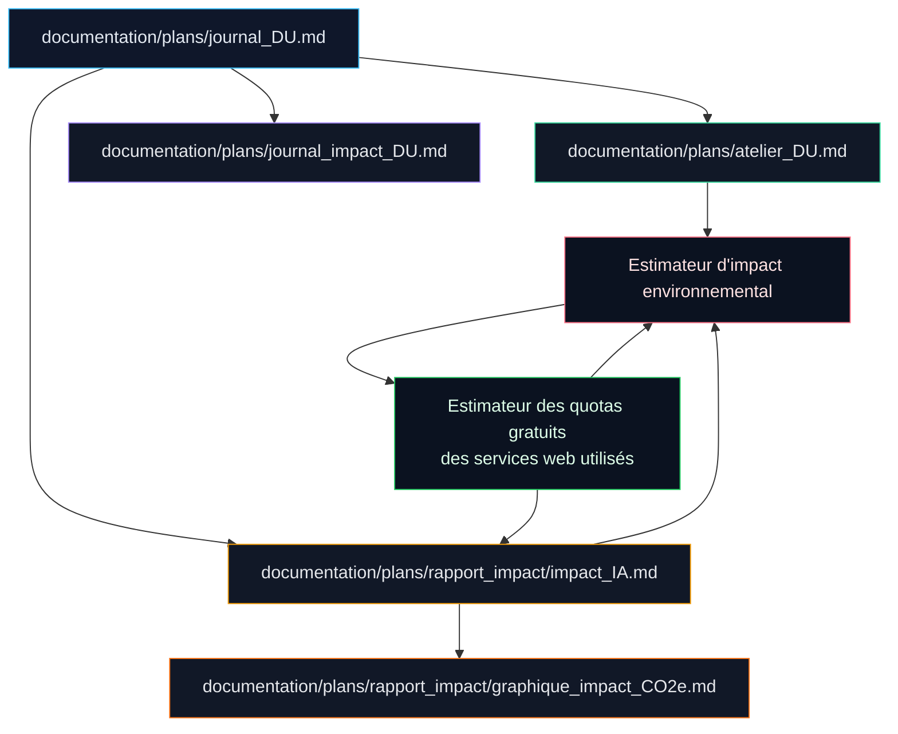

# Journal DU

Ce document sert de porte d'entrée courte vers le journal d'impact lié aux ateliers DU.

## Usage

- suivre les évolutions issues des ateliers;
- retrouver les décisions liées à la sobriété numérique;
- lire les ajouts qui ont été conservés dans le projet;
- disposer d'un résumé téléchargeable et partageable.

## Référence principale

Le journal détaillé et tenu à jour se trouve dans [journal_impact_DU.md](./journal_impact_DU.md).

## Schéma des liens

Le schéma suivant résume les relations entre les documents DU, le rapport d'impact IA, l'estimateur d'impact et l'estimateur des quotas gratuits des services web utilisés.

Lecture rapide:

- `journal_DU.md` sert d'index court.
- `atelier_DU.md` fixe les règles de lecture et de sobriété.
- `journal_impact_DU.md` conserve l'historique détaillé.
- `rapport_impact/impact_IA.md` est le rapport principal.
- `rapport_impact/graphique_impact_CO2e.md` documente la méthode du graphique.
- l'estimateur d'impact agrège les signaux du projet et alimente le rapport;
- l'estimateur des quotas gratuits aide à documenter les limites et hypothèses des services web utilisés.
