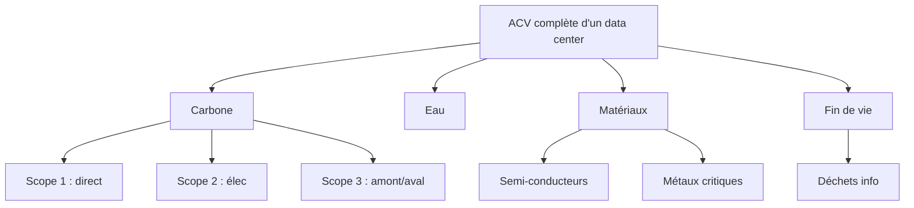

## Mise en perspective : IA et data centers

### Consommation actuelle des data centers

Avant l'essor massif de l'IA générative, les data centers représentaient déjà un poste énergétique significatif. Il est possible de retenir un ordre de grandeur d'environ **300 TWh/an** avant l'explosion des usages génératifs, même si cette valeur dépend du périmètre retenu : cloud, stockage, calcul scientifique, services web, streaming, réseaux internes et infrastructures associées.

L'AIE estime qu'en **2024**, les data centers ont consommé environ **415 TWh**, soit environ **1,5 % de l'électricité mondiale** [@aie_iea_2024]. Cette valeur montre que les data centers ne sont pas encore comparables aux grands secteurs historiques comme le transport ou l'élevage, mais qu'ils constituent déjà une infrastructure énergétique majeure. À titre d'ordre de grandeur, **415 TWh/an** correspondent presque à la consommation électrique annuelle de la France, qui s'établit autour de **449 TWh** en 2024 selon RTE [@rte_annual_review_2024_keyfindings].

La hausse récente ne vient pas uniquement de l'IA. Les usages numériques classiques continuent aussi de croître : cloud, stockage, vidéo, applications web, services logiciel en tant que service, calcul scientifique, cryptoactifs selon les périodes et infrastructures réseau. L'IA générative constitue toutefois un accélérateur très visible, car elle demande des serveurs spécialisés, des GPU, beaucoup de mémoire, du refroidissement et une alimentation électrique stable.

### Part estimée de l'IA dans cette consommation

La part exacte de l'IA dans la consommation électrique mondiale des data centers reste difficile à isoler. Les grands opérateurs ne publient pas toujours une séparation claire entre calcul IA, cloud classique, stockage, bases de données, streaming, services internes et autres charges numériques. Il faut donc raisonner par **ordre de grandeur** plutôt que par chiffre exact [@aie_iea_2024_1].

Une hypothèse prudente situe aujourd'hui l'IA autour de **10 à 15 %** de la consommation électrique mondiale des data centers. En retenant une consommation totale proche de **500 TWh/an** en 2025, cela correspondrait à environ **50 à 75 TWh/an** attribuables à l'IA.

Ce chiffre doit être compris comme une estimation méthodologique, non comme une mesure certifiée. Il est suffisamment faible pour rappeler que l'IA n'est pas encore le principal poste énergétique mondial, mais suffisamment élevé pour justifier une vigilance immédiate. **50 à 75 TWh/an**, c'est déjà l'ordre de grandeur de plusieurs fois la consommation énergétique annuelle totale de Paris, ou encore l'équivalent de la production annuelle de plusieurs réacteurs nucléaires.

### Scénarios de croissance à l'horizon 2030

Selon l'AIE, à l'horizon **2030**, la consommation électrique mondiale des data centers pourrait atteindre environ **1 000 TWh/an**, soit autour de **3 % de la demande électrique mondiale**. Cette trajectoire représenterait plus qu'un doublement par rapport au niveau de 2024.

Dans un scénario haut, l'IA pourrait représenter une part très importante de ce volume, par exemple autour de **50 %** de la consommation totale des data centers. Cela correspondrait à environ **500 TWh/an** attribuables à l'IA. Cette valeur serait donc comparable à la consommation électrique actuelle de l'ensemble des data centers autour de 2025.

Il serait cependant trop affirmatif de parler d'un plateau stable dès **2030**. La consommation liée à l'IA pourrait encore continuer à croître après cette date, notamment si les agents IA, la vidéo générative, l'automatisation du code, la bureautique augmentée, la recherche scientifique assistée et les usages industriels se généralisent. Une stabilisation semble plus plausible entre **2035 et 2045**, selon les contraintes économiques, énergétiques, matérielles et réglementaires.

À titre d'hypothèse prudente, il est possible d'envisager un plateau mondial de l'IA autour de **1 000 TWh/an** à plus long terme. Ce plateau ne serait pas seulement technique : il dépendrait du prix de l'électricité, des limites de raccordement au réseau, de la disponibilité des GPU, de l'efficacité des modèles, de la rentabilité réelle des usages, des règles imposées aux data centers et de la capacité des États à encadrer les infrastructures les plus énergivores.

### Tensions électriques locales et arbitrages d'infrastructure

L'implantation d'un data center dédié à l'intelligence artificielle ne soulève pas uniquement un enjeu de consommation énergétique globale annuelle. Elle génère également une demande de puissance électrique localisée très forte, souvent de l'ordre de plusieurs centaines de mégawatts pour les infrastructures géantes. Cette concentration géographique impose des défis techniques et politiques majeurs aux gestionnaires de réseau : création de nouvelles lignes à très haute tension, gestion des pics de charge, maintien de la stabilité de la fréquence, et renforcement général des infrastructures électriques [@rte_bilan_pr].

Par conséquent, même lorsque ces centres de données sont alimentés par une électricité fortement décarbonée (comme en France grâce au nucléaire et aux renouvelables), le problème se déplace sur le terrain de l'aménagement territorial et de la souveraineté. La disponibilité de la puissance électrique devenant une ressource rare, un arbitrage s'impose : la capacité électrique disponible doit-elle être allouée en priorité à la réindustrialisation du pays, à la décarbonation des transports, ou à l'hébergement de capacités de calcul pour l'IA ? [@aie_agence_internationale].

### Localisation climatique des data centers

Un même service numérique n'a pas le même impact selon que son data center est situé dans une région froide, tempérée, chaude, humide ou en stress hydrique. Le refroidissement, la consommation d'eau et les indicateurs de performance comme le PUE ou le WUE dépendent du climat local, du type d'installation et du niveau de densité de calcul. La géographie compte donc autant que le modèle utilisé.

Pour CleanMyMap, cela rappelle qu'un coût numérique ne peut pas être évalué uniquement à partir du code ou du volume de requêtes. Il faut aussi tenir compte du lieu d'hébergement, des conditions de refroidissement, de la pression sur l'eau et de la stabilité énergétique locale. Une même fonctionnalité peut donc avoir un impact très différent selon qu'elle s'appuie sur des infrastructures sobres ou sur des infrastructures situées dans des zones plus contraintes.

### Conflit d'usage du foncier

Les data centers occupent aussi du terrain, parfois à proximité de métropoles ou de zones industrielles stratégiques. Ce foncier pourrait être affecté à d'autres usages : logements, activités productives locales, renaturation, agriculture urbaine ou équipements publics. L'enjeu n'est pas toujours massif en surface, mais il devient réel dès qu'une implantation mobilise un sol rare ou bien situé.

Pour CleanMyMap, cela signifie qu'un data center ne doit pas être évalué seulement comme un objet technique, mais aussi comme un choix d'aménagement. Le coût spatial d'une infrastructure numérique entre alors en concurrence avec d'autres priorités territoriales, ce qui renforce l'idée d'un arbitrage entre utilité réelle et occupation de ressources rares.

### Chaleur fatale et valorisation locale

Les data centers rejettent une quantité importante de chaleur. Si cette chaleur n'est pas récupérée pour chauffer des bâtiments, des piscines, des serres ou des réseaux urbains, une partie de l'énergie consommée devient une chaleur perdue. L'impact réel dépend donc aussi de la capacité à valoriser cette chaleur localement.

Cette récupération n'efface pas la consommation initiale, mais elle peut en réduire le bilan net lorsque l'infrastructure est intégrée à un territoire capable de réutiliser l'énergie thermique. À l'inverse, un data center isolé, difficile à raccorder à un réseau de chaleur ou mal intégré à son environnement reste plus proche d'une dépense énergétique pure.

### Centres de données sous-marins : une piste de réduction énergétique encore expérimentale

Une piste explorée par certains acteurs consiste à modifier directement les conditions de refroidissement des centres de données. Microsoft a par exemple testé **Project Natick**, un prototype de datacenter sous-marin alimenté par des énergies renouvelables offshore, précisément pour étudier la faisabilité de ce type d'infrastructure dans un cadre réel. [Microsoft Research - Natick](https://www.microsoft.com/en-us/research/project/natick/?lang=fr-ca) ; [Microsoft Source](https://news.microsoft.com/source/features/sustainability/project-natick-underwater-datacenter/).

L'intérêt de ce type d'approche est simple : dans un centre de données, l'électricité ne sert pas seulement aux serveurs. Elle alimente aussi le refroidissement, la ventilation, les pompes, la conversion électrique, la sécurité et les systèmes de redondance. Le Département américain de l'Énergie rappelle d'ailleurs que le **PUE** compare l'énergie totale d'un site à l'énergie strictement informatique, ce qui montre bien que le "coût" d'un data center ne se limite pas aux machines de calcul [@doe_data_centers_servers].

Les centres sous-marins peuvent donc améliorer l'efficacité du refroidissement et réduire certains besoins en eau douce ou en climatisation classique. Mais ils restent expérimentaux et ne suppriment ni la chaleur rejetée dans l'environnement marin, ni les impacts de fabrication du matériel, ni la dépendance aux semi-conducteurs, ni la complexité de maintenance. Autrement dit, ils peuvent améliorer un poste de coût, pas abolir le coût global.

Pour CleanMyMap, l'enseignement est prudent : oui, l'industrie cherche à réduire l'empreinte de ses infrastructures, mais cette amélioration reste marginale si l'usage logiciel continue de croître sans discipline. Les gains les plus fiables restent donc la sobriété applicative, la limitation des fonctionnalités inutiles, la réduction du stockage et l'optimisation des parcours les plus coûteux.

### Compétition entre usages numériques utiles et inutiles

L'IA consomme une partie des capacités électriques, matérielles et cloud qui pourraient être utilisées pour d'autres services numériques : santé, recherche, transition énergétique, services publics, éducation. L'impact environnemental n'est donc pas seulement absolu, mais aussi lié à la question : à quels usages sont allouées les ressources rares ?

Dans un projet comme CleanMyMap, cette logique impose une discipline claire : l'IA ne se justifie que lorsqu'elle améliore réellement la coordination terrain, la qualité des données, la sécurité ou la sobriété du site. Une fonctionnalité séduisante mais peu utile peut détourner des ressources précieuses sans bénéfice social ou environnemental mesurable.

### Incertitude des crédits carbone et green cloud

Le fait qu'un fournisseur compense ses émissions ou achète de l'électricité renouvelable ne signifie pas toujours que l'électricité consommée à chaque instant est réellement bas carbone. Il faut distinguer l'énergie effectivement consommée localement, les contrats d'achat renouvelables, les certificats, les mécanismes de compensation et la réalité physique du réseau au moment de l'usage.

Autrement dit, un discours de type "green cloud" ne doit pas être lu comme une preuve automatique de sobriété. Pour CleanMyMap, la bonne lecture consiste à rester prudente sur les annonces de neutralité carbone et à privilégier les indicateurs concrets : localisation, PUE/WUE, consommation réelle, usages évités et utilité de la fonctionnalité.

### Comparaison avec d'autres secteurs

À l'échelle mondiale, le numérique représente environ **2 à 4 %** des émissions de CO₂e selon les études et les périmètres retenus. Certaines estimations récentes situent même les émissions incorporées des industries numériques autour de **4 %** des émissions mondiales lorsque les chaînes d'approvisionnement sont largement intégrées.

Par comparaison, le **transport routier** représente environ **15 %** des émissions mondiales de CO₂, puisque le transport représente environ un cinquième des émissions mondiales et que la route en constitue environ les trois quarts. L'**élevage** représente quant à lui environ **14,5 %** des émissions anthropiques mondiales de gaz à effet de serre selon l'estimation classique de la FAO.

L'IA n'est donc pas encore un poste comparable aux secteurs historiques comme le transport routier ou l'élevage. Son impact direct reste plus faible en part mondiale. Le véritable enjeu est sa **dynamique de croissance** : la consommation liée aux data centers et aux charges IA augmente beaucoup plus vite que celle de nombreux autres secteurs. Il faut donc surveiller l'IA non parce qu'elle serait déjà le principal problème climatique mondial, mais parce que sa trajectoire peut devenir significative si les usages se généralisent sans sobriété, sans efficacité énergétique et sans gouvernance claire.

La conclusion à retenir est donc nuancée : l'IA n'est pas encore un secteur énergétique dominant à l'échelle mondiale, mais elle devient un poste structurant de la croissance électrique future. Dans un projet comme CleanMyMap, cette analyse justifie une règle de proportion : utiliser l'IA seulement lorsqu'elle apporte un gain réel de qualité, de coordination ou d'utilité terrain, et refuser les usages décoratifs, redondants ou trop coûteux.

### Tableau récapitulatif des ordres de grandeur

| Repère                                                     | Consommation électrique | Comparaison simple                                           |
| ---------------------------------------------------------- | ----------------------: | ------------------------------------------------------------ |
| Data centers avant l'essor massif de l'IA générative       |          **300 TWh/an** | **2/3** de la consommation électrique française              |
| Data centers mondiaux autour de 2025                       |          **500 TWh/an** | **1 année** de consommation électrique française             |
| Part estimée de l'IA aujourd'hui                           |      **50 à 75 TWh/an** | Plusieurs fois la consommation énergétique annuelle de Paris |
| Data centers mondiaux vers 2030                            |        **1 000 TWh/an** | Environ **2 fois** la consommation électrique française      |
| Part IA possible dans un scénario haut vers 2030           |          **500 TWh/an** | Comparable à la consommation électrique française actuelle   |
| Plateau IA possible à long terme                           |        **1 000 TWh/an** | Environ **2 fois** la consommation électrique française      |
| Production annuelle d'un réacteur nucléaire d'environ 1 GW |        **7 à 8 TWh/an** | **500 TWh/an** = plusieurs dizaines de réacteurs nucléaires  |

Ces comparaisons ne signifient pas que l'IA "consomme une France" aujourd'hui. Elles servent à donner une échelle. En 2025, la part propre à l'IA reste probablement inférieure à la consommation totale des data centers. En revanche, dans un scénario haut à l'horizon 2030, l'IA pourrait atteindre un volume électrique comparable à celui d'un grand pays industrialisé.

Il faut aussi distinguer puissance et énergie. Dire qu'un data center atteint **1 GW** de puissance signifie qu'il appelle une puissance instantanée comparable à un gros réacteur nucléaire. Mais si cette puissance est utilisée toute l'année, elle représente environ **8,8 TWh/an** avant prise en compte du facteur de charge. C'est pourquoi quelques grands sites industriels peuvent avoir un impact local très fort sur le réseau électrique, même si leur poids mondial reste limité en pourcentage.

## Empreinte matérielle de l'IA

### GPU, serveurs, semi-conducteurs et stockage

L'IA accentue la demande en matériel spécialisé (GPU NVIDIA, TPU Google), serveurs haute densité et stockage rapide, augmentant la pression sur la fabrication des semi-conducteurs.

### Métaux critiques et chaînes d'approvisionnement

La fabrication dépend de chaînes complexes : la Chine raffine par exemple **95 % du gallium** mondial. La demande des data centers pourrait peser 10 % de l'offre de certains métaux critiques d'ici 2030.

### Obsolescence accélérée du matériel IA

La course à la puissance de calcul propre à l'intelligence artificielle entraîne une réduction significative de la durée de vie utile des équipements en centre de données. Afin d'intégrer les dernières générations d'accélérateurs et de puces IA, les serveurs sont fréquemment renouvelés sur des cycles très courts (3 à 5 ans), ce qui alourdit considérablement l'impact environnemental lié à leur phase de fabrication rapporté à leur durée d'usage effective [@iea_electricity_2024].

Par ailleurs, l'écosystème de l'IA générative pousse à un renouvellement matériel mondial pour supporter des architectures toujours plus denses, exigeant des innovations constantes (nouvelles générations de GPU, mémoire HBM, refroidissement liquide, racks de haute densité). Même si l'usage marginal d'un projet individuel comme CleanMyMap apparaît faible, il s'inscrit dans cette demande collective qui stimule un cycle industriel d'obsolescence prématurée. L'empreinte matérielle du projet ne se limite donc pas à l'énergie consommée pour « utiliser un serveur » ponctuellement, mais inclut sa part contributive à cette accélération du renouvellement matériel global [@google_measuring_the].

### Déchets électroniques et fin de vie

Le monde a produit **62 millions de tonnes** de déchets électroniques en 2022. Seulement **22,3 %** sont collectés et recyclés correctement, posant des risques sanitaires et environnementaux majeurs.

## Analyse de cycle de vie et scopes carbone

### Différence entre scopes 1, 2, 3 et ACV

L'ACV mesure l'impact du berceau à la tombe. Les **Scopes 1 et 2** couvrent les émissions directes et l'électricité, tandis que le **Scope 3** (souvent majoritaire) inclut la fabrication des serveurs, le transport et la fin de vie.

### Fabrication, transport, maintenance et fin de vie

Pour l'IA, la phase de fabrication est critique car elle mobilise des processus industriels énergivores et gourmands en eau ultra-pure.

### Redondance cloud, sauvegardes, réplication et stockage

La haute disponibilité (Multi-AZ) et la redondance des données multiplient l'empreinte matérielle. Pour CleanMyMap, l'usage de Supabase (PostgreSQL) et Vercel implique :

- **Réplication** : La duplication des données sur plusieurs zones de disponibilité peut doubler la consommation électrique liée au stockage et au calcul de synchronisation.
- **Sauvegardes (Backups)** : Les snapshots réguliers créent une accumulation de données "froides" qui, bien que moins énergivores à la lecture, pèsent sur l'impact matériel à long terme du data center.
- **Data Transfer** : La réplication inter-régionale (si activée) ajoute un coût réseau significatif en raison des transferts de données permanents.

Cette redondance ne se limite pas aux copies visibles dans l'application. Le cloud repose aussi sur des environnements aperçu, staging, logs, CDN et mécanismes de haute disponibilité qui maintiennent plusieurs versions d'un même contenu ou d'un même état technique. Ton site peut n'afficher qu'un seul fichier, mais l'infrastructure peut en conserver plusieurs copies synchronisées. L'empreinte réelle est donc souvent supérieure au poids apparent des données.

### Limites d'une ACV simplifiée appliquée à CleanMyMap

Les estimations fondées uniquement sur l'électricité sont incomplètes. L'ACV peut fortement augmenter le bilan, mais manque souvent de données fournisseurs transparentes sur le matériel spécifique à l'IA.

## Impacts environnementaux indirects ou sous-estimés

### CI/CD, compilations, aperçus et déploiements

Chaque push déclenche des jobs GitHub (lint, tests, compilations) consommant du calcul serveur. CleanMyMap utilise des filtrages de chemins pour limiter ces coûts inutiles.

Le coût environnemental des environnements de développement est souvent sous-estimé. Les compilations, les tests, les aperçus Vercel, GitHub Actions, le lint, le typecheck, les déploiements ratés, les branches temporaires et les agents IA qui relancent des commandes peuvent devenir un poste réel dès qu'une petite modification déclenche une chaîne complète. Dans un projet en développement rapide, il faut donc éviter de transformer chaque micro-changement en cycle CI/CD lourd.

### Données dormantes, logs, caches et backups

Le stockage durable des photos terrain sur Supabase et les logs mesure d'audience (PostHog/Sentry) créent une empreinte persistante même en l'absence de trafic utilisateur.

Cette persistance ne concerne pas seulement les photos ou les fichiers visibles. Elle inclut aussi les logs, les embeddings, les caches, les snapshots, les mesures d'audience, les versions de modèles, les métriques et les traces de débogage. Une grande partie de ces données est conservée "au cas où", ce qui crée un stock numérique qui s'accumule dans le temps même lorsqu'il n'apporte plus de valeur directe au projet.

Le coût réel vient souvent de la répétition des copies et des durées de rétention. Une donnée peu utile peut être dupliquée dans plusieurs services, archivée dans des backups, recopiée dans des systèmes d'observabilité puis conservée plusieurs années. Pour CleanMyMap, cela signifie qu'une politique de rétention stricte est aussi importante que la limitation du volume initial.

### Terminaux utilisateurs

L'impact ne s'arrête pas au serveur. La consultation des cartes interactives (Leaflet) sur les terminaux utilisateurs (smartphones, ordinateurs) consomme de l'énergie :

- **Rendu client** : L'affichage et le déplacement sur la carte sollicitent le CPU et le GPU du terminal pour le rendu des tuiles et des éléments vectoriels.
- **Consommation** : Un smartphone en navigation web active consomme environ 1 à 3 Watts. L'usage intensif de cartes interactives peut augmenter cette consommation de 20 à 30 % par rapport à une page statique.
- **Obsolescence logicielle** : Des interfaces trop lourdes peuvent ralentir les anciens terminaux, incitant indirectement à leur renouvellement prématuré.

Le site peut donc rester sobre côté serveur tout en étant lourd côté utilisateur. Vieux téléphones qui chauffent, batterie consommée, données mobiles mobilisées, JavaScript important, rendu de carte et animations créent une empreinte diffusée chez les utilisateurs, donc moins visible dans le bilan cloud. Dans un rapport honnête, il faut considérer cette dépense côté terminal comme une partie réelle du coût numérique.

### Usage mobile : GPS, photos, réseau 4G/5G

Lors d'un signalement sur le terrain, plusieurs composants physiques sont sollicités :

- **GPS (GNSS)** : La puce de géolocalisation est très énergivore (~50-150 mW en mode actif) car elle nécessite un verrouillage satellitaire constant. Le rafraîchissement continu de la position pour le suivi de trajet aggrave cet impact par rapport à une géolocalisation ponctuelle.
- **Traitement d'images** : Le capteur optique et l'ISP (Image Signal Processor) sollicitent une puissance de calcul importante pour la mise au point, l'exposition et la compression (HEIF/JPEG). Plus la résolution augmente, plus le traitement en temps réel par le processeur neuronal du smartphone est intensif.
- **Réseau mobile** : L'envoi de photos haute résolution via 4G ou 5G consomme environ 0,1 à 0,2 kWh par Go de données transférées. La 5G est plus efficace par bit, mais l'effet rebond lié à l'augmentation de la taille des fichiers photos peut annuler ce gain en énergie totale consommée par session de transfert.

La consultation sur réseau mobile, surtout avec cartes et images, peut aussi être plus énergivore qu'une consultation via fibre ou Wi-Fi. Pour des bénévoles en extérieur, l'usage terrain se fait justement souvent en 4G ou 5G, avec GPS, appareil photo et carte interactive. L'impact n'est donc pas seulement côté serveur ou cloud : il est aussi distribué dans les conditions réelles d'usage.

Une application de cleanwalk ne mobilise pas seulement du cloud. Elle sollicite aussi les capteurs du téléphone, l'écran lumineux en extérieur, la localisation continue éventuelle et l'upload de photos. Sur mobile, ces usages peuvent être plus significatifs qu'une simple page web textuelle. Pour CleanMyMap, cela justifie de limiter les parcours superflus, de compresser les médias, d'éviter les rechargements inutiles et de ne pas supposer que l'usage terrain sera "gratuit" parce qu'il se déroule hors bureau.

### Surproduction fonctionnelle facilitée par l'IA

L'IA permet de coder plus vite, ce qui incite à multiplier les routes API (57 actuellement) et les composants client (237), augmentant le poids du bundle et la surface de maintenance.

Cet effet crée un véritable **prototype permanent** : il devient facile de produire beaucoup de fonctionnalités avant même de savoir si elles seront réellement utilisées. Le résultat est une dette environnementale par surproduction logicielle, avec plus de pages, plus de composants, plus de dépendances, plus de maintenance et plus de surface à héberger.

Le problème n'est pas seulement l'ajout de fonctionnalités. C'est la complexité inutile qu'elles créent lorsqu'elles ne sont pas reliées à un usage concret. Dans CleanMyMap, l'IA doit donc être évaluée comme un accélérateur sous contrainte : si elle permet de livrer plus vite sans alourdir le périmètre, elle peut être utile ; si elle favorise l'empilement de modules non utilisés, elle augmente une dette écologique purement liée à la complexité.

L'effet rebond est ici spécifique : la baisse du coût de production logicielle augmente la production logicielle. Plus le développement devient accessible, plus il devient tentant de lancer des prototypes, des variantes et des fonctionnalités qui s'additionnent sans toujours être retenues. À l'échelle du web, cette accessibilité technique peut donc augmenter le nombre total de projets numériques créés, même si chaque projet pris isolément paraît modeste.

## Synthèse environnementale

### Impact faible en ordre de grandeur, mais non nul

Avec environ 10 à 20 kgCO₂e pour le développement, l'impact est comparable à **200 km de voiture**. Ce coût est "acceptable" si le projet déclenche une dépollution réelle supérieure.

### Risque principal : trajectoire de croissance, accumulation des usages et dette environnementale

Le risque majeur n'est pas le coût d'une requête, mais l'accumulation de services logiciel en tant que service (Vercel, Supabase, Clerk, Stripe, etc.) et de fonctionnalités secondaires qui finissent par créer une dette écologique structurelle.

### Conditions de soutenabilité

Pour rester soutenable, CleanMyMap doit garder une ligne simple : sobriété technique, limitation des fonctionnalités inutiles, choix de modèles efficaces, suivi des usages et arbitrage systématique selon l'utilité réelle. L'IA n'est justifiable que si elle améliore concrètement le service, la coordination ou la qualité du projet plus qu'elle n'augmente sa complexité, sa dépendance et son impact global.
