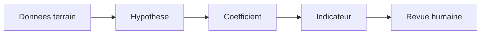

# Protocole scientifique

Ce document definit la methode de calcul des indicateurs utilises par CleanMyMap.
Les indicateurs sont des proxys de lecture et de pilotage, pas une mesure scientifique absolue.

## Comptabilité environnementale CleanMyMap

Le vocabulaire de statut est strictement limité à `OBSERVED`, `DERIVED`,
`DECLARED`, `ASSUMPTION`, `PROXY` et `NA`. Une activité observée ou dérivée ne
devient pas un impact physique sans mesure ou facteur audité : elle est alors
affichée comme activité + `NA`.

La période projet va de mi-février à septembre 2026. La fenêtre auditée des
services va du 18 mars au 18 septembre 2026; l'usage des services antérieur au
18 mars est `UNKNOWN / NOT AUDITED`.

Le modèle central utilise 35 Md token-équivalent (`DECLARED + ASSUMPTION`) et
retient comme proxys 10,5 MWh, 3,675 tCO2e électrique et 47,5 m³ d'eau
indirecte (affichés ≈10 MWh, ≈3,7 tCO2e et ≈45 m³). L'ACV partielle est de
4,8 tCO2e (affichée ≈5 tCO2e, `ASSUMPTION + PROXY`). L'usage exact ChatGPT
hors Codex, l'énergie/CO2e/eau des quelque 130 images et les impacts physiques
des services SaaS restent `NA` faute d'audit exploitable. Aucun token n'est
reconstruit à partir d'heures, et aucune valeur `NA` n'est convertie en zéro.

## Schema de travail

## Principes

- chaque coefficient doit avoir une source ou une justification explicite ;
- les formules doivent rester simples, reproductibles et auditable ;
- une hypothese doit etre marquee comme hypothese ;
- un changement de coefficient doit etre trace dans la documentation technique partagee ;
- les indicateurs doivent aider a comparer des actions, pas a pretendre mesurer tout l'impact environnemental du monde.

## Indicateurs retenus

### Eau preservee

Hypothese prudente : un megot peut polluer entre 500 et 1000 litres d'eau.

Formule de travail :

`Eau_preservee (L) = Nombre_megots x 500`

### CO2 evite

L'effet est estime a partir du poids des dechets collectes et d'un coefficient de matiere.

Formule de travail :

`CO2_evite (kg) = Poids_dechets (kg) x Coefficient_matiere`

### Surface nettoyee

La surface est une proxy utile quand le poids seul ne raconte pas toute l'action.

Formule de travail :

`Surface (m2) = (Poids (kg) x 15) + (Temps (min) x 2)`

### Score de pollution

Le score sert a comparer des zones entre elles et a prioriser des actions.

Sur la carte d'actions, ce score reste un score historique constaté avant l'action. Il ne doit pas être présenté comme une mesure actuelle ni être augmenté par un malus temporel additif. La carte applique une projection non linéaire de re-pollution documentée dans [`methodologie-carte-actions.md`](./methodologie-carte-actions.md), sans modifier le score historique.

Formule de travail :

Pour chaque mesure renseignée, chaque composante est normalisée par le nombre
de bénévoles selon le dénominateur historique sûr `max(1, volunteersCount)` :

`intensite_dechets = masse_dechets_kg / nombre_benevoles`

`intensite_megots = nombre_megots / nombre_benevoles`

Chaque intensité est rapportée à la référence maximale de sa composante puis
bornée entre 0 et 100. Le score historique est le maximum des composantes
disponibles ; une métrique absente n'est pas assimilée à zéro et, si aucune
composante n'est exploitable, le score est indisponible.

La population de référence correspond au contrat de la carte versionné avant
`77e72b0b` : actions `approved`. La frontière publique actuelle conserve en
plus `moderation_visibility = 'visible'`, conformément au contrat de sécurité
des surfaces publiques ; cette restriction est contemporaine et ne doit pas
être présentée comme une règle scientifique pré-77. Aucun filtre supplémentaire
sur `duration_minutes`, `action_phase` ou `action_date` n'est autorisé dans la
population de référence. Le scorer TypeScript reste une fonction de calcul et
ne filtre pas `actionType`, `status`, `actionPhase` ou `durationMinutes`.

La recherche menée dans le dépôt ne trouve aucune décision canonique autorisant
une normalisation par bénévole-heure ; cette formule n'est donc pas consacrée.
La migration append-only
`20260913000009_restore_pre77_pollution_reference_population.sql` aligne la
RPC V2 globale et départementale sur cette population, sans modifier la
formule par bénévole ni supprimer les références départementales.

## Gouvernance

- revoir les coefficients a intervalle fixe ;
- documenter la source de chaque changement ;
- garder une trace des hypothèses dans un seul endroit ;
- refuser toute presentation qui ferait croire a une precision artificielle.

### Fiabilité et auditabilité des indicateurs

- effectuer périodiquement une revue des métriques et de leurs coefficients ;
- réaliser des contrôles de cohérence entre les données déclaratives, les
  preuves disponibles et les indicateurs consolidés ;
- distinguer explicitement les sources terrain, numériques, mesurées, dérivées
  et proxy avant toute interprétation ;
- conserver des exports auditables (notamment CSV ou JSON) des métriques
  consolidées ;
- tracer les coefficients, hypothèses, changements et anomalies qui influencent
  un indicateur ou une alerte d'intégrité.

Le runtime calcule actuellement `dataIntegrityPriority` à partir de
`anomaliesCount`. Ce protocole ne définit donc pas de seuil implémenté de
« 10 tonnes pour un individu ».

### Empreinte numérique et électricité

Le moteur d'empreinte numérique conserve la séparation entre valeur mesurée, valeur dérivée et proxy. La conversion électrique ne s'effectue que dans le sens `kWh réel × facteur électrique`; en l'absence de kWh, l'interface utilise le libellé `équivalent électrique estimé` et conserve le CO₂e proxy sans reconstruire de kWh par division. Une donnée absente reste `à compléter`.

Le facteur par défaut configurable est `0,35 kgCO₂e/kWh` pour des serveurs majoritairement américains, avec [EPA eGRID](https://www.epa.gov/egrid) et [EIA](https://www.eia.gov/tools/faqs/faq.php?id=74&t=11) comme références de cadrage. Il doit être remplacé par un facteur régional lorsque la localisation électrique réelle est connue. La ventilation du refroidissement reste prudente: environ 7 % dans certains hyperscalers efficaces à plus de 30 % dans des installations moins efficaces selon [IEA Energy and AI](https://www.iea.org/reports/energy-and-ai/energy-demand-from-ai). Les serveurs accélérés principalement associés à l'IA sont décrits comme un moteur de croissance, sans attribuer de part IA inconnue à CleanMyMap.

## Lecture correcte

Le protocole n'a pas pour but de sur-vendre l'impact. Il sert a rendre l'impact comparable, discutable et ameliorable.

## Attribution individuelle post-action

Les participations finales proviennent exclusivement de `action_participants`.
Une mesure individuelle saisie par l'organisateur autorisé de l'action ou par
un administrateur reste une observation brute attachée à la participation :
masse de déchets hors mégots, condition et méthode ; nombre de mégots et/ou
masse, condition et provenance. Une mesure `NULL` n'est pas un zéro, et une
valeur dérivée ne remplace jamais la valeur brute.

La quote-part additive est conservatrice : les participations confirmées
mesurées utilisent leur mesure exacte ; les confirmés non mesurés se partagent
uniquement `totalAction - somme(mesures exactes)`. Si le total collectif est
inconnu, les mesures connues restent disponibles et les autres valeurs sont
`NA`. Un dépassement du total connu est une incohérence, sans reliquat négatif,
et bloque l'éligibilité à de nouveaux crédits Mohs pour la métrique concernée.

Pour la gamification uniquement, la masse brute de déchets reçoit l'hypothèse
versionnée `impact-terrain-2026-waste-moisture-v1` : `sec = 1,0`, `humide =
0,7`, `mouille = 0,4`. L'équivalent sec est donc `masse_brute × facteur` ; il
ne modifie ni la masse collective ni les rapports. Les mégots réutilisent le
moteur canonique `2500 mégots/kg`, avec les mêmes facteurs d'état ; un nombre
compté explicitement est prioritaire sur toute conversion de masse.
