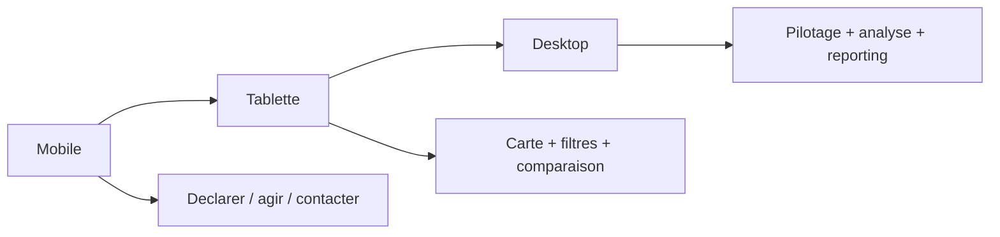

# Coherence mobile first

La priorite est de garder les actions essentielles lisibles et rapides sur petit ecran.

## Hiérarchie par support

## Règles principales

- sur mobile, les CTA critiques doivent rester en pleine largeur ;
- les surfaces denses doivent se replier en une seule colonne si elles degradent la comprehension ;
- au-dela de deux colonnes, il faut une vraie raison produit ;
- les tableaux doivent rester lisibles sans zoom ;
- une carte ne doit jamais empecher l'acces au geste principal ;
- les titres doivent rester courts et tenir sur une seule ligne si possible.

## Ce qu'on attend d'une page bien coherente

1. on comprend en moins de 10 secondes ce qu'on peut faire ;
2. on sait ou cliquer ;
3. on ne perd pas le contexte en revenant en arriere ;
4. la version desktop enrichit sans contredire la version mobile.

