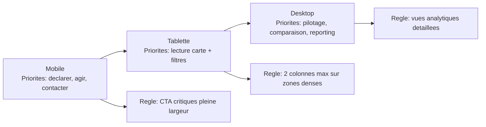

# Coherence mobile first

## Schema responsive mobile -> tablette -> desktop

Fallback statique:
```md

```

- Prioriser les flux critiques sur mobile (declarer, agir, contacter, rejoindre).
- CTA pleine largeur quand pertinent.
- Tables/graphes avec fallback lisible sur petits ecrans.
