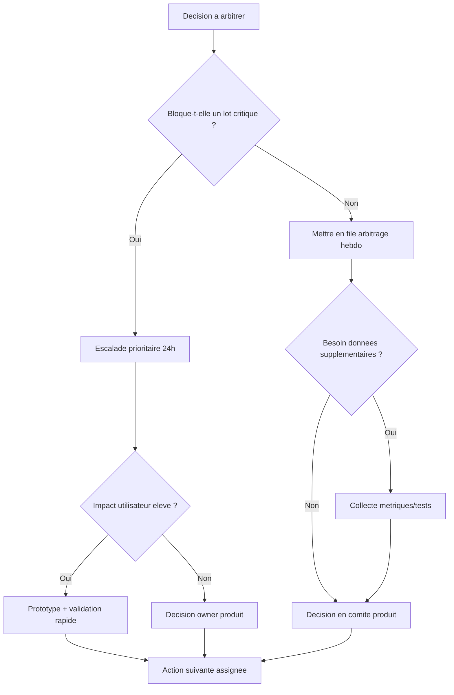

# Decisions en attente

## Decision tree des arbitrages produit

Fallback statique:
```md

```

## A arbitrer
- Niveau de priorisation des recommandations proactives Itineraire IA.
- Strategie d'ouverture API externe (quota, auth, format).
- Cadre de calibration des proxys d'impact par territoire.
