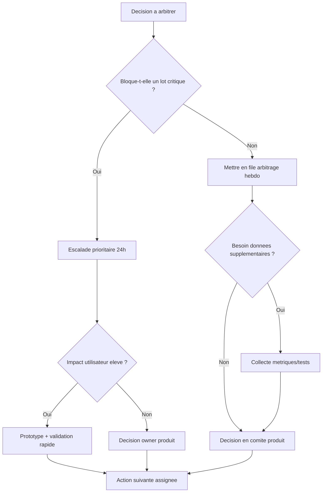

# Decisions en attente

## Decision tree des arbitrages produit

```mermaid
flowchart TD
  A[Decision a arbitrer] --> B{Bloque-t-elle un lot critique ?}
  B -- Oui --> B1[Escalade prioritaire 24h]
  B -- Non --> C[Mettre en file arbitrage hebdo]
  B1 --> D{Impact utilisateur eleve ?}
  D -- Oui --> D1[Prototype + validation rapide]
  D -- Non --> D2[Decision owner produit]
  C --> E{Besoin donnees supplementaires ?}
  E -- Oui --> E1[Collecte metriques/tests]
  E -- Non --> F[Decision en comite produit]
  D1 --> G[Action suivante assignee]
  D2 --> G
  E1 --> F
  F --> G
```
Fallback statique:
```md

```

## A arbitrer
- Niveau de priorisation des recommandations proactives Itineraire IA.
- Strategie d'ouverture API externe (quota, auth, format).
- Cadre de calibration des proxys d'impact par territoire.
- Ordre final des priorites DU selon le calendrier reel de livraison.
- Niveau de profondeur attendu pour le module data quality.
- Perimetre exact du PDF web complet attendu pour validation academique.
- Seuils minimaux de qualite et de performance pour cloturer chaque lot critique.

## Chantier futur — rôles scientifique et entreprise

**Statut : `PLAN / ARBITRAGE OUVERT` — non implémenté.**

Le runtime actuel utilise principalement `scientifique` et `entreprise` comme
parcours UX personnalisés. Cette solution est acceptable à court terme, mais
ne tranche pas encore si ces rôles doivent recevoir une personnalisation plus
profonde, des surfaces dédiées, des projections adaptées ou des capacités
serveur spécifiques. Le choix inverse — les maintenir comme parcours UX sans
privilège particulier — reste également ouvert.

La décision doit rester séparée entre `GRANTED_ROLE`, `ACTIVE_ROLE`, la
structure éventuellement représentée et le parcours UX. Une navigation, un
CTA, un libellé ou une page proposée à un parcours ne crée aucun droit serveur.
Les capacités potentielles sont à étudier dans
[`authorization-capabilities.md`](../security/authorization-capabilities.md),
qui reste une source `PLAN / TARGET`, et non dans le contrat runtime courant.

### Personnalisation future de `ACTIVE_ROLE=scientifique`

Question produit :

```txt
Que doit apporter concrètement ACTIVE_ROLE=scientifique
au-delà d’une navigation orientée analyse ?
```

Axes d’étude pour l’expérience utilisateur :

- accueil orienté analyse plutôt que terrain ;
- accès prioritaire à Rapports, Open Data et Méthodologie ;
- visualisations scientifiques plus détaillées ;
- indicateurs de qualité des données ;
- provenance, incertitudes, couverture et limites méthodologiques ;
- comparaison temporelle et territoriale ;
- exports adaptés à l’analyse ;
- accès facilité aux protocoles et métadonnées.

Une permission ne pourra être envisagée qu’après avoir défini la donnée
concernée, la finalité, le niveau d’agrégation, la minimisation,
l’anonymisation ou pseudonymisation nécessaire, le scope, la justification
métier et le contrôle serveur. Des capacités telles que :

```txt
analytics.view_sanitized
analytics.export_sanitized
```

restent donc des hypothèses à arbitrer, sans activation automatique pour le
rôle scientifique. Par défaut, ce rôle ne doit pas recevoir d’accès aux
emails, identifiants Clerk bruts, messages privés, coordonnées personnelles
inutiles, fonctions de modération ou modifications des contributions d’autrui.

### Personnalisation future de `ACTIVE_ROLE=entreprise`

Question produit :

```txt
Que doit apporter concrètement ACTIVE_ROLE=entreprise
à un représentant d’entreprise ou partenaire ?
```

Axes d’étude pour l’expérience utilisateur :

- accueil orienté partenariat, mécénat et impact ;
- suivi des actions soutenues ;
- synthèse d’impact adaptée ;
- portail partenaire réellement contextualisé ;
- actions ou campagnes liées à l’organisation ;
- rapports ESG/impact pertinents ;
- identification des opportunités de soutien ;
- relations avec associations et territoires.

Le rôle `entreprise` ne prouve jamais à lui seul l’appartenance à une
organisation et ne donne aucun accès aux ressources privées d’une société. Toute
future capacité privée devra reposer sur une relation canonique vérifiée :

```txt
user
+
organization_membership vérifiée
+
capacité
+
scope organization
→ accès
```

L’arbitrage devra préciser la donnée, la finalité, le niveau de projection, la
minimisation, le scope et le contrôle serveur correspondants. En l’absence de
relation organisationnelle persistée, aucune capacité privée, pouvoir sur une
autre organisation ou visibilité propre à un « réseau » ne doit être déduit du
parcours.

### Critères de clôture du futur chantier

Avant toute implémentation, la décision devra distinguer explicitement :

1. les éléments de parcours UX et de personnalisation d’interface ;
2. les surfaces produit réellement nécessaires ;
3. les projections de données autorisées et leurs limites ;
4. les capacités serveur éventuelles, chacune avec son scope et son garde ;
5. les données et pouvoirs explicitement exclus.

La clôture de cet arbitrage ne devra ajouter aucun privilège implicite à
`scientifique` ou `entreprise` et ne devra pas transformer un rôle ou un CTA en
relation organisationnelle persistée.
