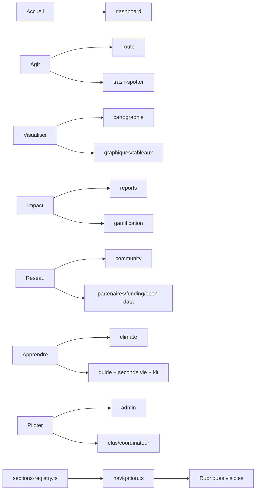

# Matrice rubriques

## Vue architecture blocs -> rubriques

Fallback statique:
```md

```

## Blocs cibles
- Accueil: formulaire benevole + parametres de compte
- Agir: itineraire IA, trash spotter
- Visualiser: cartographie + graphiques/tableaux dynamiques
- Impact: rapports d'impact, classement
- Reseau: discussion, partenaires engages, donnees ouvertes, financement/sponsoring
- Apprendre: developpement durable, guide pratique, seconde vie, kit terrain
- Piloter: admin, elus, coordinateur

## Source technique
- `apps/web/src/lib/sections-registry.ts`
- `apps/web/src/lib/navigation.ts`
