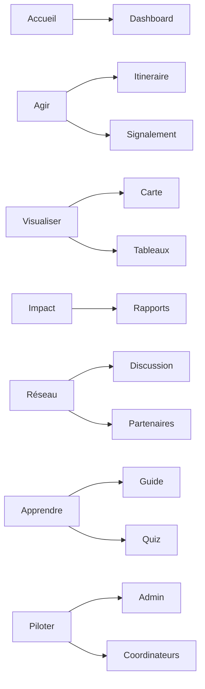

# Matrice rubriques

## Vue d'ensemble

## Correspondance bloc -> usage

| Bloc | Rôle principal | Sortie attendue |
| --- | --- | --- |
| Accueil | Entrée rapide | voir, agir, reprendre |
| Agir | Passage a l'action | declaration, itineraire, signalement |
| Visualiser | Lecture territoriale | carte, filtres, comparaison |
| Impact | Preuve et synthese | rapport, bilan, export |
| Réseau | Mise en relation | discussion, partenaires, relais locaux |
| Apprendre | Onboarding utile | guide, ressources, mini-contenu |
| Piloter | Gouvernance | moderation, controle, arbitrage |

## Source technique

- `apps/web/src/lib/sections-registry.ts`
- `apps/web/src/lib/navigation.ts`

## Regle de maintenance

Quand un bloc change, mettre a jour cette matrice en meme temps que le registre de sections. La matrice n'est pas un commentaire : c'est un contrat de navigation.

