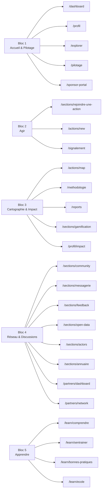

# Matrice rubriques

## Structure en 5 blocs (homepage)

```mermaid
flowchart LR
  B1["Bloc 1\nAccueil & Pilotage"]
  B2["Bloc 2\nAgir"]
  B3["Bloc 3\nCartographie & Impact"]
  B4["Bloc 4\nRéseau & Discussions"]
  B5["Bloc 5\nApprendre"]

  B1 --> DASH["/dashboard"]
  B1 --> PROFIL["/profil"]
  B1 --> EXPLORER["/explorer"]
  B1 --> PIL["/pilotage"]
  B1 --> SPONSOR["/sponsor-portal"]

  B2 --> FORM["/sections/rejoindre-une-action"]
  B2 --> NEW["/actions/new"]
  B2 --> SIGNAL["/signalement"]

  B3 --> MAP["/actions/map"]
  B3 --> METHODO["/methodologie"]
  B3 --> REP["/reports"]
  B3 --> BADGES["/sections/gamification"]
  B3 --> IMPACT["/profil/impact"]

  B4 --> COMM["/sections/community"]
  B4 --> MSG["/sections/messagerie"]
  B4 --> FEEDBACK["/sections/feedback"]
  B4 --> OPENDATA["/sections/open-data"]
  B4 --> ACTORS["/sections/actors"]
  B4 --> ANNUAIRE["/sections/annuaire"]
  B4 --> PARTNERS["/partners/dashboard"]
  B4 --> PARTNERS_ALIAS["/partners/network"]

  B5 --> COMPRENDRE["/learn/comprendre"]
  B5 --> QUIZ["/learn/sentrainer"]
  B5 --> PRATIQUES["/learn/bonnes-pratiques"]
  B5 --> ECOLE["/learn/ecole"]
```

## Familles autonomes

- Auth & Onboarding : `/sign-in`, `/sign-up`, `/onboarding`, `/onboarding/localisation`
- Institutionnel & Légal : `/contact`, `/conditions-*`, `/mentions-legales`, `/politique-*`, `/en`
- Système & Utilitaires : `/reglages`, `/form-comparison`, `/preview/actions/new`, `/error/429`
- Admin & Super-admin : `/admin`, `/admin/forms`, `/admin/services`, `/admin/godmode`
- Print & Export : `/prints/report`

## Correspondance bloc -> usage

| Bloc | Teinte | Rôle principal | Sortie attendue |
|---|---|---|---|
| Accueil & Pilotage | `amber` / `brun` | Entrée personnelle + gouvernance | reprendre, piloter, administrer |
| Agir | `emerald` | Passage à l'action terrain | rejoindre une action, créer une action, signaler un déchet |
| Cartographie & Impact | `sky` / `red` | Lecture territoriale + preuve | carte, rapports, méthodologie, badges |
| Réseau & Discussions | `indigo` | Mise en relation | partenaires, messagerie, open data, communauté |
| Apprendre | `yellow` | Montée en compétence | point de départ, quiz, guides, école |

## Blocs fusionnés (ancienne structure)

| Ancien bloc | Fusionné dans |
|---|---|
| Piloter | Bloc 1 — Accueil & Pilotage |
| Impact | Bloc 3 — Cartographie & Impact |
| Discussion | Bloc 4 — Réseau & Discussions |

## Source technique

- `apps/web/src/lib/navigation.ts`
- `documentation/pages_site/INDEX.md`

## Routes canoniques et alias

Le bloc Agir expose exactement trois entrées utilisateur :
`/sections/rejoindre-une-action`, `/actions/new` et `/signalement`. Les routes
`/missions/[id]` et `/actions/history` restent accessibles pour leurs
workflows et liens existants, mais ne sont pas des rubriques primaires du
bloc. Les moteurs itinéraire et météo restent accessibles via les panneaux de
`/actions/new` ; leurs anciennes URLs sont des redirections de compatibilité.
Trash Spotter n'est pas une entrée Agir : `/sections/trash-spotter` reste une
surface secondaire de consultation et de monitoring dans Réseau & Discussions,
et `/signalement` porte l'unique création d'observation.

- `/explorer` et `/reports` sont les routes canoniques des pages Sommaire et Rapports.
- `/sections/feedback`, `/sections/community`, `/sections/messagerie`, `/sections/open-data` et `/sections/actors` sont les routes canoniques des sections publiques correspondantes.
- `/community`, `/messagerie`, `/open-data`, `/partners/network` et `/partners/network/pepite` restent des alias legacy ou des redirections techniques.
- `/declaration` redirige vers `/actions/new` et reste un alias legacy.
- `/sections/route` redirige vers `/actions/new?panel=itineraire`.
- `/sections/weather` et `/sections/guide` redirigent vers `/actions/new?panel=meteo`.
- `/learn/hub` et `/learn/ressources` sont des surfaces intégrées, plus des pages autonomes.
- `/observatoire` et `/sections/sandbox` ne sont plus des routes UI canoniques du repo actuel.

## Règle de maintenance

Quand un bloc change, mettre à jour cette matrice et le registre de navigation,
puis les fiches `CURRENT` des routes concernées. Le fichier historique
`pages_site/rubriques_utilite_impact_.md` n'est pas une source à maintenir pour
le présent. La matrice n'est pas un commentaire : c'est un contrat de
navigation.
