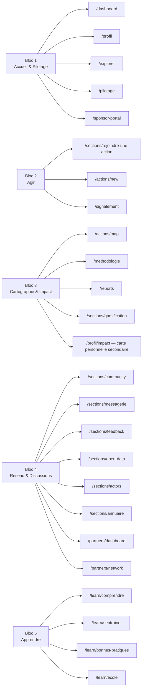

# Matrice rubriques

## Structure en 5 blocs (homepage)

```mermaid
flowchart LR
  B1["Bloc 1\nAccueil & Pilotage"]
  B2["Bloc 2\nAgir"]
  B3["Bloc 3\nCartographie & Impact"]
  B4["Bloc 4\nRéseau & Discussions"]
  B5["Bloc 5\nApprendre"]

  B1 --> DASH["/dashboard"]
  B1 --> PROFIL["/profil"]
  B1 --> EXPLORER["/explorer"]
  B1 --> PIL["/pilotage"]
  B1 --> SPONSOR["/sponsor-portal"]

  B2 --> FORM["/sections/rejoindre-une-action"]
  B2 --> NEW["/actions/new"]
  B2 --> SIGNAL["/signalement"]

  B3 --> MAP["/actions/map"]
  B3 --> METHODO["/methodologie"]
  B3 --> REP["/reports"]
  B3 --> BADGES["/sections/gamification"]
  B3 --> IMPACT["/profil/impact — carte personnelle secondaire"]

  B4 --> COMM["/sections/community"]
  B4 --> MSG["/sections/messagerie"]
  B4 --> FEEDBACK["/sections/feedback"]
  B4 --> OPENDATA["/sections/open-data"]
  B4 --> ACTORS["/sections/actors"]
  B4 --> ANNUAIRE["/sections/annuaire"]
  B4 --> PARTNERS["/partners/dashboard"]
  B4 --> PARTNERS_ALIAS["/partners/network"]

  B5 --> COMPRENDRE["/learn/comprendre"]
  B5 --> QUIZ["/learn/sentrainer"]
  B5 --> PRATIQUES["/learn/bonnes-pratiques"]
  B5 --> ECOLE["/learn/ecole"]
```

## Familles autonomes

- Auth & Onboarding : `/sign-in`, `/sign-up`, `/onboarding`, `/onboarding/localisation`
- Institutionnel & Légal : `/contact`, `/conditions-*`, `/mentions-legales`, `/politique-*`, `/en`
- Système & Utilitaires : `/reglages`, `/preview/actions/new`, `/error/429`
- Admin & Super-admin : `/admin`, `/admin/forms`, `/admin/services`, `/admin/godmode`
- Print & Export : `/prints/report`

## Correspondance bloc -> usage

`/profil/impact` appartient au bloc Cartographie & Impact pour sa sémantique
visuelle et métier, mais son accès utilisateur est contextuel : le profil actif
ouvre la carte depuis « Progression & badges ». Elle ne rejoint pas le ruban
principal et ne se confond pas avec `/reports`, qui reste collectif.

| Bloc | Teinte | Rôle principal | Sortie attendue |
|---|---|---|---|
| Accueil & Pilotage | `amber` / `brun` | Entrée personnelle + gouvernance | reprendre, piloter, administrer |
| Agir | `emerald` | Passage à l'action terrain | rejoindre une action, créer une action, signaler un déchet |
| Cartographie & Impact | `sky` / `red` | Lecture territoriale + preuve | carte, rapports, méthodologie, badges |
| Réseau & Discussions | `indigo` | Mise en relation | partenaires, messagerie, open data, communauté |
| Apprendre | `yellow` | Montée en compétence | point de départ, quiz, guides, école |

## Blocs fusionnés (ancienne structure)

| Ancien bloc | Fusionné dans |
|---|---|
| Piloter | Bloc 1 — Accueil & Pilotage |
| Impact | Bloc 3 — Cartographie & Impact |
| Discussion | Bloc 4 — Réseau & Discussions |

## Source technique

- `apps/web/src/lib/navigation.ts`
- `documentation/pages_site/INDEX.md`

La navigation CURRENT suit le contrat unique `NavigationBlockId` (`home`,
`act`, `visualize`, `impact`, `network`, `connect`, `learn`). Le registry des
rubriques ne porte pas de `spaceId` parallèle : le terme produit général
« espace » ne doit pas être interprété comme une seconde taxonomie de
navigation.

## Parcours, structures et autorisation

Cette matrice décrit une navigation UX, pas une matrice de permissions. Les
CTA sont personnalisés par parcours, mais ne donnent aucun droit serveur
supplémentaire. Les notions `GRANTED_ROLE`, `ACTIVE_ROLE`, organisation et
parcours UX sont définies dans la source sécurité canonique
[`documentation/security/authz-authn-regles.md`](../security/authz-authn-regles.md).

Le portail Sponsor peut être proposé principalement aux parcours entreprise et
élu sans que cela prouve une appartenance organisationnelle ou une attribution
territoriale. Les scopes correspondants restent déterminés par leurs contrats
serveur dédiés.

## Routes canoniques et alias

`CURRENT_SURFACE` désigne une page ou une rubrique rendue par son contrat
runtime courant et susceptible d'être disponible dans le registry. Une
`COMPATIBILITY_REDIRECT` conserve une ancienne URL et ses paramètres utiles,
mais ne constitue pas une rubrique CURRENT ni une entrée de navigation.

Le bloc Agir expose exactement trois entrées utilisateur :
`/sections/rejoindre-une-action`, `/actions/new` et `/signalement`. Les routes
`/missions/[id]` et `/actions/history` restent accessibles pour leurs
workflows et liens existants, mais ne sont pas des rubriques primaires du
bloc. Les moteurs itinéraire et météo restent accessibles via les panneaux de
`/actions/new` ; leurs anciennes URLs sont des redirections de compatibilité.
Trash Spotter n'est pas une entrée Agir : `/sections/trash-spotter` reste une
surface secondaire de consultation et de monitoring dans Réseau & Discussions,
et `/signalement` porte l'unique création d'observation.

- `/explorer` et `/reports` sont les routes canoniques des pages Sommaire et Rapports.
- `/sections/feedback`, `/sections/community`, `/sections/messagerie`, `/sections/open-data` et `/sections/actors` sont les routes canoniques des sections publiques correspondantes.
- `/community`, `/messagerie`, `/open-data`, `/partners/network` et `/partners/network/pepite` restent des alias legacy ou des redirections techniques.
- `/actions/new?panel=itineraire` et `/actions/new?panel=meteo` sont les
  `CURRENT_SURFACE` des moteurs itinéraire et météo, rendus respectivement par
  `RouteSection` et `WeatherSection`.
- `/sections/route` est une `COMPATIBILITY_REDIRECT` vers
  `/actions/new?panel=itineraire`.
- `/sections/weather` et `/sections/guide` sont des `COMPATIBILITY_REDIRECT`
  vers `/actions/new?panel=meteo`.
- `/learn/hub` et `/learn/ressources` sont des surfaces intégrées, plus des pages autonomes.
- `/observatoire` et `/sections/sandbox` ne sont plus des routes UI canoniques du repo actuel.

## Règle de maintenance

Quand un bloc change, mettre à jour cette matrice et le registre de navigation,
puis les fiches `CURRENT` des routes concernées. Le fichier historique
`pages_site/rubriques_utilite_impact_.md` n'est pas une source à maintenir pour
le présent. La matrice n'est pas un commentaire : c'est un contrat de
navigation.
