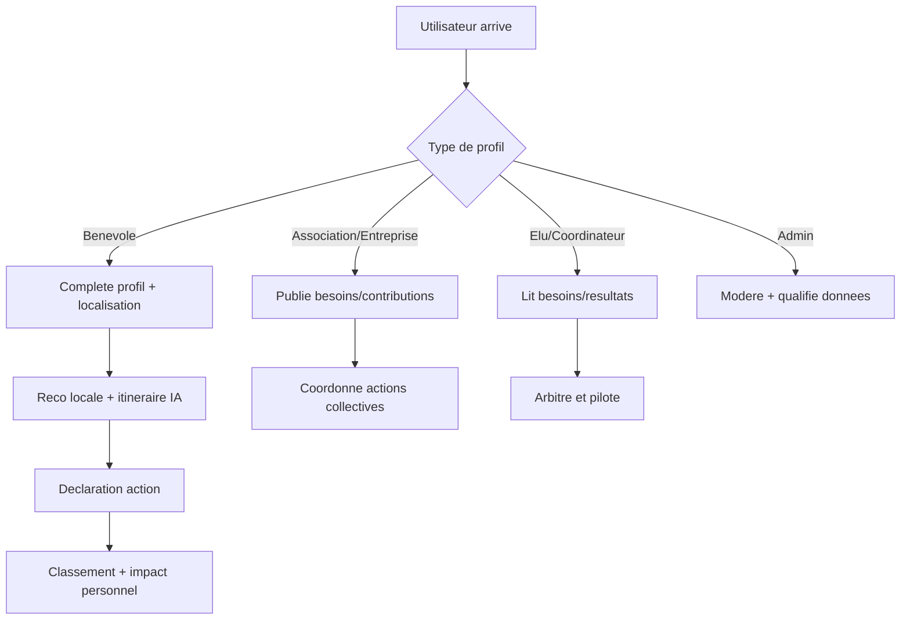

# Parcours utilisateurs

## Vue flowchart (parcours terrain)

Fallback statique:
```md

```

## Benevole
- Rejoint la plateforme -> complete son profil -> reco locale -> agit -> suit son impact.
- Contribue au signalement, a l'execution terrain et a la continuite des actions.

## Association / commercant / entreprise
- Se reference -> publie ses besoins/contributions -> coordonne actions collectives.
- Anime la mobilisation, coordonne localement et suit les besoins du terrain.

## Elu / coordinateur
- Consulte besoins/resultats -> arbitre -> pilote les actions locales.
- Utilise les resultats pour prioriser, arbitrer et soutenir les actions utiles.

## Admin
- Modere, qualifie les donnees et maintient la gouvernance.
- Assume la supervision, la qualite des donnees et la coherence des livrables.

## Publics concernes

- Benevoles et citoyens contributeurs
- Coordinateurs associatifs
- Decideurs locaux et collectivites
- Acteurs de supervision et moderation
- Publics secondaires : partenaires, scolaires, structures de sensibilisation

## Acteurs impliques et responsabilites

- **Citoyens** : signalement, participation, execution terrain
- **Associations** : animation, coordination, suivi local
- **Collectivites** : arbitrage, priorisation, soutien institutionnel
- **Equipe projet / admin** : qualite des donnees, moderation, consolidation des livrables
