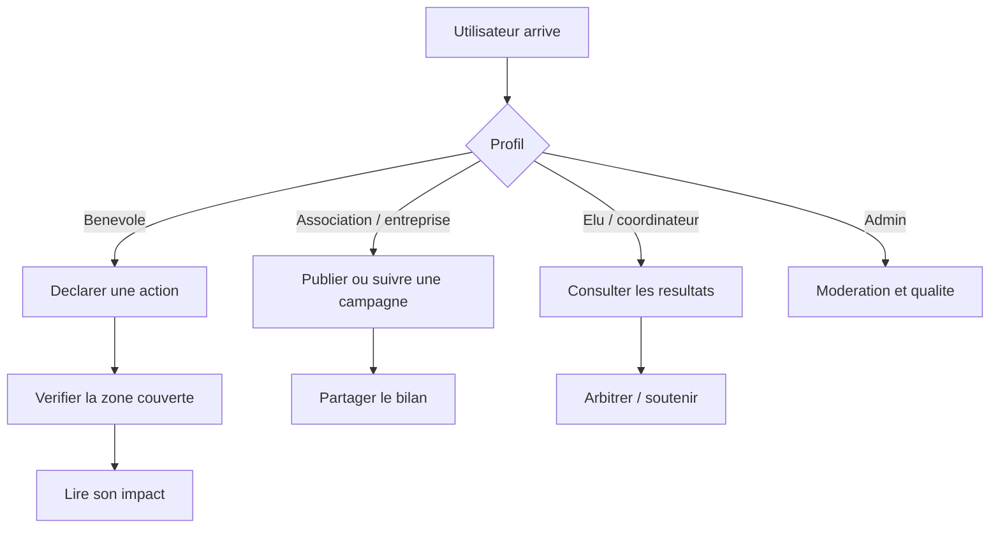

# Parcours utilisateurs

## Lecture rapide

## Benevole

1. complete son profil ;
2. declare une action ou rejoint une action existante ;
3. consulte la zone couverte et le bilan obtenu.

Attente produit : le chemin doit etre rapide, lisible et possible depuis mobile.

## Association ou entreprise

1. reference une action ou une campagne ;
2. suit les contributions ;
3. telecharge ou partage un rapport exploitable.

Attente produit : donner de la visibilite et du suivi sans imposer une charge administrative lourde.

## Elu ou coordinateur

1. consulte les resultats par zone ;
2. lit les points saillants ;
3. utilise les bilans pour prioriser ou soutenir une action.

Attente produit : aider a decider vite, pas fournir un rapport inutilement dense.

## Admin

1. verifie la qualite ;
2. modere si besoin ;
3. maintient la coherence entre les rubriques.

Attente produit : proteger la qualite des donnees et la lisibilite globale.

