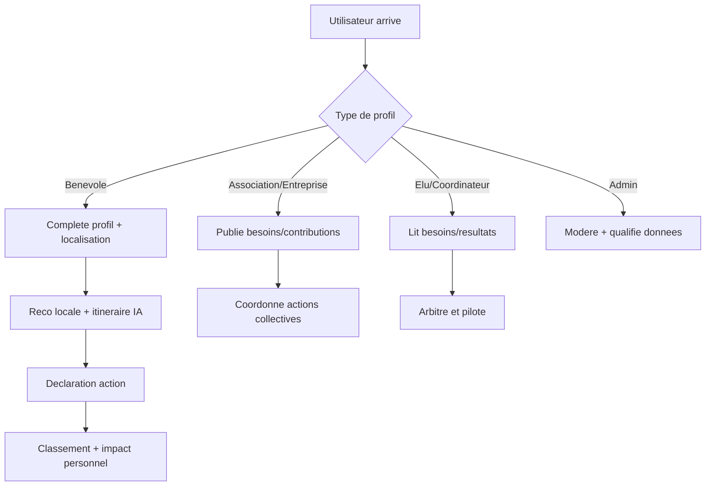

# Parcours utilisateurs

## Vue flowchart (parcours terrain)

Fallback statique:
```md

```

## Benevole
- Rejoint la plateforme -> complete son profil -> reco locale -> agit -> suit son impact.

## Association / commercant / entreprise
- Se reference -> publie ses besoins/contributions -> coordonne actions collectives.

## Elu / coordinateur
- Consulte besoins/resultats -> arbitre -> pilote les actions locales.

## Admin
- Modere, qualifie les donnees et maintient la gouvernance.
