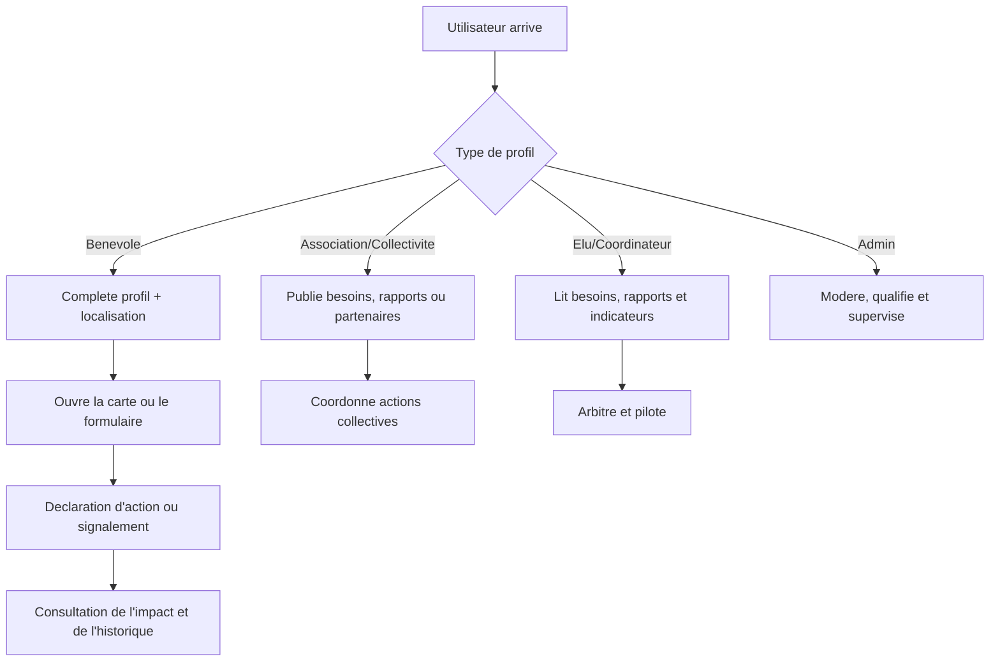

# Parcours utilisateurs

## Vue flowchart (parcours actuel)

```mermaid
flowchart TD
  A[Utilisateur arrive] --> B{Type de profil}
  B -- Benevole --> C[Complete profil + localisation]
  C --> D[Ouvre la carte ou le formulaire]
  D --> E[Declaration d'action ou signalement]
  E --> F[Consultation de l'impact et de l'historique]
  B -- Association/Collectivite --> G[Publie besoins, rapports ou partenaires]
  G --> H[Coordonne actions collectives]
  B -- Elu/Coordinateur --> I[Lit besoins, rapports et indicateurs]
  I --> J[Arbitre et pilote]
  B -- Admin --> K[Modere, qualifie et supervise]
```
Fallback statique:
```md

```

## Benevole
- Rejoint la plateforme, complete son profil et accede vite a la carte ou au formulaire.
- Contribue au signalement, a la declaration d'action et au suivi de l'impact.

## Association / collectivité / entreprise
- Se reference, publie ses besoins ou ses actions, puis coordonne les contributions.
- Utilise les rapports, la cartographie et les partenaires pour structurer la mobilisation.

## Elu / coordinateur
- Le coordinateur ouvre `/pilotage` uniquement sur les actions dont il est le créateur ou l'organisateur/coorganisateur canonique ; l'absence de relation produit un état vide, jamais une vue globale.
- L'élu est la cible future d'un pilotage territorial fondé sur une attribution canonique (`TARGET / NOT_IMPLEMENTED` tant que le runtime ne la fournit pas) ; il ne reçoit pas de fallback global.
- Les indicateurs publics et transverses restent consultables dans Reports lorsque leur contrat de lecture le permet.

## Admin
- Modere, qualifie les donnees et maintient la gouvernance.
- Assume la supervision, la qualite des donnees et la coherence des livrables.
- `/admin` est sa surface de supervision ; `admin` ne reçoit pas le parcours métier `/pilotage` par son seul rôle actif.

## Rôle, capacité et périmètre

Le rôle actif ne suffit pas à définir le périmètre métier. Une capacité de
pilotage doit aussi être bornée par une relation canonique côté serveur :

```txt
coordinateur → actions organisées (creator / organizer / coorganizer)
elu          → territoire attribué (TARGET / NOT_IMPLEMENTED)
admin        → modération et supervision globale, pas pilotage métier
max          → administration de plateforme ; basculer explicitement vers un rôle métier
```

## Publics concernes

- Benevoles et citoyens contributeurs
- Coordinateurs associatifs
- Decideurs locaux et collectivites
- Acteurs de supervision et moderation
- Publics secondaires : partenaires, scolaires, structures de sensibilisation
- Les pages `learn/ecole` et `open-data` servent aussi de passerelles d'entrée pour la sensibilisation et la lecture publique.

## Acteurs impliques et responsabilites

- **Citoyens** : signalement, participation, execution terrain
- **Associations** : animation, coordination, suivi local
- **Collectivites** : arbitrage, priorisation, soutien institutionnel
- **Equipe projet / admin** : qualite des donnees, moderation, consolidation des livrables
