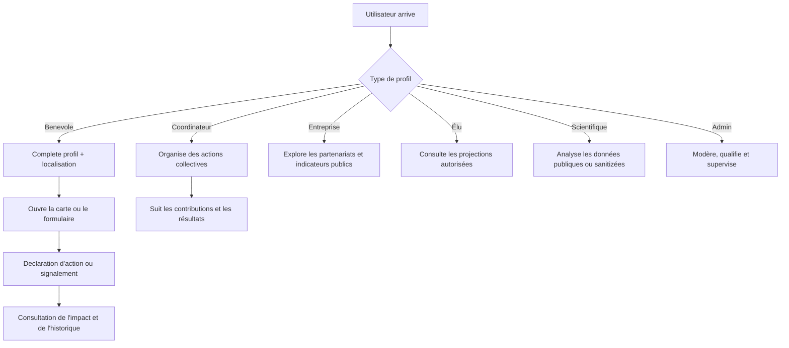

# Parcours utilisateurs

Ce document décrit les parcours UX et les personas proposés dans l'interface.
Il ne définit pas les permissions serveur. La source canonique des frontières
AuthN/AuthZ, des capacités et des scopes est
[`documentation/security/authz-authn-regles.md`](../security/authz-authn-regles.md).

## Quatre notions à ne pas confondre

```txt
GRANTED_ROLE
= rôle obtenu par le compte

ACTIVE_ROLE
= persona métier actif utilisé pour les capacités effectives

organisation / structure
= entité externe à laquelle une personne peut éventuellement être reliée

parcours UX
= navigation, CTA, libellés et priorités d'interface
```

Un parcours UX ne donne aucun droit serveur supplémentaire. Une relation
organisationnelle ou territoriale doit être persistée et vérifiée par le
contrat serveur concerné ; un libellé comme « Association », « Entreprise »,
« Collectivité » ou « Scientifique » ne constitue jamais cette preuve.

## Vue flowchart (parcours actuel)

```mermaid
flowchart TD
  A[Utilisateur arrive] --> B{Type de profil}
  B -- Benevole --> C[Complete profil + localisation]
  C --> D[Ouvre la carte ou le formulaire]
  D --> E[Declaration d'action ou signalement]
  E --> F[Consultation de l'impact et de l'historique]
  B -- Coordinateur --> G[Organise des actions collectives]
  G --> H[Suit les contributions et les résultats]
  B -- Entreprise --> I[Explore les partenariats et indicateurs publics]
  B -- Élu --> J[Consulte les projections autorisées]
  B -- Scientifique --> K[Analyse les données publiques ou sanitizées]
  B -- Admin --> L[Modère, qualifie et supervise]
```
Fallback statique:
```md

```

## Bénévole

- Rejoint la plateforme, complète son profil et accède vite à la carte ou au formulaire.
- Contribue au signalement, à la déclaration d'action et au suivi de l'impact.

## Coordinateur — personne / fonction

- Le coordinateur représente une personne qui organise des actions ; le rôle n'est pas techniquement équivalent à une association.
- Une association peut être la structure représentée par cette personne, mais cette relation est une donnée distincte et ne découle pas du rôle.
- Le coordinateur ouvre `/pilotage` uniquement sur les actions dont il est le créateur ou l'organisateur/coorganisateur canonique ; l'absence de relation produit un état vide, jamais une vue globale.

## Entreprise — représentant d'entreprise

- Le parcours entreprise propose les partenariats, le mécénat, les rapports et le portail Sponsor comme des entrées UX.
- Le simple rôle `entreprise` ne prouve pas l'appartenance à une organisation, ne donne pas accès aux ressources privées d'une société et ne confère aucun pouvoir sur une autre organisation.
- Toute future permission organisationnelle devra utiliser une relation canonique persistée et vérifiée côté serveur.

## Élu — décideur public

- L'élu représente le décideur public ; il ne représente pas techniquement une collectivité, un administrateur ou le propriétaire d'un territoire.
- Les droits territoriaux restent conditionnés à une attribution territoriale canonique. En son absence, aucun fallback global n'est accordé.
- Les indicateurs publics et transverses restent consultables dans Reports lorsque leur contrat de lecture le permet.

## Scientifique — parcours d'analyse

- Le parcours scientifique sert actuellement principalement l'analyse : Rapports, Open Data, Méthodologie et autres projections publiques ou sanitizées.
- Le rôle ne donne pas de privilège implicite sur des données privées, des messages, des identifiants ou des ressources d'organisation.

## Admin

- Modère, qualifie les données et maintient la gouvernance.
- Assume la supervision, la qualité des données et la cohérence des livrables.
- `/admin` est sa surface de supervision ; `admin` ne reçoit pas le parcours métier `/pilotage` par son seul rôle actif.

## Portail Sponsor

Le portail Sponsor est proposé principalement aux parcours entreprise et élu
par décision UX. Cette proposition de navigation n'est pas une AuthZ et ne
crée ni scope organisationnel ni scope territorial. La page affiche seulement
les données que son contrat serveur autorise réellement ; elle ne doit pas les
présenter comme les données propres au réseau ou au territoire de la personne
tant qu'un tel scope n'est pas appliqué.

## Rôle, capacité et périmètre

Le rôle actif ne suffit pas à définir le périmètre métier. Une capacité de
pilotage doit aussi être bornée par une relation canonique côté serveur :

```txt
coordinateur → actions organisées (creator / organizer / coorganizer)
entreprise   → organisation uniquement avec relation canonique (TARGET)
elu          → territoire uniquement avec attribution canonique (TARGET / NOT_IMPLEMENTED)
admin        → modération et supervision globale, pas pilotage métier
max          → administration de plateforme ; basculer explicitement vers un rôle métier
```

## Publics concernes

- Bénévoles et citoyens contributeurs
- Personnes qui coordonnent des actions
- Représentants d'entreprises et décideurs publics
- Structures partenaires, dont les associations et collectivités, lorsqu'elles sont réellement reliées par un contrat métier
- Acteurs de supervision et de modération
- Publics secondaires : scolaires et structures de sensibilisation
- Les pages `learn/ecole` et `open-data` servent aussi de passerelles d'entrée pour la sensibilisation et la lecture publique.

## Acteurs impliques et responsabilites

- **Citoyens** : signalement, participation, exécution terrain
- **Coordinateurs** : organisation des actions et suivi des contributions
- **Associations et entreprises** : structures externes pouvant être représentées ou partenaires selon les relations persistées
- **Élus** : décision publique et pilotage territorial uniquement lorsqu'un scope canonique existe
- **Équipe projet / admin** : qualité des données, modération, consolidation des livrables
