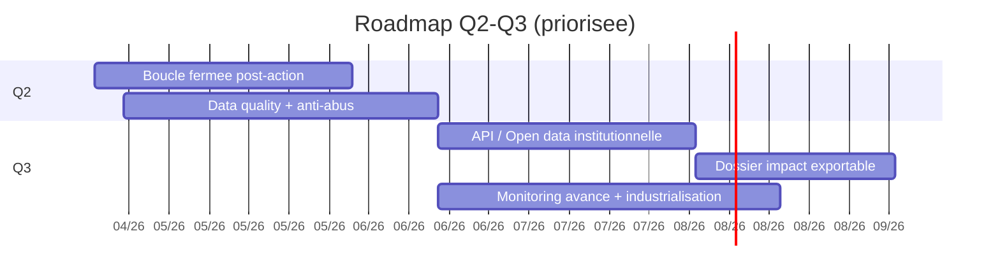

# Roadmap priorisee

## Mini gantt Q2/Q3 + dependances

Fallback statique:
```md

```

## Priorite 1
- Boucle fermee post-action (resume, recommandation, progression personnelle)
- Stabilisation data quality + anti-abus

## Priorite 2
- API/open data institutionnelle
- Dossier impact exportable elus/chercheurs

## Priorite 3
- Industrialisation runbooks + monitoring avance
