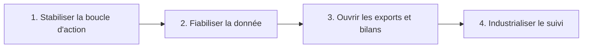

# Roadmap priorisee

La feuille de route doit rester courte, lisible et dependante des vrais usages terrain.

## Logique d'ensemble

## Priorite 1 - stabiliser la valeur coeur

- boucle fermee post-action ;
- progression lisible apres declaration ;
- verification des donnees avant publication ;
- reduction des doublons et des actions peu exploitables.

## Priorite 2 - fiabiliser la donnee

- controles de qualite sur les champs critiques ;
- anti-abus et moderation quand necessaire ;
- clarte des statuts d'action ;
- cohérence entre carte, historique et rapports.

## Priorite 3 - rendre les resultats partageables

- export PDF simple pour les partenaires et les elus ;
- vues institutionnelles plus lisibles ;
- rapport par association, ville, periode ou campagne ;
- version partageable des donnees importantes.

## Priorite 4 - maintenir la trajectoire

- monitoring ;
- runbooks ;
- traceabilite documentaire ;
- audit regulier des choix de produit.

## Ce qui est hors perimetre immediat

- interfaces lourdes sans usage terrain confirme ;
- duplication de dashboards ;
- fonctions IA non justifiees par un gain concret ;
- mecanismes de gamification qui ne servent pas l'action.

