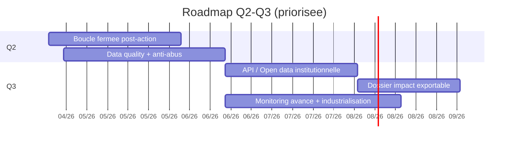

# Roadmap priorisee

## Mini gantt Q2/Q3 + dependances

Fallback statique:
```md

```

## Priorite 1
- Boucle fermee post-action (resume, recommandation, progression personnelle)
- Stabilisation data quality + anti-abus

## Priorite 2
- API/open data institutionnelle
- Dossier impact exportable elus/chercheurs

## Priorite 3
- Industrialisation runbooks + monitoring avance

## Socle deja acquis

- Parcours applicatifs coeur actifs : `/dashboard`, `/reports`, `/actions/new`, `/actions/map`, `/actions/history`, `/admin`
- Registre de rubriques et sections operationnel
- APIs metier principales en production : actions, spots, community, reports, moderation, health/services
- Base de securisation initiale : middleware, variables d'environnement centralisees, RLS de base
- Audit d'impact IA consolide et automatisation initiale des metriques de documentation
- Premiers livrables PDF et exports disponibles

## Hors perimetre

- Gouvernance RH interne non numerique
- Negociation politique ou institutionnelle hors outil
- Comptabilite et obligations administratives non applicatives
- Logistique terrain physique : materiel, transport, stockage
- Process juridiques complets hors code

## Chantiers ouverts

### Priorite immediate

- Tests de non-regression cibles sur les parcours coeur et les exports
- Validation humaine et clarte des contenus environnementaux
- Fiabilite des indicateurs et protocole de revue mensuelle

### Priorite moyen terme

- Clarification structurelle des pages coeur pour supprimer les doublons analytiques
- Campagnes multi-actions et suivi associe
- Standardisation des usages IA utiles et politique de partage de donnees

### Priorite consolidation et perennisation

- Refactor `section-renderer` sans regression fonctionnelle
- Tracabilite documentaire unique a maintenir a jour
- Mitigation du vendor lock-in a prolonger par inventaire technique
- Routine d'audit trimestrielle (Responsable Sobriete)
- Verification finale complete et synthese des risques restants
