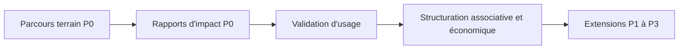

# Roadmap priorisée

> **Statut documentaire : `PLAN`**
>
> **Horizon : Q4 2026 → 2027**
>
> Cette roadmap est la source produit de priorité globale. Elle ne remplace ni
> les fiches `CURRENT` de `documentation/pages_site/`, ni les contrats de
> sécurité, de données, d'architecture ou juridiques. Une fonctionnalité décrite
> comme existante ici doit rester cohérente avec ces sources spécialisées.

## 1. Principe directeur

CleanMyMap dispose déjà d'un périmètre fonctionnel large. La priorité n'est
plus d'ajouter des fonctionnalités en volume, mais de démontrer une boucle
produit simple, fiable et utile de bout en bout :

```text
besoin ou action locale
→ préparation
→ action terrain
→ déclaration des résultats
→ données fiables
→ rapport d'impact exploitable
→ coordination de l'action suivante
```

Les prochains lots doivent donc privilégier, dans cet ordre :

1. la fiabilité du parcours terrain ;
2. la transformation des données en preuve et livrable ;
3. la validation d'usage avec des acteurs réels ;
4. la structuration juridique et économique du projet ;
5. l'amélioration UX/UI des surfaces déjà utiles ;
6. l'extension fonctionnelle seulement lorsqu'un besoin démontré la justifie.

### Vue synthétique des priorités


```mermaid
flowchart LR
  TERRAIN[Parcours terrain P0] --> RAPPORTS[Rapports d'impact P0]
  RAPPORTS --> USAGE[Validation d'usage]
  USAGE --> STRUCTURE[Structuration associative et économique]
  STRUCTURE --> EXTENSIONS[Extensions P1 à P3]
```

## 2. Priorités globales

| Priorité | Chantier | État courant | Résultat attendu |
| --- | --- | --- | --- |
| `P0` | Parcours bénévole de bout en bout | fonctionnalités riches, validation E2E encore incomplète sur plusieurs effets réels | une action peut être préparée, réalisée, déclarée, reprise et finalisée sans rupture |
| `P0` | Rapports d'impact | génération, analyse, snapshots, historique et exports déjà présents | générer simplement un rapport fiable depuis une action validée et le réutiliser comme livrable |
| `P0 parallèle` | Structuration associative | aucune association n'exploite encore juridiquement CleanMyMap | constituer la structure si la décision est confirmée et préparer son exploitation réelle du projet |
| `P1` | Communauté | hub fonctionnel mais encore dense | rendre le réseau lisible et utile sans créer un réseau social généraliste |
| `P1` | Messagerie / discussions | fond fonctionnel très avancé | valider les parcours réels, l'accès, la modération et la compréhension mobile avant toute extension |
| `P1` | Modération / administration | cockpit `/admin` avancé ; certaines surfaces techniques restent incomplètes | prouver les permissions et transitions sensibles, puis simplifier les écrans secondaires |
| `P1` | Compte / dashboard / profil | `/reglages` livré pour son scope ; dashboard et profils encore perfectibles | recentrer l'espace personnel sur état, prochaine action, notifications et préférences utiles |
| `P1` | UX/UI du formulaire bénévole | contrat fonctionnel avancé | réduire la charge cognitive et améliorer l'usage terrain mobile sans modifier le métier |
| `P2` | Application mobile | `CURRENT / ACTIVE DEVELOPMENT`, `NOT_PRODUCTION_READY` | rendre fiable la V1 GPS native avant d'élargir son périmètre |
| `P2` | Convergence UI générale | plusieurs lots visuels déjà exécutés | terminer les états, densités et incohérences restantes sans refonte globale |
| `P3` | Extensions et montée en échelle | plusieurs pistes existent | n'ajouter campagnes, nouvelles projections ou rôles spécialisés qu'après validation du noyau |

---

# 3. P0 — Parcours bénévole de bout en bout

## Objectif

Faire du parcours terrain la source fiable de toutes les données d'impact.

La surface canonique reste `/actions/new`. Le produit possède déjà :

- préparation avant action ;
- workflow guidé ;
- itinéraire ;
- formalités ;
- météo ;
- participants ;
- déclaration complète après action ;
- médias ;
- exports ;
- reprise d'une action existante ;
- séparation entre mesures déclarées et proxys d'impact.

Le prochain travail porte principalement sur la preuve du comportement réel,
pas sur l'ajout de nouveaux sous-formulaires.

## Travail de fond prioritaire

### P0.1 — Persistance réelle

Valider de bout en bout :

- création réelle de l'action ;
- reprise d'un brouillon ou d'une pré-action ;
- conservation des données après authentification tardive ;
- changement de phase sans création de doublon ;
- persistance des résultats terrain ;
- état final réellement relu depuis la base.

Une réponse positive de l'interface ne suffit pas comme preuve de persistance.

### P0.2 — Chaîne médias

Valider :

```text
sélection
→ intent
→ upload
→ finalize
→ rattachement
→ relecture
```

Couvrir les erreurs partielles, retry, suppression et absence de doublon
orphelin.

### P0.3 — Géométrie et itinéraire

Vérifier les cas réels :

- parcours automatique ;
- GPX importé ;
- dessin manuel ;
- loop ;
- point-to-point ;
- fallback estimé ;
- export de la géométrie réellement retenue.

### P0.4 — Participants et organisation

Tester :

- action spontanée ;
- structure ;
- organisateur/coorganisateur ;
- inscription future ;
- présence finale ;
- attribution post-action ;
- droits de modification.

## Travail UX/UI

La structure métier ne doit pas être reconstruite. Les améliorations portent sur :

- lisibilité mobile ;
- distinction obligatoire / facultatif ;
- réduction des aides répétitives ;
- ouverture des disclosures seulement lorsqu'elle aide réellement ;
- résumé avant envoi ;
- erreurs proches du champ ;
- focus sur la première erreur ;
- reprise visible après interruption ;
- CTA principal unique par étape.

## Stop condition

Le chantier P0 parcours bénévole est considéré suffisamment stabilisé lorsque
plusieurs scénarios réalistes peuvent être exécutés de bout en bout avec
persistance vérifiée, y compris un scénario mobile et au moins un scénario
d'erreur/reprise.

---

# 4. P0 — Rapports d'impact

## État courant

`/reports` possède déjà un socle important :

- synthèse publique légère ;
- analyse sur données validées ;
- méthodes KPI ;
- tendances ;
- qualité et couverture des données ;
- génération PDF ;
- modules optionnels ;
- export détaillé ;
- quota serveur ;
- historique personnel ;
- snapshots persistés ;
- relecture et réexport du snapshot historique.

La priorité n'est donc pas de créer un second moteur de rapport.

## P0.1 — Rapport d'une action

Créer le point d'entrée métier le plus direct :

```text
action terminée et admissible
→ Générer le rapport d'impact
→ scope = single_action
→ résolution serveur de l'action
→ aperçu
→ génération
→ historique
```

Le contrat doit rester typé et ne jamais faire confiance à l'identifiant comme
preuve d'accès ou d'admissibilité.

## P0.2 — Reproductibilité

Finaliser le contrat de versioning nécessaire pour les générations futures :

- schéma de snapshot ;
- template ;
- méthodologie ;
- facteurs ;
- renderer ;
- provenance ;
- éventuelle génération dérivée.

Le réexport historique continue de relire le snapshot existant sans recalculer
silencieusement les données actuelles.

## P0.3 — Niveaux de détail

Les niveaux `Concis`, `Par défaut` et `Exhaustif` ne doivent revenir dans
l'interface que lorsqu'ils produisent réellement des sorties différentes.

Avant cela, conserver le contrat de compatibilité existant sans promettre une
fonction non matérialisée.

## P0.4 — Qualité du livrable

Le PDF doit pouvoir servir à plusieurs usages sans créer plusieurs moteurs :

- bénévole / organisateur : preuve lisible de l'action ;
- association : bilan partageable ;
- collectivité : lecture factuelle et territoriale ;
- partenaire ou financeur : synthèse et méthode ;
- recherche : données et limites lorsqu'elles sont appropriées.

La hiérarchie visuelle doit privilégier :

1. synthèse exécutive ;
2. résultats terrain ;
3. périmètre ;
4. impact et proxys clairement qualifiés ;
5. qualité des données ;
6. méthodes et limites ;
7. annexes et données détaillées.

## Stop condition

Le rapport devient un livrable produit central lorsque l'utilisateur peut
partir d'une action validée, générer un document sans reconfigurer inutilement
le périmètre, puis retrouver exactement le même état historique.

---

# 5. P0 parallèle — Structuration associative

## Statut

Ce chantier est stratégique et administratif, pas un changement de runtime.

Tant que la structure n'est pas effectivement constituée et que le transfert
n'est pas décidé :

```text
CleanMyMap reste juridiquement porté par la personne physique actuelle.
```

Les documents légaux publics et le runtime ne doivent pas anticiper
l'association.

## Étapes

Si l'option association loi 1901 est confirmée :

1. choisir les fondateurs et la gouvernance initiale ;
2. finaliser l'objet ;
3. choisir le siège ;
4. adopter les statuts ;
5. tenir l'assemblée constitutive ;
6. effectuer la déclaration ;
7. obtenir RNA puis SIREN/SIRET lorsque nécessaire ;
8. ouvrir les moyens de fonctionnement adaptés ;
9. souscrire l'assurance correspondant aux activités réelles ;
10. inventorier les actifs CleanMyMap ;
11. décider quels actifs, contrats et responsabilités sont transférés ou licenciés ;
12. mettre à jour la documentation juridique et le site uniquement après changement réel.

## Lien avec Pépite

Le chantier doit être travaillé avec :

- proposition de valeur ;
- étude de marché ;
- business model ;
- budget ;
- stratégie de financement ;
- gouvernance ;
- trajectoire association / éventuelle évolution coopérative.

Ces documents de travail peuvent rester dans `PERSO/PEPITE/` tant qu'ils
contiennent des hypothèses non stabilisées.

---

# 6. P1 — Communauté

## État courant

La communauté est déjà un hub réel avec événements, RSVP, organisation et
réseau de partenaires.

Le problème prioritaire n'est pas l'absence de fonctionnalités, mais la
lisibilité du hub.

## Travail de fond

Avant toute extension, valider :

- ce que l'utilisateur vient réellement faire sur Communauté ;
- la différence entre Communauté, Messagerie, Annuaire et Feedback ;
- la valeur des missions communautaires ;
- l'utilité du volet Partenaires ;
- le rôle réel de cette surface dans le retour après une première action.

## Travail UX/UI

Priorités :

- éviter que les missions noient les autres usages ;
- réduire les répétitions ;
- simplifier les CTA ;
- rendre le premier écran scannable ;
- tester la hiérarchie mobile ;
- réduire la densité des cartes ;
- conserver les détails secondaires hors du premier niveau.

## Non-objectifs

- recréer un réseau social généraliste ;
- dupliquer la messagerie ;
- dupliquer l'annuaire ;
- ajouter des fils publics sans besoin démontré.

---

# 7. P1 — Messagerie et discussions

## État courant

Le fond fonctionnel est déjà avancé :

- messages privés ;
- discussions communautaires ;
- territoires ;
- discussions d'actions ;
- annonces ;
- sondages ;
- pièces jointes ;
- recherche ;
- historique paginé ;
- notifications ;
- accès et exclusions ;
- responsive mobile/desktop.

Les lots documentés de messagerie ont déjà traité la majorité de l'ancien
backlog UI.

## Priorité

Ne pas ajouter de nouvelles capacités avant validation réelle.

Tester principalement :

- compréhension `Discussions` / `Messages privés` ;
- accès à une discussion d'action ;
- refus pour un compte non autorisé ;
- annulation d'action et lecture historique ;
- exclusions/réintégrations ;
- notifications ;
- upload de pièce jointe ;
- recherche ;
- navigation mobile ;
- conservation des brouillons lors des changements de contexte.

## À différer

Les sondages multi-choix, expiration et clôture restent hors périmètre tant
qu'un besoin produit ne les justifie pas.

---

# 8. P1 — Modération et administration

## `/admin`

Le cockpit principal possède déjà :

- files de modération ;
- supervision ;
- audit ;
- feedback utilisateur ;
- réponse privée ;
- annulation d'action future ;
- signalements ;
- preuves terrain à la demande.

Le travail prioritaire est la validation des permissions et transitions :

```text
anonyme
→ refus
membre ordinaire
→ refus des capacités admin
admin/max
→ capacité autorisée
mutation
→ état métier + audit
```

## Surfaces techniques secondaires

`/admin/forms` reste inachevé et ne porte actuellement qu'un pilotage de
feature flags consommés par les parcours `CURRENT`.

Décision à prendre :

- le finaliser si ces flags ont un usage opérationnel réel ;
- ou réduire/retirer sa visibilité si cette surface ne justifie pas une page
  dédiée.

Ne pas transformer `/admin/forms` en nouveau système A/B sans besoin démontré.

---

# 9. P1 — Compte, dashboard et profils

## `/reglages`

Le périmètre actuel est considéré livré :

- langue ;
- mode d'affichage ;
- nom affiché ;
- localisation ;
- confidentialité ;
- suppression de compte.

Le travail futur doit rester correctif ou motivé par un besoin réel.

## `/dashboard`

Le dashboard reste à simplifier.

Objectif :

```text
où j'en suis
→ qu'est-ce qui demande mon attention
→ quelle est ma prochaine action utile
```

Réduire :

- rappels redondants ;
- badges répétés ;
- blocs d'aide ;
- cartes secondaires ;
- informations déjà accessibles ailleurs.

Conserver :

- action prioritaire ;
- notifications ;
- quelques indicateurs utiles ;
- raccourcis réellement fréquents ;
- lien secondaire vers les réglages.

## Profils

Conserver la séparation entre :

- rôle attribué ;
- rôle actif ;
- parcours UX ;
- relation réelle à une organisation.

Aucune simplification d'interface ne doit créer une permission implicite.

---

# 10. P1 — UX/UI formulaire bénévole

Le formulaire ne doit pas être réécrit comme un nouveau produit.

## Objectif

Faire baisser la charge cognitive sans appauvrir la donnée nécessaire.

## Axes

- mobile first réel ;
- un objectif par écran ;
- CTA principal stable ;
- informations secondaires repliées ;
- libellés plus courts ;
- unités explicites ;
- erreurs contextualisées ;
- aide au bon moment ;
- moins de cartes décoratives ;
- différence claire entre mesure, estimation et recommandation ;
- conservation du brouillon et de la progression visibles ;
- éviter toute demande de compte avant qu'une identité soit réellement nécessaire.

## Validation

Faire des tests utilisateurs simples sur téléphone et noter :

- endroits où l'utilisateur hésite ;
- champs mal compris ;
- abandons ;
- demandes d'aide ;
- retours arrière ;
- erreurs ;
- temps passé par étape.

Les corrections doivent partir de ces observations plutôt que d'une nouvelle
refonte esthétique globale.

---

# 11. P2 — Application mobile

## Statut courant

```text
CURRENT / ACTIVE DEVELOPMENT
NOT_PRODUCTION_READY
```

L'application mobile est une seconde application du même produit. Elle ne doit
pas reproduire le web.

Sa justification principale reste le suivi GPS natif fiable.

## Bloqueurs avant production

Les limites encore documentées sont :

- RLS `mission_actions` à tester ;
- renouvellement du token Clerk en background headless ;
- validation de l'usage opérationnel réel et de la préparation production.

## V1 cible

La V1 doit rester courte :

```text
ouvrir l'app
→ démarrer une mission
→ permission GPS
→ carte/tracé live
→ état de synchronisation
→ finir la mission
→ flush
→ finalisation serveur
```

Les autres parcours peuvent continuer à ouvrir les surfaces web lorsqu'elles
sont suffisantes.

## Travail de fond après les bloqueurs

- carte GPS live ;
- tracé temps réel ;
- robustesse background ;
- reprise après interruption ;
- état offline / synchronisation ;
- contacts d'urgence si le besoin produit est confirmé ;
- validation sur appareils réels ;
- audit pré-release adapté.

## Non-objectifs

- parité fonctionnelle web/mobile ;
- deuxième moteur de rapport ;
- deuxième messagerie ;
- modèle métier parallèle ;
- gamification mobile indépendante.

---

# 12. P2 — Convergence UX/UI générale

Les chantiers visuels précédents ont déjà harmonisé une grande partie des
palettes et shells.

Le travail restant doit être ciblé.

## Priorités

- états `loading`, `empty`, `error`, `forbidden`, `offline` ;
- responsive réel ;
- navigation clavier ;
- focus visible ;
- `prefers-reduced-motion` ;
- densité de texte ;
- suppression des callouts redondants ;
- cohérence des CTA ;
- lisibilité des interfaces denses ;
- rendu impression/export.

## Règle

Aucune refonte globale.

Chaque lot doit partir :

1. de la fiche canonique ;
2. du code réel ;
3. du design system ;
4. d'un problème observable.

---

# 13. P3 — Extensions après validation du noyau

Ces sujets ne deviennent prioritaires qu'après preuve du parcours P0.

## Campagnes multi-actions

À considérer si plusieurs partenaires ont besoin de regrouper des actions dans
une campagne identifiable et mesurable.

## Open data et usages institutionnels avancés

À approfondir lorsque :

- la qualité des données est suffisante ;
- les règles de diffusion sont claires ;
- un utilisateur institutionnel réel est identifié.

## Rôles `scientifique` et `entreprise`

Leur spécialisation produit reste à arbitrer.

Ne pas ajouter de privilèges serveur parce qu'un parcours UX porte ce nom.

## Partenariats externes

Toute intégration doit respecter :

- consentement ;
- attribution ;
- contrat de données ;
- minimisation ;
- absence de copie ou réutilisation lorsque le partenaire l'interdit ;
- source de vérité externe conservée lorsque le service partenaire reste canonique.

---

# 14. Horizon de travail

## Q4 2026 — Convergence

Priorités :

1. parcours bénévole E2E ;
2. rapport d'une action ;
3. tests utilisateurs du formulaire ;
4. étude de marché et validation du besoin ;
5. création de l'association si décision confirmée ;
6. simplification Communauté / Dashboard ;
7. validation des permissions de modération.

## H1 2027 — Pilotes et preuve d'usage

Objectifs :

- terrains pilotes ;
- partenaires actifs ;
- rapports réellement utilisés ;
- données de rétention et de complétion ;
- modèle économique testé ;
- premiers financements ou conventions selon opportunités ;
- poursuite mobile uniquement si les bloqueurs P2 sont levés.

## H2 2027 — Reproductibilité

Selon les preuves obtenues :

- déploiement sur plusieurs territoires ;
- campagnes multi-actions ;
- services institutionnels ciblés ;
- professionnalisation éventuelle ;
- approfondissement mobile ;
- réévaluation SCIC / ESUS si le fonctionnement réel le justifie.

---

# 15. Critères de décision

Avant tout nouveau chantier, poser les questions suivantes :

```text
Le problème est-il observé chez un utilisateur réel ?
La fonctionnalité existe-t-elle déjà ailleurs dans CleanMyMap ?
Peut-on améliorer l'existant au lieu de créer une nouvelle surface ?
La donnée nécessaire est-elle fiable ?
Le coût de maintenance est-il proportionné à l'usage ?
Le besoin est-il web, mobile natif ou purement organisationnel ?
Une source canonique existe-t-elle déjà ?
La fonctionnalité améliore-t-elle directement la boucle cœur ?
```

Une réponse négative sur plusieurs de ces points est un signal pour différer le
chantier.

---

# 16. Indicateurs de progression

La roadmap ne fixe pas ici de cibles numériques non validées.

Les familles de preuves à suivre sont :

### Usage

- actions préparées ;
- actions réellement finalisées ;
- taux de complétion du parcours ;
- reprise après brouillon/interruption ;
- utilisateurs revenant pour une autre action.

### Qualité

- complétude ;
- cohérence ;
- géolocalisation ;
- traces ;
- erreurs de persistance ;
- médias correctement finalisés.

### Impact produit

- rapports générés depuis des actions réelles ;
- rapports consultés ou partagés ;
- exports réellement utilisés ;
- partenaires utilisant les livrables.

### Communauté

- RSVP ;
- présence réelle lorsque connue ;
- passage d'un événement à une action ;
- discussions réellement utilisées ;
- retour pour une nouvelle action.

### Structuration

- entretiens terrain ;
- partenaires pilotes ;
- structure juridique ;
- financement ;
- conventions ;
- validation du business model.

Toute cible chiffrée doit être établie séparément à partir d'une baseline
observée ou d'un objectif explicitement décidé.

---

# 17. Ce qui n'est pas prioritaire maintenant

Sauf preuve nouvelle :

- ajouter un grand nombre de pages ;
- enrichir encore la messagerie ;
- construire un réseau social ;
- rechercher la parité mobile/web ;
- créer de nouveaux dashboards généralistes ;
- ajouter des métriques non actionnables ;
- ajouter de nouvelles projections d'impact sans protocole ;
- multiplier les rôles ou permissions ;
- industrialiser une fonctionnalité sans usage démontré ;
- refaire globalement l'UI.

---

# 18. Stop condition globale

Le prochain cycle produit est réussi lorsque CleanMyMap peut démontrer de façon
simple et reproductible :

```text
une action réelle
→ des données fiables
→ un rapport d'impact exploitable
→ un acteur qui s'en sert
→ une action suivante facilitée
```

Lorsque cette boucle est prouvée, les extensions P2/P3 peuvent être réévaluées
avec des données d'usage plutôt qu'avec des hypothèses.
