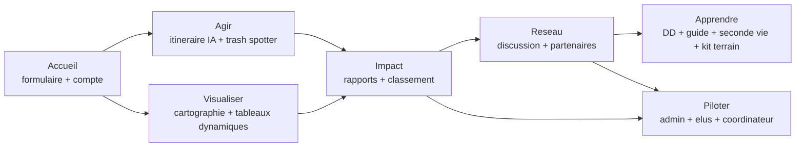

# Vision et objectifs

CleanMyMap structure l'action locale de depollution en connectant citoyens, associations, entreprises et acteurs publics.

## Architecture bloc produit (7 blocs)

Fallback statique:
```md

```

## Objectifs produit
- Acceleration des actions concretes locales
- Mesure d'impact lisible et exploitable
- Coordination reseau multi-acteurs
- Apprentissage et professionnalisation des pratiques terrain
