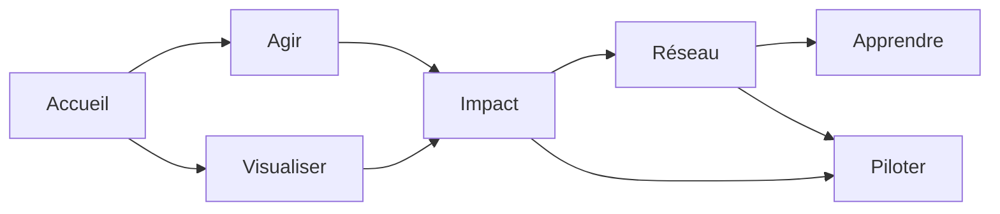

# Vision et objectifs

CleanMyMap aide les acteurs locaux a transformer des actions de depollution en donnees exploitables, visibles et reutilisables.

## Problematique

Le probleme central n'est pas seulement l'existence de dechets, mais la difficulte a :

- les localiser proprement ;
- coordonner les actions ;
- eviter les doublons ;
- produire une preuve lisible pour les associations, les entreprises et les collectivites.

## Promesse produit

Le produit doit soutenir une boucle complete :

1. declarer une action ;
2. visualiser ce qui a ete couvert ;
3. mesurer l'impact ;
4. partager un bilan ;
5. repartir sur une action suivante.

## Architecture des blocs

## Objectifs mesurables

- reduire la friction de declaration ;
- rendre la carte utile pour decider et non seulement pour montrer ;
- produire des rapports simples a transmettre ;
- soutenir la coordination entre benevoles, associations, commerces et collectivites ;
- garder une experience lisible sur mobile avant d'ajouter des surfaces plus riches sur desktop.

## Non-objectifs

- faire un reseau social generaliste ;
- ajouter des couches de complexite sans usage terrain ;
- multiplier les tableaux de bord si la meme information peut etre lue ailleurs ;
- confondre utilite terrain et volume de fonctionnalites.

