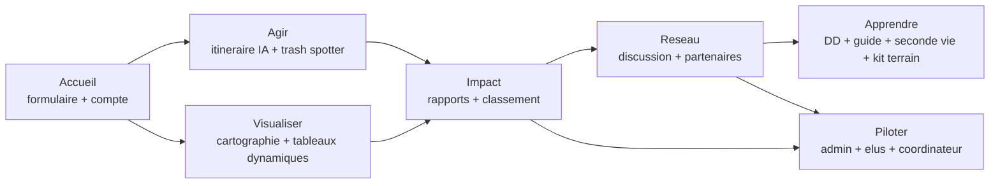

# Vision et objectifs

CleanMyMap structure l'action locale de depollution en connectant citoyens, associations, entreprises et acteurs publics.

## Architecture bloc produit (7 blocs)

Fallback statique:
```md

```

## Objectifs produit
- Acceleration des actions concretes locales
- Mesure d'impact lisible et exploitable
- Coordination reseau multi-acteurs
- Apprentissage et professionnalisation des pratiques terrain

## Probleme central

Le probleme principal est la dissociation entre la realite visible des dechets dans l'espace public et la capacite des acteurs locaux a agir vite, de maniere coordonnee et mesurable.

Trois freins dominants structurent ce besoin :

- dispersion de l'information ;
- faible continuite de mobilisation ;
- difficulte de priorisation locale.

## Impact vise

L'objectif n'est pas seulement de signaler des dechets, mais de soutenir une boucle complete :

- action de terrain ;
- coordination collective ;
- pilotage par la donnee ;
- production de livrables exploitables.

## Benefices attendus

### Impact actuel

- base applicative fonctionnelle pour la collecte et le suivi ;
- parcours role-aware en progression ;
- premiers livrables exploitables pour le pilotage.

### Impact potentiel

- meilleure continuite des actions locales ;
- meilleure priorisation territoriale ;
- meilleure exploitabilite institutionnelle des donnees ;
- coordination collective plus lisible entre citoyens, associations et acteurs publics.
