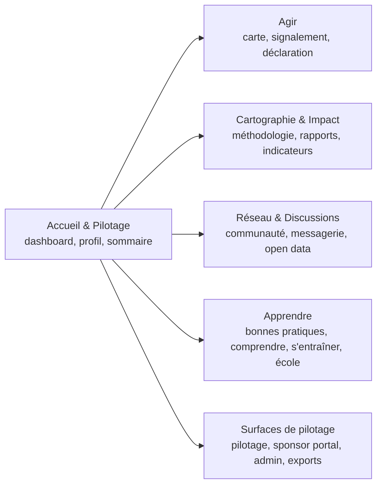

# Vision et objectifs

CleanMyMap structure l'action locale de dépollution en connectant citoyens, associations, collectivités, entreprises et acteurs de supervision.

## Positionnement du projet

CleanMyMap se positionne à l'intersection de plusieurs champs complémentaires :

- **transition écologique** : prévention et réduction des déchets abandonnés, sensibilisation, organisation d'actions de dépollution et amélioration de la connaissance environnementale ;
- **civic-tech** : outils numériques au service de l'action citoyenne, de la coordination locale et de la coopération entre acteurs d'un territoire ;
- **innovation numérique** : plateforme web et mobile, cartographie interactive, traitement et restitution de données, outils de coordination et composants open source ;
- **innovation sociale** : recherche de formes de coordination plus efficaces entre citoyens, associations, collectivités, établissements d'enseignement et de recherche, entreprises et autres acteurs locaux ;
- **économie sociale et solidaire (ESS)** : cible de structuration cohérente avec la finalité d'intérêt collectif du projet, via la constitution envisagée d'une association loi 1901 ;
- **science participative**, lorsque les protocoles, observations et données produits permettent une contribution structurée à la connaissance.

Ces qualifications décrivent le positionnement et l'ambition de CleanMyMap. Elles ne constituent pas, à elles seules, une reconnaissance administrative, un agrément, une certification ou une qualification juridique acquise.

### Qualifications et statuts

| Qualification ou statut | Situation |
| --- | --- |
| Projet environnemental | `CURRENT` |
| Projet numérique / civic-tech | `CURRENT` |
| Projet open source | `CURRENT` |
| Innovation numérique | `CURRENT` comme positionnement du projet |
| Innovation sociale | `POSITIONNEMENT` à démontrer selon les critères du dispositif concerné |
| Science participative | `CONDITIONNEL` selon les protocoles et usages concernés |
| Association loi 1901 | `TARGET` tant que l'association n'est pas constituée |
| Économie sociale et solidaire (ESS) | `TARGET` via la future structure associative ; ne pas la présenter comme acquise avant constitution |
| Agrément ESUS | `NON ACQUIS` ; option future à évaluer si les critères sont remplis |
| SCIC | `OPTION D'ÉVOLUTION` ; ne constitue pas la structure actuelle |

## Architecture produit actuelle


```mermaid
flowchart LR
  HOME[Accueil & Pilotage<br/>dashboard, profil, sommaire] --> ACT[Agir<br/>carte, signalement, déclaration]
  HOME --> CARTO[Cartographie & Impact<br/>méthodologie, rapports, indicateurs]
  HOME --> RESEAU[Réseau & Discussions<br/>communauté, messagerie, open data]
  HOME --> LEARN[Apprendre<br/>bonnes pratiques, comprendre, s'entraîner, école]
  HOME --> OPS[Surfaces de pilotage<br/>pilotage, sponsor portal, admin, exports]
```

Fallback statique:

```md

```

## Objectifs produit

- Accélérer les actions concrètes de terrain
- Rendre l'impact lisible, sourcé et exportable
- Conserver un réseau local actif et utile
- Donner des repères pédagogiques simples aux nouveaux venus

## Problème central

Le problème principal est la dissociation entre la réalité visible des déchets dans l'espace public et la capacité des acteurs locaux à agir vite, de manière coordonnée et mesurable.

Trois freins dominants structurent ce besoin :

- dispersion de l'information ;
- faible continuité de mobilisation ;
- difficulté de priorisation locale.

## Impact visé

L'objectif n'est pas seulement de signaler des déchets, mais de soutenir une boucle complète :

- action de terrain ;
- déclaration et valorisation d'une action ;
- coordination collective ;
- lecture de l'impact ;
- production de livrables exploitables.

## Bénéfices attendus

### Impact actuel

- base applicative fonctionnelle pour la collecte, la carte et le suivi ;
- parcours orientés par les rôles et les objectifs ;
- livrables et exports déjà utiles pour le pilotage.

### Impact potentiel

- meilleure continuité des actions locales ;
- meilleure priorisation territoriale ;
- meilleure exploitabilité institutionnelle des données ;
- coordination collective plus lisible entre citoyens, associations et acteurs publics.
