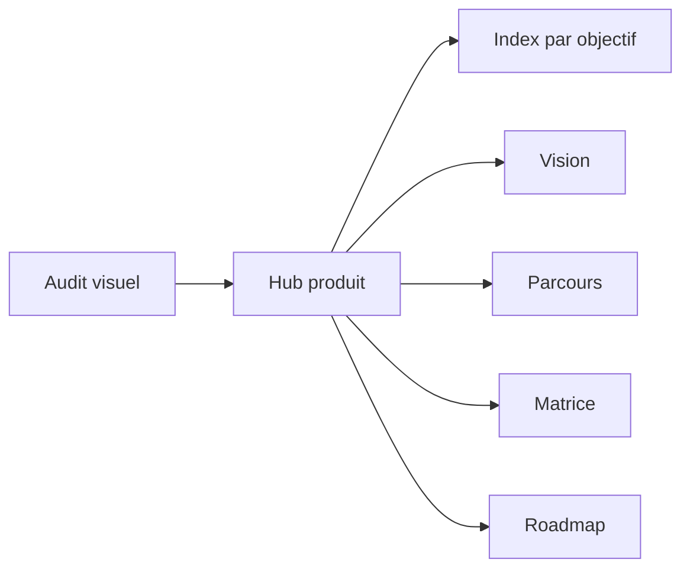

# Visual-first priorites

Top des pages ou le visuel apporte le plus de clarté et réduit le temps de comprehension.

## Classement

1. [documentation/index-par-objectif.md](../index-par-objectif.md) - table d'orientation generale
2. [documentation/product/vision-et-objectifs.md](./vision-et-objectifs.md) - vision produit
3. [documentation/product/matrice-rubriques.md](./matrice-rubriques.md) - correspondance rubriques / sections
4. [documentation/product/parcours-utilisateurs.md](./parcours-utilisateurs.md) - parcours et persona
5. [documentation/product/roadmap-priorisee.md](./roadmap-priorisee.md) - ordre d'execution
6. [documentation/product/SCIENTIFIC_PROTOCOL.md](./SCIENTIFIC_PROTOCOL.md) - methodologie des indicateurs
7. [documentation/architecture/system-overview.md](../architecture/system-overview.md) - vue d'ensemble technique
8. [documentation/architecture/modules-cles-et-dependances.md](../architecture/modules-cles-et-dependances.md) - dépendances et zones cles
9. [documentation/security/authz-authn-regles.md](../security/authz-authn-regles.md) - regles d'acces
10. [documentation/operations/incidents-frequents-et-reprise.md](../operations/incidents-frequents-et-reprise.md) - reprise et incidents

## Criteres de choix

- si une page sert a decider, le visuel doit montrer la structure ;
- si une page sert a executer, le visuel doit montrer les etapes ;
- si une page sert a controler, le visuel doit montrer les points de vigilance ;
- si une page sert a comparer, le visuel doit montrer la relation entre les blocs.
