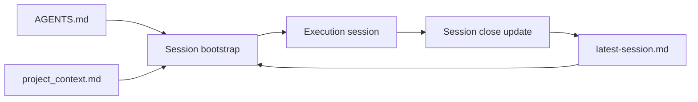

# Codex Memory Governance

## Architecture memoire session

Fallback statique:
```md

```

## Purpose
Keep Codex context stable across sessions while minimizing token waste.

## Source-of-truth layers
1. `AGENTS.md` (stable rules)
- Global operating rules and response style.
- Update rarely (only when process changes).

2. `project_context.md` (semi-stable project context)
- Architecture, stack, critical files, and validation commands.
- Update when architecture or workflows change.

3. `documentation/du/session/latest-session.md` (volatile session memory)
- Recent done, in-progress, next, and risks.
- Update at the end of each meaningful session.

## Update cadence
- `AGENTS.md`: monthly or by explicit process decision.
- `project_context.md`: when runtime topology or conventions change.
- `documentation/du/session/latest-session.md`: every session close.

## Session protocol
Start:
1. Run `npm run session:bootstrap`.
2. Run `npm run session:budget`.
3. Confirm scope and risks.

Close:
1. Run `npm run session:close -- --done "..." --next "..." --risk "..."`.
2. Keep entries short and factual.

## Anti-drift rules
- Do not duplicate stable rules in `latest-session.md`.
- Do not store volatile TODO lists in `AGENTS.md`.
- Keep each section concise and deduplicated.
- Keep `documentation/du/session/latest-session.md` below line budget (default cap: 140 lines, 8 items/section).
