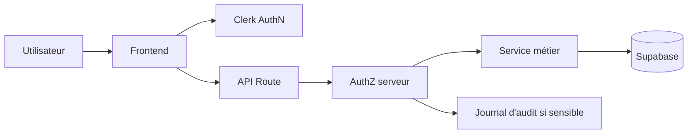

# AuthN, AuthZ, secrets et frontières API

Référence durable pour l'authentification, les permissions, les dérogations administratives et les frontières d'accès.

## Principes

```txt
AuthN = qui est l'utilisateur ?
AuthZ = que peut-il faire dans ce contexte ?
Ownership = cette ressource lui appartient-elle ?
Override = agit-il explicitement comme modérateur ?
Audit = l'opération sensible est-elle traçable ?
```

Une session valide ne donne jamais implicitement tous les droits.

## Architecture



## Identité principale

Clerk est le fournisseur d'identité principal du web.

Les profils Supabase servent aux jointures et aux règles métier.

Préserver la distinction entre :

```txt
Role
SessionRole
Parcours
```

Ne pas créer une seconde identité canonique indépendante sans ADR.

## Catégories d'accès

Chaque surface doit appartenir à une catégorie explicite.

| Catégorie | Exemple | Contrôle |
|---|---|---|
| Public | health, contenu public | aucune session requise |
| Authentifié | profil courant | session |
| Propriétaire | modifier sa ressource | session + ownership |
| Organisateur | gérer son action | session + relation organisateur |
| Admin-like | modération globale | rôle serveur |
| Service | cron, RPC privilégiée | secret/service role |
| Webhook | Stripe ou tiers | signature |

## Routes sensibles

Fichiers pivots :

```txt
apps/web/src/lib/auth/protected-routes.ts
apps/web/src/proxy.ts
apps/web/src/lib/authz.ts
apps/web/src/lib/auth/
apps/web/src/app/api/
```

Le proxy ne remplace pas l'autorisation du handler.

## Permissions sur les actions

### Utilisateur ordinaire

Un utilisateur ordinaire peut suivre le parcours normal prévu par le produit.

Exemples :

- créer une action ;
- demander à rejoindre ;
- annuler sa propre demande ;
- modifier ce que son rôle et l'ownership autorisent.

### Organisateur

Un organisateur autorisé peut, selon le contrat de l'action :

- consulter les demandes ;
- accepter ou refuser ;
- ajouter ou retirer un participant ;
- ouvrir ou fermer les inscriptions ;
- modifier les informations autorisées.

Cette gestion reste limitée à sa propre action. Elle ne déclenche pas les droits de modération globale et ne doit pas être confondue avec une dérogation admin.

### Admin, élu ou max

Un rôle privilégié peut disposer de droits de supervision globale.

Mais :

> un admin qui utilise le parcours utilisateur normal reste dans le parcours normal.

Exemple canonique :

```txt
demande normale pour rejoindre l'action d'un tiers
→ participationStatus: "pending"
→ participationSource: "group_form"
```

Le rôle privilégié ne doit pas transformer automatiquement cette demande en participation confirmée.

## Dérogation administrative

Une dérogation doit être distincte du flux normal.

Exemples :

- confirmer manuellement un participant ;
- corriger une attribution ;
- masquer ou restaurer une action ;
- corriger un impact validé ;
- modifier un organisateur ;
- supprimer un contenu abusif.

Une dérogation sensible doit :

1. vérifier le rôle côté serveur ;
2. être explicite dans le code ;
3. être séparée du bouton ou flux utilisateur normal ;
4. exiger un motif lorsque pertinent ;
5. créer une trace d'audit ;
6. utiliser une source claire, par exemple `admin_override`, si le contrat le permet.

Ne pas utiliser un booléen envoyé par le client comme preuve d'autorisation.

Pour les participations d'action, les nouvelles dérogations administratives utilisent `participation_source = admin_override`. La valeur historique `admin` reste acceptée en lecture pour compatibilité, mais elle ne doit plus être utilisée par le flux normal de jonction.

Un retrait d'un participant déjà confirmé est une opération distincte `admin_remove_participant`. Elle exige un motif, conserve la cible utilisateur et journalise l'état avant/après. Un refus de demande en attente reste `admin_review_reject`.

Le contrat d'audit action doit conserver au minimum :

- l'identifiant d'opération ;
- l'administrateur ou modérateur auteur ;
- l'action cible ;
- l'opération métier ;
- l'issue `success` ou `error` ;
- le motif lorsqu'il est obligatoire ;
- l'ancienne valeur et la nouvelle valeur lorsqu'une donnée change ;
- la cible utilisateur lorsque l'opération concerne une participation ou un compte ;
- le contexte technique utile, sans pouvoir écraser les champs canoniques.

Les opérations sensibles comme rejet, masquage, restauration, correction d'impact, changement d'organisateur ou dérogation de participation exigent un motif d'au moins 5 caractères après trim.

Le journal d'audit d'une action n'est pas public. Il peut être lu par le créateur de l'action, ses organisateurs/coorganisateurs autorisés et les rôles de modération `admin`, `elu`, `max`.

Ne pas ajouter `change_organizer` ou `reopen_action` tant qu'une commande produit et un modèle d'état explicites n'existent pas. Un changement d'organisateur devra préserver les coorganisateurs existants et auditer avant/après.

## Visibilité de modération des actions

Le masquage de modération est distinct du statut métier de l'action.

```txt
status = pending | approved | rejected
moderation_visibility = visible | hidden
```

Une action `hidden` est exclue des surfaces publiques, dont la carte, les listes publiques et la page Formulaire de groupe. Elle reste traitable par les chemins de modération autorisés.

Restaurer `moderation_visibility = visible` ne valide pas l'action et ne transforme pas une pré-action en collecte finalisée.

## Centralisation des permissions

Éviter les comparaisons dispersées de chaînes de rôles.

Préférer des helpers centraux déjà existants ou à compléter.

Exemples de capacités :

```txt
canManageAction
canReviewActionParticipants
canModerateAnyAction
canUseAdminOverride
canEditValidatedImpact
canChangeActionStatus
canViewModerationAudit
```

Ne pas créer un système parallèle si un helper canonique existe déjà.

## Auto-validation

Une action créée par un profil de modération pour son propre compte peut suivre une règle d'auto-validation si le contrat métier l'autorise.

Cette règle doit être :

- explicite ;
- côté serveur ;
- testée ;
- traçable.

Ne pas auto-valider une action créée au nom d'un tiers sans règle métier explicite.

## Supabase et RLS

L'AuthZ applicative ne remplace pas RLS.

Tester :

- anonyme ;
- connecté propriétaire ;
- connecté non-propriétaire ;
- admin-like ;
- service role si réellement nécessaire.

Ne jamais :

- désactiver RLS pour débloquer un flux ;
- envoyer `service_role` au client ;
- accorder une RPC sensible au public uniquement pour contourner un échec client.

## Secrets

Les secrets restent côté serveur.

Exemples :

```txt
SUPABASE_SERVICE_ROLE_KEY
CLERK_SECRET_KEY
RESEND_API_KEY
STRIPE_SECRET_KEY
STRIPE_WEBHOOK_SECRET
CRON_SECRET
```

Commande :

```bash
npm run security:secrets
```

## Frontières API

Le test :

```txt
apps/web/src/app/api/api-boundary.test.ts
```

doit protéger au minimum :

- familles API sensibles ;
- health endpoints publics ;
- absence de doublons dans les patterns protégés.

Tests complémentaires :

```txt
apps/web/src/lib/auth/protected-routes.test.ts
apps/web/src/proxy.protected-routes.test.ts
apps/web/src/lib/seo/indexability.test.ts
```

## Checklist avant modification sensible

```txt
□ Session requise ?
□ Rôle requis ?
□ Ownership requis ?
□ État métier vérifié ?
□ Input validé ?
□ RLS cohérente ?
□ RPC correctement permissionnée ?
□ Override séparé du flux normal ?
□ Motif requis ?
□ Audit requis ?
□ Test négatif présent ?
```

## Validation

```bash
npm run test:security
npm run test
npm run typecheck
npm run lint
```

Pour une modification structurante :

```bash
npm run checks
```
