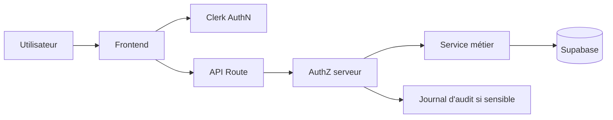

# AuthN, AuthZ, secrets et frontières API

Référence durable pour l'authentification, les permissions, les dérogations administratives et les frontières d'accès.

Le modèle de capacités et de périmètres cible est défini dans :

```txt
documentation/security/authorization-capabilities.md
```

Ce document conserve les contrats techniques AuthN/AuthZ et les règles propres aux surfaces existantes. En cas de divergence pendant la migration, le code et les tests actuels décrivent le comportement réellement implémenté ; la matrice de capacités décrit la direction à atteindre.

## Principes

```txt
AuthN = qui est l'utilisateur ?
AuthZ = que peut-il faire dans ce contexte ?
Capability = quelle opération métier demande-t-il ?
Scope = dans quel périmètre peut-il l'exercer ?
Ownership = cette ressource lui appartient-elle ?
Override = agit-il explicitement comme modérateur ?
Audit = l'opération sensible est-elle traçable ?
```

Une session valide ne donne jamais implicitement tous les droits.

La décision serveur cible suit :

```txt
identité
+ capacité
+ rôle compatible
+ scope / ownership
+ état métier
+ projection de données autorisée
```

## Architecture


```mermaid
flowchart LR
  U[Utilisateur] --> UI[Frontend]
  UI --> CL[Clerk AuthN]
  UI --> API[API Route]
  API --> AZ[AuthZ serveur]
  AZ --> DOMAIN[Service métier]
  DOMAIN --> SB[(Supabase)]
  AZ --> AUDIT[Journal d'audit si sensible]
```

## Identité principale

Clerk est le fournisseur d'identité principal du web.

Les profils Supabase servent aux jointures et aux règles métier.

Préserver la distinction entre :

```txt
Role
SessionRole
Parcours
Capability
Scope
```

Ne pas créer une seconde identité canonique indépendante sans ADR.

Le vocabulaire du rôle privilégié est unifié : **IMU = rôle interne `max`**.
L'autorité d'IMU est toutefois une identité Clerk canonique, pas une valeur de
rôle. Chaque instance Clerk configure un couple serveur distinct
`CLERK_IMU_OWNER_USER_ID` / `CLERK_IMU_OWNER_EMAIL`; l'accès `max` exige l'ID
exact et l'email principal exactement correspondant avec le statut
`verified`. Une erreur Clerk, une absence de configuration ou un mismatch
refuse le privilège. Les métadonnées Clerk, `profiles.role_label` dans
Supabase, `CREATOR_INBOX_EMAIL`, `CLERK_ADMIN_USER_IDS` et les alias historiques
(`owner`, `godmode`, `creator`, `super_admin`, etc.) ne sont jamais des preuves
suffisantes. Les alias restent uniquement acceptés à la frontière de lecture
legacy pour les rôles non privilégiés.

Le bypass `CMM_DEV_AUTH_BYPASS` est accepté seulement avec
`NODE_ENV=development` et un hostname strictement local (`localhost`,
`127.0.0.1` ou `[::1]`). `dev-max` est synthétique et local; `dev-admin` sert
à tester l'administration sans réutiliser l'identité IMU. Aucun de ces comptes
ne représente un utilisateur Clerk ou Supabase et aucun n'est accepté sur
Preview, Production ou un hôte distant.

`service_role` est une identité technique serveur. Ce n'est jamais un rôle utilisateur ni une preuve d'autorisation HTTP.

## Règles durables pour les tests authentifiés

- Clerk reste l'AuthN canonique en production. Un test de surface protégée en
  production doit donc utiliser une vraie session Clerk et le contrôle serveur
  habituel.
- Le bypass `CMM_DEV_AUTH_BYPASS_*` est strictement limité au développement et
  aux hôtes locaux prévus pour les tests. Il ne doit jamais être accepté comme
  mécanisme d'authentification en production.
- Les tests navigateur locaux peuvent sélectionner, selon la surface testée,
  chacun des rôles canoniques : `benevole`, `coordinateur`, `scientifique`,
  `entreprise`, `elu`, `admin` et `max`. Ils doivent privilégier l'identité qui
  correspond réellement au rôle vérifié plutôt qu'utiliser `max` par défaut.
- Les handlers authentifiés réutilisent les helpers centraux compatibles avec
  Clerk et le bypass local. Ils ne recréent pas une logique d'identification
  parallèle à partir de `auth()` ou d'en-têtes propres au handler.
- Aucun bypass de production ne doit être ajouté pour faciliter un test. Si une
  preuve de production est nécessaire, elle doit passer par le parcours et les
  permissions réels.
- Les tests d'AuthZ doivent vérifier les refus de scope : owner/non-owner,
  organizer/non-organizer, organisation A/B, territoire A/B lorsque ces scopes
  existent.

## Catégories d'accès

Chaque surface doit appartenir à une catégorie explicite.

| Catégorie | Exemple | Contrôle |
|---|---|---|
| Public | health, contenu public | aucune session requise |
| Authentifié | profil courant | session |
| Propriétaire | modifier sa ressource | session + ownership |
| Organisateur | gérer son action | session + relation organisateur |
| Organisation | gérer les ressources de son organisation | session + relation canonique |
| Territoire | consulter/piloter un territoire | session + attribution territoriale canonique |
| Modération globale | dérogation plateforme | capacité privilégiée serveur |
| Service | cron, RPC privilégiée | secret/service role |
| Webhook | Stripe ou tiers | signature |

Une relation organisationnelle ou territoriale absente ou ambiguë ne doit jamais être remplacée par un droit global.

## Routes sensibles

Fichiers pivots :

```txt
apps/web/src/lib/auth/protected-routes.ts
apps/web/src/proxy.ts
apps/web/src/lib/authz.ts
apps/web/src/lib/auth/
apps/web/src/lib/profiles.ts
apps/web/src/app/api/
```

Le proxy ne remplace pas l'autorisation du handler.

La navigation et le parcours UX ne remplacent pas non plus l'AuthZ serveur.

## Rôles et capacités

Les rôles ne sont pas une hiérarchie linéaire.

La cible est :

```txt
benevole     → self / owned
coordinateur → organized / organization
scientifique → sanitized analytics
entreprise   → organization
elu          → territory
admin        → global moderation
max          → platform administration
```

Le contrat détaillé, les scopes et les données accessibles sont définis dans `authorization-capabilities.md`.

### Divergence actuelle importante

Le code générique considère principalement `admin` et `max` comme rôles admin-like, tandis que le domaine Actions inclut encore actuellement `elu` dans certaines capacités de modération globale.

Cette divergence est un état à faire converger, pas une règle à propager.

Ne pas conclure :

```txt
elu peut modérer globalement les actions
→ donc elu doit devenir admin-like partout
```

La direction cible est :

```txt
elu → scope territorial explicite
admin/max → modération globale selon capacité
```

Tant qu'une relation territoriale canonique n'existe pas pour une opération, appliquer le fail-closed plutôt qu'un fallback global.

## Permissions sur les actions

### Utilisateur ordinaire

Un utilisateur ordinaire peut suivre le parcours normal prévu par le produit.

Exemples :

- créer une action ;
- demander à rejoindre ;
- annuler sa propre demande ;
- modifier ce que l'ownership autorise.

Le rôle seul ne permet pas de modifier une action d'un tiers.

### Organisateur

Un organisateur autorisé peut, selon le contrat de l'action :

- consulter les demandes ;
- accepter ou refuser ;
- ajouter ou retirer un participant ;
- ouvrir ou fermer les inscriptions ;
- modifier les informations autorisées.

Cette gestion reste limitée à l'action dont il est organisateur/coorganisateur. Elle ne déclenche pas les droits de modération globale et ne doit pas être confondue avec une dérogation admin.

### Dérogation globale et future dérogation territoriale

Une dérogation globale doit être une capacité explicite de modération, normalement réservée au rôle qui possède cette capacité dans le domaine concerné.

Une future dérogation territoriale pour `elu` doit être distincte :

```txt
canModerateTerritoryAction(identity, action, territoryAssignment)
```

et ne doit être activée que lorsque :

- le territoire de l'utilisateur est canonique ;
- le territoire de la ressource est canonique ;
- la relation est vérifiée côté serveur ;
- les cas territoire A / territoire B sont testés.

Un utilisateur privilégié qui suit le parcours utilisateur normal reste dans le parcours normal.

Exemple canonique :

```txt
admin demande normalement à rejoindre l'action d'un tiers
→ participationStatus: "pending"
→ participationSource: "group_form"
```

Le rôle privilégié ne doit pas transformer automatiquement cette demande en participation confirmée.

## Dérogation administrative

Une dérogation doit être distincte du flux normal.

Exemples :

- confirmer manuellement un participant ;
- corriger une attribution ;
- masquer ou restaurer une action ;
- corriger un impact validé ;
- modifier un organisateur ;
- supprimer un contenu abusif.

Une dérogation sensible doit :

1. vérifier l'identité et la capacité côté serveur ;
2. vérifier le scope lorsque l'opération n'est pas globale ;
3. être explicite dans le code ;
4. être séparée du bouton ou flux utilisateur normal ;
5. exiger un motif lorsque pertinent ;
6. créer une trace d'audit ;
7. utiliser une source claire, par exemple `admin_override`, si le contrat le permet.

Ne pas utiliser un booléen envoyé par le client comme preuve d'autorisation.

Pour les participations d'action, les nouvelles dérogations administratives utilisent `participation_source = admin_override`. La valeur historique `admin` reste acceptée en lecture pour compatibilité, mais elle ne doit plus être utilisée par le flux normal de jonction.

Un retrait d'un participant déjà confirmé est une opération distincte `admin_remove_participant`. Elle exige un motif, conserve la cible utilisateur et journalise l'état avant/après. Un refus de demande en attente reste `admin_review_reject`.

Le contrat d'audit action doit conserver au minimum :

- l'identifiant d'opération ;
- l'administrateur ou modérateur auteur ;
- l'action cible ;
- l'opération métier ;
- l'issue `success` ou `error` ;
- le motif lorsqu'il est obligatoire ;
- l'ancienne valeur et la nouvelle valeur lorsqu'une donnée change ;
- la cible utilisateur lorsque l'opération concerne une participation ou un compte ;
- le contexte technique utile, sans pouvoir écraser les champs canoniques.

Les opérations sensibles comme rejet, masquage, restauration, correction d'impact, changement d'organisateur ou dérogation de participation exigent un motif d'au moins 5 caractères après trim lorsqu'elles sont classées comme telles par leur contrat.

Le journal d'audit d'une action n'est pas public. Son droit de lecture doit suivre une capacité dédiée et la minimisation des données. Les accès historiques actuellement présents doivent être relus lors de la convergence vers la matrice de capacités.

Ne pas ajouter `change_organizer` ou `reopen_action` tant qu'une commande produit et un modèle d'état explicites n'existent pas. Un changement d'organisateur devra préserver les coorganisateurs existants et auditer avant/après.

## Visibilité de modération des actions

Le masquage de modération est distinct du statut métier de l'action.

```txt
status = pending | approved | rejected
moderation_visibility = visible | hidden
```

Une action `hidden` est exclue des surfaces publiques, dont la carte, les listes publiques et la page Formulaire de groupe. Elle reste traitable par les chemins de modération autorisés.

### Frontière de lecture de `GET /api/actions`

La lecture publique globale est toujours public-safe : une requête sans statut,
avec un statut invalide ou avec `status=approved` ne restitue que les actions
approuvées et les signalements Trash Spotter `validated` ou `cleaned`. Cette
lecture peut utiliser `loadOrRefreshPublicSurfaceSnapshot`.

Toute vue qui peut inclure un état non public — `status=pending`,
`status=rejected` ou la vue globale explicite `status=all` — exige l'AuthN puis
l'AuthZ de modération prévue par le code courant. Au moment de la rédaction,
le domaine Actions accepte encore `admin`, `elu` ou `max` sur certaines de ces
surfaces. Cette permission actuelle doit rester testée jusqu'à sa migration et
ne doit pas être généralisée à d'autres domaines.

La cible architecturale reste :

```txt
admin/max → capacité de modération globale
elu       → lecture/pilotage territorial puis éventuelle modération territoriale bornée
```

Les vues non publiques sont lues directement et ne doivent jamais passer par un snapshot de surface publique.

Restaurer `moderation_visibility = visible` ne valide pas l'action et ne transforme pas une pré-action en collecte finalisée.

### Frontière de lecture de la carte publique

`GET /api/actions/map` est une projection public-safe distincte des lectures de
modération. Quel que soit le paramètre `status` fourni (`approved`, `pending`,
`rejected` ou `all`), le handler conserve la compatibilité de l'URL mais
normalise la lecture vers les actions `approved` et `moderation_visibility =
visible`. Cette règle est appliquée à la fois avec et sans viewport, y compris
lorsqu'un snapshot existant est servi.

Le fallback navigateur appelle `actions_map_feed` avec le statut public
`approved` et filtre défensivement ses lignes. La RPC ne restitue elle-même que
les actions approuvées et visibles et les lignes
`trash_spotter_spots.status IN ('validated', 'cleaned')`. La RLS de cette table
interdit également la lecture directe des lignes `new` aux rôles anon et
authenticated.

La lecture propriétaire `GET /api/signalements/me` reste séparée : elle utilise
la session du compte courant et peut restituer ses propres observations `new`,
sans les exposer à la carte publique.

## Lecture propriétaire Trash Spotter

La capacité `GET /api/signalements/me` est une surface propriétaire dédiée au
suivi des observations du compte connecté. Le handler appelle
`requireAuthenticatedAccess`, utilise exclusivement le `userId` retourné par
ce contrôle et filtre `trash_spotter_spots.created_by_clerk_id = userId` côté
serveur. Aucun paramètre client ne peut sélectionner un autre propriétaire.

Cette lecture est limitée aux types `spot` et `clean_place`, aux statuts
canoniques `new`, `validated` et `cleaned`, avec un ordre `created_at DESC` et
une limite de 20 par défaut plafonnée à 50. Son DTO ne contient que les champs
nécessaires au suivi utilisateur : identité, date, type, libellé, statut,
coordonnées et dates de validation/nettoyage. Il ne passe ni par
`GET /api/actions` ni par un snapshot de surface publique et doit rester
strictement privé (`no-store`).

La lecture des preuves photo reste une capacité séparée. Elle n'est déclenchée
qu'après le clic de l'auteur sur `Voir les preuves photo`; l'ownership média
existant autorise l'auteur à lire ses propres preuves, y compris lorsque le
signalement est encore `new`.

## Lecture propriétaire des missions GPS

La route `/missions/[id]` est une surface applicative protégée par AuthN Clerk.
Le proxy assure l'entrée authentifiée mais ne remplace pas l'AuthZ serveur de
la capacité de lecture.

La capacité serveur suit obligatoirement cet ordre :

1. appeler `requireAuthenticatedAccess` ;
2. résoudre le rôle avec `getCurrentUserRoleLabel` et le helper central
   `isAdminLikeProfile` ;
3. lire la mission ciblée avec `volunteer_id` ;
4. autoriser le `userId` correspondant à `volunteer_id`, ou un profil
   `admin`/`max` ;
5. lire `gps_points` seulement après cette décision positive.

`mission` et `gps_points` constituent une donnée propriétaire sensible. Un
profil `elu` ou un autre profil ordinaire ne reçoit pas un accès par analogie
avec la modération des actions. `created_by` reste une provenance potentielle
et ne constitue pas une permission tant qu'un producteur et un contrat d'accès
explicites ne sont pas établis.

Le `service_role` peut être utilisé par cette capacité comme moyen technique
strictement serveur, mais il ne constitue jamais l'autorisation : toute
restitution reste conditionnée par la décision d'ownership ou de rôle
privilégié. La lecture mission/GPS est directe, sans cache partagé indexé par
`missionId`, et aucun partage public n'est autorisé sans future vue sanitizée
explicite.

## Centralisation des permissions

Éviter les comparaisons dispersées de chaînes de rôles.

Préférer des helpers de capacité orientés domaine.

Exemples existants :

```txt
canManageAction
canReviewActionParticipants
canModerateAnyAction
canUseAdminOverride
canEditValidatedImpact
canChangeActionStatus
canViewModerationAudit
```

Exemples de cibles plus précises lorsqu'un scope est nécessaire :

```txt
canModerateAction(identity, action, scope)
canViewTerritoryReport(identity, territory)
canManageOrganizationResource(identity, organization)
canAssignRole(identity, targetRole)
```

Ne pas créer un moteur universel parallèle si les helpers de domaine suffisent. La convergence porte sur le vocabulaire, les invariants et les scopes, pas sur une abstraction unique obligatoire.

## Permissions sur les données

L'accès à une fonctionnalité ne donne pas accès à toutes les colonnes disponibles.

Appliquer la minimisation des DTO :

```txt
public
owner_private
scoped_operational
sanitized_analytics
privileged_admin
security_audit
```

Un scientifique doit recevoir les données nécessaires à l'analyse, pas les PII disponibles par commodité.

Un élu doit recevoir les informations nécessaires au pilotage territorial, pas un accès implicite à tous les comptes individuels du territoire.

Une projection serveur sanitizée est préférable au chargement d'un objet complet suivi d'un masquage client.

## Auto-validation

Une action créée par un profil de modération pour son propre compte peut suivre une règle d'auto-validation si le contrat métier l'autorise.

Cette règle doit être :

- explicite ;
- côté serveur ;
- testée ;
- traçable.

Ne pas auto-valider une action créée au nom d'un tiers sans règle métier explicite.

## Supabase et RLS

L'AuthZ applicative ne remplace pas RLS.

Tester selon le domaine :

- anonyme ;
- connecté propriétaire ;
- connecté non-propriétaire ;
- organisateur / non-organisateur ;
- organisation A / organisation B ;
- territoire A / territoire B ;
- admin ;
- max ;
- service role si réellement nécessaire.

Ne jamais :

- désactiver RLS pour débloquer un flux ;
- envoyer `service_role` au client ;
- accorder une RPC sensible au public uniquement pour contourner un échec client ;
- utiliser `service_role` comme justification de l'autorisation d'un utilisateur ;
- élargir une policy organisationnelle ou territoriale faute de relation canonique.

## Secrets

Les secrets restent côté serveur.

Exemples :

```txt
SUPABASE_SERVICE_ROLE_KEY
CLERK_SECRET_KEY
RESEND_API_KEY
STRIPE_SECRET_KEY
STRIPE_WEBHOOK_SECRET
CRON_SECRET
```

Commande :

```bash
npm run security:secrets
```

## Frontières API

Le test :

```txt
apps/web/src/app/api/api-boundary.test.ts
```

doit protéger au minimum :

- familles API sensibles ;
- health endpoints publics ;
- absence de doublons dans les patterns protégés.

Tests complémentaires :

```txt
apps/web/src/lib/auth/protected-routes.test.ts
apps/web/src/proxy.protected-routes.test.ts
apps/web/src/lib/seo/indexability.test.ts
```

Le fait qu'une route soit protégée ne prouve pas que chaque capacité interne de cette route est autorisée correctement.

## Checklist avant modification sensible

```txt
□ Session requise ?
□ Capacité exacte identifiée ?
□ Rôle compatible ?
□ Scope minimal identifié ?
□ Ownership / organisation / territoire vérifié côté serveur ?
□ État métier vérifié ?
□ Projection de données minimale ?
□ Input validé ?
□ RLS cohérente ?
□ RPC correctement permissionnée ?
□ Override séparé du flux normal ?
□ Motif requis ?
□ Audit requis ?
□ Tests négatifs de scope présents ?
```

## Validation

```bash
npm run test:security
npm run test
npm run typecheck
npm run lint
```

Pour une modification structurante :

```bash
npm run checks
```

## Références

```txt
documentation/security/authorization-capabilities.md
documentation/architecture/adr/ADR-007-capability-scoped-authorization.md
apps/web/src/lib/domain-language.ts
apps/web/src/lib/profiles.ts
apps/web/src/lib/authz.ts
apps/web/src/lib/actions/permissions.ts
```
