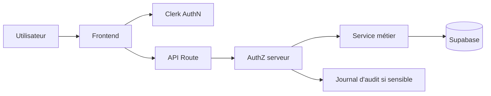

# AuthN, AuthZ, secrets et frontières API (`CURRENT`)

> Source canonique de l'état runtime actuel. La matrice de capacités cible est
> séparée dans [`authorization-capabilities.md`](./authorization-capabilities.md)
> et ne doit pas être lue comme une permission déjà déployée.

Référence durable pour l'authentification, les permissions, les dérogations administratives et les frontières d'accès.

Le modèle de capacités et de périmètres cible est défini dans :

```txt
documentation/security/authorization-capabilities.md
```

Ce document conserve les contrats techniques AuthN/AuthZ et les règles propres aux surfaces existantes. En cas de divergence pendant la migration, le code et les tests actuels décrivent le comportement réellement implémenté ; la matrice de capacités décrit la direction à atteindre.

## Principes

```txt
AuthN = qui est l'utilisateur ?
AuthZ = que peut-il faire dans ce contexte ?
Capability = quelle opération métier demande-t-il ?
Scope = dans quel périmètre peut-il l'exercer ?
Ownership = cette ressource lui appartient-elle ?
Override = agit-il explicitement comme modérateur ?
Audit = l'opération sensible est-elle traçable ?
```

Une session valide ne donne jamais implicitement tous les droits.

La décision serveur cible suit :

```txt
identité
+ capacité
+ rôle compatible
+ scope / ownership
+ état métier
+ projection de données autorisée
```

## Architecture


```mermaid
flowchart LR
  U[Utilisateur] --> UI[Frontend]
  UI --> CL[Clerk AuthN]
  UI --> API[API Route]
  API --> AZ[AuthZ serveur]
  AZ --> DOMAIN[Service métier]
  DOMAIN --> SB[(Supabase)]
  AZ --> AUDIT[Journal d'audit si sensible]
```

## Identité principale

Clerk est le fournisseur d'identité principal du web.

Les profils Supabase servent aux jointures et aux règles métier.

Préserver la distinction entre :

```txt
Role
SessionRole
Parcours
Capability
Scope
```

Ne pas créer une seconde identité canonique indépendante sans ADR.

Le vocabulaire du rôle privilégié est unifié : **IMU = super-admin = rôle
interne `max`**. `max` est la valeur technique canonique, `IMU` le libellé
produit, et `super-admin` (ainsi que `super_admin` et `superadmin`) un alias
entrant normalisé vers `max`. Aucun de ces termes ne représente un niveau de
permission différent. Les alias historiques `owner`, `godmode` et `creator`
restent limités à la compatibilité d'entrée.

`service_role` est une identité technique serveur. Ce n'est jamais un rôle utilisateur ni une preuve d'autorisation HTTP.

### Séparation obligatoire du rôle attribué, du rôle actif et du profil UX

L'identité courante doit exposer le contrat suivant :

```ts
role: GrantedRole          // GRANTED_ROLE : attribution réellement obtenue
activeRole: ActiveRole     // ACTIVE_ROLE : rôle qui pilote les capacités
activeProfile: AppProfile  // alias UX/legacy, sans permission autonome
```

`role` reste l'attribution obtenue et ne peut pas être modifié par le menu.
Les capacités effectives des gardes, de `EffectiveAccess` et des APIs sensibles
sont calculées depuis `activeRole`, qui doit toujours être autorisé par
`role`. `activeProfile` est un alias de compatibilité UX/legacy ; il sert à la
navigation, aux CTA, aux libellés et aux priorités de parcours, mais ne donne
jamais de permission indépendante.

Le rôle actif est résolu après le rôle attribué :

```txt
role = résolution Clerk + allowlists d'identifiants + règles d'identité
activeRole = activeRole persisté si valide pour role, sinon role
activeProfile = alias de lecture de activeRole
```

Une valeur persistée ne peut être retenue que si elle appartient à
`getSwitchableProfiles(role)`. Toute absence, valeur inconnue ou combinaison
incompatible utilise `activeRole = role`, puis `activeProfile = activeRole`.
Ce fallback protège à la fois les anciens comptes et les métadonnées
partiellement migrées.

La matrice de sélection est asymétrique et ne constitue pas une hiérarchie de
droits :

| GRANTED_ROLE | ACTIVE_ROLE sélectionnables |
|---|---|
| rôle ouvert | rôles ouverts |
| `elu` | rôles ouverts + `elu` + `admin` |
| `admin` | rôles ouverts + `admin` |
| `max` | rôles ouverts + `elu` + `admin` + `max` |

L'exception produit autorise donc `elu → admin`, mais interdit `admin → elu`.
`elu` et `admin` restent des rôles distincts : tant que
`ACTIVE_ROLE=elu`, le compte ne reçoit aucune capacité admin globale. Une
bascule explicite vers `ACTIVE_ROLE=admin` active les capacités admin normales
sans modifier `GRANTED_ROLE`. Cette bascule est volontaire et explicite de la
part de l'utilisateur ; elle ne constitue ni un héritage implicite ni une
faille de privilège.

La mutation UX canonique est `POST /api/account/active-profile`. Elle doit
valider la session, résoudre le `role` côté serveur, vérifier la cible avec
`getSwitchableProfiles(role)`, écrire uniquement `activeRole` dans Clerk et
déclencher la synchronisation canonique vers Supabase. L'ancien champ
`activeProfile` peut être accepté comme entrée de compatibilité puis normalisé
vers `activeRole`. La route ne doit jamais accepter ou réécrire `role` depuis
le payload client.

`POST /api/account/profile-role` est une route historique retirée du parcours
UX. Elle ne doit plus servir de sélecteur de persona ; les sessions
authentifiées reçoivent `410` et doivent migrer vers la route dédiée.

Invariants de non-régression :

- aucun `benevole → admin` ou `admin → max` automatique ;
- `elu → admin` est autorisé comme exception de sélection active ; `admin → elu`
  est refusé ;
- aucun refresh ou onboarding ne rétrograde silencieusement `admin` ou `max` ;
- `role=max` est conservé lorsque `activeRole=benevole` ;
- `role=admin` est conservé lorsque `activeRole=scientifique` ;
- `activeProfile` ne constitue jamais une preuve de permission ;
- les privilèges sont portés par les identifiants/allowlists et métadonnées
  vérifiées, pas par une adresse email codée en dur.

## Règles durables pour les tests authentifiés

- Clerk reste l'AuthN canonique en production. Un test de surface protégée en
  production doit donc utiliser une vraie session Clerk et le contrôle serveur
  habituel.
- Le bypass `CMM_DEV_AUTH_BYPASS_*` est strictement limité au développement et
  aux hôtes locaux prévus pour les tests. Il ne doit jamais être accepté comme
  mécanisme d'authentification en production.
- Les tests navigateur locaux peuvent sélectionner, selon la surface testée,
  chacun des rôles canoniques : `benevole`, `coordinateur`, `scientifique`,
  `entreprise`, `elu`, `admin` et `max`. Ils doivent privilégier l'identité qui
  correspond réellement au rôle vérifié plutôt qu'utiliser `max` par défaut.
- Les handlers authentifiés réutilisent les helpers centraux compatibles avec
  Clerk et le bypass local. Ils ne recréent pas une logique d'identification
  parallèle à partir de `auth()` ou d'en-têtes propres au handler.
- Aucun bypass de production ne doit être ajouté pour faciliter un test. Si une
  preuve de production est nécessaire, elle doit passer par le parcours et les
  permissions réels.
- Les tests d'AuthZ doivent vérifier les refus de scope : owner/non-owner,
  organizer/non-organizer, organisation A/B, territoire A/B lorsque ces scopes
  existent.

## Catégories d'accès

Chaque surface doit appartenir à une catégorie explicite.

| Catégorie | Exemple | Contrôle |
|---|---|---|
| Public | health, contenu public | aucune session requise |
| Authentifié | profil courant | session |
| Propriétaire | modifier sa ressource | session + ownership |
| Organisateur | gérer son action | session + relation organisateur |
| Organisation | gérer les ressources de son organisation | session + relation canonique |
| Territoire | consulter/piloter un territoire | session + attribution territoriale canonique |
| Modération globale | dérogation plateforme | capacité privilégiée serveur |
| Service | cron, RPC privilégiée | secret/service role |
| Webhook | Stripe ou tiers | signature |

Une relation organisationnelle ou territoriale absente ou ambiguë ne doit jamais être remplacée par un droit global.

## Routes sensibles

Fichiers pivots :

```txt
apps/web/src/proxy.ts
apps/web/src/lib/authz.ts
apps/web/src/lib/auth/
apps/web/src/lib/profiles.ts
apps/web/src/app/api/
```

Le proxy ne remplace pas l'autorisation du handler.

La navigation et le parcours UX ne remplacent pas non plus l'AuthZ serveur.

## Rôles et capacités

Les rôles ne sont pas une hiérarchie linéaire.

La cible est :

```txt
benevole     → self / owned
coordinateur → organized / organization
scientifique → sanitized analytics
entreprise   → organization
elu          → territory
admin        → global moderation
max          → platform administration
```

Le contrat détaillé, les scopes et les données accessibles sont définis dans `authorization-capabilities.md`.

### Frontière globale et territoriale

Les capacités globales du domaine Actions sont explicitement réservées aux
rôles actifs `admin` et `max`. Le rôle actif `elu` n'obtient aucun override
global de modération, de statut, de participants, d'audit ou d'impact.

La règle runtime est donc :

```txt
elu → scope territorial explicite, sans override global
admin/max → capacités globales explicitement autorisées
```

La capacité cible `actions.moderate_territory`, c'est-à-dire la modération
territoriale des élus, est **NON IMPLÉMENTÉE** tant que
l'attribution territoriale de l'élu, le territoire canonique de l'action, la
relation vérifiable côté serveur et les tests de séparation territoire A/B ne
sont pas tous disponibles. En attendant, ce chemin est fail-closed plutôt que
remplacé par un fallback global.

Les prérequis complets et les opérations encore ouvertes sont définis dans la
section Élu de
[`authorization-capabilities.md`](./authorization-capabilities.md). Ce
document `CURRENT` ne confère donc aucune permission runtime à
`actions.moderate_territory`.

Un compte `GRANTED_ROLE=elu` qui sélectionne explicitement
`ACTIVE_ROLE=admin` utilise les capacités `admin` pendant cette session. En
`ACTIVE_ROLE=elu`, il perd immédiatement ces capacités globales.

## Permissions sur les actions

### Utilisateur ordinaire

Un utilisateur ordinaire peut suivre le parcours normal prévu par le produit.

Exemples :

- créer une action ;
- demander à rejoindre ;
- annuler sa propre demande ;
- modifier ce que l'ownership autorise.

Le rôle seul ne permet pas de modifier une action d'un tiers.

### Organisateur

Un organisateur autorisé peut, selon le contrat de l'action :

- consulter les demandes ;
- accepter ou refuser ;
- ajouter ou retirer un participant ;
- ouvrir ou fermer les inscriptions ;
- modifier les informations autorisées.

Cette gestion reste limitée à l'action dont il est organisateur/coorganisateur. Elle ne déclenche pas les droits de modération globale et ne doit pas être confondue avec une dérogation admin.

### Dérogation globale et future dérogation territoriale

Une dérogation globale doit être une capacité explicite de modération, normalement réservée au rôle qui possède cette capacité dans le domaine concerné.

Une future capacité territoriale pour `elu`, nommée
`actions.moderate_territory`, doit être distincte :

```txt
canModerateTerritoryAction(identity, action, territoryAssignment)
```

et ne doit être activée que lorsque :

- le territoire de l'utilisateur est canonique ;
- le territoire de la ressource est canonique ;
- la relation est vérifiée côté serveur ;
- les cas territoire A / territoire B sont testés.

Un utilisateur privilégié qui suit le parcours utilisateur normal reste dans le parcours normal.

Exemple canonique :

```txt
admin demande normalement à rejoindre l'action d'un tiers
→ participationStatus: "pending"
→ participationSource: "group_form"
```

Le rôle privilégié ne doit pas transformer automatiquement cette demande en participation confirmée.

## Dérogation administrative

Une dérogation doit être distincte du flux normal.

Exemples :

- confirmer manuellement un participant ;
- corriger une attribution ;
- masquer ou restaurer une action ;
- corriger un impact validé ;
- modifier un organisateur ;
- supprimer un contenu abusif.

Une dérogation sensible doit :

1. vérifier l'identité et la capacité côté serveur ;
2. vérifier le scope lorsque l'opération n'est pas globale ;
3. être explicite dans le code ;
4. être séparée du bouton ou flux utilisateur normal ;
5. exiger un motif lorsque pertinent ;
6. créer une trace d'audit ;
7. utiliser une source claire, par exemple `admin_override`, si le contrat le permet.

Ne pas utiliser un booléen envoyé par le client comme preuve d'autorisation.

Pour les participations d'action, les nouvelles dérogations administratives utilisent `participation_source = admin_override`. La valeur historique `admin` reste acceptée en lecture pour compatibilité, mais elle ne doit plus être utilisée par le flux normal de jonction.

Un retrait d'un participant déjà confirmé est une opération distincte `admin_remove_participant`. Elle exige un motif, conserve la cible utilisateur et journalise l'état avant/après. Un refus de demande en attente reste `admin_review_reject`.

Le contrat d'audit action doit conserver au minimum :

- l'identifiant d'opération ;
- l'administrateur ou modérateur auteur ;
- l'action cible ;
- l'opération métier ;
- l'issue `success` ou `error` ;
- le motif lorsqu'il est obligatoire ;
- l'ancienne valeur et la nouvelle valeur lorsqu'une donnée change ;
- la cible utilisateur lorsque l'opération concerne une participation ou un compte ;
- le contexte technique utile, sans pouvoir écraser les champs canoniques.

Les opérations sensibles comme rejet, masquage, restauration, correction d'impact, changement d'organisateur ou dérogation de participation exigent un motif d'au moins 5 caractères après trim lorsqu'elles sont classées comme telles par leur contrat.

Le journal d'audit d'une action n'est pas public. Son droit de lecture doit suivre une capacité dédiée et la minimisation des données. Les accès historiques actuellement présents doivent être relus lors de la convergence vers la matrice de capacités.

Ne pas ajouter `change_organizer` ou `reopen_action` tant qu'une commande produit et un modèle d'état explicites n'existent pas. Un changement d'organisateur devra préserver les coorganisateurs existants et auditer avant/après.

## Visibilité de modération des actions

Le masquage de modération est distinct du statut métier de l'action.

```txt
status = pending | approved | rejected | cancelled
moderation_visibility = visible | hidden
published_at = NULL | timestamp de publication explicite
```

Une action `hidden` est exclue des surfaces publiques, dont la carte, les listes publiques et la page Formulaire de groupe. Elle reste traitable par les chemins de modération autorisés.

`cancelled` est un état métier terminal distinct de `rejected`. Seuls les
administrateurs autorisés (`ACTIVE_ROLE=admin|max`) peuvent annuler une
pré-action déjà publiée dont le début local est futur, après confirmation
explicite. L'annulation conserve l'identité de l'action et ses dépendances,
ainsi que `cancelled_at`, `cancelled_by_clerk_id`, le motif et le statut
précédent ; elle retire l'action des listes futures, du joinage et du partage.
Une discussion existante peut être relue en historique mais n'accepte plus de
nouveau message. Aucune action annulée n'est comptée comme réalisée ou
gamifiée, et aucune suppression physique n'est proposée par ce contrat.

`published_at` ne remplace ni `status` ni `moderation_visibility`. Une
pré-action créée ou seulement `pret_a_partager` conserve `published_at = NULL`
et reste privée. Seule la commande authentifiée `Publier cette action`, après
contrôle d'ownership/co-organisateur autorisé, renseigne ce champ. Une action
future est ensuite une propriété dérivée : pré-action publiée et début local
Europe/Paris strictement postérieur à l'instant courant.

### Frontière de lecture de `GET /api/actions`

La lecture publique globale est toujours public-safe : une requête sans statut,
avec un statut invalide ou avec `status=approved` ne restitue que les actions
approuvées et les signalements Trash Spotter `validated` ou `cleaned`. Cette
lecture peut utiliser `loadOrRefreshPublicSurfaceSnapshot`.

Toute vue qui peut inclure un état non public — `status=pending`,
`status=rejected`, `status=cancelled` ou la vue globale explicite `status=all` — exige l'AuthN puis
l'AuthZ de modération prévue par le code courant. Ces surfaces globales sont
réservées aux capacités explicites des rôles actifs `admin` et `max` ; `elu`
reste fail-closed tant qu'un scope territorial canonique n'est pas
implémenté.

La cible architecturale reste :

```txt
admin/max → capacité de modération globale
elu       → lecture/pilotage territorial puis éventuelle modération territoriale bornée
```

Les vues non publiques sont lues directement et ne doivent jamais passer par un snapshot de surface publique.

Restaurer `moderation_visibility = visible` ne valide pas l'action et ne transforme pas une pré-action en collecte finalisée.

### Frontière de lecture de la carte publique

`GET /api/actions/map` est une projection public-safe distincte des lectures de
modération. Quel que soit le paramètre `status` fourni (`approved`, `pending`,
`rejected` ou `all`), le handler conserve la compatibilité de l'URL. Il expose
les actions `approved` visibles et, dans la seule projection cartographique,
les pré-actions `pending` publiées dont le début local est futur. Ces dernières
sont normalisées en `approved` dans le DTO public de la carte, tandis que leur
statut persisté reste `pending` et qu'elles restent exclues des KPI Impact.
Cette règle est appliquée à la fois avec et sans viewport, y compris lorsqu'un
snapshot existant est servi. Les actions `pending` post-action, `rejected` ou
masquées ne sont jamais incluses.

Le fallback navigateur appelle `actions_map_feed` avec le statut public
`approved` et filtre défensivement ses lignes. La RPC restitue les actions
approuvées visibles ainsi que les pré-actions futures explicitement publiées
`pending` (avec un statut de projection `approved`) et les lignes
`trash_spotter_spots.status IN ('validated', 'cleaned')`. La RLS de cette table
interdit également la lecture directe des lignes `new` aux rôles anon et
authenticated.

La vue publique `GET /api/actions?view=future` réutilise la même projection
Actions et ne renvoie que les pré-actions publiées dont le début est futur.
Les champs `volunteers_count`, `duration_minutes`, l'itinéraire et les objectifs
restent prévisionnels ; les mesures post-action restent nulles jusqu'à une
observation réelle. Le join futur passe par `action_registrations` et est
refusé si `groupJoinEnabled` est faux. Une inscription `confirmed` signifie
uniquement qu'elle a été acceptée; elle ne constitue pas une présence terrain
et ne contribue pas à la gamification.

La lecture propriétaire `GET /api/signalements/me` reste séparée : elle utilise
la session du compte courant et peut restituer ses propres observations `new`,
sans les exposer à la carte publique.

### Reprise de `/actions/new?actionId=...`

La reprise d'une action ne doit utiliser l'identifiant fourni par l'URL que
pour déduire l'onglet initial ; elle ne constitue ni une autorité de lecture
ni une autorité de mutation. Un `tab=` explicite reste prioritaire et évite
toute lecture de l'action.

- un visiteur anonyme utilise uniquement la projection minimale autorisée par
  la RLS publique ; une action privée ou inaccessible produit un fallback
  neutre et ne révèle ni son existence ni sa phase ;
- un utilisateur authentifié utilise d'abord la frontière Clerk/RLS ; si une
  résolution serveur explicite est nécessaire pour un propriétaire ou un
  organisateur, elle réévalue `canManageAction` avant de retourner la phase ;
- aucun chemin anonyme ne remplace cette projection par le `service_role`.

Les règles d'interface restent inchangées : `pre_action` ouvre l'onglet
Pré-formulaire, les phases de formulaire complet ouvrent Formulaire, et le
changement d'onglet ne crée pas d'action.

### Partage d'action et discussion : capacités distinctes

Les deux décisions d'accès sont indépendantes :

```txt
ACTION_SHARE_ELIGIBILITY
!=
ACTION_DISCUSSION_AVAILABILITY
```

#### Partage d'action

Une référence d'action est partageable uniquement selon le contrat porté par
`isPublicActionReferenceAvailable` et son équivalent SQL
`is_public_action_reference_available` :

```txt
pré-action future, publiée et visible
→ invitation

action post_action_complete, approuvée, publiée et visible
→ result
```

Cette éligibilité ne donne aucun droit de lire ou d'écrire la discussion. Elle
détermine uniquement si une référence publique peut être sélectionnée,
transmise ou matérialisée dans un partage.

#### Disponibilité de la discussion

La discussion possède son propre contrat. Le comportement antérieur à la
migration `20260915000009_action_share_requests.sql` reste la référence à
préserver :

- une pré-action publique future conforme à
  `isPublishedFuturePreAction` côté TypeScript et
  `is_public_future_pre_action` côté SQL ;
- une action non-`pre_action`, approuvée, publiée et visible ;
- la compatibilité historique `action_phase IS NULL`, considérée comme
  non-`pre_action` ;
- un utilisateur authentifié ;
- l'absence d'exclusion explicite active.

La migration de partage ne doit donc pas être interprétée comme faisant de
l'éligibilité au partage une autorité d'accès à la discussion. La migration
append-only dédiée à la discussion restaure ce contrat dans un prédicat SQL
distinct, sans modifier le flux de partage ni son first-contact.

`action_participants` n'est jamais une autorité d'accès à la discussion :
`pending`, `confirmed`, `cancelled` et `refused` n'ont aucun effet sans
exclusion explicite. La table `action_conversation_exclusions` porte seulement
l'état courant ; les exclusions et réintégrations sont aussi enregistrées via
`appendActionModerationAudit` dans l'audit canonique, avec l'acteur, l'utilisateur
cible, l'action, la conversation et le motif lorsqu'il est fourni. La
correction append-only courante est
`20260915000011_action_discussion_access_contract.sql`.

### Audience des notifications de discussion

L'accès à la discussion et l'audience de notification sont deux contrats
distincts :

```txt
DISCUSSION_ACCESS != NOTIFICATION_AUDIENCE
```

L'accès reste déterminé uniquement par la discussion publiée et visible, une
session authentifiée et l'absence d'exclusion active. Il ne dépend ni de
`action_registrations`, ni de `action_participants`, ni de
`action_conversation_members` ; un non-participant authentifié peut donc
continuer à lire et écrire lorsque le contrat d'accès l'autorise.

Le fan-out des messages d'action suit le cycle de vie :

- avant l'action : créateur, comptes organisateurs et inscriptions futures
  `pending` ou `confirmed` encore actives ;
- après `post_action_complete` : créateur, comptes organisateurs et seules les
  participations finales `action_participants` `confirmed`.

Une inscription future, même `confirmed`, ne devient jamais une participation
finale. Un ancien inscrit sans participation finale confirmée conserve l'accès
à la discussion selon le contrat ci-dessus, mais ne reçoit plus automatiquement
les notifications post-action. Les exclusions Chat restent appliquées au
fan-out. `action_conversation_members` est seulement une projection technique
recalculable ; une ligne périmée ne suffit pas à recevoir une notification.

## Lecture propriétaire Trash Spotter

La capacité `GET /api/signalements/me` est une surface propriétaire dédiée au
suivi des observations du compte connecté. Le handler appelle
`requireAuthenticatedAccess`, utilise exclusivement le `userId` retourné par
ce contrôle et filtre `trash_spotter_spots.created_by_clerk_id = userId` côté
serveur. Aucun paramètre client ne peut sélectionner un autre propriétaire.

Cette lecture est limitée aux types `spot` et `clean_place`, aux statuts
canoniques `new`, `validated` et `cleaned`, avec un ordre `created_at DESC` et
une limite de 20 par défaut plafonnée à 50. Son DTO ne contient que les champs
nécessaires au suivi utilisateur : identité, date, type, libellé, statut,
coordonnées et dates de validation/nettoyage. Il ne passe ni par
`GET /api/actions` ni par un snapshot de surface publique et doit rester
strictement privé (`no-store`).

La lecture des preuves photo reste une capacité séparée. Elle n'est déclenchée
qu'après le clic de l'auteur sur `Voir les preuves photo`; l'ownership média
existant autorise l'auteur à lire ses propres preuves, y compris lorsque le
signalement est encore `new`.

## Lecture propriétaire des missions GPS

La route `/missions/[id]` est une surface applicative protégée par AuthN Clerk.
Le proxy assure l'entrée authentifiée mais ne remplace pas l'AuthZ serveur de
la capacité de lecture.

La capacité serveur suit obligatoirement cet ordre :

1. appeler `requireAuthenticatedAccess` ;
2. résoudre le rôle avec `getCurrentUserRoleLabel` et le helper central
   `isAdminLikeProfile` ;
3. lire la mission ciblée avec `volunteer_id` ;
4. autoriser le `userId` correspondant à `volunteer_id`, ou un profil
   `admin`/`max` ;
5. lire `gps_points` seulement après cette décision positive.

`mission` et `gps_points` constituent une donnée propriétaire sensible. Un
profil `elu` ou un autre profil ordinaire ne reçoit pas un accès par analogie
avec la modération des actions. `created_by` reste une provenance potentielle
et ne constitue pas une permission tant qu'un producteur et un contrat d'accès
explicites ne sont pas établis.

Le `service_role` peut être utilisé par cette capacité comme moyen technique
strictement serveur, mais il ne constitue jamais l'autorisation : toute
restitution reste conditionnée par la décision d'ownership ou de rôle
privilégié. La lecture mission/GPS est directe, sans cache partagé indexé par
`missionId`, et aucun partage public n'est autorisé sans future vue sanitizée
explicite.

## Centralisation des permissions

Éviter les comparaisons dispersées de chaînes de rôles.

Préférer des helpers de capacité orientés domaine.

Exemples existants :

```txt
canManageAction
canReviewActionParticipants
canModerateActionsGlobally
canManageActionsGlobally
canOverrideActionParticipants
canEditValidatedImpact
canViewActionModerationAudit
canValidateActionAdministrativeRequirements
```

Les capacités globales ci-dessus consomment uniquement `ACTIVE_ROLE` et sont
limitées à `admin`/`max`. Les droits du créateur, de l'organisateur et du
coorganisateur restent des droits relationnels distincts ; ils ne constituent
pas un passe-droit global.

Exemples de cibles plus précises lorsqu'un scope est nécessaire :

```txt
canModerateAction(identity, action, scope)
canViewTerritoryReport(identity, territory)
canManageOrganizationResource(identity, organization)
canAssignRole(identity, targetRole)
```

Ne pas créer un moteur universel parallèle si les helpers de domaine suffisent. La convergence porte sur le vocabulaire, les invariants et les scopes, pas sur une abstraction unique obligatoire.

## Permissions sur les données

L'accès à une fonctionnalité ne donne pas accès à toutes les colonnes disponibles.

Appliquer la minimisation des DTO :

```txt
public
owner_private
scoped_operational
sanitized_analytics
privileged_admin
security_audit
```

Un scientifique doit recevoir les données nécessaires à l'analyse, pas les PII disponibles par commodité.

Un élu doit recevoir les informations nécessaires au pilotage territorial, pas un accès implicite à tous les comptes individuels du territoire.

Une projection serveur sanitizée est préférable au chargement d'un objet complet suivi d'un masquage client.

## Validation des actions

La création ou la déclaration d'une action suit toujours le parcours métier
normal de validation, quel que soit le rôle actif de son auteur. Aucun rôle ne
confère d'auto-validation implicite.

La validation des démarches administratives d'une pré-action est une capacité
distincte de `canManageAction` :

```txt
ACTIVE_ROLE=admin|max|elu
OU organisateur/coorganisateur de l'action dans action_organizers
→ autorisé
autres → 403
```

Le créateur n'obtient pas cette capacité du seul fait de la création. La
mutation est contrôlée côté serveur, conserve `administrativeRequirements`
séparé de `preparationState`, et réutilise l'audit Actions avec les valeurs
avant/après. Une pré-action créée ne signifie donc pas que les démarches sont
validées ; elles doivent l'être avant le démarrage réel de l'action. Cette
validation ne doit pas empêcher la saisie rétrospective des résultats déjà
réalisés.

Une validation ou modération ultérieure par `admin`/`max` est une opération
distincte, contrôlée côté serveur, motivée lorsque le contrat l'exige et
auditée. Elle ne doit pas être déduite de la création de l'action.

## Supabase et RLS

L'AuthZ applicative ne remplace pas RLS.

Tester selon le domaine :

- anonyme ;
- connecté propriétaire ;
- connecté non-propriétaire ;
- organisateur / non-organisateur ;
- organisation A / organisation B ;
- territoire A / territoire B ;
- admin ;
- max ;
- service role si réellement nécessaire.

Ne jamais :

- désactiver RLS pour débloquer un flux ;
- envoyer `service_role` au client ;
- accorder une RPC sensible au public uniquement pour contourner un échec client ;
- utiliser `service_role` comme justification de l'autorisation d'un utilisateur ;
- élargir une policy organisationnelle ou territoriale faute de relation canonique.

## Secrets

Les secrets restent côté serveur.

Exemples :

```txt
SUPABASE_SERVICE_ROLE_KEY
CLERK_SECRET_KEY
RESEND_API_KEY
STRIPE_SECRET_KEY
STRIPE_WEBHOOK_SECRET
CRON_SECRET
```

Commande :

```bash
npm run security:secrets
```

## Frontières API

Le test :

```txt
apps/web/src/app/api/api-boundary.test.ts
```

doit protéger au minimum :

- familles API sensibles ;
- health endpoints publics ;
- absence de doublons dans les patterns protégés.

Tests complémentaires :

```txt
apps/web/src/proxy.protected-routes.test.ts
apps/web/src/lib/seo/indexability.test.ts
```

Le fait qu'une route soit protégée ne prouve pas que chaque capacité interne de cette route est autorisée correctement.

La frontière account/profile suit en plus ce tableau :

| Route | But | Écriture autorisée | Autorité AuthZ |
|---|---|---|---|
| `POST /api/account/active-profile` | Changer le rôle actif / la persona UX | `activeRole` uniquement ; `activeProfile` accepté comme entrée legacy | session + `role` réel + `getSwitchableProfiles(role)` |
| `POST /api/account/profile-role` | Ancien sélecteur de rôle | aucune ; route retirée (`410`) | session seulement pour retourner le retrait |

Une réponse positive de la mutation doit retourner le `role` résolu,
`activeRole` et l'`activeProfile` appliqué afin que le client puisse se
réaligner sans réinterpréter les métadonnées Clerk.

## Checklist avant modification sensible

```txt
□ Session requise ?
□ Capacité exacte identifiée ?
□ Rôle compatible ?
□ Scope minimal identifié ?
□ Ownership / organisation / territoire vérifié côté serveur ?
□ État métier vérifié ?
□ Projection de données minimale ?
□ Input validé ?
□ RLS cohérente ?
□ RPC correctement permissionnée ?
□ Override séparé du flux normal ?
□ Motif requis ?
□ Audit requis ?
□ Tests négatifs de scope présents ?
```

## Validation

```bash
npm run test:security
npm run test
npm run typecheck
npm run lint
```

Pour une modification structurante :

```bash
npm run checks
```

## Références

```txt
documentation/security/authorization-capabilities.md
documentation/architecture/adr/ADR-007-capability-scoped-authorization.md
apps/web/src/lib/domain-language.ts
apps/web/src/lib/profiles.ts
apps/web/src/lib/authz.ts
apps/web/src/lib/actions/permissions.ts
```
