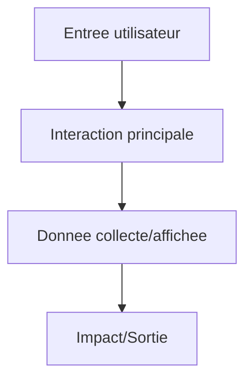
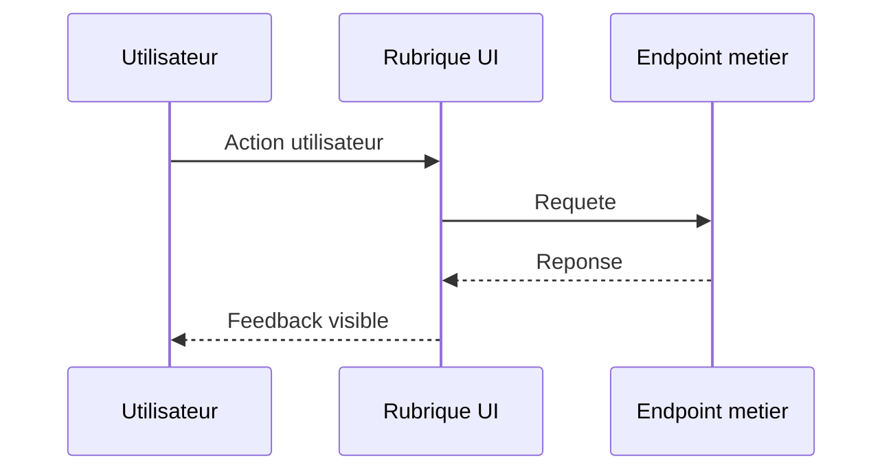

# Schema rubrique - [NOM_RUBRIQUE]

## Objectif
- [But principal de la rubrique]

## Parcours


Fallback statique:
```md

```

## Sequence API


Fallback statique:
```md

```

## Points d'attention
- [Risque 1]
- [Risque 2]
- [Contrat de donnees critique]
